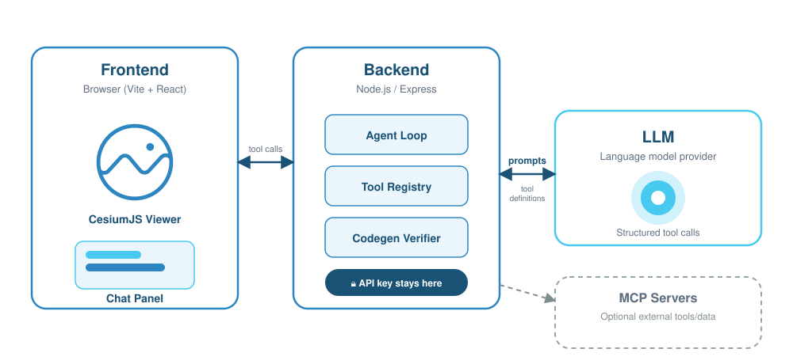

# CesiumJS AI Sample App


A ready-to-run starter pairing a [CesiumJS](https://cesium.com/platform/cesiumjs/) 3D globe with an LLM-powered chat interface. The LLM drives the globe through structured tool calls (e.g. _"fly to Paris"_) while the **LLM API key never reaches the browser** — all inference runs behind a Node.js API server.

---

[**Getting Started**](docs/getting-started.md) &nbsp;·&nbsp; [**Architecture**](docs/architectures/architecture.md) &nbsp;·&nbsp; [**Packages**](docs/packages/index.md) &nbsp;·&nbsp; [**Viewer Tools Tutorial**](docs/tutorials/cesium-viewer-tools-tutorial.md)

---

## Get Started

You need an **LLM API key** from OpenAI, Anthropic, or Google Generative AI to enable chat. A free [Cesium Ion](https://ion.cesium.com) token is optional but improves terrain and imagery.

```bash
npx degit CesiumGS/cesiumjs-ai-starter-app cesiumjs-ai-starter-app
cd cesiumjs-ai-starter-app
cp .env.example .env
```

Open `.env` and set `AI_PROVIDER` with its matching API key (e.g. `OPENAI_API_KEY`). Optionally set `VITE_CESIUM_ION_ACCESS_TOKEN`.

### Option A — Docker (recommended)

Requires [Docker Desktop](https://docs.docker.com/get-docker/) only — no local Node.js needed.

```bash
docker compose up --build --wait
```

Open **http://localhost:8080** once both containers report healthy.

### Option B — Local dev (hot reload)

Requires **Node.js ≥ 20** and **npm ≥ 9**.

```bash
npm install
npm run dev
```

- Globe + HMR: **http://localhost:5173**
- Chat API: `http://localhost:3001`

---

## Try It Out

Type a place into the chat panel — e.g. **`fly to Paris`** — and the camera flies there. Any city, landmark, or address works.

For requests that don't fit a single fly-to, try something like **`drop a pin at the Eiffel Tower`** — this routes through `executeCesiumCode` instead, which is gated behind AI SDK's native tool-approval mechanism (`toolApproval` configured in `backend/src/app.ts` — see `backend/src/tools/execute-cesium-code-tool.ts`): the chat panel shows you the assistant's raw intent for the call and waits for you to **approve or reject it** (a human-in-the-loop checkpoint — see `frontend/src/components/ChatPanel.tsx`'s `onApprovalRequired` handler) _before_ any code is generated. After approval, the backend generates and statically verifies a CesiumJS snippet; the frontend then executes it in a fresh QuickJS-WASM sandbox with memory/deadline limits and a guarded bridge to the live `Viewer`.

If no provider key is configured, the globe still runs as a plain viewer with a "AI is not configured. Add a supported provider API key to your .env file." banner.

---

## Architecture



Viewer tools (camera, entities) are streamed via [Server-Sent Events](https://developer.mozilla.org/en-US/docs/Web/API/Server-sent_events) to the browser and executed against the live `Viewer`. The LLM API key never reaches the browser — all inference happens behind the Node.js API. See [Architecture](docs/architectures/architecture.md) for the full component diagram, request sequence, and deployment topology. The workspace packages provide the reusable pieces:

| Package                                                   | Role                                                                                                                                                                                                                                |
| --------------------------------------------------------- | ----------------------------------------------------------------------------------------------------------------------------------------------------------------------------------------------------------------------------------- |
| [`@cesium-ai/server`](packages/server/)                   | [Express](https://expressjs.com) router — mounts `POST /api/chat`, runs the [`streamText`](https://sdk.vercel.ai/docs/reference/ai-sdk-core/stream-text) agent loop                                                                 |
| [`@cesium-ai/tools-schemas`](packages/tools-schemas/)     | [Zod](https://zod.dev)-schemed viewer tool definitions (`flyTo`, entities, imagery, …) — schemas only, no `execute`                                                                                                                 |
| [`@cesium-ai/codegen-cesium`](packages/codegen-cesium/)   | Intent → [AST](https://en.wikipedia.org/wiki/Abstract_syntax_tree)-verified CesiumJS code pipeline; owns the `executeCesiumCode` tool definition                                                                                    |
| [`@cesium-ai/codegen-sandbox`](packages/codegen-sandbox/) | [QuickJS](https://bellard.org/quickjs/) + WASM runtime isolation for executing verified CesiumJS snippets in the browser                                                                                                            |
| [`@cesium-ai/mcp-tools`](packages/mcp-tools/)             | Optional [Model Context Protocol](https://modelcontextprotocol.io) client bridge that exposes allowlisted MCP tools to the agent                                                                                                    |
| [`@cesium-ai/webmcp-cesium`](packages/webmcp-cesium/)     | Registers viewer tools on `document.modelContext`, the browser-native [WebMCP](https://developer.chrome.com/docs/ai/webmcp) standard — a different, in-browser counterpart to `@cesium-ai/mcp-tools`' server-side MCP client bridge |
| [`@cesium-ai/chat-element`](packages/chat-element/)       | Reusable React chat panel component that renders streamed assistant/tool activity and approval UX                                                                                                                                   |
| [`@cesium-ai/sample-config`](shared/)                     | App-level tool allowlist and shared `flyTo` args contract                                                                                                                                                                           |

- **`@cesium-ai/server`** — an Express router that mounts the AI SDK chat key-layer (`/api/chat`). It accepts a tool registry and a resolved language model and runs the `streamText` agent loop server-side, so the LLM API key never reaches the browser. The host app owns provider selection.
- **`@cesium-ai/tools-schemas`** — Zod-schemed CesiumJS viewer tool definitions (`flyTo`, …). Schemas only, no `execute`, and scoped strictly to tools that run directly against a live `Viewer`.
- **`@cesium-ai/tools`** — default, ready-to-use **client-side executors** for every tool in `@cesium-ai/tools-schemas`'s catalogue (`flyTo`, camera, entity, animation, and imagery tools) — the browser-side "other half" of that schema-only package, so a host app doesn't have to hand-write an executor for every tool before it can turn one on. `createCesiumToolExecutors({ ... })` lets a host override or extend any individual tool (e.g. this app's own `flyTo`, which validates against an extended shape — see below) without forking the rest. See [`packages/tools/README.md`](packages/tools/README.md).
- **`@cesium-ai/codegen-cesium`** — backend-only pipeline that turns `executeCesiumCode`'s natural-language `intent` into statically-verified CesiumJS code (skills-grounded generation + an AST verifier), and also owns `executeCesiumCode`'s tool definition itself (schema-only, no `execute`) — that tool can't run directly against a `Viewer` like `flyTo` does, so it lives here rather than in `tools-schemas`. Parse-only — it never executes generated code itself.
- **`@cesium-ai/codegen-sandbox`** — frontend-only QuickJS-WASM execution sandbox used to run verified generated CesiumJS snippets under strict memory/time limits and a guarded bridge to the live `Viewer`.
- **`@cesium-ai/mcp-tools`** — optional, server-only [Model Context Protocol](https://modelcontextprotocol.io) client bridge. Connects to MCP servers (SSE/HTTP — stdio is deliberately unsupported), namespaces + allowlist-filters their tools, and merges them into an AI SDK `ToolSet` a host app spreads alongside `createCesiumTools()` — this is the "MCP-backed tool group" the split-execution diagram above refers to. Entirely opt-in through an `mcp.config.json` file, with no MCP client created when the file is absent. See [`packages/mcp-tools/README.md`](packages/mcp-tools/README.md) for the full security model and API.
- **`@cesium-ai/webmcp-cesium`** — frontend-only, registers every `@cesium-ai/tools-schemas` viewer tool on `document.modelContext` (the browser-native [WebMCP](https://developer.chrome.com/docs/ai/webmcp) Imperative API), backed by `@cesium-ai/tools`' executors. This lets an agent already running **inside the browser tab** (e.g. Chrome's built-in AI, or the Model Context Tool Inspector extension) call these tools directly — a materially different integration than `@cesium-ai/mcp-tools` above (which is this app's backend connecting _out_ to external MCP servers, the opposite direction, over a different transport). See [`packages/webmcp-cesium/README.md`](packages/webmcp-cesium/README.md).
- **`@cesium-ai/chat-element`** — reusable React chat UI package consumed by the frontend app, including tool event rendering and inline approval UI used for protected tool calls.

This app builds its own executable `executeCesiumCode` tool on top of the library's schema (`backend/src/tools/execute-cesium-code-tool.ts`, wrapping `@cesium-ai/codegen-cesium`), the same "app extends the shared schema" pattern `flyTo` uses via `backend/src/tools/flyto-tool.ts`. Because `executeCesiumCode` is a "Code Mode" tool — the model's output is arbitrary generated code, not bounded typed args like `flyTo`'s lat/lon/altitude — it needs a materially different security posture than `flyTo`. The backend's AST verification (see [`packages/codegen-cesium/README.md`](packages/codegen-cesium/README.md)) is defense-in-depth only, not a substitute for runtime isolation; the frontend independently executes verified snippets through `@cesium-ai/codegen-sandbox`, a fresh QuickJS-WASM interpreter with memory/deadline limits and a guarded host bridge. See [`packages/tools-schemas/README.md`](packages/tools-schemas/README.md) and [`packages/codegen-cesium/README.md`](packages/codegen-cesium/README.md) for the full generation/verification pipeline.

See [Architecture](https://cesiumgs.github.io/cesiumjs-ai-starter-app/architectures/architecture/) for more detail.

---

## Working with Cesium Tools

**Enable or disable a tool:** edit `ENABLED_CESIUM_TOOLS` in [`shared/src/enabled-tools.ts`](shared/src/enabled-tools.ts). Both the backend registry and frontend executor map derive from this array — a typo fails to build, and enabling a tool without a client-side executor also fails to compile.

**Update a tool's schema:** structural args rules live in `flyToInputShape` (both tiers derive from it); model-facing descriptions live in [`flyTo.ts`](https://github.com/CesiumGS/cesiumjs-ai-starter-app/blob/main/backend/src/tools/flyto-tool.ts) backend-only and are never bundled into the client.

See the [Cesium Viewer Tools Tutorial](https://cesiumgs.github.io/cesiumjs-ai-starter-app/tutorials/cesium-viewer-tools-tutorial/) for the full step-by-step walkthrough.

### Enabling MCP tools

MCP tools are a separate, opt-in tool group — see [`@cesium-ai/mcp-tools`](packages/mcp-tools/README.md) for the full API and security model. Nothing below is required for the app to run; without an `mcp.config.json` file, no MCP client is ever created.

List servers in a dedicated `mcp.config.json` file at the repo root (see [`mcp.config.json.example`](mcp.config.json.example)). It is a plain JSON array, easier to read and edit than an inline environment value, and keeps server configuration out of shell history:

```json
[
  {
    "name": "docs",
    "transport": { "type": "http", "url": "https://example.com/mcp" },
    "allowedTools": ["search"]
  },
  { "name": "ion", "transport": { "type": "http", "url": "http://localhost:3000/mcp/" } }
]
```

There's no manual "does this need OAuth" flag to set. `backend/src/index.ts` attempts every configured server the same way at startup ([`createMcpTools`](packages/mcp-tools/README.md)):

- **Connects successfully** (e.g. the `docs` server above, using a static header/API key or no auth at all) — shared by every visitor from then on. Tools are namespaced `mcp__<name>__<toolName>` and merged into the same registry `flyTo`/`executeCesiumCode` live in ([`backend/src/app.ts`](backend/src/app.ts)) — **every MCP tool is approval-gated by default** (`toolApproval: "user-approval"`), the same human-in-the-loop checkpoint `executeCesiumCode` uses, since MCP tools run arbitrary third-party server code this app doesn't control.
- **Fails with a 401** (e.g. the `ion` server above) — auto-detected as needing per-user authentication, and automatically offered through the chat panel's interactive Connect flow instead: credentials and MCP clients are scoped to the browser session, kept in backend memory only, and discarded on disconnect or restart. See the mcp-tools README's [session-scoped OAuth](packages/mcp-tools/README.md#session-scoped-oauth) section.
- **Fails any other way** (network unreachable, bad URL, etc.) — recorded as a genuine connection failure (surfaced on `GET /health` as `mcpServers`) and never prevents the rest of the app from starting.

The full resolved tool registry for a given request — including any connected MCP tools, which aren't knowable statically at build time — can be inspected via `GET /api/tools` (rate-limited the same as `/api/chat`); the frontend's `ChatPanel` shows this list in a small "Tools (N)" disclosure so it's visible which tools (built-in and MCP) are actually available in a running instance.

If a connected server's tool declares an ["MCP Apps"](https://modelcontextprotocol.io) `ui://` widget resource (e.g. an interactive asset-import launcher), `GET /api/tools` reports it via that tool's `mcpApp` field and the chat panel renders it inline in a sandboxed iframe (`packages/chat-element/src/McpAppWidget.tsx`) — including a bridge that lets the widget call tools back on its own server, gated behind an explicit inline Approve/Reject prompt. See the mcp-tools README's [MCP Apps widgets](packages/mcp-tools/README.md#mcp-apps-widgets) section for the full architecture.

### Registering WebMCP tools

Separately from the MCP client bridge above, this app also registers its viewer tools on `document.modelContext` — the browser-native [WebMCP](https://developer.chrome.com/docs/ai/webmcp) standard — via [`@cesium-ai/webmcp-cesium`](packages/webmcp-cesium/README.md) (wired in `frontend/src/tools/webmcp-tools.ts` / `frontend/src/App.tsx`). This lets an agent already running **inside the browser tab** call these tools directly against the live `Viewer`; it does **not** make them callable from VS Code Copilot's or Claude Desktop's MCP configuration, which speak MCP over stdio/HTTP/SSE to a separate server process instead. See the [Registering WebMCP Tools tutorial](https://cesiumgs.github.io/cesiumjs-ai-starter-app/tutorials/webmcp-cesium-tutorial/) for how to enable and test it in Chrome.

---

## Environment Variables

| Variable                                | Required | Description                                                                                                                                                                                                                                                                                                           |
| --------------------------------------- | -------- | --------------------------------------------------------------------------------------------------------------------------------------------------------------------------------------------------------------------------------------------------------------------------------------------------------------------- |
| `VITE_CESIUM_ION_ACCESS_TOKEN`          | No       | Cesium Ion token — baked into the client bundle at build time. Intentionally client-visible; scope it in the Ion console to restrict allowed assets and HTTP referrers.                                                                                                                                               |
| `VITE_CESIUM_ION_SERVER_URL`            | No       | Cesium ion API server the token above was issued by. Only needed for a token from a non-production ion server (e.g. an internal or staging ion environment) — leave unset for a normal ion.cesium.com token. A mismatched/missing value here causes every asset request to 401 against the default production server. |
| `OPENAI_API_KEY`                        | Yes      | LLM API key — server-side only, never `VITE_` prefixed. Required when `AI_PROVIDER=openai`.                                                                                                                                                                                                                           |
| `ANTHROPIC_API_KEY`                     | Yes      | Required when `AI_PROVIDER=anthropic`.                                                                                                                                                                                                                                                                                |
| `GOOGLE_GENERATIVE_AI_API_KEY`          | Yes      | Required when `AI_PROVIDER=google`.                                                                                                                                                                                                                                                                                   |
| `AI_PROVIDER`                           | No       | `openai` (default) \| `anthropic` \| `google`                                                                                                                                                                                                                                                                         |
| `AI_MODEL`                              | No       | Override the default model for the selected provider.                                                                                                                                                                                                                                                                 |
| `RATE_LIMIT_RPM`                        | No       | Per-IP requests/minute for `/api/chat` (default `20`).                                                                                                                                                                                                                                                                |
| `CODEGEN_MAX_SKILLS`                    | No       | Max BM25-matched `cesiumjs-skills` domains inlined as grounding context in the `executeCesiumCode` tool's generation prompt (default `1`).                                                                                                                                                                            |
| `CODEGEN_SKILL_THRESHOLD`               | No       | Minimum BM25 score a `cesiumjs-skills` domain must reach to be considered a match for the `executeCesiumCode` tool's generation prompt (default `1.0`). Set to `0` to disable filtering.                                                                                                                              |
| `CODEGEN_MAX_ATTEMPTS`                  | No       | Max regeneration attempts if a generated `executeCesiumCode` snippet fails static AST verification (default `3`).                                                                                                                                                                                                     |
| `CODEGEN_MAX_CODE_LENGTH`               | No       | Max generated `executeCesiumCode` source length in characters enforced by static AST verification (default `4000`).                                                                                                                                                                                                   |
| `CODEGEN_MAX_CODE_LINES`                | No       | Max generated `executeCesiumCode` line count enforced by static AST verification (default `100`).                                                                                                                                                                                                                     |
| `CODEGEN_ALLOWED_SYMBOLS`               | No       | Optional comma-separated free-identifier allowlist passed to static AST verification (`allowedSymbols`). Leave unset/blank to disable allowlist enforcement.                                                                                                                                                          |
| `CODEGEN_EXTRA_INSTRUCTIONS`            | No       | Optional operator-supplied instructions appended to the codegen prompt output rules (for app-specific constraints/style guidance).                                                                                                                                                                                    |
| `MCP_TOOL_TIMEOUT_MS`                   | No       | Per-tool-call timeout for MCP tools, in ms (default `30000`).                                                                                                                                                                                                                                                         |
| `TELEMETRY_ENABLED`                     | No       | Enables backend OTEL log + trace + metric export (`true`/`false`, default `false`). Traces cover the agent loop's GenAI spans (`invoke_agent`/`chat`/`execute_tool`) via `@ai-sdk/otel`. Metrics cover `/api/chat` token usage/duration and `executeCesiumCode` token usage/skill-match scores/generation duration.   |
| `OTEL_EXPORTER_OTLP_ENDPOINT`           | No       | Base OTLP endpoint for backend log/trace/metric export. The app sends logs to `<endpoint>/v1/logs`, traces to `<endpoint>/v1/traces`, and metrics to `<endpoint>/v1/metrics` unless the explicit endpoints below are set.                                                                                             |
| `OTEL_EXPORTER_OTLP_LOGS_ENDPOINT`      | No       | Explicit backend OTLP logs endpoint (overrides `OTEL_EXPORTER_OTLP_ENDPOINT + /v1/logs`).                                                                                                                                                                                                                             |
| `OTEL_EXPORTER_OTLP_TRACES_ENDPOINT`    | No       | Explicit backend OTLP traces endpoint (overrides `OTEL_EXPORTER_OTLP_ENDPOINT + /v1/traces`).                                                                                                                                                                                                                         |
| `OTEL_EXPORTER_OTLP_METRICS_ENDPOINT`   | No       | Explicit backend OTLP metrics endpoint (overrides `OTEL_EXPORTER_OTLP_ENDPOINT + /v1/metrics`).                                                                                                                                                                                                                       |
| `OTEL_EXPORTER_OTLP_HEADERS`            | No       | Comma-separated OTLP headers (`key=value,key2=value2`) for backend provider auth/project routing.                                                                                                                                                                                                                     |
| `OTEL_SERVICE_NAME`                     | No       | OTEL `service.name` for backend logs (default `cesiumjs-ai-starter-app-backend`).                                                                                                                                                                                                                                     |
| `OTEL_SERVICE_NAMESPACE`                | No       | OTEL `service.namespace` for backend logs (default `cesium-ai`).                                                                                                                                                                                                                                                      |
| `OTEL_RESOURCE_ATTRIBUTES`              | No       | Extra backend OTEL resource attributes as `key=value,key2=value2`.                                                                                                                                                                                                                                                    |
| `OTEL_LOG_LEVEL`                        | No       | Backend telemetry log threshold: `debug` \| `info` \| `warn` \| `error` \| `silent` (default `info`).                                                                                                                                                                                                                 |
| `VITE_API_BASE_URL`                     | No       | Dev default `http://localhost:3001`. In `compose.yaml` this is built as `""` so the frontend calls relative `/api/chat`, which nginx proxies to the backend.                                                                                                                                                          |
| `VITE_SANDBOX_ALLOWED_NETWORK_ORIGINS`  | No       | Comma-separated exact HTTP(S) origins generated Cesium code may load assets from. Empty/unset denies guest-provided network URLs.                                                                                                                                                                                     |
| `VITE_TELEMETRY_ENABLED`                | No       | Enables frontend OTEL log export (`true`/`false`, default `false`).                                                                                                                                                                                                                                                   |
| `VITE_OTEL_EXPORTER_OTLP_ENDPOINT`      | No       | Base OTLP endpoint for frontend log export. The app sends logs to `<endpoint>/v1/logs` unless the explicit logs endpoint is set.                                                                                                                                                                                      |
| `VITE_OTEL_EXPORTER_OTLP_LOGS_ENDPOINT` | No       | Explicit frontend OTLP logs endpoint (overrides `VITE_OTEL_EXPORTER_OTLP_ENDPOINT + /v1/logs`).                                                                                                                                                                                                                       |
| `VITE_OTEL_EXPORTER_OTLP_HEADERS`       | No       | Comma-separated OTLP headers (`key=value,key2=value2`) for frontend provider auth/project routing.                                                                                                                                                                                                                    |
| `VITE_OTEL_SERVICE_NAME`                | No       | OTEL `service.name` for frontend logs (default `cesiumjs-ai-starter-app-frontend`).                                                                                                                                                                                                                                   |
| `VITE_OTEL_SERVICE_NAMESPACE`           | No       | OTEL `service.namespace` for frontend logs (default `cesium-ai`).                                                                                                                                                                                                                                                     |
| `VITE_OTEL_RESOURCE_ATTRIBUTES`         | No       | Extra frontend OTEL resource attributes as `key=value,key2=value2`.                                                                                                                                                                                                                                                   |
| `VITE_OTEL_LOG_LEVEL`                   | No       | `debug` \| `info` \| `warn` \| `error` \| `silent` for this app's browser-side loggers (console + OTLP export alike, currently just the codegen sandbox's). Defaults to `debug` in dev builds, `silent` in production.                                                                                                |

See [`.env.example`](.env.example) for the complete list, including `AI_BASE_URL` and telemetry settings for OTLP-compatible providers.

All `VITE_*` vars are read from this single repo-root `.env` for both `npm run dev` (via `frontend/vite.config.ts`'s `envDir`) and `docker compose up` (via `compose.yaml`'s build-arg substitution) — there is no separate `frontend/.env` to keep in sync.

Copy `.env.example` to `.env` and fill in your values. The `.env` file is git-ignored.

---

## Scripts

| Command                  | Description                                                                 |
| ------------------------ | --------------------------------------------------------------------------- |
| `npm run dev`            | Build packages, then start packages (watch), backend, and frontend together |
| `npm run dev:frontend`   | Vite dev server only                                                        |
| `npm run dev:backend`    | Build packages, then run backend + packages in watch mode                   |
| `npm run build:packages` | Type-check and build the `@cesium-ai/*` workspace packages                  |
| `npm run build`          | Build packages, frontend bundle, and backend                                |
| `npm run preview`        | Serve the production frontend bundle locally                                |
| `npm run format`         | Format the whole workspace with Prettier (writes in place)                  |
| `npm run format:check`   | Verify formatting without writing (used in CI)                              |

---

## Project Structure

```
cesiumjs-ai-starter-app/
├── frontend/              # Vite + React SPA (CesiumJS globe + chat panel)
├── backend/               # Thin Express host (provider selection, tool registry, API key)
├── packages/
│   ├── server/            # @cesium-ai/server — chat router + agent loop
│   ├── tools-schemas/     # @cesium-ai/tools-schemas — viewer tool schemas
│   ├── tools/             # @cesium-ai/tools — default client-side tool executors
│   ├── codegen-cesium/    # @cesium-ai/codegen-cesium — codegen pipeline + executeCesiumCode tool
│   ├── codegen-sandbox/   # @cesium-ai/codegen-sandbox — frontend sandbox for generated code
│   ├── mcp-tools/         # @cesium-ai/mcp-tools — optional MCP client bridge
│   ├── chat-element/      # @cesium-ai/chat-element — reusable chat panel component
├── shared/                # @cesium-ai/sample-config — enabled tools + flyTo args contract
├── compose.yaml           # Docker Compose — frontend + backend on internal network
└── .env.example           # Environment variable template
```

---

## Code Style

Formatted with [Prettier](https://prettier.io) (`printWidth: 100`, otherwise defaults). Run before committing — CI fails on unformatted files.

```bash
npm run format        # format in place
npm run format:check  # verify (CI)
```

---

## Contributing & License

Contributions welcome — see [CONTRIBUTING.md](CONTRIBUTING.md) and [CODE_OF_CONDUCT.md](CODE_OF_CONDUCT.md).

Apache 2.0 — see [LICENSE](LICENSE).
