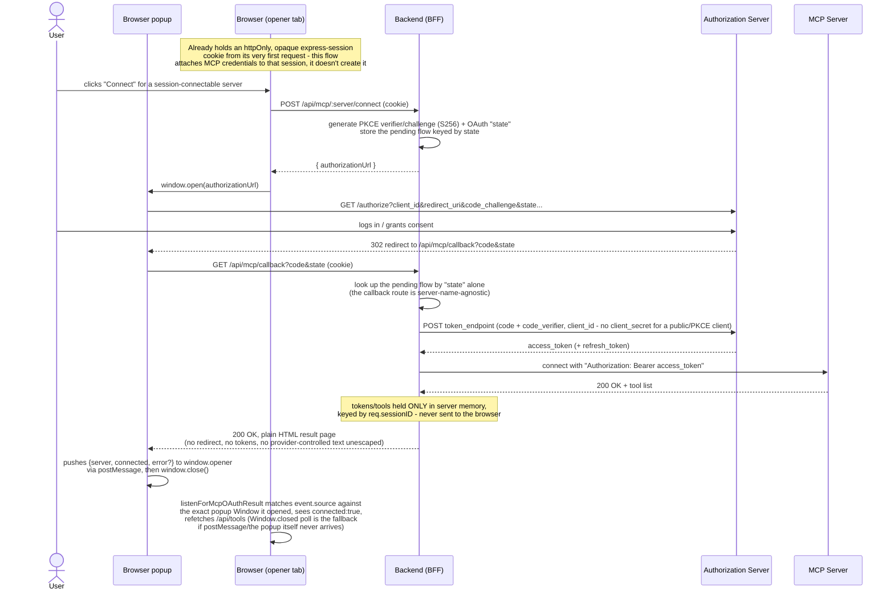
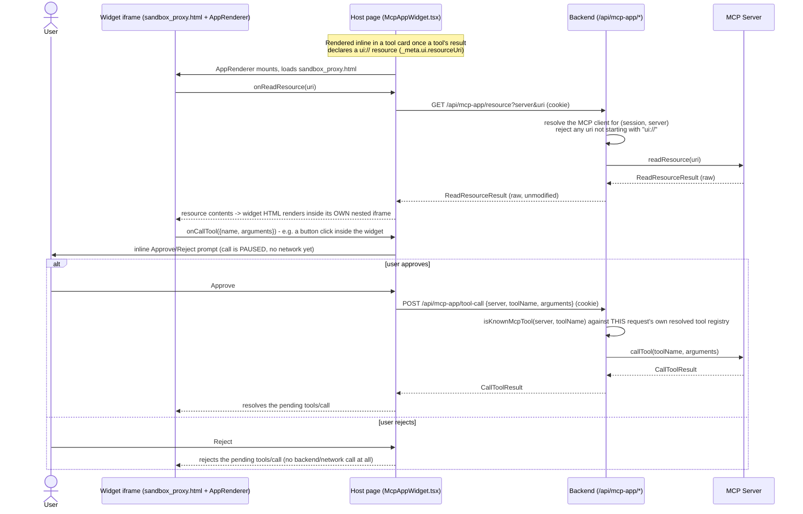

# Backend

Thin Node.js/Express host app. It resolves the environment and LLM provider, curates this app's Cesium tool surface, and wires everything into `@cesium-ai/server`'s chat router. This is where the LLM API key lives — it never reaches the browser.

See the [top-level README](../README.md) for architecture, quick start, and the full smoke test.

## Structure

```
src/
├── app.ts                 # Express app: composes middleware + routers below into one app
├── routers/
│   ├── health-router.ts       # GET /health liveness/readiness probe
│   ├── tools-router.ts        # GET /api/tools: introspects the resolved tool registry (incl. MCP)
│   ├── mcp-session-router.ts  # /api/mcp/* routes: per-session, user-initiated MCP OAuth connect/disconnect/status
│   └── mcp-app-router.ts      # /api/mcp-app/* routes: MCP Apps widget bridge (ui:// resource fetch + approved tool calls)
├── tools/
│   ├── flyto-tool.ts       # This app's model-facing flyTo input schema (extends the shared shape with descriptions)
│   └── execute-cesium-code-tool.ts # This app's server-executed executeCesiumCode tool (wraps @cesium-ai/codegen-cesium)
└── utils/
    ├── env.ts              # Zod-validated, typed environment config (loads .env)
    ├── mcp-servers-config.ts # Resolves MCP servers from mcp.config.json
    ├── providers.ts        # LLM provider factory — resolves an AI SDK LanguageModel from Env
    └── rate-limit.ts        # In-process per-IP sliding-window rate limiter
```

`app.ts` is split out from the process entry point (env/model resolution + `listen`) so the fully-wired app — real middleware in real order, real tool registry — can be started on an ephemeral port and driven over HTTP in `app.integration.test.ts`.

## Tool surface

The backend builds its tool registry from `ENABLED_CESIUM_TOOLS` (`@cesium-ai/sample-config`, in [`shared/`](../shared)) via `createCesiumTools` (`@cesium-ai/tools-schemas`), so the model is only ever offered tools this app turned on. `flyTo`'s model-facing input schema is this app's extended `flyToInputSchema` (`src/tools/flyto-tool.ts`), which layers `.describe()` hints onto the shared structural shape (`flyToShape` in `@cesium-ai/sample-config`) that the frontend also validates against — see [Working with Cesium Tools](../README.md#working-with-cesium-tools) in the top-level README.

### `executeCesiumCode`: code generation and verification

`executeCesiumCode` is built in `src/tools/execute-cesium-code-tool.ts` and wraps the code generation from `@cesium-ai/codegen-cesium`. The backend generates and verifies code (AST-based), then the frontend receives the verified code and executes it directly against the live Viewer. When the frontend sandbox reports an `executionError`, the next tool execution automatically extracts the latest `{ code, executionError }` result from the AI SDK message history and appends it to the nested codegen prompt as runtime correction context. A later successful execution clears older feedback. AST-based verification remains the server-side security gate; the frontend sandbox provides the independent runtime boundary.

## Environment

Environment variables are parsed and validated by `src/utils/env.ts` (Zod). See the [Environment Variables](../README.md#environment-variables) table in the top-level README for the full list (`AI_PROVIDER`, provider API keys, `RATE_LIMIT_RPM`, `ALLOWED_ORIGIN`, etc.).

## Session middleware (MCP OAuth "Connect" flow)

`src/utils/session.ts`'s `createSessionMiddleware` is only mounted when `sessionMcp` is configured (see [Enabling MCP tools](../README.md#enabling-mcp-tools)). It defaults to `express-session`'s in-memory `MemoryStore` — fine for local dev / a single instance, but sessions (and any MCP connections tied to them) are lost on restart and aren't shared across replicas. `createBackendApp`'s `sessionStore` option accepts any real `express-session`-compatible `Store` (e.g. `connect-redis`) for production; construct it in `src/index.ts` and pass it through. Note this only replaces the session-ID/cookie layer — `@cesium-ai/mcp-tools`'s `SessionMcpManager` keeps its own in-memory state (live MCP client connections), so a multi-instance deployment still needs sticky sessions / instance affinity for the "Connect" flow to keep working; see that package's README for details.

### Why this is a Backend-for-Frontend (BFF), not a browser-side PKCE client

The per-session MCP "Connect" flow (`src/routers/mcp-session-router.ts`) implements the entire OAuth 2.0/2.1 authorization-code + PKCE exchange **server-side** — the browser only ever sees an `authorizationUrl` to open in a popup and later polls `GET /api/mcp/:server/status`. This backend is deliberately acting as a BFF: it generates and stores the PKCE code verifier/challenge and OAuth `state`, exchanges the authorization code for tokens, and holds the resulting access/refresh tokens entirely in server memory (`@cesium-ai/mcp-tools`'s `SessionMcpManager`), keyed only by the opaque, httpOnly `express-session` cookie (`req.sessionID`). The browser never receives or handles a code verifier, an access token, or a refresh token at any point.

#### Sequence diagram



This is a different (and, for a public client talking to third-party OAuth providers, safer) design than the common SPA pattern of running the whole PKCE dance **in the browser** and stashing the resulting tokens in `sessionStorage`:

|                                 | Backend-for-Frontend (this app)                                                                                                      | Browser-side PKCE + `sessionStorage`                                                             |
| ------------------------------- | ------------------------------------------------------------------------------------------------------------------------------------ | ------------------------------------------------------------------------------------------------ |
| Code verifier / tokens          | Never leave the server process; browser only holds an httpOnly session cookie                                                        | Live in `sessionStorage`, readable by any JS running on that page                                |
| Exposure to XSS                 | An XSS bug can ride the session cookie via same-origin requests, but can't directly read/exfiltrate the token value                  | An XSS bug can `sessionStorage.getItem(...)` the access/refresh token directly and exfiltrate it |
| Token refresh                   | Handled transparently by the backend (`@ai-sdk/mcp`'s refresh logic) — the browser never needs to see a new token                    | The browser page must itself store and rotate refreshed tokens                                   |
| Third-party client secret       | Can be configured and used safely (never shipped to the browser)                                                                     | Never safe to embed — must stay a public/PKCE-only client                                        |
| Persistence across tabs/reloads | Survives via the session cookie; MCP connection itself is still in-memory per backend instance (see the multi-instance caveat above) | Tied to one tab's `sessionStorage` (cleared on tab close, not shared across tabs)                |

`sessionStorage` is a reasonable choice for genuinely client-only state that never needs to be secret (e.g. this repo's own codegen sandbox keeps its own API keys in `sessionStorage`, isolated from the sandboxed iframe — see [`docs/Codegen-tool-security-attacks-vectors.md`](../docs/Codegen-tool-security-attacks-vectors.md)), but it is the wrong place for OAuth tokens or PKCE material precisely because any script with page access can read it. Keeping the whole PKCE exchange and the resulting tokens server-side (this BFF pattern) removes that entire class of exposure, at the cost of the backend needing to track per-session state itself (see [`@cesium-ai/mcp-tools`'s README](../packages/mcp-tools/README.md) for the full sequence diagram and in-memory-state caveats).

## MCP Apps widget bridge

`src/routers/mcp-app-router.ts` mounts `/api/mcp-app/resource` and `/api/mcp-app/tool-call` — the backend-side half of rendering an MCP Apps widget (a tool result's `ui://` HTML resource, e.g. Cesium ion's asset importer). Like the OAuth "Connect" flow above, this backend never hands MCP credentials or a live MCP client to the browser: the widget itself runs inside `@mcp-ui/client`'s sandboxed iframe (`frontend/public/sandbox_proxy.html`) and only ever talks to this backend's two proxy routes over plain `fetch`, authenticated by the same session cookie.

- `GET /api/mcp-app/resource` resolves the right `MCPClient` for `(req.sessionID, server)` (checking operator-configured servers first, then this session's own connected servers), rejects any `uri` not starting with `ui://`, and returns the raw `client.readResource(...)` result unmodified.
- `POST /api/mcp-app/tool-call` re-validates `(server, toolName)` against **this request's own** resolved tool registry (`isKnownMcpTool`) before calling `client.callTool(...)` — a widget can never invoke a tool the backend wouldn't otherwise have offered the model.
- Neither route executes a tool call automatically: the frontend (`McpAppWidget.tsx`) always shows an inline Approve/Reject prompt first, and only calls `POST /api/mcp-app/tool-call` once the user approves.

### Sequence diagram



## Scripts

| Command                  | Description                                  |
| ------------------------ | -------------------------------------------- |
| `npm run dev`            | Run the backend with `tsx watch`             |
| `npm run build`          | Type-check and compile to `dist/`            |
| `npm run typecheck:test` | Type-check source and tests without emitting |
| `npm run start`          | Run the compiled `dist/index.js`             |

Run from the repo root with `npm run dev:backend` to also build/watch the workspace packages it depends on.
