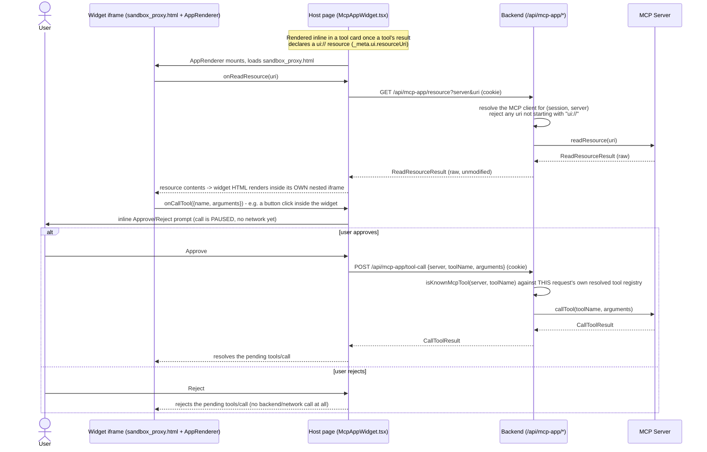

# Backend

Thin Node.js/Express host. Resolves the LLM provider, builds the tool registry, and mounts `@cesium-ai/server`'s chat router — the API key never reaches the browser.

See [Getting Started](https://cesiumgs.github.io/cesiumjs-ai-starter-app/getting-started/) for setup and the smoke test.

## Structure

```
src/
├── app.ts                 # Express app: composes middleware + routers below into one app
├── routers/
│   └── health-router.ts       # GET /health liveness/readiness probe
├── tools/
│   ├── flyto-tool.ts       # This app's model-facing flyTo input schema (extends the shared shape with descriptions)
│   └── execute-cesium-code-tool.ts # This app's server-executed executeCesiumCode tool (wraps @cesium-ai/codegen-cesium)
└── utils/
    ├── env.ts              # Zod-validated, typed environment config (loads .env)
    ├── telemetry.ts        # OTEL logger + tracer provider, package logger adapters
    ├── mcp-servers-config.ts # Resolves MCP servers from mcp.config.json
    ├── providers.ts        # LLM provider factory — resolves an AI SDK LanguageModel from Env
    └── rate-limit.ts        # In-process per-IP sliding-window rate limiter
```

## Tool registry

The backend builds its tool registry from `ENABLED_CESIUM_TOOLS` (`@cesium-ai/sample-config`, defined in [`shared/`](https://github.com/CesiumGS/cesiumjs-ai-starter-app/tree/main/shared)) via `createCesiumTools` (`@cesium-ai/tools-schemas`), so the model is only ever offered the tools this app enables. `flyTo`'s model-facing input schema is this app's extended `flyToInputSchema` (`src/tools/flyto-tool.ts`), which layers `.describe()` hints onto the shared structural shape (`flyToShape` in `@cesium-ai/sample-config`) that the frontend also validates against — see [Working with Cesium Tools](https://github.com/CesiumGS/cesiumjs-ai-starter-app/blob/main/README.md#working-with-cesium-tools) in the top-level README. The `executeCesiumCode` tool generates and AST-verifies CesiumJS snippets server-side; the frontend receives verified code and executes it against the live Viewer.

### `executeCesiumCode`: code generation and verification

`executeCesiumCode` is built in `src/tools/execute-cesium-code-tool.ts` and wraps the code generation from `@cesium-ai/codegen-cesium`. The backend generates and verifies code (AST-based), then the frontend receives the verified code and executes it directly against the live Viewer. When the frontend sandbox reports an `executionError`, the next tool execution automatically extracts the latest `{ code, executionError }` result from the AI SDK message history and appends it to the nested codegen prompt as runtime correction context. A later successful execution clears older feedback. AST-based verification remains the server-side security gate; the frontend sandbox provides the independent runtime boundary.

See the [Cesium Viewer Tools Tutorial](https://cesiumgs.github.io/cesiumjs-ai-starter-app/tutorials/cesium-viewer-tools-tutorial/) for the full walkthrough.

## Environment

Parsed and validated by [`src/utils/env.ts`](https://github.com/CesiumGS/cesiumjs-ai-starter-app/blob/main/backend/src/utils/env.ts) ([Zod](https://zod.dev)). See [Getting Started](https://cesiumgs.github.io/cesiumjs-ai-starter-app/getting-started/) for the full variable list (`AI_PROVIDER`, API keys, `RATE_LIMIT_RPM`, `ALLOWED_ORIGIN`, etc.).

Backend logging can be exported to any OTLP-compatible telemetry provider by setting `TELEMETRY_ENABLED=true` and either `OTEL_EXPORTER_OTLP_ENDPOINT` (base endpoint) or `OTEL_EXPORTER_OTLP_LOGS_ENDPOINT` (explicit logs endpoint). Optional headers/resource attributes/service identity fields are also supported (`OTEL_EXPORTER_OTLP_HEADERS`, `OTEL_SERVICE_NAME`, `OTEL_SERVICE_NAMESPACE`, `OTEL_RESOURCE_ATTRIBUTES`, `OTEL_LOG_LEVEL`).

`src/index.ts` builds one scoped logger per package via `telemetry.createLogger(scope)`/`telemetry.createMcpToolsLogger(scope)` and threads it through every package that accepts one, so a single `TELEMETRY_ENABLED=true` covers this app's own logs plus `@cesium-ai/mcp-tools`, `@cesium-ai/codegen-cesium` (code generation attempts/failures), and `@cesium-ai/server` (agent-loop and MCP Apps proxy failures) — each log line carries a `log.scope` attribute identifying its package.

## Session middleware (MCP OAuth "Connect" flow)

`src/utils/session.ts`'s `createSessionMiddleware` is only mounted when `sessionMcp` is configured (see [Enabling MCP tools](https://github.com/CesiumGS/cesiumjs-ai-starter-app/blob/main/README.md#enabling-mcp-tools)). It defaults to `express-session`'s in-memory `MemoryStore` — fine for local dev / a single instance, but sessions (and any MCP connections tied to them) are lost on restart and aren't shared across replicas. `createBackendApp`'s `sessionStore` option accepts any real `express-session`-compatible `Store` (e.g. `connect-redis`) for production; construct it in `src/index.ts` and pass it through. See [`@cesium-ai/server`'s README](https://cesiumgs.github.io/cesiumjs-ai-starter-app/packages/server/#session-scoped-mcp-oauth-connect-createmcpsessionrouter) for why this "Connect" flow is a Backend-for-Frontend design rather than a browser-side PKCE client, the full sequence diagram, and the BFF vs. `sessionStorage` comparison.

## MCP Apps widget bridge

`@cesium-ai/server/mcp`'s `mcp-app-router.ts` (mounted in `app.ts`) exposes `/api/mcp-app/resource` and `/api/mcp-app/tool-call` — the backend-side half of rendering an MCP Apps widget (a tool result's `ui://` HTML resource, e.g. Cesium ion's asset importer). Like the OAuth "Connect" flow above, this backend never hands MCP credentials or a live MCP client to the browser: the widget itself runs inside `@mcp-ui/client`'s sandboxed iframe (`frontend/public/sandbox_proxy.html`, created following the [mcp-ui sandbox proxy setup guide](https://mcpui.dev/guide/client/walkthrough#_3-set-up-a-sandbox-proxy)) and only ever talks to this backend's two proxy routes over plain `fetch`, authenticated by the same session cookie.

- `GET /api/mcp-app/resource` resolves the right `MCPClient` for `(req.sessionID, server)` (checking operator-configured servers first, then this session's own connected servers), rejects any `uri` not starting with `ui://`, and returns the raw `client.readResource(...)` result unmodified.
- `POST /api/mcp-app/tool-call` re-validates `(server, toolName)` against **this request's own** resolved tool registry (`isKnownMcpTool`) before calling `client.callTool(...)` — a widget can never invoke a tool the backend wouldn't otherwise have offered the model.
- Neither route executes a tool call automatically: the frontend (`McpAppWidget.tsx`) always shows an inline Approve/Reject prompt first, and only calls `POST /api/mcp-app/tool-call` once the user approves.

### Sequence diagram



## Scripts

| Command                  | Description                                                  |
| ------------------------ | ------------------------------------------------------------ |
| `npm run dev`            | Run with [`tsx`](https://github.com/privatenumber/tsx) watch |
| `npm run build`          | Type-check and compile to `dist/`                            |
| `npm run typecheck:test` | Type-check without emitting                                  |
| `npm run start`          | Run compiled `dist/index.js`                                 |

Run from the repo root with `npm run dev:backend` to also build/watch workspace packages.
