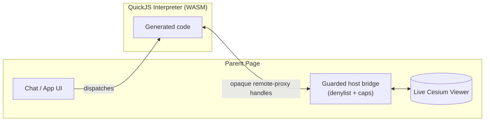
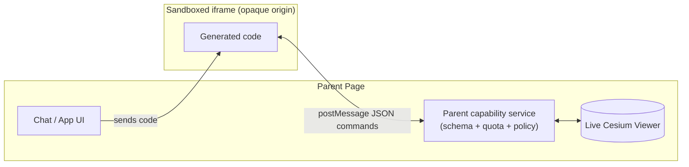
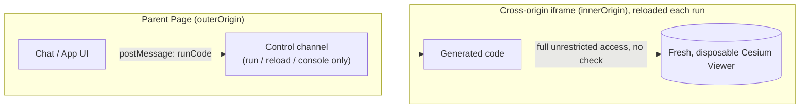
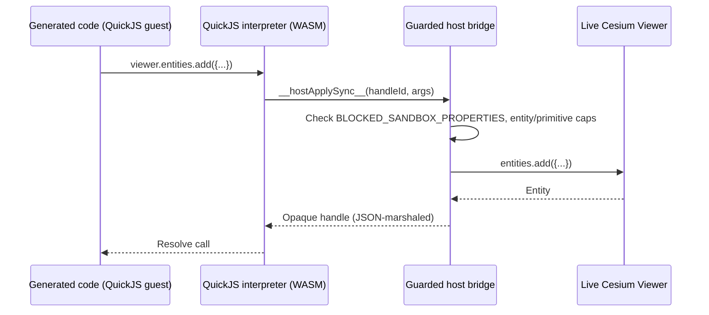
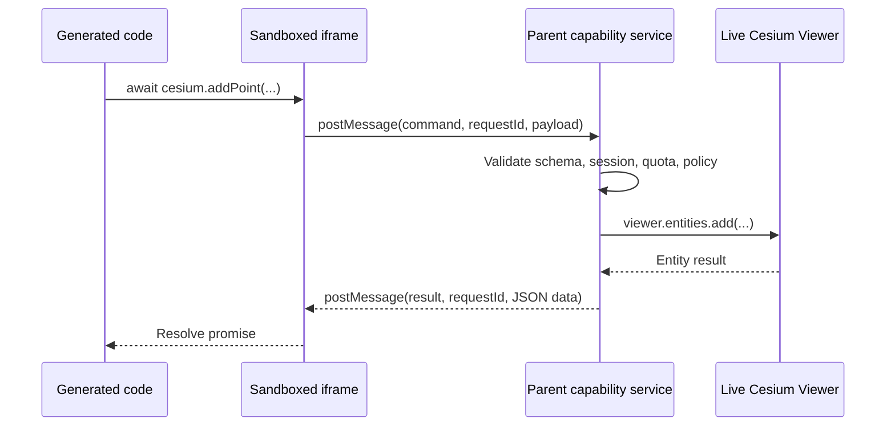
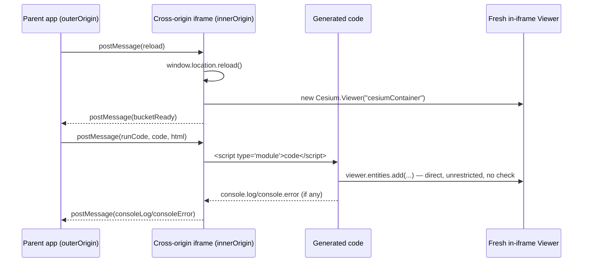

# Execution Sandbox Approaches for Generated Cesium Code

This note evaluates architecture options for the execution boundary that runs code generated for
`executeCesiumCode`: the current QuickJS-WASM executor, a sandboxed `<iframe>` restricted to an
explicit command RPC API, and a disposable in-iframe `Viewer` with no capability boundary at all.
It is an architecture comparison, not an implementation plan — the current implementation remains
the QuickJS-WASM executor in `@cesium-ai/codegen-sandbox`.

## Options at a Glance

| Approach                                      | Advantages                                                                                                                                    | Disadvantages                                                                                                                                                                                                               | When to use                                                                                                                                                        |
| ---------------------------------------------- | ----------------------------------------------------------------------------------------------------------------------------------------------- | -------------------------------------------------------------------------------------------------------------------------------------------------------------------------------------------------------------------------- | --------------------------------------------------------------------------------------------------------------------------------------------------------------------- |
| **QuickJS-WASM guarded bridge** (current)      | Enforceable CPU interruption and memory ceiling per run; compatible with existing `viewer`/`Cesium` codegen; opaque handles support an object-shaped API without exposing the real `Viewer` | Generic bridge needs strict host-side property/method allowlisting; WASM interpreter adds bundle/startup cost                                                                                                             | Generated code must retain an expressive, arbitrary CesiumJS-like API against a persistent live `Viewer`, and the product needs enforceable guest resource limits    |
| **Sandboxed iframe with command RPC**          | Command names are naturally enumerable/reviewable; strong DOM separation via opaque origin or `sandbox="allow-scripts"`; no interpreter dependency | No reliable parent-enforced CPU deadline for a synchronous guest loop; no portable memory ceiling; requires a new command-oriented generation contract — existing `viewer.entities.add(...)` snippets won't run unchanged | The product can commit to a stable, small, explicitly-reviewed catalog of actions and values a browser-origin boundary over direct compatibility with arbitrary CesiumJS snippets |
| **Disposable in-iframe Viewer, no RPC layer**  | Simplest to implement; no AST verification or capability allowlist to maintain; native browser feature only                                  | No guardrails at all — a bad generation can freely call any Cesium/DOM API; requires a genuinely separate iframe origin from the parent (misconfiguration silently removes the isolation); Viewer must be disposable/recreated per run, not the persistent main-page instance | The product can accept a fresh, throwaway `Viewer` per execution instead of the persistent one, can guarantee a separate iframe origin, and either has a human review step or accepts an unverified, unbounded guest runtime as a simplicity trade-off |

The sections below go into each option's architecture, setup, and trade-offs in detail.

## High-Level Architecture Comparison

These flowcharts show where each approach draws its boundary, what crosses it, and — critically —
where the live `Viewer` actually lives. This is the fastest way to see how the three approaches
differ structurally before reading the detailed sections below.

**Approach 1 — QuickJS-WASM guarded bridge (current):** the `Viewer` stays in the parent page; the
guest only ever touches opaque, capability-checked handles.



**Approach 2 — Sandboxed iframe with command RPC:** the `Viewer` also stays in the parent page;
the guest can only request named, schema-validated commands over `postMessage`.



**Approach 3 — Disposable in-iframe Viewer, no RPC layer:** the `Viewer` moves *into* a
cross-origin iframe and is recreated from scratch every run; the guest has direct, unrestricted
access to it, with no capability check anywhere in the path.



## Security Guarantees Checklist

This checklist states, per approach, whether a specific security property is actually guaranteed
by the boundary itself — not by additional application-level code layered on top (AST verification,
rate limits, caps) which should be kept regardless of runtime (see
[Cancellation and Resource Limits](#cancellation-and-resource-limits)).

| Security property                                                            | QuickJS-WASM guarded bridge                                                          | Sandboxed iframe with command RPC                                                    | Disposable in-iframe Viewer, no RPC layer                                                             |
| ----------------------------------------------------------------------------- | -------------------------------------------------------------------------------------- | ---------------------------------------------------------------------------------------- | --------------------------------------------------------------------------------------------------------- |
| Blocks generated code from reading parent DOM, cookies, or storage             | ✅ Yes — guest has no browser globals at all unless the host explicitly binds them      | ✅ Yes — opaque origin (`srcdoc`, no `allow-same-origin`) cannot read the parent's origin  | ⚠️ Only if the iframe is served from a genuinely separate origin from the parent; same-origin removes this guarantee entirely |
| Blocks generated code from ever seeing parent secrets/API tokens/session state | ✅ Yes — only explicitly marshaled JSON-shaped values cross the host bridge             | ✅ Yes — only command payloads/results (JSON) cross `postMessage`; the `Viewer` never crosses | ⚠️ Same as above — depends entirely on real cross-origin isolation being configured and maintained     |
| Blocks arbitrary outbound network calls (`fetch`/`XHR`) by default             | ✅ Yes — no `fetch` reachable unless the host deliberately exposes it                   | ⚠️ Requires an explicit CSP (`connect-src 'none'`) on the iframe bootstrap; not automatic  | ❌ No — generated code gets the platform's real `fetch`/`XHR` with no restriction unless a CSP is added separately |
| Enforced CPU execution timeout (can stop a synchronous infinite loop)          | ✅ Yes — QuickJS's interrupt handler can halt guest bytecode mid-execution              | ❌ No — no reliable parent-enforced deadline for code running on the iframe's own thread   | ❌ No — same limitation; only a full iframe reload can reclaim a hung realm                             |
| Enforced memory ceiling                                                       | ✅ Yes — configurable QuickJS runtime memory limit, enforced by the interpreter         | ❌ No — browser-managed only, no portable per-run ceiling                                 | ❌ No — same limitation                                                                                  |
| Capability surface is a small, explicitly reviewable allowlist (not a broad proxy) | ❌ No — the current generic bridge exposes broad `viewer`/`Cesium` access guarded by a denylist, not a small allowlist | ✅ Yes — command names are a fixed, enumerable catalog defined entirely by the parent      | ❌ No — full, unrestricted Cesium and DOM API surface, nothing is reviewable or enumerable               |
| Runs existing `viewer.*`/`Cesium.*` codegen unchanged (no new prompt contract) | ✅ Yes — this is the current, already-compatible executor                              | ❌ No — requires a new command-oriented generation contract; existing snippets won't run   | ✅ Yes — arguably the most compatible, since there is no marshaling boundary at all                     |
| No extra infrastructure required (e.g., a second origin/port)                  | ✅ Yes — runs entirely within the existing page                                        | ✅ Yes — an opaque `srcdoc` origin needs no separate origin/port                           | ❌ No — requires provisioning and maintaining a genuinely separate origin for the Viewer iframe          |

## Recommendation

For the current product shape, QuickJS-WASM remains the preferred primary runtime because it has
per-run interruption and memory limits. If an iframe boundary is introduced instead or in addition,
use it only with an **explicit command RPC API** — do not pass the live Cesium `Viewer`, `Cesium`
namespace, DOM nodes, or a generic `viewer.*` proxy to generated code. An iframe can be a useful
additional browser boundary, but it does not independently enforce CPU or memory quotas for
JavaScript that runs on the browser's main thread.

## Approach 1: QuickJS-WASM Guarded Bridge (Current)

This is the executor already implemented and running in `@cesium-ai/codegen-sandbox` — see
[its README](../packages/codegen-sandbox/README.md) for the full marshaling/handle/capability
architecture. In summary: generated code runs inside a separate QuickJS interpreter compiled to
WASM, with no browser globals at all. A guarded host bridge exposes the real `Viewer`/`Cesium`
namespace through opaque remote-proxy handles, checked against a denylist of blocked
properties/methods (`BLOCKED_SANDBOX_PROPERTIES`) and capped entity/primitive/data-source counts.
The QuickJS runtime enforces a configurable memory ceiling and can interrupt guest bytecode
mid-execution — the only enforced CPU/memory bounds among the three approaches compared here.



## Approach 2: Sandboxed Iframe with Command RPC

### Threat Model and Boundary

The parent application owns the live `Viewer`, credentials, UI, approval decision, network policy,
and all mutations. Generated code runs in an iframe with an opaque origin and can request a small
set of actions. The parent validates every request before invoking Cesium.



The `Viewer` never crosses the boundary. The iframe only receives JSON-shaped results such as an
entity id, camera position, or a structured error. This prevents the guest from accessing browser
objects by traversing properties from a real Cesium instance.

### Setup

The minimum iframe permissions are `sandbox="allow-scripts"`. Do **not** add
`allow-same-origin`: with it absent, a `srcdoc` frame has an opaque origin and cannot read the
parent's DOM, storage, or cookies.

```ts
const frame = document.createElement("iframe");
frame.sandbox.add("allow-scripts");
frame.referrerPolicy = "no-referrer";
frame.srcdoc = iframeBootstrapHtml;
frame.hidden = true;
document.body.append(frame);
```

The bootstrap page needs a restrictive CSP. The exact policy depends on how the bootstrap is
served, but it should prohibit network, navigation, forms, frames, workers, and media by default:

```html
<meta
  http-equiv="Content-Security-Policy"
  content="default-src 'none'; script-src 'unsafe-inline' blob:; connect-src 'none'; img-src 'none'; style-src 'none'; font-src 'none'; media-src 'none'; worker-src 'none'; frame-src 'none'; form-action 'none'; base-uri 'none'; navigate-to 'none'"
/>
```

`'unsafe-inline'` above is only for the fixed iframe bootstrap. Prefer a server-hosted bootstrap
with a hash or nonce when practical. Generated source should be sent after the iframe reports ready
and imported as a `Blob` module, rather than evaluated with `eval` or `new Function`.

Because an opaque-origin iframe cannot be targeted by a stable origin string, the parent normally
uses `"*"` as the `postMessage` target origin. That is only acceptable when the channel is bound to
the exact `iframe.contentWindow` and authenticated with an unguessable session token or, preferably,
a transferred `MessageChannel` port.

### Example: Parent Capability Service

This example shows a deliberately small command surface. The schema check, quota check, and
approval check occur in the parent, immediately before each real Viewer mutation.

```ts
type FrameCommand =
  | { type: "addPoint"; requestId: string; longitude: number; latitude: number; label?: string }
  | { type: "flyTo"; requestId: string; longitude: number; latitude: number; height?: number };

function handleFrameCommand(viewer: Cesium.Viewer, command: FrameCommand) {
  switch (command.type) {
    case "addPoint": {
      assertEntityCapNotExceeded(viewer, { maxEntities: 200 });
      const position = Cesium.Cartesian3.fromDegrees(command.longitude, command.latitude);
      const entity = viewer.entities.add({ position, label: { text: command.label ?? "" } });
      return { entityId: entity.id };
    }
    case "flyTo": {
      const destination = Cesium.Cartesian3.fromDegrees(
        command.longitude,
        command.latitude,
        command.height ?? 1_500,
      );
      viewer.camera.flyTo({ destination });
      return { started: true };
    }
  }
}
```

The real implementation should use Zod or an equivalent runtime schema for `FrameCommand`, reject
unknown keys and commands, impose per-command size/range limits, and respond with a stable result
envelope:

```ts
type FrameResult =
  | { type: "result"; requestId: string; value: unknown }
  | { type: "error"; requestId: string; message: string };
```

Avoid a generic protocol such as `{ path: "viewer.entities.add", args: [...] }`. It recreates the
broad authority of a direct Viewer proxy and makes policy review depend on arbitrary property paths.

### Example: Iframe RPC Client and Generated Module

The fixed iframe bootstrap exposes a narrow `cesium` object to generated modules. It tracks pending
requests locally and rejects them when the parent returns an error.

```js
const pending = new Map();
let port;

function invoke(type, payload) {
  const requestId = crypto.randomUUID();
  port.postMessage({ type, requestId, ...payload });
  return new Promise((resolve, reject) => pending.set(requestId, { resolve, reject }));
}

const cesium = {
  addPoint: (longitude, latitude, label) => invoke("addPoint", { longitude, latitude, label }),
  flyTo: (longitude, latitude, height) => invoke("flyTo", { longitude, latitude, height }),
};

window.addEventListener("message", async ({ data, ports }) => {
  if (data.type !== "initialize" || ports.length !== 1) return;
  port = ports[0];
  port.onmessage = ({ data }) => {
    const request = pending.get(data.requestId);
    if (!request) return;
    pending.delete(data.requestId);
    if (data.type === "error") request.reject(new Error(data.message));
    else request.resolve(data.value);
  };
  const sourceUrl = URL.createObjectURL(new Blob([data.code], { type: "text/javascript" }));
  try {
    await import(sourceUrl);
  } finally {
    URL.revokeObjectURL(sourceUrl);
  }
});
```

Generated source is then asynchronous command code, rather than direct CesiumJS code:

```js
await cesium.addPoint(2.3522, 48.8566, "Paris");
await cesium.flyTo(2.3522, 48.8566, 1_500);
```

This is a meaningful product and prompt contract change. Existing codegen that emits
`viewer.entities.add(...)` and `Cesium.Cartesian3.fromDegrees(...)` will not run unchanged.

### Cancellation and Resource Limits

Removing or reloading an iframe can discard its JavaScript realm:

```ts
function stopFrame(frame: HTMLIFrameElement) {
  frame.remove();
}
```

That is useful after an asynchronous operation, but it is not an enforceable execution deadline.
An infinite synchronous loop inside an iframe can still monopolize the browser renderer thread, so
the parent may not get a chance to run its own timeout callback. Browser-managed memory pressure is
also not a per-run memory limit.

Keep the backend AST verification, parent-side rate limits, payload limits, entity/primitive/data
source caps, and CSP regardless of execution runtime. If hard CPU and memory bounds are required,
keep QuickJS-WASM or move execution to an independently resource-limited process/service.

## Comparison Across All Three Approaches

| Concern                        | QuickJS-WASM guarded bridge                                         | Sandboxed iframe with command RPC                                      | Disposable in-iframe Viewer, no RPC layer                                                       |
| ------------------------------- | ---------------------------------------------------------------------| -------------------------------------------------------------------------| ----------------------------------------------------------------------------------------------------|
| Guest runtime                  | Separate QuickJS interpreter in WASM                                 | Browser JavaScript realm in an iframe                                    | Browser JavaScript realm in an iframe, hosting its own `Viewer` directly                            |
| DOM/storage access              | Absent unless host binds it                                          | Blocked from parent with opaque origin/`sandbox="allow-scripts"`; iframe-local APIs still need CSP controls | Blocked from parent only if a genuinely separate origin is configured; otherwise unrestricted        |
| Viewer integration              | Opaque handles can support object-shaped APIs                        | Must be explicit asynchronous commands; no live Viewer reference        | Live, real `Viewer` constructed directly inside the iframe; full unrestricted access                |
| CPU deadline                    | QuickJS interrupt handler can stop guest bytecode                    | No reliable parent-enforced timeout for a synchronous loop              | No reliable parent-enforced timeout for a synchronous loop (same limitation)                        |
| Memory ceiling                  | Configurable QuickJS runtime limit                                    | Browser-managed only; no portable per-run ceiling                       | Browser-managed only; no portable per-run ceiling (same limitation)                                 |
| Network control                 | No `fetch` unless deliberately exposed                                | Requires strict iframe CSP such as `connect-src 'none'`                  | Unrestricted `fetch`/`XHR` unless a CSP is separately added                                          |
| Capability review               | Current generic bridge needs strict host denylist policy              | Command names are naturally enumerable and reviewable                   | None — no allowlist or denylist at all                                                              |
| Existing codegen compatibility  | Compatible with current `viewer`/`Cesium` snippets                    | Requires a new command-oriented generation contract                     | Compatible, arguably the most directly (no marshaling boundary at all)                              |
| Bundle/runtime cost             | WASM assets and interpreter startup                                   | Native browser feature; no interpreter dependency                       | Native browser feature; requires provisioning a second origin/port to be safe                        |
| Best fit                        | Arbitrary but statically verified Cesium snippets requiring limits    | Narrow, durable action catalog and strong parent/guest DOM separation   | A disposable, non-persistent Viewer instance where simplicity is prioritized over verification       |

## Approach 3: Disposable In-Iframe Viewer, No RPC Layer

This approach skips a capability boundary entirely: run generated code with **full, unrestricted
access to its own `Cesium.Viewer` instance**, constructed fresh inside the iframe on every
execution, with no AST verification and no RPC surface at all. This is a real, viable pattern
under a specific set of conditions, not merely a hypothetical:



- **The iframe must be served from a genuinely separate origin from the parent app** (a distinct
  scheme+host+port, e.g. a dedicated inner-viewer origin), not `srcdoc`/opaque-origin and not the
  parent's own origin. A `sandbox="allow-scripts allow-same-origin"` attribute is then safe to use,
  because `allow-same-origin` only restores the iframe's *own* origin privileges — since that
  origin differs from the parent's, generated code still cannot reach the parent app's DOM,
  storage, or cookies. Using the same origin for both defeats this isolation and must be treated as
  a configuration error, not a supported mode.
- **The `Viewer` must live inside the iframe, not the parent.** Each execution fully reloads the
  iframe and constructs a brand-new `Viewer` from scratch; the generated code owns that disposable
  instance directly. No live, persistent, credentialed parent `Viewer` is ever handed across the
  boundary — only small control messages (e.g. "run this code", "execution finished", console
  output) cross `postMessage`.
- **The generated code must be treated as effectively trusted, or its blast radius accepted.**
  Without AST verification or a capability allowlist, this pattern only makes sense when either a
  human reviews/approves the code before each run, or the product is willing to accept that a bad
  generation can freely mutate/crash only its own disposable Viewer instance (not the user's
  ongoing session) and consume network/CPU/memory within that iframe's own budget.

Adopting this approach here would mean moving the actual Cesium canvas into a separate-origin
iframe (not the main page) and accepting that generated code gets unrestricted access to that
iframe's own DOM/Viewer — dropping both the AST verifier and QuickJS's memory/CPU bounds in
exchange for architectural simplicity. It is a good fit only if the product is willing to make the
Viewer itself disposable/iframe-local and recreated per run, rather than the persistent main-page
instance it is today, and only if the parent origin's secrets/session state are never exposed to
that iframe.

## Choosing Between Approaches

See the [Options at a Glance](#options-at-a-glance) table at the top of this document for a
side-by-side summary of advantages, disadvantages, and when to use each approach.

Use QuickJS and an iframe together only when the iframe boundary addresses a concrete additional
risk, such as isolating an untrusted UI/document renderer. An iframe around the existing generic
Viewer bridge adds complexity without replacing the need for explicit capability policy or runtime
limits.

## Related Material

- [Current QuickJS executor](../packages/codegen-sandbox/README.md)
- [Codegen security attack vectors](Codegen-tool-security-attacks-vectors.md)
- [MDN: `<iframe sandbox>`](https://developer.mozilla.org/en-US/docs/Web/HTML/Element/iframe#sandbox)
- [MDN: Content Security Policy](https://developer.mozilla.org/en-US/docs/Web/HTTP/Guides/CSP)
- [MDN: `MessageChannel`](https://developer.mozilla.org/en-US/docs/Web/API/MessageChannel)
