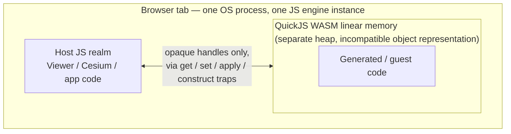
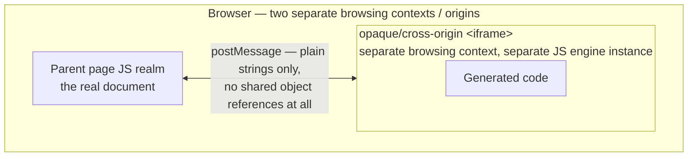
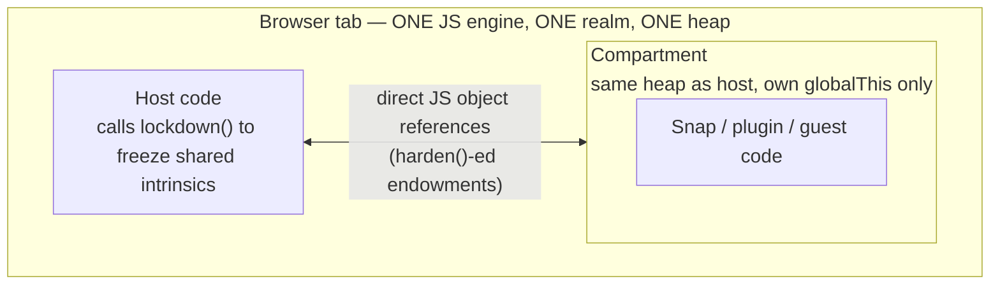
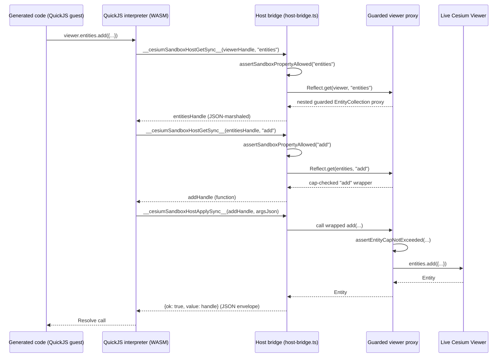
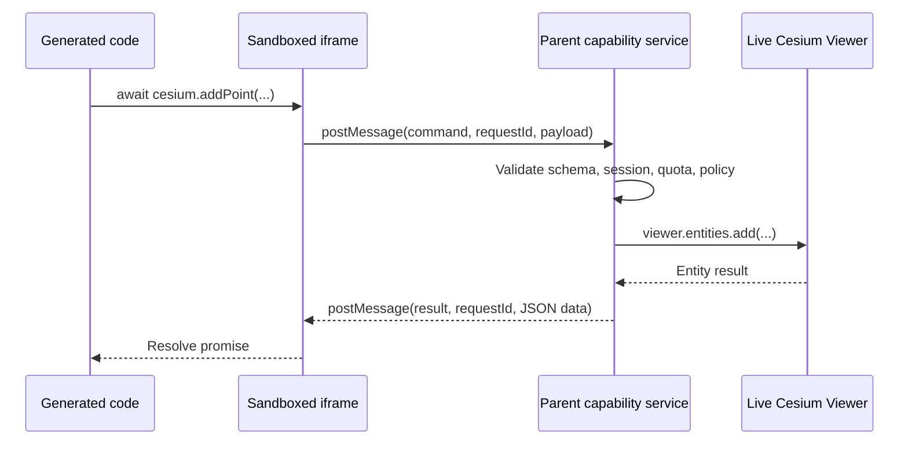
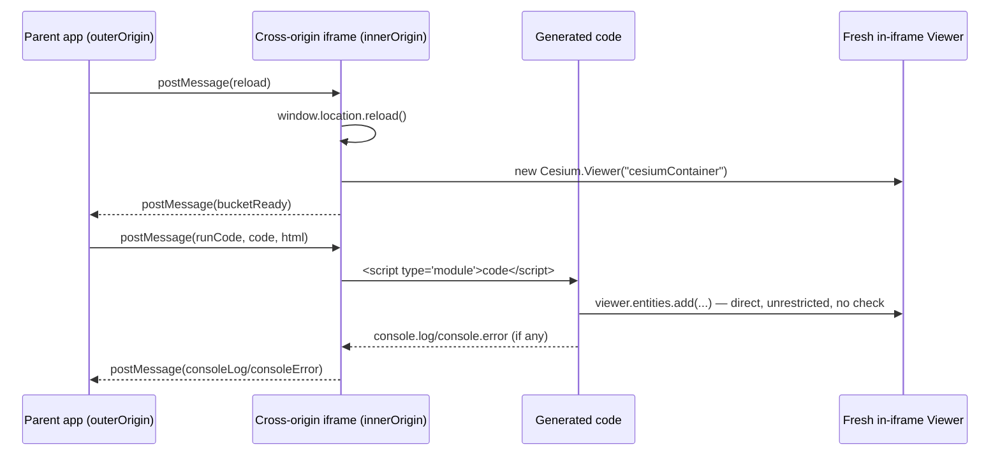

# Execution Sandbox Approaches for Generated Cesium Code

This note evaluates architecture options for the execution boundary that runs code generated for
`executeCesiumCode`: the current QuickJS-WASM executor, a sandboxed `<iframe>` restricted to an
explicit command RPC API, and a disposable in-iframe `Viewer` with no capability boundary at all.
It also summarizes how other real-world systems (SES/Hardened JavaScript, MetaMask Snaps,
quickjs-wasi) solve the same guest-code-isolation problem, as external validation for the choice
made here. It is a reference/architecture document, not an implementation plan — the current
implementation remains the QuickJS-WASM executor in
[`@cesium-ai/codegen-sandbox`](https://github.com/CesiumGS/cesiumjs-ai-starter-app/blob/main/packages/codegen-sandbox/README.md).

## Options at a Glance

| Approach                                      | Advantages                                                                                                                                                                                  | Disadvantages                                                                                                                                                                                                                                                                 | When to use                                                                                                                                                                                                                                            |
| --------------------------------------------- | ------------------------------------------------------------------------------------------------------------------------------------------------------------------------------------------- | ----------------------------------------------------------------------------------------------------------------------------------------------------------------------------------------------------------------------------------------------------------------------------- | ------------------------------------------------------------------------------------------------------------------------------------------------------------------------------------------------------------------------------------------------------ |
| **QuickJS-WASM guarded bridge** (current)     | Enforceable CPU interruption and memory ceiling per run; compatible with existing `viewer`/`Cesium` codegen; opaque handles support an object-shaped API without exposing the real `Viewer` | Generic bridge needs strict host-side property/method allowlisting; WASM interpreter adds bundle/startup cost                                                                                                                                                                 | Generated code must retain an expressive, arbitrary CesiumJS-like API against a persistent live `Viewer`, and the product needs enforceable guest resource limits                                                                                      |
| **Sandboxed iframe with command RPC**         | Command names are naturally enumerable/reviewable; strong DOM separation via opaque origin or `sandbox="allow-scripts"`; no interpreter dependency                                          | No reliable parent-enforced CPU deadline for a synchronous guest loop; no portable memory ceiling; requires a new command-oriented generation contract — existing `viewer.entities.add(...)` snippets won't run unchanged                                                     | The product can commit to a stable, small, explicitly-reviewed catalog of actions and values a browser-origin boundary over direct compatibility with arbitrary CesiumJS snippets                                                                      |
| **Disposable in-iframe Viewer, no RPC layer** | Simplest to implement; no AST verification or capability allowlist to maintain; native browser feature only                                                                                 | No guardrails at all — a bad generation can freely call any Cesium/DOM API; requires a genuinely separate iframe origin from the parent (misconfiguration silently removes the isolation); Viewer must be disposable/recreated per run, not the persistent main-page instance | The product can accept a fresh, throwaway `Viewer` per execution instead of the persistent one, can guarantee a separate iframe origin, and either has a human review step or accepts an unverified, unbounded guest runtime as a simplicity trade-off |

The sections below go into each option's architecture, setup, and trade-offs in detail.

## Where does guest code actually run?

The three families below classify both this repo's three options and the external systems this
note compares them against for validation: **SES / Hardened JavaScript** and **MetaMask Snaps**
(built on SES) as one family, and **quickjs-wasi** as another (see
[External validation](#external-validation-how-other-systems-solve-this) for details on each). The
key structural question for any of these — internal or external — is: **does guest code share a JS
heap/realm with the host, or a genuinely separate one?** That answer predicts the whole
vulnerability class each approach is exposed to (or immune from).

### Family A — separate WASM-hosted heap (Approach 1, this repo's current approach; also quickjs-wasi)

Guest and host objects can never be confused because they live in physically separate memory with
different internal representations — the family this repo uses today (see
[Approach 1](#approach-1-quickjs-wasm-guarded-bridge-current) below).

### Family B — separate browsing context (Approaches 2 & 3, `<iframe>` + `postMessage`)

Isolation is as strong as Family A (arguably stronger — a different browsing context, not just a
different heap), but plain-string message-passing costs `async`/`await` ergonomics and the overhead
of serializing state on every call. This repo's two iframe-based options both live in this family:
[Approach 2](#approach-2-sandboxed-iframe-with-command-rpc) keeps a capability-checked command RPC
layer in the parent, while [Approach 3](#approach-3-disposable-in-iframe-viewer-no-rpc-layer) drops
that layer and gives guest code direct, unrestricted access to a disposable in-iframe `Viewer`.

### Family C — same realm, hardened via frozen intrinsics (SES, MetaMask Snaps — not used by any option here)

Guest and host code run in the **same engine instance** — isolation comes entirely from
JavaScript-level bookkeeping (frozen prototypes, a fresh `globalThis`). This is fast and gives free
devtools support, but a shared heap is a structurally riskier property than a separate one (see
[External Validation](#external-validation-how-other-systems-solve-this) below). No option
considered for this repo uses this family, since CesiumJS's huge API surface is a poor fit for the
small, hand-curated allowlist that this family relies on for safety.

## Comparing the three options for this repo

This table states, per option, whether a specific security property is actually guaranteed by the
boundary itself — not by additional application-level code layered on top (AST verification, rate
limits, caps) which should be kept regardless of runtime (see the cancellation/resource-limit
caveat in [Approach 2](#approach-2-sandboxed-iframe-with-command-rpc) below).

| Property                                              | QuickJS-WASM guarded bridge (current)                          | Sandboxed iframe with command RPC                                       | Disposable in-iframe Viewer, no RPC layer                                             |
| ----------------------------------------------------- | -------------------------------------------------------------- | ----------------------------------------------------------------------- | ------------------------------------------------------------------------------------- |
| Isolation family                                      | Family A — separate WASM heap                                  | Family B — separate browsing context                                    | Family B — separate browsing context                                                  |
| Blocks parent DOM/cookie/storage access               | ✅ Yes — no browser globals unless explicitly bound            | ✅ Yes — opaque origin (no `allow-same-origin`)                         | ⚠️ Only if served from a genuinely separate origin; same-origin removes the guarantee |
| Blocks outbound network (`fetch`/`XHR`) by default    | ✅ Yes — unless the host deliberately exposes it               | ⚠️ Requires an explicit CSP (`connect-src 'none'`); not automatic       | ❌ No — real `fetch`/`XHR` unless a CSP is added separately                           |
| Enforced CPU timeout / memory ceiling                 | ✅ Yes — QuickJS interrupt handler + configurable memory limit | ❌ No — no reliable parent-enforced deadline or portable memory ceiling | ❌ No — same limitation as command RPC                                                |
| Capability surface is a small, reviewable allowlist   | ❌ No — broad `viewer`/`Cesium` proxy guarded by a denylist    | ✅ Yes — command names are a fixed, enumerable catalog                  | ❌ No — full, unrestricted Cesium/DOM surface, nothing reviewable                     |
| Runs existing `viewer.*`/`Cesium.*` codegen unchanged | ✅ Yes — current, already-compatible executor                  | ❌ No — needs a new command-oriented generation contract                | ✅ Yes — arguably most compatible, no marshaling boundary at all                      |
| Extra infrastructure required                         | ✅ None — runs entirely within the existing page               | ✅ None — an opaque `srcdoc` origin needs no separate origin/port       | ❌ Yes — requires provisioning a genuinely separate origin for the Viewer iframe      |

## Recommendation

For the current product shape, QuickJS-WASM remains the preferred primary runtime because it has
per-run interruption and memory limits. If an iframe boundary is introduced instead or in addition,
use it only with an **explicit command RPC API** — do not pass the live Cesium `Viewer`, `Cesium`
namespace, DOM nodes, or a generic `viewer.*` proxy to generated code. An iframe can be a useful
additional browser boundary, but it does not independently enforce CPU or memory quotas for
JavaScript that runs on the browser's main thread. A separate WASM-hosted heap (Family A) also
structurally avoids the object-identity-confusion bug class that same-realm approaches (Family C)
are exposed to, and the denylist-guarded generic proxy is a deliberate trade-off — CesiumJS's API
surface is too large for a hand-curated allowlist without a new, narrower codegen contract.

## Approach 1: QuickJS-WASM Guarded Bridge (Current)

This is the executor already implemented and running in `@cesium-ai/codegen-sandbox` — see
[its README](https://github.com/CesiumGS/cesiumjs-ai-starter-app/blob/main/packages/codegen-sandbox/README.md)
for the full marshaling/handle/capability
architecture. In summary: generated code runs inside a separate QuickJS interpreter compiled to
WASM, with no browser globals at all. Four sync host bridges (`__cesiumSandboxHostGetSync__`,
`__cesiumSandboxHostSetSync__`, `__cesiumSandboxHostApplySync__`,
`__cesiumSandboxHostConstructSync__`) let guest code read/write properties and call/construct
through opaque remote-proxy handles. Every property get/set is checked against a denylist
(`BLOCKED_SANDBOX_PROPERTIES`, plus any `_`-prefixed property) before it's allowed to resolve; a
small set of specific methods — `entities.add`, `scene.primitives.add`, `dataSources.add` — are
additionally wrapped by a guarded proxy that enforces entity/primitive/data-source count caps
before forwarding the real call. The QuickJS runtime enforces a configurable memory ceiling and can
interrupt guest bytecode mid-execution — the only enforced CPU/memory bounds among the three
approaches compared here.

## Approach 2: Sandboxed Iframe with Command RPC

The parent application keeps the live `Viewer`, credentials, UI, approval decision, network
policy, and all mutations. Generated code runs in an iframe with an opaque origin (no
`allow-same-origin`) and can only request a small, schema-validated catalog of named commands over
`postMessage` — never a generic `{ path: "viewer.entities.add", args: [...] }` proxy, which would
recreate the full authority of a direct Viewer proxy.

The `Viewer` never crosses the boundary — only JSON-shaped results (an entity id, camera position,
a structured error) do, so guest code cannot reach browser objects by traversing properties from a
real Cesium instance. Building this out requires: an iframe with `sandbox="allow-scripts"` only
(never `allow-same-origin`); a restrictive CSP on the bootstrap page (network, forms, frames,
workers, and media off by default); a runtime-validated (e.g. Zod) command schema instead of `eval`
or a generic property-path proxy; and a `postMessage` channel authenticated to the exact
`iframe.contentWindow`, ideally via a transferred `MessageChannel` port rather than a bare `"*"`
target origin.

Removing or reloading the iframe can discard its JS realm, but that is not an enforceable execution
deadline — a synchronous infinite loop can still monopolize the renderer thread before any parent
timeout callback runs, and browser-managed memory pressure is not a per-run memory limit. Keep AST
verification, rate limits, payload/entity caps, and CSP regardless of runtime; if hard CPU/memory
bounds are required, keep QuickJS-WASM or move execution to an independently resource-limited
process/service.

## Approach 3: Disposable In-Iframe Viewer, No RPC Layer

This approach skips a capability boundary entirely: run generated code with **full, unrestricted
access to its own `Cesium.Viewer` instance**, constructed fresh inside the iframe on every
execution, with no AST verification and no RPC surface at all. This is a real, viable pattern
under a specific set of conditions, not merely a hypothetical:

- **The iframe must be served from a genuinely separate origin from the parent app** (a distinct
  scheme+host+port, e.g. a dedicated inner-viewer origin), not `srcdoc`/opaque-origin and not the
  parent's own origin. A `sandbox="allow-scripts allow-same-origin"` attribute is then safe to use,
  because `allow-same-origin` only restores the iframe's _own_ origin privileges — since that
  origin differs from the parent's, generated code still cannot reach the parent app's DOM,
  storage, or cookies. Using the same origin for both defeats this isolation and must be treated as
  a configuration error, not a supported mode.
- **The `Viewer` must live inside the iframe, not the parent.** Each execution fully reloads the
  iframe and constructs a brand-new `Viewer` from scratch; the generated code owns that disposable
  instance directly. No live, persistent, credentialed parent `Viewer` is ever handed across the
  boundary — only small control messages (e.g. "run this code", "execution finished", console
  output) cross `postMessage`.
- **The generated code must be treated as effectively trusted, or its blast radius accepted.**
  Without AST verification or a capability allowlist, this pattern only makes sense when either a
  human reviews/approves the code before each run, or the product is willing to accept that a bad
  generation can freely mutate/crash only its own disposable Viewer instance (not the user's
  ongoing session) and consume network/CPU/memory within that iframe's own budget.

Adopting this approach here would mean moving the actual Cesium canvas into a separate-origin
iframe (not the main page) and accepting that generated code gets unrestricted access to that
iframe's own DOM/Viewer — dropping both the AST verifier and QuickJS's memory/CPU bounds in
exchange for architectural simplicity. It is a good fit only if the product is willing to make the
Viewer itself disposable/iframe-local and recreated per run, rather than the persistent main-page
instance it is today, and only if the parent origin's secrets/session state are never exposed to
that iframe.

## External validation: how other systems solve this

Other real-world systems face the same guest-code-isolation problem and land in the same three
structural families described above:

- **[SES](https://medium.com/agoric/ses-securing-javascript-in-the-real-world-4f309e6b66a6) / Hardened JavaScript** ([Agoric/endojs](https://github.com/endojs/endo/tree/master/packages/ses))
  and **[MetaMask Snaps](https://github.com/MetaMask/snaps)** (built on SES) use Family C: a small,
  hand-curated, `harden()`-ed allowlist in a `lockdown()`-ed `Compartment`, with no built-in
  CPU/memory ceiling (SES relies entirely on an outer iframe/worker/process boundary). This is
  tractable for MetaMask because their API surface is small and finite; it is not practical here
  given CesiumJS's thousands of classes/methods, short of inventing a new, narrower codegen
  contract like Approach 2's command RPC.
- **[quickjs-wasi](https://github.com/vercel-labs/quickjs-wasi)** is architecturally the same family
  as this repo's current approach (Family A) and even offers a novel snapshot/restore feature, but
  is **not recommended today**: a stack overflow crashes the whole WASM instance instead of
  throwing a catchable exception, there's no Asyncify equivalent, and it's young (~70 stars, one
  active maintainer) — real regressions for a sandbox whose job is surviving hostile/broken guest
  code. Revisit if it matures.
- A separate-origin **iframe + `postMessage`** boundary (Family B, i.e. this repo's Approaches 2
  and 3) is also a well-established generic web-platform pattern for isolating untrusted code,
  independent of any specific product.

## Why the current approach fits this repo

- A **separate WASM-hosted JS heap** (Family A) structurally avoids the object-identity-confusion
  bug class that same-realm approaches (Family C) are exposed to.
- The **denylist-guarded generic proxy** (vs. a small allowlist) is a deliberate trade-off —
  CesiumJS's API surface is too large for a hand-curated allowlist without a new, narrower codegen
  contract.
- **VM-enforced memory/CPU limits** are a concrete advantage over both the SES/MetaMask model and
  `quickjs-wasi`'s uncaught-stack-overflow behavior, and over either iframe-based option (Approaches
  2 and 3), neither of which enforces a portable CPU deadline or memory ceiling.

## References & Related Material

- [Current QuickJS executor](https://github.com/CesiumGS/cesiumjs-ai-starter-app/blob/main/packages/codegen-sandbox/README.md)
- [Codegen security attack vectors](codegen-tool-security-attacks-vectors.md)
- [MDN: `<iframe sandbox>`](https://developer.mozilla.org/en-US/docs/Web/HTML/Element/iframe#sandbox)
- [MDN: Content Security Policy](https://developer.mozilla.org/en-US/docs/Web/HTTP/Guides/CSP)
- [MDN: `MessageChannel`](https://developer.mozilla.org/en-US/docs/Web/API/MessageChannel)
- [quickjs-emscripten](https://github.com/justjake/quickjs-emscripten) — what this repo uses
- [quickjs-wasi](https://github.com/vercel-labs/quickjs-wasi) — Vercel Labs
- [QuickJS](https://bellard.org/quickjs/) — Fabrice Bellard
- [SES (Secure ECMAScript)](https://github.com/endojs/endo/tree/master/packages/ses) — Agoric/endojs
- [Realms shim](https://github.com/agoric/realms-shim) — Agoric
- [MetaMask Snaps](https://github.com/MetaMask/snaps)
- ["How to build a plugin system on the web and also sleep well at night"](https://www.figma.com/blog/how-we-built-the-figma-plugin-system/) — background reading on an `<iframe>` + WASM-interpreter sandbox journey (Rudi Chen, Aug 22, 2019)
- ["An update on plugin security"](https://www.figma.com/blog/an-update-on-plugin-security/) — background reading on a disclosed same-realm sandbox vulnerability and a permanent switch to QuickJS-in-WASM (Evan Wallace, Oct 2, 2019)
