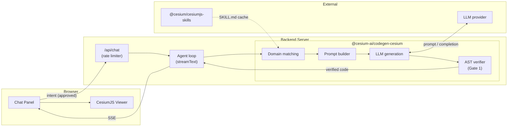
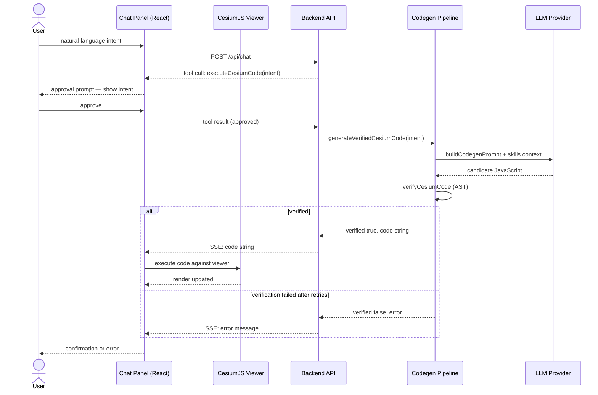
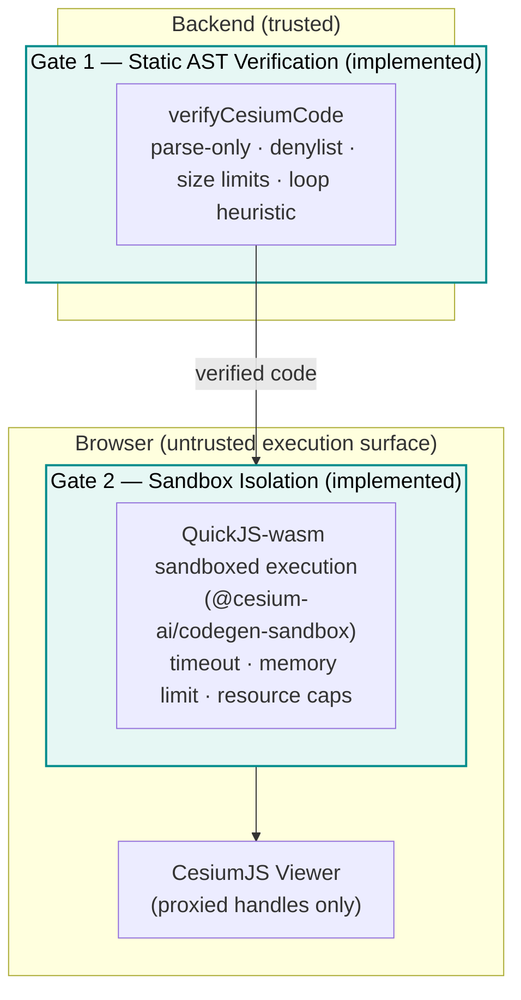

# Codegen Architecture

This document describes the architecture of the `executeCesiumCode` code generation system:
where it lives in the overall component model, how its internal pieces fit together, and what
kind of security gates are in place. For the threat model and recommended mitigations, see the
[Security Considerations](codegen-tool-security-attacks-vectors.md) document.

---

## 1. Where codegen fits in the system

The codegen system is an additional path through the existing backend. A normal tool call
(e.g., `flyTo`) goes: browser → backend → model → tool call → browser executor. The codegen
path adds a server-side generation sub-system that runs before any code reaches the browser.



The [`@cesium-ai/codegen-cesium`](https://github.com/CesiumGS/cesiumjs-ai-starter-app/tree/main/packages/codegen-cesium) package is a pure server-side dependency — it is never
bundled into the client.

### Request lifecycle



---

## 2. Package structure

```
packages/codegen-cesium/
├── src/
│   ├── index.ts                    # Public entry point (backend only)
│   ├── tool-names.ts               # { executeCesiumCode }
│   ├── schemas.ts                  # executeCesiumCodeInputShape (re-export)
│   ├── tools/
│   │   └── executeCesiumCode/
│   │       ├── executeCesiumCode.schema.ts   # { intent: string } — no descriptions
│   │       └── executeCesiumCode.ts          # Model-facing description + factory
│   └── pipeline/
│       ├── generate-verified-cesium-code.ts  # Orchestration entry point
│       ├── domain-matcher.ts                 # BM25 skill ranking
│       ├── prompt-builder.ts                 # Prompt assembly
│       ├── ast-verifier.ts                   # verifyCesiumCode (acorn/acorn-walk)
│       └── skills-loader.ts                  # Loads + caches SKILL.md files
```

### Three-subpath export pattern

Like [`@cesium-ai/tools-schemas`](https://github.com/CesiumGS/cesiumjs-ai-starter-app/tree/main/packages/tools-schemas), the codegen package uses a three-subpath export to enforce
the server-only boundary for tool descriptions:

| Subpath                                                                                                                      | Exports                                              | Consumer         |
| ---------------------------------------------------------------------------------------------------------------------------- | ---------------------------------------------------- | ---------------- |
| [`@cesium-ai/codegen-cesium`](https://github.com/CesiumGS/cesiumjs-ai-starter-app/tree/main/packages/codegen-cesium)         | Full pipeline + model-facing descriptions            | **Backend only** |
| [`@cesium-ai/codegen-cesium/names`](https://github.com/CesiumGS/cesiumjs-ai-starter-app/tree/main/packages/codegen-cesium)   | `CODEGEN_CESIUM_TOOL_NAMES`, `CodegenCesiumToolName` | Both tiers       |
| [`@cesium-ai/codegen-cesium/schemas`](https://github.com/CesiumGS/cesiumjs-ai-starter-app/tree/main/packages/codegen-cesium) | `executeCesiumCodeInputShape`, inferred types        | Both tiers       |

Importing from the root subpath in client code would bundle the generation pipeline and tool
descriptions into the browser — the package structure prevents this by design.

---

## 3. Component responsibilities

| Component           | File                                                                                                                                                                                     | Responsibility                                                                                                                                                                                |
| ------------------- | ---------------------------------------------------------------------------------------------------------------------------------------------------------------------------------------- | --------------------------------------------------------------------------------------------------------------------------------------------------------------------------------------------- |
| **Tool definition** | [`tools/executeCesiumCode/executeCesiumCode.ts`](https://github.com/CesiumGS/cesiumjs-ai-starter-app/blob/main/packages/codegen-cesium/src/tools/executeCesiumCode/executeCesiumCode.ts) | Declares the `executeCesiumCode` tool with its model-facing description. Schema-only — no `execute` handler here.                                                                             |
| **Tool wiring**     | [`backend/src/tools/execute-cesium-code-tool.ts`](https://github.com/CesiumGS/cesiumjs-ai-starter-app/blob/main/backend/src/tools/execute-cesium-code-tool.ts)                           | `createExecuteCesiumCodeTool` wraps the pipeline in an [AI SDK](https://sdk.vercel.ai/docs) `Tool`. Catches all exceptions and returns `{ error }` instead of throwing.                       |
| **Pipeline entry**  | [`pipeline/generate-verified-cesium-code.ts`](https://github.com/CesiumGS/cesiumjs-ai-starter-app/blob/main/packages/codegen-cesium/src/pipeline/generate-verified-cesium-code.ts)       | Orchestrates the full domain-match → prompt → generate → verify → retry flow.                                                                                                                 |
| **Domain matching** | [`pipeline/domain-matcher.ts`](https://github.com/CesiumGS/cesiumjs-ai-starter-app/blob/main/packages/codegen-cesium/src/pipeline/domain-matcher.ts)                                     | [BM25](https://en.wikipedia.org/wiki/Okapi_BM25)-ranks intent against SKILL.md descriptions. Returns top-N `CesiumSkill[]`.                                                                   |
| **Prompt builder**  | [`pipeline/prompt-builder.ts`](https://github.com/CesiumGS/cesiumjs-ai-starter-app/blob/main/packages/codegen-cesium/src/pipeline/prompt-builder.ts)                                     | Assembles the generation prompt with skill context and output constraints.                                                                                                                    |
| **AST verifier**    | [`pipeline/ast-verifier.ts`](https://github.com/CesiumGS/cesiumjs-ai-starter-app/blob/main/packages/codegen-cesium/src/pipeline/ast-verifier.ts)                                         | `verifyCesiumCode` — parse-only [AST](https://en.wikipedia.org/wiki/Abstract_syntax_tree) analysis via [`acorn`](https://github.com/acornjs/acorn). Collects all violations before returning. |
| **Skills loader**   | [`pipeline/skills-loader.ts`](https://github.com/CesiumGS/cesiumjs-ai-starter-app/blob/main/packages/codegen-cesium/src/pipeline/skills-loader.ts)                                       | Reads all `skills/cesiumjs-*/SKILL.md` files from the installed [`@cesium/cesiumjs-skills`](https://github.com/CesiumGS/cesiumjs-skills) package. Caches after first load.                    |

---

## 4. Security gates

The codegen system is designed around two security gates. Both are implemented: Gate 1 runs
server-side in [`@cesium-ai/codegen-cesium`](https://github.com/CesiumGS/cesiumjs-ai-starter-app/tree/main/packages/codegen-cesium); Gate 2 runs client-side in
[`@cesium-ai/codegen-sandbox`](https://github.com/CesiumGS/cesiumjs-ai-starter-app/blob/main/packages/codegen-sandbox/README.md).



**Gate 1 — Static AST Verification** runs server-side before any code leaves the backend.
It rejects code that contains banned constructs (`eval`, `Function`, dynamic `import`,
computed member access) or banned browser globals (`fetch`, `window`, `document`,
`localStorage`, etc.), code that exceeds size limits, and code with statically detectable
infinite loops. Unverified code is never returned as the verified result. The LLM API key
and raw skill bodies never cross the Backend → Browser boundary — both stay server-side.

**Gate 2 — Browser-side Sandbox Isolation** is implemented in
[`@cesium-ai/codegen-sandbox`](https://github.com/CesiumGS/cesiumjs-ai-starter-app/blob/main/packages/codegen-sandbox/README.md).
After user approval, verified code is executed inside a fresh QuickJS-wasm interpreter per
run — isolated from the page's global scope, with no direct access to `window`/`document`/
`fetch` — bound to the live `Viewer` only through a guarded, opaque-handle host bridge that
enforces an execution timeout, a memory limit, and entity/primitive/data-source collection
caps. The [Security Considerations](codegen-tool-security-attacks-vectors.md) document
covers the sandbox options evaluated before choosing this QuickJS-wasm approach.

---

## 5. How the tool is registered in the backend

[`backend/src/app.ts`](https://github.com/CesiumGS/cesiumjs-ai-starter-app/blob/main/backend/src/app.ts) wires the codegen tool into the agent loop alongside the viewer tools via `createExecuteCesiumCodeTool`. The tool is only registered when a model is configured; if no API key is available it is silently omitted even if listed in `ENABLED_CESIUM_TOOLS`.

`executeCesiumCode` is registered with `toolApproval: "user-approval"`, making it the only tool in the starter app that pauses the agent loop and requires an explicit browser confirmation before the backend generates any code. See [Codegen Tool Tutorial — Human-in-the-loop approval](../tutorials/codegen-tool-tutorial.md#3-human-in-the-loop-approval) for the wiring details and configuration options.

---

## Related documents

- [Architecture](architecture.md) — overall system component model and sequence diagrams.
- [Codegen Tool Tutorial](../tutorials/codegen-tool-tutorial.md) — how to use and configure the tool.
- [How Codegen Works](../tutorials/codegen-pipeline.md) — step-by-step pipeline walkthrough with diagrams.
- [Security Considerations](codegen-tool-security-attacks-vectors.md) — full threat model, attack vectors, and recommended mitigations for the generation pipeline.
