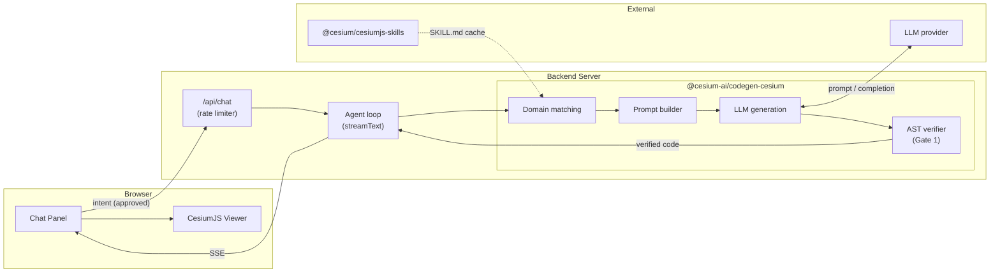
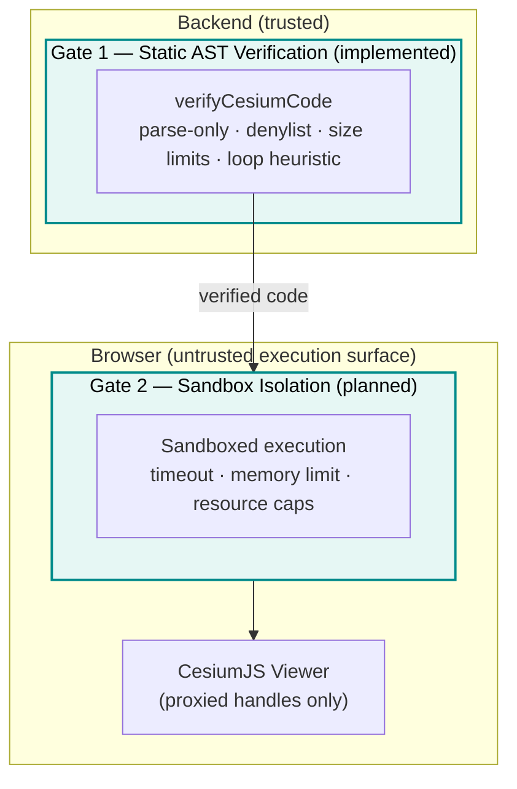

# Codegen Architecture

This document describes the architecture of the `executeCesiumCode` code generation system:
where it lives in the overall component model, how its internal pieces fit together, and which
security gates are in place. For the threat model and recommended mitigations, see the
[Security Considerations](Codegen-tool-security-attacks-vectors.md) document.

---

## 1. Where codegen fits in the system

The codegen system is an additional path through the existing backend. A normal tool call
(e.g., `flyTo`) goes: browser → backend → model → tool call → browser executor. The codegen
path adds a server-side generation sub-system that runs before any code reaches the browser.



The `@cesium-ai/codegen-cesium` package is a pure server-side dependency — it is never
bundled into the client.

---

## 2. Package structure

```
packages/codegen-cesium/
├── src/
│   ├── index.ts                    # Public entry point (backend only)
│   ├── tool-names.ts               # { executeCesiumCode }
│   ├── schemas.ts                  # executeCesiumCodeInputShape (re-export)
│   ├── tools/
│   │   └── executeCesiumCode/
│   │       ├── executeCesiumCode.schema.ts   # { intent: string } — no descriptions
│   │       └── executeCesiumCode.ts          # Model-facing description + factory
│   └── pipeline/
│       ├── generate-verified-cesium-code.ts  # Orchestration entry point
│       ├── domain-matcher.ts                 # BM25 skill ranking
│       ├── prompt-builder.ts                 # Prompt assembly
│       ├── ast-verifier.ts                   # verifyCesiumCode (acorn/acorn-walk)
│       └── skills-loader.ts                  # Loads + caches SKILL.md files
```

### Three-subpath export pattern

Like `@cesium-ai/tools-cesium`, the codegen package uses a three-subpath export to enforce
the server-only boundary for tool descriptions:

| Subpath                             | Exports                                              | Consumer         |
| ----------------------------------- | ---------------------------------------------------- | ---------------- |
| `@cesium-ai/codegen-cesium`         | Full pipeline + model-facing descriptions            | **Backend only** |
| `@cesium-ai/codegen-cesium/names`   | `CODEGEN_CESIUM_TOOL_NAMES`, `CodegenCesiumToolName` | Both tiers       |
| `@cesium-ai/codegen-cesium/schemas` | `executeCesiumCodeInputShape`, inferred types        | Both tiers       |

Importing from the root subpath in client code would bundle the generation pipeline and tool
descriptions into the browser — the package structure prevents this by design.

---

## 3. Component responsibilities

| Component           | File                                            | Responsibility                                                                                                                            |
| ------------------- | ----------------------------------------------- | ----------------------------------------------------------------------------------------------------------------------------------------- |
| **Tool definition** | `tools/executeCesiumCode/executeCesiumCode.ts`  | Declares the `executeCesiumCode` tool with its model-facing description. Schema-only — no `execute` handler here.                         |
| **Tool wiring**     | `backend/src/tools/execute-cesium-code-tool.ts` | `createExecuteCesiumCodeTool` wraps the pipeline in an AI SDK `Tool`. Catches all exceptions and returns `{ error }` instead of throwing. |
| **Pipeline entry**  | `pipeline/generate-verified-cesium-code.ts`     | Orchestrates the full domain-match → prompt → generate → verify → retry flow.                                                             |
| **Domain matching** | `pipeline/domain-matcher.ts`                    | BM25-ranks intent against SKILL.md descriptions. Returns top-N `CesiumSkill[]`.                                                           |
| **Prompt builder**  | `pipeline/prompt-builder.ts`                    | Assembles the generation prompt with skill context and output constraints.                                                                |
| **AST verifier**    | `pipeline/ast-verifier.ts`                      | `verifyCesiumCode` — parse-only static analysis via `acorn`. Collects all violations before returning.                                    |
| **Skills loader**   | `pipeline/skills-loader.ts`                     | Reads all `skills/cesiumjs-*/SKILL.md` files from the installed `@cesium/cesiumjs-skills` package. Caches after first load.               |

---

## 4. Security gates

The codegen system is designed around two security gates. Only Gate 1 is currently
implemented; Gate 2 is planned.



**Gate 1 — Static AST Verification** runs server-side before any code leaves the backend.
It rejects code that contains banned constructs (`eval`, `Function`, dynamic `import`,
computed member access) or banned browser globals (`fetch`, `window`, `document`,
`localStorage`, etc.), code that exceeds size limits, and code with statically detectable
infinite loops. Unverified code is never returned as the verified result.

**Gate 2 — Browser-side Sandbox Isolation** is not yet implemented. Currently, verified
code is returned to the chat panel but not automatically executed against the `Viewer`.
Enabling execution without Gate 2 means relying entirely on server-side static analysis.
The [Security Considerations](Codegen-tool-security-attacks-vectors.md) document covers the
recommended sandbox options (QuickJS WASM, iframe sandbox, and the recommended hybrid
approach) before Gate 2 is added.

---

## 5. How the tool is registered in the backend

`backend/src/app.ts` wires the codegen tool into the agent loop alongside the viewer tools:

```ts
// backend/src/app.ts (simplified)
import { createExecuteCesiumCodeTool } from "./tools/execute-cesium-code-tool";
import { CODEGEN_CESIUM_TOOL_NAMES } from "@cesium-ai/codegen-cesium/names";

// Only registered when a model is configured and the tool is enabled
const executeCesiumCodeTool = model
  ? createExecuteCesiumCodeTool({ model, maxSkills, maxAttempts })
  : undefined;

const toolApproval = {
  [CODEGEN_CESIUM_TOOL_NAMES.executeCesiumCode]: "user-approval",
};
```

The `"user-approval"` setting is what triggers the browser's approval prompt — the agent
loop pauses and streams the tool call back to the client, which shows the raw intent and
waits for an explicit user click before returning a result. This is the only tool in the
starter app with this setting.

---

## 6. Data boundaries

| Boundary                  | What crosses it                           | Direction |
| ------------------------- | ----------------------------------------- | --------- |
| Browser → Backend         | User's natural-language `intent` string   | In        |
| Backend → LLM provider    | Assembled prompt (intent + skill context) | Out       |
| LLM provider → Backend    | Candidate JavaScript string               | In        |
| Backend → Browser         | Verified JavaScript string (or error)     | Out       |
| Browser → CesiumJS Viewer | Executed JavaScript (Gate 2, planned)     | In        |

The LLM API key never crosses the Backend → Browser boundary. The skill bodies (which can
contain detailed API examples) are assembled server-side and never sent raw to the browser.

---

## Related documents

- [Architecture](architecture.md) — overall system component model and sequence diagrams.
- [Codegen Tool Tutorial](tutorials/codegen-tool-tutorial.md) — how to use and configure the tool.
- [How Codegen Works](tutorials/codegen-pipeline.md) — step-by-step pipeline walkthrough with diagrams.
- [Security Considerations](Codegen-tool-security-attacks-vectors.md) — full threat model, attack vectors, and recommended mitigations for the generation pipeline.
