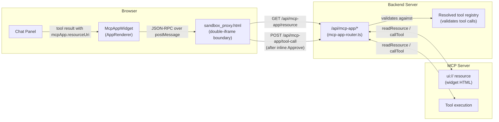
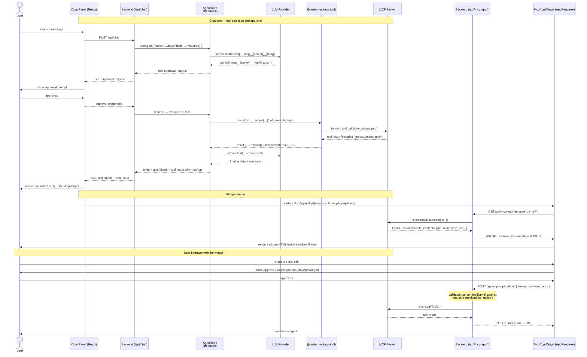

# MCP Apps Architecture

This document describes how [MCP Apps](https://modelcontextprotocol.io/extensions/apps/overview)
widget rendering is wired into the starter app: where the components live, how a widget fetches
its HTML and calls tools back, and what security gates apply. MCP Apps support is an extension of
standard MCP — a tool can optionally declare an interactive `ui://` HTML widget resource via
`_meta.ui.resourceUri` alongside its plain JSON result.

For general MCP server setup, see the [MCP Support Architecture](architecture-mcp.md) doc and the
[Adding an MCP Server](../tutorials/mcp-server-tutorial.md) tutorial.

---

## 1. Where MCP Apps fit in the system

The widget never talks to the MCP server directly — all network traffic is proxied through the
backend, which validates every request against the session's own resolved tool registry.

---

## 2. Sequence — chat turn, widget render, and a widget-initiated tool call

---

## 3. Component responsibilities

| Component                     | File                                                                                                                                                                           | Responsibility                                                                                                                                                                                                                                                                                                    |
| ----------------------------- | ------------------------------------------------------------------------------------------------------------------------------------------------------------------------------ | ----------------------------------------------------------------------------------------------------------------------------------------------------------------------------------------------------------------------------------------------------------------------------------------------------------------- |
| **Widget metadata discovery** | [`packages/mcp-tools/src/mcp-app-meta.ts`](https://github.com/CesiumGS/cesiumjs-ai-starter-app/blob/main/packages/mcp-tools/src/mcp-app-meta.ts)                               | `getMcpAppToolMeta()` — reads `_meta.ui` from a discovered tool and attaches it as `tool.mcpApp`. `mcpAppClientCapabilities` is advertised during every `createMCPClient` call.                                                                                                                                   |
| **Backend bridge**            | `@cesium-ai/server/mcp`'s `mcp-app-router.ts`                                                                                                                                  | `GET /api/mcp-app/resource` (fetches raw `ReadResourceResult` for `ui://` URIs only) and `POST /api/mcp-app/tool-call` (validates `(server, toolName)` against the request's tool registry, then calls the MCP tool). Both operations are timeout-wrapped via `MCP_TOOL_TIMEOUT_MS`.                              |
| **Widget renderer**           | [`packages/chat-element/src/components/McpAppWidget.tsx`](https://github.com/CesiumGS/cesiumjs-ai-starter-app/blob/main/packages/chat-element/src/components/McpAppWidget.tsx) | Uses [`@mcp-ui/client`'s `AppRenderer`](https://www.npmjs.com/package/@mcp-ui/client) — implements the MCP Apps JSON-RPC/postMessage protocol; proxies `onReadResource`/`onCallTool` to the backend's `/api/mcp-app/*` routes. Shows inline Approve/Reject before any widget-initiated `tools/call` is forwarded. |
| **Sandbox proxy**             | [`frontend/public/sandbox_proxy.html`](https://github.com/CesiumGS/cesiumjs-ai-starter-app/blob/main/frontend/public/sandbox_proxy.html)                                       | Static HTML file served at `/sandbox_proxy.html`. Required by [`AppRenderer`](https://www.npmjs.com/package/@mcp-ui/client) as the inner iframe that isolates widget HTML from the host app's DOM. Served by Vite in dev and nginx in production.                                                                 |
| **Tool introspection**        | `GET /api/tools`                                                                                                                                                               | Reports `mcpApp: { resourceUri }` alongside `name`/`description` for every tool that declared a widget — the chat panel uses this to decide whether to render `McpAppWidget` for a given tool result.                                                                                                             |

---

## 4. Security model

| Risk                                                                     | Mitigation                                                                                                                                                                                                                                                                                                                                           |
| ------------------------------------------------------------------------ | ---------------------------------------------------------------------------------------------------------------------------------------------------------------------------------------------------------------------------------------------------------------------------------------------------------------------------------------------------- |
| Widget HTML executing arbitrary JS in the host page.                     | [`AppRenderer`](https://www.npmjs.com/package/@mcp-ui/client) isolates widget HTML through a double-iframe boundary ([`sandbox_proxy.html`](https://github.com/CesiumGS/cesiumjs-ai-starter-app/blob/main/frontend/public/sandbox_proxy.html)). The widget runs in a sandboxed inner iframe with no direct access to the host app's DOM or `window`. |
| A widget calling arbitrary MCP tools without user knowledge.             | Every widget-initiated `tools/call` requires an explicit inline Approve/Reject prompt in `McpAppWidget` before the backend is ever contacted.                                                                                                                                                                                                        |
| A widget calling tools on a server the current session hasn't connected. | `POST /api/mcp-app/tool-call` independently validates `(server, toolName)` against the request's own resolved tool registry (static + session tools) — a widget cannot call a tool the session doesn't already have registered.                                                                                                                      |
| A widget fetching arbitrary network resources via the backend proxy.     | `GET /api/mcp-app/resource` is restricted to `ui://` URIs only — any other scheme returns 400 before the MCP client is ever called.                                                                                                                                                                                                                  |
| Credentials/session tokens leaking to the widget.                        | The widget communicates only through the [`AppRenderer`](https://www.npmjs.com/package/@mcp-ui/client) JSON-RPC bridge — it never sees the bearer token, session cookie, or any other auth credential the backend uses.                                                                                                                              |

---

## 5. Limitations

- Only the `resources/read` and `tools/call` directions of the widget bridge are wired up. A
  widget that relies on server-initiated notifications (e.g. `notifications/resources/updated`)
  has no channel to receive them in this architecture.
- Widget HTML is loaded fresh for each tool result render — there is no cross-turn widget state
  persistence.
- The `ui://` scheme check in `mcp-app-router.ts` is enforced at the backend; the frontend trusts
  that the `resourceUri` in `GET /api/tools` is already a `ui://` URI (set by the MCP server,
  not by user input).

---

## Related documents

- [MCP Support Architecture](architecture-mcp.md) — overall MCP component model, startup sequence, OAuth flow, and security model.
- [Adding an MCP Server](../tutorials/mcp-server-tutorial.md) — task-oriented tutorial for configuring MCP servers and OAuth.
- [`@cesium-ai/mcp-tools` package docs](../packages/mcp-tools/index.md) — full README including the MCP Apps widgets section.
