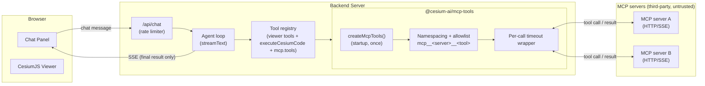
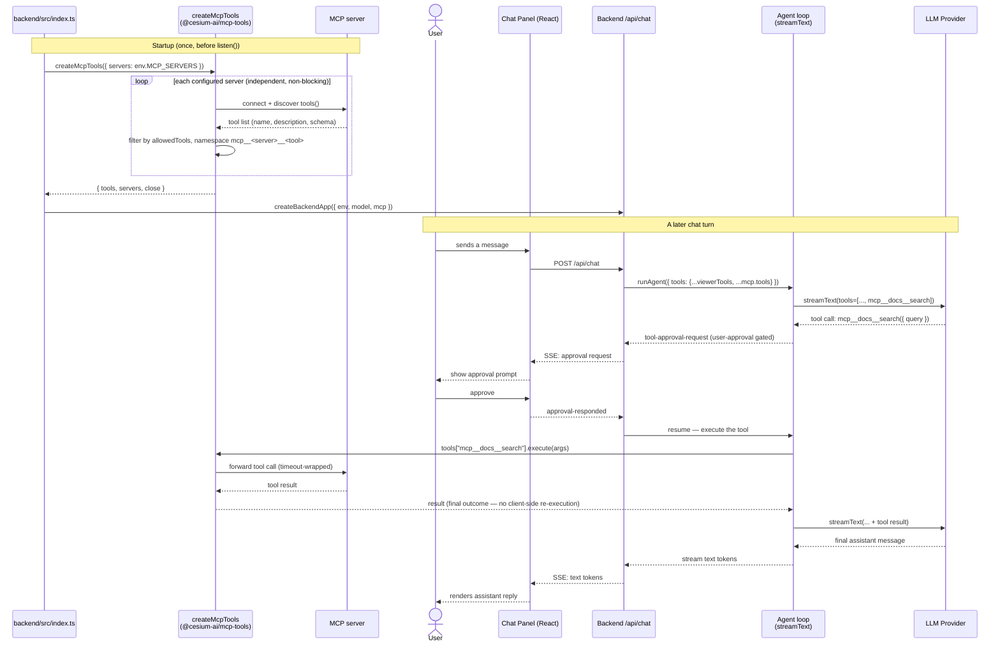

# MCP Support Architecture

This document describes how [Model Context Protocol](https://modelcontextprotocol.io) (MCP) tool
support is wired into the starter app: where it fits in the overall component model, how a
tool-calling turn flows through an MCP server, and what security gates apply to it. MCP support is
implemented entirely in [`@cesium-ai/mcp-tools`](https://github.com/CesiumGS/cesiumjs-ai-starter-app/blob/main/packages/mcp-tools/README.md),
an optional, server-only package — an app that never configures an MCP server never imports it.

---

## 1. Where MCP fits in the system

MCP tools are architecturally different from this repo's other tool groups. A viewer tool (e.g.
`flyTo`) is schema-only on the backend and executes in the browser against the live `Viewer`; the
codegen tool (`executeCesiumCode`) generates code server-side but only actually runs it later,
client-side. An MCP tool's `execute()` instead talks to the MCP server directly from Node — its
result **is** the real, final outcome, and it is never streamed to the browser as a client tool
call.



### Why MCP tools run entirely server-side

- **CORS.** Most MCP servers do not set permissive `Access-Control-Allow-Origin` headers, so a
  browser `fetch` to them would be blocked by the same-origin policy. Routing MCP traffic through
  the Node.js backend sidesteps this — the server-to-MCP call is a plain HTTP/SSE request with no
  origin restrictions.
- **Credential handling.** An MCP server config may carry auth headers. Consuming it only in Node
  keeps those credentials (and the config itself) out of the client bundle entirely — the same
  reasoning that keeps the LLM API key server-only (see [Architecture § split-execution model](architecture.md)).
- **Third-party, dynamic tool registry.** Unlike `flyTo` (hand-authored, reviewed once), an MCP
  server can add, remove, or reword its tools at any time. Keeping discovery and execution
  server-side means a compromised or malicious server can't inject tool definitions the client
  ever sees directly — it only ever sees the model's already-decided tool calls and their results.

---

## 2. Sequence — connecting at startup, then a tool-calling turn



Key points this diagram makes explicit:

- Connecting to every configured MCP server happens **once, at process startup** (`createMcpTools`
  is `async`) — not per-request. A per-request lookup would repeat the discovery round trip on
  every chat turn for no benefit, since a running MCP server's tool catalogue is expected to be
  stable within a process lifetime.
- Each server connects **independently**; a connection failure is recorded in
  `McpToolsHandle.servers` (surfaced via `/health`) and logged, never thrown — one bad server never
  takes the rest of the app down.
- Every MCP tool is registered with `toolApproval: "user-approval"` by default (see
  [`backend/src/app.ts`](https://github.com/CesiumGS/cesiumjs-ai-starter-app/blob/main/backend/src/app.ts)),
  the same human-in-the-loop gate `executeCesiumCode` uses — a model can never call third-party
  code without an explicit user decision first.
- Unlike `executeCesiumCode`, an MCP tool's `execute()` result is already the real, final outcome
  the moment it resolves — there's no later client-side execution phase to wait on, so no extra
  `stopAfterTools`/response-suppression machinery is needed for it (see
  [`@cesium-ai/server`'s README](https://github.com/CesiumGS/cesiumjs-ai-starter-app/blob/main/packages/server/README.md)
  for why `executeCesiumCode` alone needs that).

---

## 3. Package structure

```
packages/mcp-tools/
└── src/
    ├── index.ts                # Public entry point (backend only)
    ├── types.ts                 # McpServerConfig / McpTransportConfig (zod schemas)
    ├── create-mcp-tools.ts       # createMcpTools() — the package's main entry point
    ├── connect-mcp-server.ts     # Per-server connect + discover + allowlist + namespace
    ├── tool-timeout.ts           # withTimeout() — Promise.race wrapper per tool call
    └── logger.ts                 # McpToolsLogger, noop + console implementations
```

`@cesium-ai/mcp-tools` has no dependency on `@cesium-ai/server` or `@cesium-ai/tools-schemas`, and
is entirely optional — it is a single, un-split export surface (unlike the
three-subpath pattern used by `@cesium-ai/tools-schemas`/`@cesium-ai/codegen-cesium`) because
there is no client-facing subset of it to carve out: none of this package's code ever runs in the
browser.

---

## 4. Component responsibilities

| Component              | File                                                                                                                                  | Responsibility                                                                                                                                                                                      |
| ---------------------- | ------------------------------------------------------------------------------------------------------------------------------------- | --------------------------------------------------------------------------------------------------------------------------------------------------------------------------------------------------- |
| **Config validation**  | [`types.ts`](https://github.com/CesiumGS/cesiumjs-ai-starter-app/blob/main/packages/mcp-tools/src/types.ts)                           | `McpServerConfigSchema`/`McpServerConfigsSchema` (zod) — validates transport shape (`sse`/`http` only) and rejects duplicate server names. `parseMcpServerConfigs()` throws on invalid input.       |
| **Connection entry**   | [`create-mcp-tools.ts`](https://github.com/CesiumGS/cesiumjs-ai-starter-app/blob/main/packages/mcp-tools/src/create-mcp-tools.ts)     | `createMcpTools({ servers, timeoutMs, logger })` — fans out over every configured server, merges the results into one `McpToolsHandle { tools, servers, close }`.                                   |
| **Per-server connect** | [`connect-mcp-server.ts`](https://github.com/CesiumGS/cesiumjs-ai-starter-app/blob/main/packages/mcp-tools/src/connect-mcp-server.ts) | Opens the transport, calls `tools()` on the underlying `@ai-sdk/mcp` client, applies `allowedTools`, and namespaces each tool `mcp__<server>__<tool>`. Never throws — returns `{error}` on failure. |
| **Timeout wrapper**    | [`tool-timeout.ts`](https://github.com/CesiumGS/cesiumjs-ai-starter-app/blob/main/packages/mcp-tools/src/tool-timeout.ts)             | `withTimeout(tool, timeoutMs, name, logger)` — wraps a tool's `execute()` in a `Promise.race` against a deadline so a stalled server can't hang the agent loop indefinitely.                        |
| **Logging**            | [`logger.ts`](https://github.com/CesiumGS/cesiumjs-ai-starter-app/blob/main/packages/mcp-tools/src/logger.ts)                         | `McpToolsLogger` interface; `noopMcpToolsLogger` (default) and `createConsoleMcpToolsLogger(level)`. Logs every discovered tool's name + description at connect time.                               |
| **Backend wiring**     | [`backend/src/index.ts`](https://github.com/CesiumGS/cesiumjs-ai-starter-app/blob/main/backend/src/index.ts)                          | Resolves `createMcpTools({ servers: env.MCP_SERVERS })` once at startup (skipped when `MCP_SERVERS` is empty), logs per-server outcome, closes every client on `SIGTERM`/`SIGINT`.                  |
| **App composition**    | [`backend/src/app.ts`](https://github.com/CesiumGS/cesiumjs-ai-starter-app/blob/main/backend/src/app.ts)                              | Spreads `mcp?.tools` into the tool registry, approval-gates every MCP tool name with `"user-approval"`, and surfaces `mcp.servers` in `/health` when configured.                                    |

---

## 5. Security model

MCP tool calls run code you don't control, so `@cesium-ai/mcp-tools` is deliberately conservative
by default:

| Risk                                                                                                                                                          | Mitigation                                                                                                                                                                                                                                                    |
| ------------------------------------------------------------------------------------------------------------------------------------------------------------- | ------------------------------------------------------------------------------------------------------------------------------------------------------------------------------------------------------------------------------------------------------------- |
| Config is attacker-influenceable — a server URL controls what code runs.                                                                                      | `McpServerConfig[]` is trusted, operator-supplied config (`MCP_SERVERS` env var, parsed in `backend/src/utils/env.ts`) — **never** derived from a chat request.                                                                                               |
| A locally-spawned process is a larger attack surface than a URL.                                                                                              | `stdio` transport (spawning an arbitrary local executable) is deliberately unsupported — only `sse`/`http` transports validate; anything else is rejected at parse time.                                                                                      |
| [Tool poisoning](https://owasp.org/www-community/attacks/MCP_Tool_Poisoning) / silent "rug pull" — a server can change a tool's name/description at any time. | Every discovered tool's name + description is logged at connect time (`createConsoleMcpToolsLogger("info")` or louder) — review these logs whenever a server updates. Prefer an explicit `allowedTools` allowlist over a server's full, unreviewed catalogue. |
| Name collisions across servers.                                                                                                                               | Every tool is namespaced `mcp__<serverName>__<toolName>` before merging — two servers can never silently shadow each other's tools.                                                                                                                           |
| A stalled or malicious server hangs the agent loop.                                                                                                           | Every tool call is wrapped in a timeout (`timeoutMs`, default `DEFAULT_MCP_TOOL_TIMEOUT_MS` = 30s) that rejects the call rather than blocking indefinitely.                                                                                                   |
| One bad server takes the whole app down.                                                                                                                      | Each server connects independently; a failure is recorded in `McpToolsHandle.servers` and logged, never thrown. Visible in startup logs and `/health`.                                                                                                        |
| Credentials/URLs leaking to the browser.                                                                                                                      | `McpServerConfig` (which may carry auth headers) is consumed entirely server-side and never serialized into any client-facing response.                                                                                                                       |
| A model calling an MCP tool without a human in the loop.                                                                                                      | `backend/src/app.ts` defaults every MCP tool to `toolApproval: "user-approval"` — the same approval gate `executeCesiumCode` uses (see [Codegen Architecture](architecture-codegen.md)).                                                                      |

See [`@cesium-ai/mcp-tools`'s README](https://github.com/CesiumGS/cesiumjs-ai-starter-app/blob/main/packages/mcp-tools/README.md)
for the full security model table, API reference, and current limitations (elicitation, OAuth,
resources/prompts are not wired up).

---

## 6. Configuration

| Env var               | Default | Purpose                                                                                        |
| --------------------- | ------- | ---------------------------------------------------------------------------------------------- |
| `MCP_SERVERS`         | `[]`    | JSON array of `McpServerConfig` (`name`, `transport: {type, url, headers?}`, `allowedTools?`). |
| `MCP_TOOL_TIMEOUT_MS` | `30000` | Per-tool-call timeout in milliseconds, applied to every MCP tool.                              |

Both are parsed and validated in [`backend/src/utils/env.ts`](https://github.com/CesiumGS/cesiumjs-ai-starter-app/blob/main/backend/src/utils/env.ts).
Leaving `MCP_SERVERS` unset is a zero-behavior-change default — `mcp` stays `undefined`, no
`McpToolsHandle` is constructed, and the tool registry/`/health` output are unaffected.

---

## Related documents

- [Architecture](architecture.md) — overall system component model and the split-execution model MCP follows.
- [Codegen Architecture](architecture-codegen.md) — the other tool that requires human-in-the-loop approval, for comparison.
- [Adding an MCP Server](../tutorials/mcp-server-tutorial.md) — task-oriented tutorial: configuring `MCP_SERVERS`, verifying a connection, and trying a tool call.
- [`@cesium-ai/mcp-tools` package docs](../packages/mcp-tools/index.md) — full README (API, security model, limitations).
