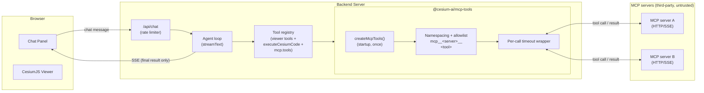
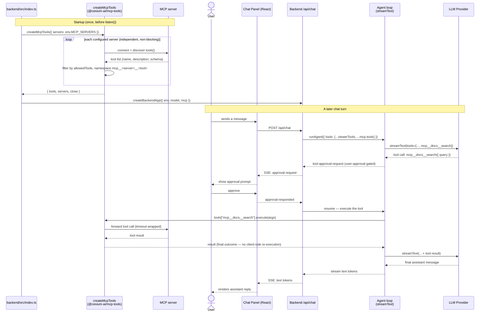
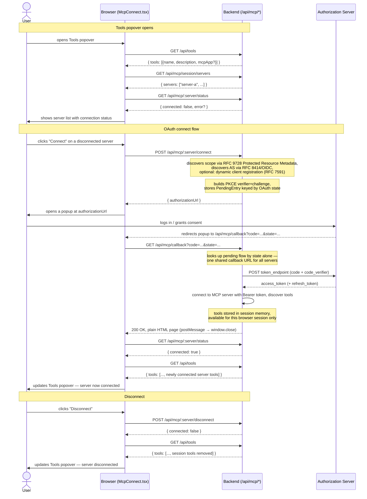

# MCP Support Architecture

This document describes how [Model Context Protocol](https://modelcontextprotocol.io) (MCP) tool
support is wired into the starter app: where it fits in the overall component model, how a
tool-calling turn flows through an MCP server, and what security gates apply to it. MCP support is
implemented entirely in [`@cesium-ai/mcp-tools`](https://github.com/CesiumGS/cesiumjs-ai-starter-app/blob/main/packages/mcp-tools/README.md),
an optional, server-only package — an app that never configures an MCP server never imports it.

---

## 1. Where MCP fits in the system

MCP tools are architecturally different from this repo's other tool groups. A viewer tool (e.g.
`flyTo`) is schema-only on the backend and executes in the browser against the live `Viewer`; the
codegen tool (`executeCesiumCode`) generates code server-side but only actually runs it later,
client-side. An MCP tool's `execute()` instead talks to the MCP server directly from Node — its
result **is** the real, final outcome, and it is never streamed to the browser as a client tool
call.



### Why MCP tools run entirely server-side

- **CORS.** Most MCP servers do not set permissive `Access-Control-Allow-Origin` headers, so a
  browser `fetch` to them would be blocked by the same-origin policy. Routing MCP traffic through
  the Node.js backend sidesteps this — the server-to-MCP call is a plain HTTP/SSE request with no
  origin restrictions.
- **Credential handling.** An MCP server config may carry auth headers. Consuming it only in Node
  keeps those credentials (and the config itself) out of the client bundle entirely — the same
  reasoning that keeps the LLM API key server-only (see [Architecture § split-execution model](architecture.md)).
- **Third-party, dynamic tool registry.** Unlike `flyTo` (hand-authored, reviewed once), an MCP
  server can add, remove, or reword its tools at any time. Keeping discovery and execution
  server-side means a compromised or malicious server can't inject tool definitions the client
  ever sees directly — it only ever sees the model's already-decided tool calls and their results.

---

## 2. Sequence — connecting at startup, then a tool-calling turn



Key points this diagram makes explicit:

- Connecting to every configured MCP server happens **once, at process startup** (`createMcpTools`
  is `async`) — not per-request. A per-request lookup would repeat the discovery round trip on
  every chat turn for no benefit, since a running MCP server's tool catalogue is expected to be
  stable within a process lifetime.
- Each server connects **independently**; a connection failure is recorded in
  `McpToolsHandle.servers` (surfaced via `/health`) and logged, never thrown — one bad server never
  takes the rest of the app down.
- Every MCP tool is registered with `toolApproval: "user-approval"` by default (see
  [`backend/src/app.ts`](https://github.com/CesiumGS/cesiumjs-ai-starter-app/blob/main/backend/src/app.ts)),
  the same human-in-the-loop gate `executeCesiumCode` uses — a model can never call third-party
  code without an explicit user decision first.
- Unlike `executeCesiumCode`, an MCP tool's `execute()` result is already the real, final outcome
  the moment it resolves — there's no later client-side execution phase to wait on, so no extra
  `stopAfterTools`/response-suppression machinery is needed for it (see
  [`@cesium-ai/server`'s README](https://github.com/CesiumGS/cesiumjs-ai-starter-app/blob/main/packages/server/README.md)
  for why `executeCesiumCode` alone needs that).

### Session-scoped interactive OAuth connect

For servers that returned a 401 at startup (auto-detected as `authRequired`), a user can connect
them interactively via the chat panel's Tools popover. The session routes below are exposed by
`@cesium-ai/server/mcp`'s `mcp-session-router.ts`:



Key points:

- A **single shared callback URL** (`<PUBLIC_URL>/api/mcp/callback`) handles all servers — the OAuth
  `state` parameter routes each callback to the right in-flight flow.
- **Token storage.** Tokens are held in a plain closure-local `OAuthState` object inside the
  [`OAuthClientProvider`](https://github.com/CesiumGS/cesiumjs-ai-starter-app/blob/main/packages/mcp-tools/src/session/oauth/oauth-client-provider.ts)
  created for each connection — one provider per `(sessionId, serverName)` pair. They are never
  written to disk, a database, or any external store, and never sent to the browser. The entire
  provider is garbage-collected when the connection is closed.
- **On connect.** A [`ConnectedMcpConnection`](https://github.com/CesiumGS/cesiumjs-ai-starter-app/blob/main/packages/mcp-tools/src/storage/models.ts)
  — holding the live MCP client, its namespaced tool set, and the `OAuthClientProvider` (and thus
  the tokens) — is saved to [`connectedRepository`](https://github.com/CesiumGS/cesiumjs-ai-starter-app/blob/main/packages/mcp-tools/src/session/session-mcp-manager.ts) keyed by `${sessionId}:${serverName}`. From
  that point the session's tools are available via
  [`getSessionTools(sessionId)`](https://github.com/CesiumGS/cesiumjs-ai-starter-app/blob/main/packages/mcp-tools/src/session/session-mcp-manager.ts)
  and merged into every `/api/chat` request for that session.
- **On disconnect.**
  [`disconnect(sessionId, serverName)`](https://github.com/CesiumGS/cesiumjs-ai-starter-app/blob/main/packages/mcp-tools/src/session/session-mcp-manager.ts)
  closes the live MCP client, removes the entry from [`connectedRepository`](https://github.com/CesiumGS/cesiumjs-ai-starter-app/blob/main/packages/mcp-tools/src/session/session-mcp-manager.ts), and releases the
  `OAuthClientProvider`. The tokens and PKCE state are discarded with it — no explicit token
  revocation call is made.
- **User/browser isolation.** Every route in
  [`mcp-session-router.ts`](https://github.com/CesiumGS/cesiumjs-ai-starter-app/blob/main/packages/server/src/routers/mcp-session-router.ts)
  keys off `req.sessionID` from [`express-session`](https://expressjs.com/en/resources/middleware/session/)'s signed, `httpOnly` session cookie. Two
  different browser tabs or users always get different `sessionID` values, so one session can
  never see or use another session's connections or tokens. The composite key
  `${sessionId}:${serverName}` (see
  [`session-mcp-manager.ts`](https://github.com/CesiumGS/cesiumjs-ai-starter-app/blob/main/packages/mcp-tools/src/session/session-mcp-manager.ts))
  means the same server can be connected independently (with different credentials) by different
  sessions simultaneously.
- **Production persistence.** By default
  [`createSessionMiddleware`](https://github.com/CesiumGS/cesiumjs-ai-starter-app/blob/main/backend/src/utils/session.ts)
  uses [`express-session`](https://expressjs.com/en/resources/middleware/session/)'s built-in in-memory `MemoryStore`. All session data — and therefore
  every active MCP connection keyed to a session — is lost if the process restarts or crashes. For
  production, pass a durable store (e.g. `connect-redis`) via the `store` option. Note that
  swapping the session store alone is not enough for multi-instance deployments: `SessionMcpManager`
  holds its own in-memory state (live MCP clients, in-flight OAuth attempts), so requests for a
  given session must consistently reach the same backend instance (sticky sessions), or each
  instance must independently re-authenticate when it receives a session it hasn't seen.
- The callback page is rendered directly by the backend (no redirect to "the" frontend) because this
  backend may be shared by more than one frontend origin.

For the MCP Apps widget render pipeline (the `/api/mcp-app/*` routes, `McpAppWidget`,
`AppRenderer`, and `sandbox_proxy.html`), see the dedicated
[MCP Apps Architecture](architecture-mcp-apps.md) document.

---

## 3. Package structure

```
packages/mcp-tools/
└── src/
    ├── index.ts                     # Public entry point (backend only)
    ├── types.ts                     # McpServerConfig / McpTransportConfig (zod schemas)
    ├── logger.ts                    # McpToolsLogger, noop + console implementations
    ├── tool-timeout.ts              # withTimeout() — Promise.race wrapper per tool call
    ├── mcp-app-meta.ts              # getMcpAppToolMeta() — reads _meta.ui from a discovered tool
    ├── resolve-mcp-scope.ts         # resolveMcpTools/resolveMcpAppTools/resolveMcpClient helpers
    ├── connection/
    │   ├── create-mcp-tools.ts      # createMcpTools() — fans out, merges, collects authRequiredServers
    │   ├── connect-mcp-server.ts    # Per-server connect + allowlist + namespace; returns {error,authRequired} on failure
    │   └── mcp-error.ts             # isUnauthorizedMcpError() — detects 401 across http/sse transports
    ├── session/
    │   ├── session-mcp-manager.ts   # createSessionMcpManager() — per-browser-session OAuth connect/disconnect
    │   ├── session-oauth-connect.ts # beginSessionOAuthConnect / completeSessionOAuthConnect
    │   └── oauth/
    │       ├── oauth-client-provider.ts            # createOAuthClientProvider() — OAuthClientProvider impl
    │       └── discover-protected-resource-scope.ts # RFC 9728 scope discovery
    └── storage/
        ├── models.ts                # ConnectedMcpConnection / PendingMcpConnection types + descriptors
        ├── repositories.ts          # McpConnectionRepository / McpPendingConnectionRepository interfaces
        └── in-memory-repositories.ts # Default in-process implementations (used unless overridden)
```

`@cesium-ai/mcp-tools` has no dependency on `@cesium-ai/server` or `@cesium-ai/tools-schemas`, and
is entirely optional.

---

## 4. Component responsibilities

| Component                  | File                                                                                                                                                                                            | Responsibility                                                                                                                                                                                                                                                           |
| -------------------------- | ----------------------------------------------------------------------------------------------------------------------------------------------------------------------------------------------- | ------------------------------------------------------------------------------------------------------------------------------------------------------------------------------------------------------------------------------------------------------------------------ |
| **Config validation**      | [`types.ts`](https://github.com/CesiumGS/cesiumjs-ai-starter-app/blob/main/packages/mcp-tools/src/types.ts)                                                                                     | `McpServerConfigSchema`/`McpServerConfigsSchema` (zod) — validates transport shape (`sse`/`http` only) and rejects duplicate server names. `parseMcpServerConfigs()` throws on invalid input.                                                                            |
| **Config resolution**      | [`backend/src/utils/mcp-servers-config.ts`](https://github.com/CesiumGS/cesiumjs-ai-starter-app/blob/main/backend/src/utils/mcp-servers-config.ts)                                              | `resolveMcpServersConfig()` — reads `mcp.config.json` first (takes priority), falls back to `MCP_SERVERS` env var JSON, falls back to `[]`.                                                                                                                              |
| **Connection entry**       | [`connection/create-mcp-tools.ts`](https://github.com/CesiumGS/cesiumjs-ai-starter-app/blob/main/packages/mcp-tools/src/connection/create-mcp-tools.ts)                                         | `createMcpTools({ servers, timeoutMs, logger })` — fans out over every configured server, merges results into one `McpToolsHandle { tools, servers, authRequiredServers, getClient, close }`.                                                                            |
| **Per-server connect**     | [`connection/connect-mcp-server.ts`](https://github.com/CesiumGS/cesiumjs-ai-starter-app/blob/main/packages/mcp-tools/src/connection/connect-mcp-server.ts)                                     | Opens the transport (no `authProvider`), calls `tools()`, applies `allowedTools`, and namespaces each tool `mcp__<server>__<tool>`. Returns `{ error, authRequired: true }` on 401, `{ error }` on other failures — never throws.                                        |
| **401 detection**          | [`connection/mcp-error.ts`](https://github.com/CesiumGS/cesiumjs-ai-starter-app/blob/main/packages/mcp-tools/src/connection/mcp-error.ts)                                                       | `isUnauthorizedMcpError(error)` — detects a 401 from both `http` (`.statusCode`) and `sse` (`/\(HTTP 401\)/` message) transports, since `MCPClientError` is not exported from `@ai-sdk/mcp`.                                                                             |
| **Session OAuth manager**  | [`session/session-mcp-manager.ts`](https://github.com/CesiumGS/cesiumjs-ai-starter-app/blob/main/packages/mcp-tools/src/session/session-mcp-manager.ts)                                         | `createSessionMcpManager({ servers, buildRedirectUrl, ... })` — manages per-browser-session connect/disconnect/callback flows; keyed by `sessionId`. In-memory by default; `connectedDescriptorRepository`/`pendingDescriptorRepository` are pluggable extension points. |
| **OAuth connect steps**    | [`session/session-oauth-connect.ts`](https://github.com/CesiumGS/cesiumjs-ai-starter-app/blob/main/packages/mcp-tools/src/session/session-oauth-connect.ts)                                     | `beginSessionOAuthConnect` / `completeSessionOAuthConnect` — the two-phase split (start + callback) needed because the browser popup is a separate HTTP navigation from the initial POST.                                                                                |
| **OAuth client provider**  | [`session/oauth/oauth-client-provider.ts`](https://github.com/CesiumGS/cesiumjs-ai-starter-app/blob/main/packages/mcp-tools/src/session/oauth/oauth-client-provider.ts)                         | `createOAuthClientProvider()` — implements `@ai-sdk/mcp`'s `OAuthClientProvider` interface; handles dynamic registration ([RFC 7591](https://datatracker.ietf.org/doc/html/rfc7591)), PKCE, and token storage via an in-memory `MemoryOAuthTokenStore`.                  |
| **Scope discovery**        | [`session/oauth/discover-protected-resource-scope.ts`](https://github.com/CesiumGS/cesiumjs-ai-starter-app/blob/main/packages/mcp-tools/src/session/oauth/discover-protected-resource-scope.ts) | `discoverProtectedResourceScope()` — fetches [RFC 9728](https://datatracker.ietf.org/doc/html/rfc9728) Protected Resource Metadata and joins `scopes_supported` into a space-separated scope string. Returns `undefined` when the field is absent (never throws).        |
| **Scope resolution**       | [`resolve-mcp-scope.ts`](https://github.com/CesiumGS/cesiumjs-ai-starter-app/blob/main/packages/mcp-tools/src/resolve-mcp-scope.ts)                                                             | `resolveMcpTools`/`resolveMcpAppTools`/`resolveMcpClient`/`isKnownMcpTool` — helpers that merge operator `mcp` tools with a request's session tools, avoiding duplicated logic in the host app.                                                                          |
| **MCP Apps metadata**      | [`mcp-app-meta.ts`](https://github.com/CesiumGS/cesiumjs-ai-starter-app/blob/main/packages/mcp-tools/src/mcp-app-meta.ts)                                                                       | `getMcpAppToolMeta()` — reads `_meta.ui` from a discovered tool and attaches it directly onto the `McpTool` object; `mcpAppClientCapabilities` is advertised during connect.                                                                                             |
| **Timeout wrapper**        | [`tool-timeout.ts`](https://github.com/CesiumGS/cesiumjs-ai-starter-app/blob/main/packages/mcp-tools/src/tool-timeout.ts)                                                                       | `withTimeout(tool, timeoutMs, name, logger)` — wraps a tool's `execute()` in a `Promise.race` against a deadline so a stalled server can't hang the agent loop indefinitely.                                                                                             |
| **Logging**                | [`logger.ts`](https://github.com/CesiumGS/cesiumjs-ai-starter-app/blob/main/packages/mcp-tools/src/logger.ts)                                                                                   | `McpToolsLogger` interface; `noopMcpToolsLogger` (default) and `createConsoleMcpToolsLogger(level)`. Logs every discovered tool's name + description at connect time.                                                                                                    |
| **Backend wiring**         | [`backend/src/index.ts`](https://github.com/CesiumGS/cesiumjs-ai-starter-app/blob/main/backend/src/index.ts)                                                                                    | Resolves `createMcpTools` once at startup, builds `createSessionMcpManager` from `authRequiredServers` when non-empty, logs per-server outcomes (connected / auth-required / error), closes all clients on `SIGTERM`/`SIGINT`.                                           |
| **App composition**        | [`backend/src/app.ts`](https://github.com/CesiumGS/cesiumjs-ai-starter-app/blob/main/backend/src/app.ts)                                                                                        | Spreads `mcp?.tools` into static tools, resolves session tools per-request via `resolveMcpTools`, approval-gates every `mcp__*` tool, mounts session + MCP-App routers, surfaces `mcp.servers` in `/health`.                                                             |
| **Session routes**         | `@cesium-ai/server/mcp`'s `mcp-session-router.ts`                                                                                                                                               | `GET /api/mcp/session/servers`, `POST /api/mcp/:server/connect`, `GET /api/mcp/callback`, `GET /api/mcp/:server/status`, `POST /api/mcp/:server/disconnect` — the HTTP surface for the browser-side "Connect" UI flow.                                                   |
| **MCP Apps bridge routes** | `@cesium-ai/server/mcp`'s `mcp-app-router.ts`                                                                                                                                                   | `GET /api/mcp-app/resource` (returns raw `ReadResourceResult` for `ui://` URIs) and `POST /api/mcp-app/tool-call` (validates against the request's tool registry before calling the MCP tool). Timeout-wrapped; `ui://` URI-gated.                                       |
| **Tools introspection**    | `@cesium-ai/server`'s `createToolsRouter`                                                                                                                                                       | `GET /api/tools` — returns `{ tools: [{name, description, mcpApp?}] }` for the request's resolved tool set (session-cookie-aware); used by the chat panel's Tools popover.                                                                                               |

---

## 5. Security model

MCP tool calls run code you don't control, so `@cesium-ai/mcp-tools` is deliberately conservative
by default:

| Risk                                                                                                                                                          | Mitigation                                                                                                                                                                                                                                                    |
| ------------------------------------------------------------------------------------------------------------------------------------------------------------- | ------------------------------------------------------------------------------------------------------------------------------------------------------------------------------------------------------------------------------------------------------------- |
| Config is attacker-influenceable — a server URL controls what code runs.                                                                                      | `McpServerConfig[]` is trusted, operator-supplied config (`mcp.config.json` or `MCP_SERVERS` env var, resolved in `backend/src/utils/mcp-servers-config.ts`) — **never** derived from a chat request.                                                         |
| A locally-spawned process is a larger attack surface than a URL.                                                                                              | `stdio` transport (spawning an arbitrary local executable) is deliberately unsupported — only `sse`/`http` transports validate; anything else is rejected at parse time.                                                                                      |
| [Tool poisoning](https://owasp.org/www-community/attacks/MCP_Tool_Poisoning) / silent "rug pull" — a server can change a tool's name/description at any time. | Every discovered tool's name + description is logged at connect time (`createConsoleMcpToolsLogger("info")` or louder) — review these logs whenever a server updates. Prefer an explicit `allowedTools` allowlist over a server's full, unreviewed catalogue. |
| Name collisions across servers.                                                                                                                               | Every tool is namespaced `mcp__<serverName>__<toolName>` before merging — two servers can never silently shadow each other's tools.                                                                                                                           |
| A stalled or malicious server hangs the agent loop.                                                                                                           | Every tool call is wrapped in a timeout (`timeoutMs`, default `DEFAULT_MCP_TOOL_TIMEOUT_MS` = 30s) that rejects the call rather than blocking indefinitely.                                                                                                   |
| One bad server takes the whole app down.                                                                                                                      | Each server connects independently; a failure is recorded in `McpToolsHandle.servers` and logged, never thrown. Visible in startup logs and `/health`.                                                                                                        |
| Credentials/URLs leaking to the browser.                                                                                                                      | `McpServerConfig` (which may carry auth headers or OAuth config) is consumed entirely server-side and never serialized into any client-facing response.                                                                                                       |
| Per-user OAuth credentials must not leak across users or persist unexpectedly.                                                                                | Session OAuth creates one in-memory provider per browser session (`MemoryOAuthTokenStore`). Tokens never reach the browser or disk and are discarded when the connection/session is closed or the process restarts.                                           |
| A model calling an MCP tool without a human in the loop.                                                                                                      | `backend/src/app.ts` defaults every MCP tool to `"user-approval"` (matched by the `mcp__` prefix convention) — the same approval gate `executeCesiumCode` uses (see [Codegen Architecture](architecture-codegen.md)).                                         |
| A rendered MCP App widget calling tools/reading resources without a human in the loop.                                                                        | Every widget-initiated tool call requires an explicit inline Approve/Reject in the chat panel's `McpAppWidget` before the backend is ever called; the backend independently re-validates `(server, toolName)` against the request's resolved tool registry.   |

See [`@cesium-ai/mcp-tools`'s README](https://github.com/CesiumGS/cesiumjs-ai-starter-app/blob/main/packages/mcp-tools/README.md)
for the full security model table, API reference, and current limitations (elicitation,
resources/prompts are not wired up).

---

## 6. Configuration

| Env var / config file | Default | Purpose                                                                                                                                                                                                                                          |
| --------------------- | ------- | ------------------------------------------------------------------------------------------------------------------------------------------------------------------------------------------------------------------------------------------------ |
| `mcp.config.json`     | —       | Preferred config location (gitignored). JSON array of `McpServerConfig`; takes priority over `MCP_SERVERS` when present. See [`mcp.config.json.example`](https://github.com/CesiumGS/cesiumjs-ai-starter-app/blob/main/mcp.config.json.example). |
| `MCP_SERVERS`         | `[]`    | Fallback JSON array of `McpServerConfig` set via `.env`. Ignored when `mcp.config.json` exists.                                                                                                                                                  |
| `MCP_TOOL_TIMEOUT_MS` | `30000` | Per-tool-call timeout in milliseconds, applied to every MCP tool.                                                                                                                                                                                |
| `SESSION_SECRET`      | —       | Required (non-empty) when any server auto-detects as `authRequired`. Used to sign session cookies. The backend throws at startup if `sessionMcp` would be created without it.                                                                    |
| `PUBLIC_URL`          | —       | Used to build the OAuth callback URL (`<PUBLIC_URL>/api/mcp/callback`). Register this with every OAuth provider before users connect.                                                                                                            |

Config is resolved in [`backend/src/utils/mcp-servers-config.ts`](https://github.com/CesiumGS/cesiumjs-ai-starter-app/blob/main/backend/src/utils/mcp-servers-config.ts)
(server list) and [`backend/src/utils/env.ts`](https://github.com/CesiumGS/cesiumjs-ai-starter-app/blob/main/backend/src/utils/env.ts)
(timeouts, session secret).
Leaving all MCP config unset is a zero-behavior-change default — `mcp` and `sessionMcp` both stay
`undefined`, no `McpToolsHandle` or `SessionMcpManager` is constructed, and the tool
registry/`/health` output are unaffected.

---

## Related documents

- [Architecture](architecture.md) — overall system component model and the split-execution model MCP follows.
- [Codegen Architecture](architecture-codegen.md) — the other tool that requires human-in-the-loop approval, for comparison.
- [MCP Apps Architecture](architecture-mcp-apps.md) — widget render pipeline, `AppRenderer`, sandbox proxy, and security model for MCP Apps.
- [Adding an MCP Server](../tutorials/mcp-server-tutorial.md) — task-oriented tutorial: configuring servers, OAuth, verifying a connection, and trying a tool call.
- [`@cesium-ai/mcp-tools` package docs](../packages/mcp-tools/index.md) — full README (API, security model, limitations).
