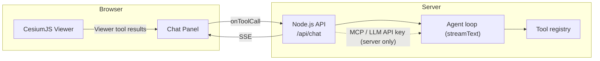
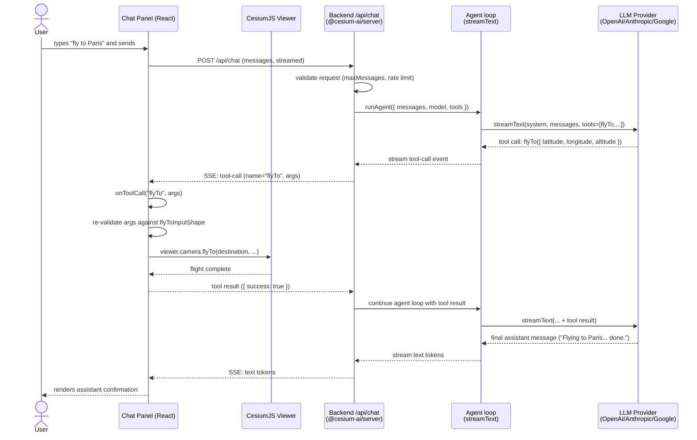

# Architecture

This document explains how the CesiumJS AI starter app is put together: its high-level
component architecture, the request/response sequence for a tool-calling chat turn, and
how it's deployed (Docker Compose topology).

## 1. Component overview

**Split-execution model:** viewer tools (camera navigation, entity manipulation) are
streamed via [Server-Sent Events](https://developer.mozilla.org/en-US/docs/Web/API/Server-sent_events) to the browser and executed there, against the live `Viewer` instance. Any future
MCP-backed tools would run entirely server-side and never stream as client tool calls. The
**LLM API key never reaches the browser** — all inference happens behind the Node.js API.

### Why split execution this way?

**CesiumJS must run in the browser:**

- CesiumJS's `Viewer` only exists in the browser (WebGL context, DOM canvas) — there's
  nothing for the server to execute against.

**Server-side logic protects against several classes of vulnerability:**

- **API key exposure** — keeping the LLM API key and any MCP credentials server-side means
  the client bundle never carries a secret that could be extracted from DevTools or a
  network trace and abused by a third party.
- **Prompt injection** ([OWASP LLM01](https://owasp.org/www-community/attacks/PromptInjection))
  **& tool poisoning** ([OWASP MCP Tool Poisoning](https://owasp.org/www-community/attacks/MCP_Tool_Poisoning))
  — tool
  _descriptions_ (the natural-language hints the LLM reads to decide which tool to call)
  are constructed server-side and never passed through untrusted user input. If
  descriptions were rendered on the client and echoed back, a crafted message could hijack
  tool selection. A related attack — [_tool poisoning_](https://owasp.org/www-community/attacks/MCP_Tool_Poisoning) — embeds adversarial instructions
  inside a tool's `name` or `description` field to manipulate the model's behaviour
  without the user's knowledge; keeping the tool registry server-only prevents a
  compromised client from injecting or replacing tool definitions. See
  [`docs/packages/index.md`](../packages/index.md) for how
  [`@cesium-ai/tools-schemas`](https://github.com/CesiumGS/cesiumjs-ai-starter-app/tree/main/packages/tools-schemas)
  splits its exports to enforce that boundary at the module level.
- **CORS restrictions on MCP servers** — most MCP servers do not set permissive
  `Access-Control-Allow-Origin` headers, so browser `fetch` calls to them are blocked by
  the browser's same-origin policy. Routing all MCP traffic through the Node.js backend
  sidesteps this entirely; the server-to-MCP call is a plain HTTP/WebSocket request with
  no origin restrictions.
- **Tool schema leakage** — exposing the full tool registry (names, parameter shapes,
  descriptions) to the browser gives an attacker the reconnaissance needed to craft
  effective prompt-injection and tool-poisoning attacks (see bullets above). Keeping
  schemas server-side removes that advantage.

## 2. Sequence diagram — a tool-calling chat turn

The following shows what happens end to end when a user types **"fly to Paris"**.

Key points this diagram makes explicit:

- The **args the model produced are untrusted** until the client re-validates them against
  the schema-only shape (`flyToInputShape`) — never trust that the server accepted a value
  as safe to feed to `Viewer.camera.flyTo`.
- The agent loop is iterative: `stopWhen: stepCountIs(maxSteps)` bounds how many
  model-call ⇄ tool-call round trips a single request can make (default `5` — see
  [`DEFAULT_MAX_STEPS`](https://github.com/CesiumGS/cesiumjs-ai-starter-app/blob/main/packages/server/src/agent.ts)
  in [`@cesium-ai/server`](https://github.com/CesiumGS/cesiumjs-ai-starter-app/blob/main/packages/server/README.md)).
- Everything left of `Backend /api/chat` runs in the browser; everything right of it runs
  on the Node.js server. The LLM provider is only ever called server-side.

## Related documents

- [Getting Started](../getting-started.md) — install and run the app.
- [Packages](../packages/index.md) — what each workspace package is responsible for.
- [Cesium Viewer Tools Tutorial](../tutorials/cesium-viewer-tools-tutorial.md) — how the viewer tool system works, and how to add/remove a tool.
- [MCP Support Architecture](architecture-mcp.md) — how optional MCP (Model Context Protocol) tool servers are wired in.
