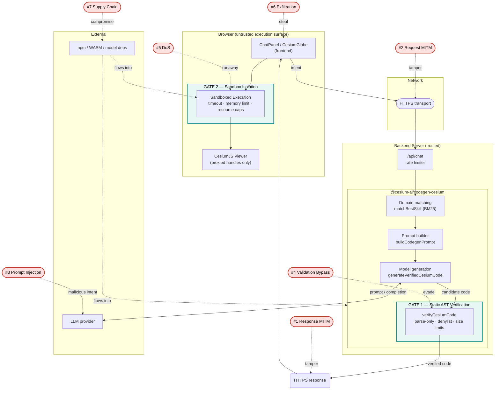

# CesiumJS CodeGen Tool: Security Attack Vectors & Mitigations

This document describes the security threat model for the AI-driven CesiumJS code generation
pipeline: where attacks can enter, what they look like, and which mitigations address each
one. It is meant as a learning resource — an orientation to the security landscape — not a
compliance checklist.

For the component architecture and current implementation status of each gate, see the
[Codegen Architecture](architecture-codegen.md) document.

**Current status:** The pipeline implements Gate 1 (server-side static AST verification).
Gate 2 (browser-side sandbox isolation) is not yet implemented — verified code is returned
to the client and executed after user approval, without sandbox isolation.

---

## Architecture & attack surface

Every attack vector (**#1–#7**) is placed on the component architecture. Attack labels
show where each vector strikes and link to the detailed section below.



**Reading the diagram:**

- Everything inside **Backend Server** is trusted; everything inside **Browser** is not —
  generated code is treated as untrusted until it passes Gate 2.
- **Gate 1** (static, no execution) catches vectors #3 and #4 before code leaves the server.
- **Gate 2** (runtime isolation) contains vectors #5 and #6 that static analysis cannot catch.
- Transport security (HTTPS/HSTS/CSP) is a deployment-layer concern that protects vectors
  #1, #2, and #6.

| #     | Attack                     | Occurs at                                  | Section                             |
| ----- | -------------------------- | ------------------------------------------ | ----------------------------------- |
| **1** | MITM Response Modification | Server → Browser (generated-code response) | [§1](#1-mitm-response-modification) |
| **2** | MITM Request Modification  | User → Server (request on the wire)        | [§2](#2-mitm-request-modification)  |
| **3** | LLM Prompt Injection       | User intent → LLM → generated code         | [§3](#3-llm-prompt-injection)       |
| **4** | Validation Bypass          | AST verifier (`verifyCesiumCode`)          | [§4](#4-validation-bypass)          |
| **5** | Resource Exhaustion / DoS  | Browser sandbox execution                  | [§5](#5-resource-exhaustion-dos)    |
| **6** | Data Exfiltration          | Browser context (user session)             | [§6](#6-data-exfiltration)          |
| **7** | Supply Chain               | Dependencies across server, LLM, sandbox   | [§7](#7-supply-chain)               |

---

## Threat model

### Actors & motivations

| Actor                        | Threat                                                    | Impact                                            |
| ---------------------------- | --------------------------------------------------------- | ------------------------------------------------- |
| **MITM Attacker (Response)** | Intercepts and modifies generated code in transit         | High — steals auth tokens, user data              |
| **MITM Attacker (Request)**  | Intercepts and modifies user intent before the server     | High — injects malicious intent before validation |
| **Compromised Server**       | Generates malicious code intentionally                    | High — affects all users                          |
| **Malicious LLM Output**     | LLM generates harmful code via prompt injection           | Medium — contained if Gate 1 verifier catches it  |
| **Malicious User**           | Intentionally asks for dangerous code                     | Low — self-inflicted in a personal-use app        |
| **Accidental Code-Gen Bug**  | Verifier misses an edge case, allows unintended API calls | Medium — may corrupt viewer state or cause DoS    |

---

## Attack vectors

### 1. MITM Response Modification

**Where it occurs:** Between the server and the browser, on the generated-code response.

An attacker intercepts the response and replaces the verified code with a malicious payload
before the browser receives it. In a properly configured HTTPS deployment this attack path
is closed, because an on-path attacker cannot tamper with a validly-terminated TLS
connection.

**Mitigations:**

- **HTTPS + HSTS (deployment)** — Enforce TLS for all traffic. This is the primary and
  sufficient control for most deployments.
  ```
  Strict-Transport-Security: max-age=31536000; includeSubDomains
  ```
- **Code signing (optional, defense-in-depth)** — Signing the generated code on the server
  and verifying it on the client adds value in high-assurance environments where the trust
  boundary extends beyond TLS termination — for example, when a CDN, corporate proxy, or
  browser extension could rewrite responses downstream of HTTPS.

---

### 2. MITM Request Modification

**Where it occurs:** Between the user and the server, on the intent request.

An attacker intercepts the user's natural-language intent and alters it before the server
receives it. The server then generates code from the modified prompt, potentially producing
malicious output if the verifier does not catch it.

Like the response case, HTTPS is the primary defence. Request-signing schemes for this
pipeline have a fundamental limitation: any secret embedded in client-side JavaScript is
trivially extractable via browser devtools, so they do not prove request integrity. A
production-grade alternative is session-based authentication with server-issued nonces.

**Mitigations:**

- **HTTPS + HSTS (deployment)** — Encrypts requests in transit, preventing on-path
  modification.
- **Session-based authentication** — Ties requests to an authenticated session rather than
  relying on a client-side secret.

---

### 3. LLM Prompt Injection

**Where it occurs:** User input → assembled prompt → LLM → generated code.

A user includes instructions in their input designed to override the system prompt and
cause the LLM to generate harmful code — for example, asking the model to ignore its
constraints and emit a `fetch` call to an external URL. The static verifier (Gate 1) is
the primary defence against whatever the LLM produces.

**Mitigations:**

1. **Static [AST](https://en.wikipedia.org/wiki/Abstract_syntax_tree) Verification (Gate 1)** — The verifier ([`ast-verifier.ts`](https://github.com/CesiumGS/cesiumjs-ai-starter-app/blob/main/packages/codegen-cesium/src/pipeline/ast-verifier.ts), powered by [`acorn`](https://github.com/acornjs/acorn)) operates in parse-only mode — it
   never evaluates the code — and uses a real AST walk rather than regex matching (regex
   can be bypassed via string concatenation or unicode escapes). It rejects:
   - `eval(...)` and bare `eval` references
   - `Function(...)` / `new Function(...)` and bare `Function` references
   - Dynamic `import(...)`
   - Computed member access (`obj[expr]`) — dot notation only
   - Browser globals: `fetch`, `XMLHttpRequest`, `WebSocket`, `window`, `document`,
     `localStorage`, `sessionStorage`, `indexedDB`, `navigator`, `Worker`,
     `SharedWorker`, `postMessage`

2. **Allowlist-based validation (optional)** — The verifier accepts an optional
   `allowedSymbols` list. When provided, any free identifier not on the list is rejected,
   giving positive-allowlist safety on top of the denylist. Currently
   `generateVerifiedCesiumCode` does not pass an `allowedSymbols` argument, so this
   feature is available but not enabled.

   ```typescript
   const result = verifyCesiumCode(code, { allowedSymbols: myAllowedSymbolsList });
   ```

3. **Sandbox execution (Gate 2)** — A runtime sandbox provides a second containment layer
   for anything the static verifier misses. Code runs isolated from the page's global
   scope and cannot reach browser APIs directly.

---

### 4. Validation Bypass

**Where it occurs:** The [AST](https://en.wikipedia.org/wiki/Abstract_syntax_tree) verifier (`verifyCesiumCode`) in [`@cesium-ai/codegen-cesium`](https://github.com/CesiumGS/cesiumjs-ai-starter-app/tree/main/packages/codegen-cesium).

Static verification has inherent limits. Some patterns that the verifier does not currently
block include:

- **Property reassignment** — reassigning a viewer property to a modified object.
- **Prototype pollution** — mutating `Object.prototype` or `__proto__`, which affects all
  objects including the viewer. Primary containment for this is the downstream sandbox.

The verifier already addresses the most common bypass routes: computed member access,
`eval`, dynamic import, and all network globals.

**Mitigations:**

1. **Existing denylist + structural bans** — The verifier rejects computed member access,
   `eval`, `Function`/`new Function`, dynamic `import`, and banned browser globals,
   whether referenced directly or as a member-access root.

2. **Runtime guardrails (defense in depth)** — Even if code passes static verification,
   runtime limits apply: entity cap, primitive cap, data-source cap, execution timeout, and
   memory limit.

3. **Test coverage for bypass patterns** — Edge cases such as property reassignment,
   prototype mutation, and adversarial inputs are good candidates for regression tests as
   the verifier evolves.

---

### 5. Resource Exhaustion / DoS

**Where it occurs:** Browser-side code execution (Gate 2 sandbox).

Generated code — accidentally or intentionally — could exhaust browser resources through
infinite loops, deep recursion, memory allocation, or spamming Viewer entities. This only
affects the user's own tab.

The static verifier catches the simplest cases (`while (true)`, `for (;;)` without a
`break`), but general unbounded iteration is only fully contained at runtime.

**Mitigations:**

1. **Execution timeout** — The sandbox interrupts code that exceeds a configured time limit
   (e.g., 5 000 ms), preventing infinite loops and runaway operations.

2. **Memory limit** — The sandbox enforces a heap cap per run (e.g., 64 MB), preventing
   out-of-memory crashes.

3. **Runtime entity and resource caps** — Limits enforced at execution time:
   - Entity cap (e.g., 200 entities maximum)
   - `scene.primitives` and `dataSources` collection caps, checked before each `add`
   - Rate limiting on sandbox execution frequency

   ```typescript
   if (viewer.entities.values.length >= maxEntities) {
     throw new EntityCapExceededError(maxEntities);
   }
   ```

4. **Static complexity limits** — `verifyCesiumCode` enforces a source-size cap (4 000
   characters / 100 lines by default, both overridable) and rejects always-true loop
   conditions without a `break`.

---

### 6. Data Exfiltration

**Where it occurs:** Within the browser context (user's own session).

Generated code running in the browser's global scope can, in principle, access browser
APIs: cookies, `localStorage`, `sessionStorage`, geolocation, the clipboard, and same-
origin `fetch` endpoints. This is primarily a concern for the planned Gate 2 sandbox, which
removes direct access to these surfaces.

**Mitigations:**

1. **Sandbox isolation (Gate 2)** — The primary control. Generated code runs in an isolated
   environment without access to the page's global scope, `window`, `document`, or storage
   APIs. It interacts with the viewer only through a controlled bridge with opaque handles.

2. **Content Security Policy (deployment)** — A CSP header limits where the browser can
   connect, so even if sandbox isolation is bypassed, `fetch()` to attacker-controlled
   domains is blocked:

   ```
   Content-Security-Policy:
     default-src 'self';
     connect-src 'self' cesium.ion.analytics.mapbox.com;
     script-src 'self' 'wasm-unsafe-eval';
   ```

3. **Credential handling best practices** — Using `httpOnly` cookies (unreadable by JS)
   and session-based auth with secure cookies reduces the value of any credential that
   generated code might reach.

4. **API rate limiting** — Request-level rate limiting at `/api/chat` limits what can be
   fetched even if an attacker gains code execution.

---

### 7. Supply Chain

**Where it occurs:** npm dependencies, the LLM provider, and any sandboxing runtime.

A compromised dependency can inject malicious behaviour anywhere in the pipeline — for
example, a backdoored npm package, a tampered WASM sandbox binary served from a CDN, or
a compromised LLM API returning adversarial output.

**Mitigations:**

1. **Dependency auditing** — `npm audit` and `npm outdated` surface known vulnerabilities.
   Wiring `npm audit` into CI as a build gate ensures new vulnerabilities are caught
   automatically.

2. **Lock files** — `package-lock.json` pins exact versions across the workspace, preventing
   silent upgrades. Reviewing lock-file diffs on dependency changes is good practice.

3. **Subresource Integrity (SRI) for CDN assets** — If any library is loaded from a CDN,
   adding an `integrity` hash to the `<script>` tag ensures the browser rejects tampered
   content.

---

## Execution model trade-offs

The choice of how to execute generated code in the browser has significant security
implications. Three broad approaches exist; the fourth combines them in layers.

### Option A: Direct execution (no sandbox)

Generated code runs directly in the browser's global scope — no isolation layer, full
access to `window`, `document`, `localStorage`, and so on. Security relies entirely on
Gate 1 (static AST verification).

This is the simplest approach and the current state of the repository. It is appropriate
for personal or demo apps where the threat model is low and the user understands the
trade-off. The static verifier materially reduces risk, but it cannot provide runtime
containment.

---

### Option B: QuickJS WASM sandbox

Generated code runs inside [QuickJS-emscripten](https://github.com/justjake/quickjs-emscripten) — a JavaScript interpreter compiled to
[WebAssembly](https://webassembly.org) — with an explicit timeout and heap cap. The viewer is exposed through an
opaque handle bridge, so the sandbox cannot reach page globals.

This provides strong process-level isolation, handles infinite loops gracefully (via
timeout interrupt), and prevents memory exhaustion. The trade-offs are additional bundle
size, implementation complexity, and some performance overhead from marshalling.

---

### Option C: iframe sandbox

Generated code runs in a cross-origin `<iframe sandbox>` element. The `sandbox` attribute
disables access to the parent frame and many browser capabilities.

```html
<iframe sandbox="allow-scripts" srcdoc="..."></iframe>
```

This uses a native browser mechanism with no WASM dependency. However, it provides weaker
isolation than QuickJS — the iframe still has access to `fetch` and `localStorage` unless
a strict CSP is also applied — and communicating with the viewer requires a `postMessage`
bridge, which adds complexity.

---

### Option D: Layered defence (recommended direction)

The approaches above are most effective in combination:

| Layer | Mechanism                             | Vectors addressed |
| ----- | ------------------------------------- | ----------------- |
| 1     | HTTPS + HSTS + CSP (deployment)       | #1, #2, #6        |
| 2     | Static AST verification (Gate 1)      | #3, #4            |
| 3     | Sandbox execution (Gate 2)            | #4, #5, #6        |
| 4     | Runtime caps: entities, timeout, heap | #5                |

The key insight is that no single layer needs to be perfect — an attacker must breach
multiple independent controls for an attack to succeed. For instance, if the AST verifier
misses a prototype-pollution pattern, the sandbox still prevents it from reaching page
globals; if the sandbox leaks, the CSP can block the exfiltration.

---

## References

- [OWASP: Code Injection](https://owasp.org/www-community/attacks/Code_Injection)
- [MDN: iframe sandbox attribute](https://developer.mozilla.org/en-US/docs/Web/HTML/Element/iframe#attr-sandbox)
- [MDN: Content Security Policy](https://developer.mozilla.org/en-US/docs/Web/HTTP/CSP)
- [QuickJS](https://bellard.org/quickjs/)
- [WebAssembly Security](https://webassembly.org/docs/security/)
