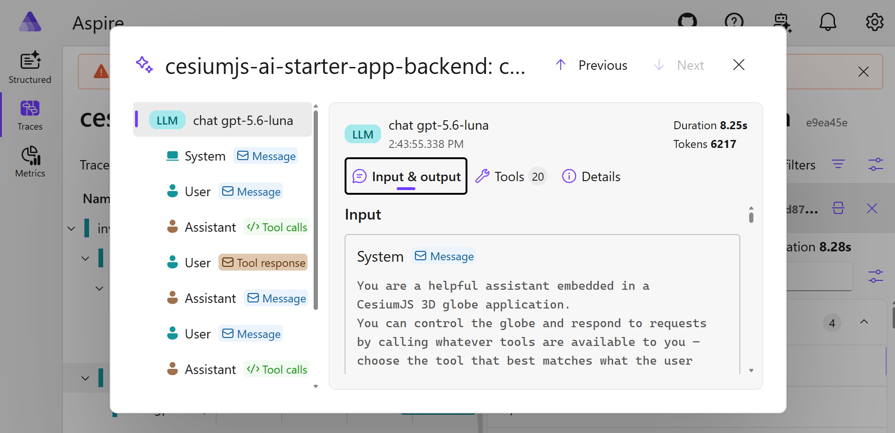

# Connecting to OTel Providers

This guide covers sending this app's telemetry — logs, traces, and metrics — to an OpenTelemetry
(OTel) backend. It assumes the app is already running locally; see
[Getting Started](getting-started.md) first if it isn't.

Both exporters speak plain OTLP/HTTP, so any OTLP-compatible provider works — point an endpoint
(and, if required, auth headers) at whichever one you pick in [Step 2](#step-2-send-telemetry-somewhere).

## What gets exported

| Signal  | Backend | Frontend |
| ------- | :-----: | :------: |
| Logs    |   ✅    |    ✅    |
| Traces  |   ✅    |    —     |
| Metrics |   ✅    |    —     |

Backend and frontend are enabled and configured independently — see
[Step 1](#step-1--learn-the-common-configuration-shape) for the env vars.

### Backend

Server-side env vars (`TELEMETRY_ENABLED`, `OTEL_*`), read via
[`backend/src/utils/env.ts`](https://github.com/CesiumGS/cesiumjs-ai-starter-app/blob/main/backend/src/utils/env.ts) and wired up in
[`backend/src/utils/telemetry.ts`](https://github.com/CesiumGS/cesiumjs-ai-starter-app/blob/main/backend/src/utils/telemetry.ts).

- **Logs**: every `AppLogger` call is also emitted as an OTel log record (`/v1/logs`) via
  [`@opentelemetry/exporter-logs-otlp-http`](https://www.npmjs.com/package/@opentelemetry/exporter-logs-otlp-http),
  alongside the existing console output.
- **Traces**: a globally-registered `NodeTracerProvider`, combined with
  [`@ai-sdk/otel`](https://www.npmjs.com/package/@ai-sdk/otel)'s `OpenTelemetry` integration via
  `registerTelemetry()`, makes every `streamText` call in `@cesium-ai/server`'s agent loop
  (`runAgent`) emit GenAI-semantic-convention spans (`invoke_agent` → `chat` → `execute_tool`) to
  `/v1/traces` with no per-call opt-in needed.
- **Metrics**: a globally-registered `MeterProvider` with a `PeriodicExportingMetricReader`
  (default 60s interval) exports to `/v1/metrics`. The agent loop and codegen pipeline each record
  histograms via `createServerMetrics`/`createCodegenMetrics`: `cesium_ai.chat.tokens.{input,output,total}`
  and `cesium_ai.chat.request.duration` for chat; `cesium_ai.codegen.tokens.{input,output,total}`,
  `cesium_ai.codegen.skill_match.score`, and `cesium_ai.codegen.generation.duration` for codegen.
  Token usage uses a separate histogram per type so a dashboard's default per-metric graph is
  unambiguous — see [Reading the token/duration histograms](#reading-the-tokenduration-histograms).

### Frontend

- Build-time Vite env vars: `VITE_TELEMETRY_ENABLED`, `VITE_OTEL_*`.
- Read via [`frontend/src/utils/config.ts`](https://github.com/CesiumGS/cesiumjs-ai-starter-app/blob/main/frontend/src/utils/config.ts) and baked into the client bundle at build time
  (see `frontend/Dockerfile` build args / `compose.yaml`).
- Emits **logs only** (no client-side tracer) — from the chat panel and the codegen sandbox logger
  adapter.

## Step 1 — Learn the common configuration shape

| Concern                   | Backend var                           | Frontend var                                           |
| ------------------------- | ------------------------------------- | ------------------------------------------------------ |
| Enable export             | `TELEMETRY_ENABLED`                   | `VITE_TELEMETRY_ENABLED`                               |
| Base OTLP endpoint        | `OTEL_EXPORTER_OTLP_ENDPOINT`         | `VITE_OTEL_EXPORTER_OTLP_ENDPOINT`                     |
| Explicit logs endpoint    | `OTEL_EXPORTER_OTLP_LOGS_ENDPOINT`    | `VITE_OTEL_EXPORTER_OTLP_LOGS_ENDPOINT`                |
| Explicit traces endpoint  | `OTEL_EXPORTER_OTLP_TRACES_ENDPOINT`  | — (frontend emits no traces)                           |
| Explicit metrics endpoint | `OTEL_EXPORTER_OTLP_METRICS_ENDPOINT` | — (frontend emits no metrics)                          |
| Auth/routing headers      | `OTEL_EXPORTER_OTLP_HEADERS`          | `VITE_OTEL_EXPORTER_OTLP_HEADERS`                      |
| `service.name`            | `OTEL_SERVICE_NAME`                   | `VITE_OTEL_SERVICE_NAME`                               |
| `service.namespace`       | `OTEL_SERVICE_NAMESPACE`              | `VITE_OTEL_SERVICE_NAMESPACE`                          |
| Extra resource attrs      | `OTEL_RESOURCE_ATTRIBUTES`            | `VITE_OTEL_RESOURCE_ATTRIBUTES`                        |
| Log severity threshold    | `OTEL_LOG_LEVEL` (default `info`)     | `VITE_OTEL_LOG_LEVEL` (default `debug` in dev, `silent` in prod) |

- Headers use the same comma-separated `key=value,key2=value2` format for both sides, shared by
  logs, traces, and metrics on the backend (`OTLPLogExporter`, `OTLPTraceExporter`, and
  `OTLPMetricExporter` all read `OTEL_EXPORTER_OTLP_HEADERS`).
- If an explicit per-signal endpoint var is unset, the app appends `/v1/logs`, `/v1/traces`, or
  `/v1/metrics` to the base endpoint automatically — set an explicit endpoint only when a
  provider's ingestion path differs from that convention.
- Frontend vars are **build-time**: changing them requires a `npm run dev` restart or Docker
  rebuild (`docker compose up --build`), since Vite bakes them into the client bundle.
- Set backend vars in the repo-root `.env` (consumed by `npm run dev:backend` / the `backend`
  container) and frontend vars in the same file (consumed by `npm run dev:frontend` / the
  `frontend` build args in `compose.yaml`). The sections below give per-provider `.env` snippets.

## Step 2 — Send telemetry somewhere

Pick one of the two options below.

### Option A: Aspire Dashboard (recommended for local testing)

The [Aspire Dashboard](https://aspire.dev/dashboard/standalone/) is the easiest way to see this
app's telemetry locally:

- One container, a built-in OTLP endpoint.
- A UI with a trace viewer (for the `invoke_agent`/`chat`/`execute_tool` span tree), a structured
  log viewer, and a Metrics tab.
- No cloud account or separate tool needed for logs vs. traces vs. metrics.

**Frontend CORS note:** unlike the backend (a server-to-server Node request, not subject to CORS),
the frontend sends OTLP logs directly from the browser via `fetch`.

- The dashboard rejects cross-origin OTLP requests by default. Without
  `DASHBOARD__OTLP__CORS__ALLOWEDORIGINS` set to the frontend's dev origin, those requests
  silently fail (a blocked/failed POST to `/v1/logs` in DevTools' Network tab) and **only backend
  telemetry shows up**, even though both sides are configured identically.
- `DASHBOARD__OTLP__CORS__ALLOWEDHEADERS` is also required, since the browser exporter's preflight
  requests `content-type` but the dashboard's default only allows `X-Requested-With`.
- If logs are still missing, check the preflight `OPTIONS` response's
  `Access-Control-Allow-Headers` value in DevTools.

```bash
docker run --rm -d -p 18888:18888 -p 4318:18890 --name aspire-dashboard `
  -e DASHBOARD__OTLP__CORS__ALLOWEDORIGINS=http://localhost:5173 `
  -e DASHBOARD__OTLP__CORS__ALLOWEDHEADERS="*" `
  mcr.microsoft.com/dotnet/aspire-dashboard:latest
```

Use the following command to get the login token:

```
$loginLine =  docker container logs aspire-dashboard | Select-String "login\?t="
$matches = [regex]::Match($loginLine, "(?<=login\?t=)(\S+)")
$matches.Value | Set-Clipboard
echo $matches.Value
```

`.env`:

```bash
TELEMETRY_ENABLED=true
OTEL_EXPORTER_OTLP_ENDPOINT=http://localhost:4318

VITE_TELEMETRY_ENABLED=true
VITE_OTEL_EXPORTER_OTLP_ENDPOINT=http://localhost:4318
```

Open `http://localhost:18888`, send a chat message that triggers a tool call, then check **Traces**
for the `invoke_agent` span tree, **Structured logs** for the corresponding `AppLogger` output, and
**Metrics** for the `cesium_ai.chat.tokens.*`/`cesium_ai.chat.request.duration` histograms (metrics
export on the default 60s interval, so allow a minute for the first data point to appear).



#### Reading the token/duration histograms

- The Aspire Dashboard's Metrics tab renders one graph per **instrument name**, so
  `cesium_ai.chat.tokens.input`, `.output`, and `.total` each show up as their own graph — view the
  `.input` and `.output` graphs side by side to compare them.
- Each line on a histogram graph (P50/P90/P99) is a **percentile** computed from the histogram's
  fixed bucket boundaries, not the exact recorded values.
- OTel's _default_ bucket boundaries (`0, 5, 10, ..., 10000`, tuned for millisecond latencies) put
  nearly every real token count into the same last bucket, collapsing P50/P90/P99 toward the same
  number regardless of actual usage.
- `backend/src/utils/telemetry.ts`'s `METRIC_VIEWS` overrides the bucket boundaries for every
  `cesium_ai.*.tokens.*` and `cesium_ai.*.duration` instrument with ranges sized for this app's
  actual usage, so the percentile lines spread out meaningfully — add a matching entry there for
  any new token- or duration-shaped histogram.

### Option B: OTel Collector (local, any backend)

- Run a local [OpenTelemetry Collector](https://opentelemetry.io/docs/collector/) to receive OTLP
  and fan it out to whatever backend you already use (Loki/Elasticsearch for logs, Tempo/Jaeger for
  traces, a cloud vendor, etc.), instead of pointing this app directly at each provider.
- Prefer this over the Aspire Dashboard when you need to test the shape of data reaching a
  particular downstream exporter rather than just eyeballing spans and logs.

```yaml
# otel-collector-config.yaml
receivers:
  otlp:
    protocols:
      http:
        endpoint: 0.0.0.0:4318
exporters:
  debug:
    verbosity: detailed
  # add your real backend's exporter(s) here (loki, otlphttp/<vendor>, etc.)
service:
  pipelines:
    logs:
      receivers: [otlp]
      exporters: [debug]
    traces:
      receivers: [otlp]
      exporters: [debug]
    metrics:
      receivers: [otlp]
      exporters: [debug]
```

```bash
docker run --rm -p 4318:4318 -v ${PWD}/otel-collector-config.yaml:/etc/otelcol/config.yaml \
  otel/opentelemetry-collector:latest
```

`.env`:

```bash
TELEMETRY_ENABLED=true
OTEL_EXPORTER_OTLP_ENDPOINT=http://localhost:4318

VITE_TELEMETRY_ENABLED=true
VITE_OTEL_EXPORTER_OTLP_ENDPOINT=http://localhost:4318
```

## Step 3 — Verify export

1. Set `TELEMETRY_ENABLED=true` / `VITE_TELEMETRY_ENABLED=true` plus the endpoint (and headers, if
   required) for your chosen provider in the repo-root `.env`.
2. Restart the backend (`tsx watch` only reloads on `.ts` changes, not `.env`) and rebuild the
   frontend if you changed `VITE_*` vars (`npm run dev:frontend` or `docker compose up --build`).
3. Send a chat message that triggers at least one tool call (e.g. ask it to fly somewhere, or run
   `executeCesiumCode`), then check your backend's ingestion UI, or the collector's `debug`
   exporter stdout, for:
   - Log records with `service.name` matching `OTEL_SERVICE_NAME` / `VITE_OTEL_SERVICE_NAME`.
   - A trace with a root `invoke_agent {modelId}` span, nested `chat {modelId}` spans (one per
     model round-trip) and `execute_tool {toolName}` spans (one per tool call) — backend only.
   - Metric data points for `cesium_ai.chat.tokens.*` and `cesium_ai.chat.request.duration` (and,
     for `executeCesiumCode` calls, `cesium_ai.codegen.*`) — backend only; these export on a 60s
     interval, so allow a minute after the request before checking.
4. See the [`README.md`](https://github.com/CesiumGS/cesiumjs-ai-starter-app/blob/main/README.md#environment-variables) environment variable table and
   [`.env.example`](https://github.com/CesiumGS/cesiumjs-ai-starter-app/blob/main/.env.example) for the full, authoritative list of telemetry vars.
