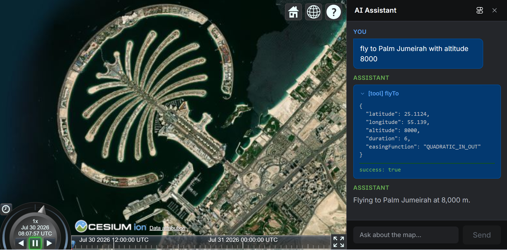

---
hide:
  - navigation
  - toc
---

  

    <h1 class="hero-title">CesiumJS AI Starter App</h1>
    

      A ready-to-run starter pairing a <a href="https://cesium.com/platform/cesiumjs/">CesiumJS</a>
      3D globe with an LLM chat interface that drives it via tool calls (e.g.
      <em>"fly to Paris"</em>) — with the <strong>API key kept server-side</strong>.
    

    

      <a class="hero-btn hero-btn--primary" href="getting-started">Get Started</a>
      <a class="hero-btn hero-btn--secondary" href="tutorials/">Check it out tutorials</a>
    

  

  

    
Scroll, swipe, or use the arrows — click a slide for details, including tutorials

  

  

    <button class="carousel-arrow carousel-arrow--prev" type="button" aria-label="Previous slide" onclick="this.nextElementSibling.scrollBy({left: -this.nextElementSibling.clientWidth * 0.9, behavior: 'smooth'})">‹</button>
    

      <a class="carousel-slide" href="tutorials/cesium-viewer-tools-tutorial">
        <figure>
          
          <figcaption>
            <h3 class="carousel-slide-title">Cesium Viewer Tools Tutorial</h3>
            
Ask in plain English — <em>"fly to Palm Jumeirah with altitude 8000"</em> — and the LLM calls the <code>flyTo</code> tool to animate the camera there.

            Read the tutorial →
          </figcaption>
        </figure>
      </a>
      <a class="carousel-slide" href="tutorials/codegen-tool-tutorial">
        <figure>
          
          <figcaption>
            <h3 class="carousel-slide-title">Codegen Tool Tutorial</h3>
            
Ask for something not in the tool library — the LLM generates AST-verified CesiumJS code, sandboxed and run only after your approval.

            Read the tutorial →
          </figcaption>
        </figure>
      </a>
      <a class="carousel-slide" href="tutorials/mcp-server-tutorial">
        <figure>
          
          <figcaption>
            <h3 class="carousel-slide-title">Adding an MCP Server</h3>
            
Connect any Model Context Protocol server via <code>MCP_SERVERS</code> — its tools plug straight into the same agent loop, gated by the same approval flow.

            Read the tutorial →
          </figcaption>
        </figure>
      </a>
    

    <button class="carousel-arrow carousel-arrow--next" type="button" aria-label="Next slide" onclick="this.previousElementSibling.scrollBy({left: this.previousElementSibling.clientWidth * 0.9, behavior: 'smooth'})">›</button>
  

## Want to learn more?

  <a class="feature-card" href="architectures/architecture">
    <h3 class="feature-title">Architecture</h3>
    
Component layout, request flow, and Docker topology for the full stack.

    Read →
  </a>
  <a class="feature-card" href="architectures/architecture-codegen">
    <h3 class="feature-title">Codegen Architecture</h3>
    
How natural-language intents become AST-verified, sandboxed CesiumJS code.

    Read →
  </a>
  <a class="feature-card" href="architectures/architecture-mcp">
    <h3 class="feature-title">MCP Support Architecture</h3>
    
How Model Context Protocol servers plug external tools into the agent loop.

    Read →
  </a>
  <a class="feature-card" href="packages/codegen-cesium">
    <h3 class="feature-title">@cesium-ai/codegen-cesium</h3>
    
Intent-to-code generation pipeline: BM25 skill matching, prompt building, and AST verification (server only).

    Read →
  </a>
  <a class="feature-card" href="packages/codegen-sandbox">
    <h3 class="feature-title">@cesium-ai/codegen-sandbox</h3>
    
QuickJS-wasm sandbox that safely executes AST-verified code against the live Viewer (frontend only).

    Read →
  </a>
  <a class="feature-card" href="packages/mcp-tools">
    <h3 class="feature-title">@cesium-ai/mcp-tools</h3>
    
Optional MCP client bridge — connect external Model Context Protocol tool servers into the agent loop.

    Read →
  </a>

## Source

[github.com/CesiumGS/cesiumjs-ai-starter-app](https://github.com/CesiumGS/cesiumjs-ai-starter-app)
