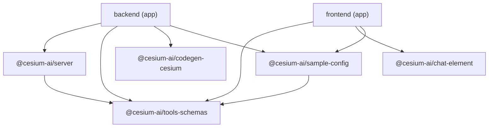

# Workspace Packages

This repo is an npm workspace monorepo. Each workspace is documented in its own section below.
See [Architecture](../architecture.md) for how the pieces fit together at runtime.

## Workspace map

```
cesiumjs-ai-starter-app/
├── packages/
│   ├── tools-schemas/    @cesium-ai/tools-schemas     — CesiumJS viewer tool schemas (server + client)
│   ├── codegen-cesium/   @cesium-ai/codegen-cesium    — intent-to-code generation pipeline (server only)
│   ├── server/           @cesium-ai/server             — Express chat router + agent loop
│   └── chat-element/     @cesium-ai/chat-element       — React chat panel UI component
├── shared/                @cesium-ai/sample-config     — this app's tool selection/config
├── frontend/              (app) Vite SPA               — CesiumJS viewer + chat panel host
└── backend/               (app) Node/Express API        — provider wiring + tool registry host
```

`frontend` and `backend` are **host apps**, not reusable packages — they compose the library
packages into a working product.

## Dependency graph



`tools-schemas` is the shared foundation everything builds on; `codegen-cesium` is a
server-only dependency (never bundled into the client); `backend` and `frontend` are
leaves — they depend on everything and nothing depends on them.

## Build order

Because of the graph above, packages must be built before the apps that depend on them:

| Command                  | What it does                                                                |
| ------------------------ | --------------------------------------------------------------------------- |
| `npm run build:packages` | Builds `tools-schemas` → `sample-config` → `server` in dependency order     |
| `npm run build`          | `build:packages`, then builds `frontend` and `backend`                      |
| `npm run dev`            | Builds packages once, then runs all dev processes concurrently (watch mode) |
| `npm test`               | Runs the Vitest suite across the workspace                                  |
| `npm run test:e2e`       | Runs the Playwright end-to-end suite                                        |

## Packages

- [tools-schemas](tools-schemas/index.md) — CesiumJS viewer tool library
- [codegen-cesium](../../packages/codegen-cesium/README.md) — intent-to-code generation pipeline
- [server](../../packages/server/README.md) — Express chat router and agent loop
- [chat-element](../../packages/chat-element/README.md) — React chat panel component
- [sample-config](../../shared/README.md) — this app's tool selection and config
- [backend](../../backend/README.md) — backend app (Node/Express)
- [frontend](../../frontend/README.md) — frontend app (Vite/React)
