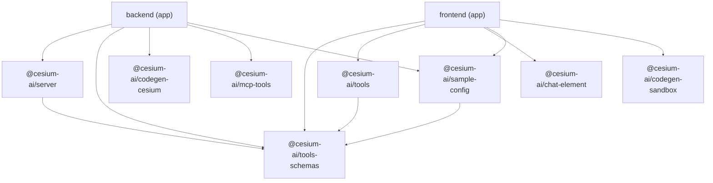

# Workspace Packages

This repo is an npm workspace monorepo. Each workspace is documented in its own section below.
See [Architecture](../architectures/architecture.md) for how the pieces fit together at runtime.

## Workspace map

```
cesiumjs-ai-starter-app/
├── packages/
│   ├── tools-schemas/    @cesium-ai/tools-schemas     — CesiumJS viewer tool schemas (server + client)
│   ├── tools/            @cesium-ai/tools              — default client-side viewer tool executors (frontend only)
│   ├── codegen-cesium/   @cesium-ai/codegen-cesium    — intent-to-code generation pipeline (server only)
│   ├── codegen-sandbox/  @cesium-ai/codegen-sandbox   — QuickJS-wasm execution sandbox (frontend only)
│   ├── mcp-tools/        @cesium-ai/mcp-tools          — optional MCP client tool bridge (server only)
│   ├── server/           @cesium-ai/server             — Express chat router + agent loop
│   └── chat-element/     @cesium-ai/chat-element       — React chat panel UI component
├── shared/                @cesium-ai/sample-config     — this app's tool selection/config
├── frontend/              (app) Vite SPA               — CesiumJS viewer + chat panel host
└── backend/               (app) Node/Express API        — provider wiring + tool registry host
```

`frontend` and `backend` are **host apps**, not reusable packages — they compose the library
packages into a working product.

## Dependency graph



`tools-schemas` is the shared foundation everything builds on; `tools` is its default,
ready-to-use client-side executor implementation (frontend-only, depends only on `tools-schemas`
+ `cesium`); `codegen-cesium` (intent-to-code generation + static verification) and `mcp-tools`
(optional MCP client bridge) are server-only dependencies (never bundled into the client);
`codegen-sandbox` (execution of already-verified code against a live `Viewer`) is frontend-only
(depends on `cesium` + `quickjs-emscripten`) and never imported server-side; `backend` and
`frontend` are leaves — they depend on everything and nothing depends on them.

## Build order

Because of the graph above, packages must be built before the apps that depend on them:

| Command                  | What it does                                                                                                                 |
| ------------------------ | ---------------------------------------------------------------------------------------------------------------------------- |
| `npm run build:packages` | Builds `tools-schemas` → `tools` → `codegen-cesium` → `codegen-sandbox` → `mcp-tools` → `sample-config` → `server` in dependency order |
| `npm run build`          | `build:packages`, then builds `frontend` and `backend`                                                                       |
| `npm run dev`            | Builds packages once, then runs all dev processes concurrently (watch mode)                                                  |
| `npm test`               | Runs the [Vitest](https://vitest.dev) suite across the workspace                                                             |
| `npm run test:e2e`       | Runs the [Playwright](https://playwright.dev) end-to-end suite                                                               |

## Packages

- [tools-schemas](tools-schemas/index.md) — CesiumJS viewer tool library
- [tools](tools/index.md) — default client-side viewer tool executors
- [codegen-cesium](codegen-cesium/index.md) — intent-to-code generation pipeline
- [codegen-sandbox](codegen-sandbox/index.md) — QuickJS-wasm execution sandbox for generated code
- [mcp-tools](mcp-tools/index.md) — optional Model Context Protocol client tool bridge
- [server](server/index.md) — Express chat router and agent loop
- [chat-element](chat-element/index.md) — React chat panel component
- [sample-config](sample-config/index.md) — this app's tool selection and config
- [backend](backend.md) — backend app (Node/Express)
- [frontend](frontend.md) — frontend app (Vite/React)
