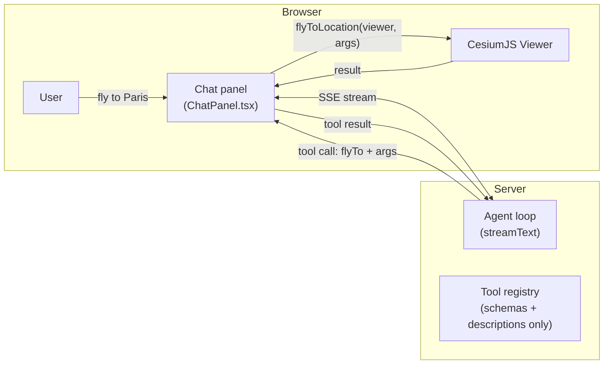

# Tutorial: Using and Extending CesiumJS Viewer Tools

This guide covers how to enable, wire up, and disable tools from the
`@cesium-ai/tools-schemas` library in this starter app. The library ships
a catalogue of ready-made CesiumJS tools; you pick which ones your app exposes
by configuring a couple of app-layer files — the library itself is never touched.


---

## 1. How **flyTo** tool works

The starter app ships with one tool already wired up end to end: **`flyTo`**.
Type something like _"fly to Paris"_ in the chat panel and the camera animates
there — the assistant confirms on arrival.


Here is what happens step by step:

1. **User types a message.** The chat panel sends it to the backend's `/api/chat`
   endpoint over a Server-Sent Events stream.
2. **The model decides to call `flyTo`.** It produces a JSON object matching the
   tool's Zod schema — `latitude`, `longitude`, `altitude`, optionally `duration`
   and `easingFunction`.
3. **The server streams the tool call to the browser.** It never executes
   anything — the server has no `Viewer`.
4. **`ChatPanel.tsx` receives `onToolCall("flyTo", args)`.** It checks that
   `"flyTo"` is in the `ENABLED_TOOLS` set from
   [`frontend/src/tools/cesium-tool-executors.ts`](https://github.com/CesiumGS/cesiumjs-ai-starter-app/blob/main/frontend/src/tools/cesium-tool-executors.ts)
   (defense-in-depth), then dispatches to that same module's `TOOL_EXECUTORS`
   map, which delegates `flyTo` to `flyToLocation` in
   [`frontend/src/tools/camera.ts`](https://github.com/CesiumGS/cesiumjs-ai-starter-app/blob/main/frontend/src/tools/camera.ts) —
   re-validating `args` against the structural schema before it ever touches
   the `Viewer`.
5. **The executor returns a result.** The chat panel posts it back so the model
   can confirm the flight finished.



### The files wired end to end

Six files make `flyTo` work. Each has one clearly scoped responsibility:

| File                                                                                                                                                       | Tier     | What it does                                                                                                                                                                                                                                                           |
| ---------------------------------------------------------------------------------------------------------------------------------------------------------- | -------- | ---------------------------------------------------------------------------------------------------------------------------------------------------------------------------------------------------------------------------------------------------------------------- |
| [`shared/src/tools/flyto-schema.ts`](https://github.com/CesiumGS/cesiumjs-ai-starter-app/blob/main/shared/src/tools/flyto-schema.ts)                       | Shared   | Defines `flyToShape` — the structural args contract (lat/lon/altitude + `duration`/`easingFunction`). No description text. Imported by both sides.                                                                                                                     |
| [`backend/src/tools/flyto-tool.ts`](https://github.com/CesiumGS/cesiumjs-ai-starter-app/blob/main/backend/src/tools/flyto-tool.ts)                         | Backend  | Layers `.describe()` hints onto `flyToShape` to produce the model-facing schema. Never reaches the client bundle.                                                                                                                                                      |
| [`backend/src/app.ts`](https://github.com/CesiumGS/cesiumjs-ai-starter-app/blob/main/backend/src/app.ts)                                                   | Backend  | Wires the tool into the AI SDK registry via `createCesiumTools({ enabled: ENABLED_CESIUM_TOOLS, flyTo: { inputSchema } })`.                                                                                                                                            |
| [`frontend/src/tools/camera.ts`](https://github.com/CesiumGS/cesiumjs-ai-starter-app/blob/main/frontend/src/tools/camera.ts)                               | Frontend | Builds `flyToLocation` from `@cesium-ai/tools`'s `createFlyToExecutor` factory — validates `rawArgs` against `flyToShape`, then calls `viewer.camera.flyTo(…)` with the extra `duration`/`easingFunction` options. Returns `{ success }` once the animation completes. |
| [`frontend/src/tools/cesium-tool-executors.ts`](https://github.com/CesiumGS/cesiumjs-ai-starter-app/blob/main/frontend/src/tools/cesium-tool-executors.ts) | Frontend | `TOOL_EXECUTORS` — `@cesium-ai/tools`'s default executor for every catalogue tool, with `flyTo` overridden by `flyToLocation`. `ENABLED_TOOLS` — the runtime allowlist `Set` built from `ENABLED_CESIUM_TOOLS`.                                                        |
| [`frontend/src/components/ChatPanel.tsx`](https://github.com/CesiumGS/cesiumjs-ai-starter-app/blob/main/frontend/src/components/ChatPanel.tsx)             | Frontend | `onToolCall` checks the incoming tool name against `ENABLED_TOOLS`, then dispatches to the matching entry in `TOOL_EXECUTORS`.                                                                                                                                         |

The shared shape (`flyToShape` in `shared/`) is the single contract both sides
agree on. The backend adds descriptions on top; the frontend validates against
the structure — neither side redefines the rules.

---

## 2. Why schema and description are separated

Every viewer tool is split into two layers. Understanding why makes it easier to
know which file to edit.

### The structural shape — `schemas.ts`

[`packages/tools-schemas/src/schemas.ts`](https://github.com/CesiumGS/cesiumjs-ai-starter-app/blob/main/packages/tools-schemas/src/schemas.ts)
holds the **args contract**: field names, types, min/max ranges, optional vs.
required. This is a plain Zod object shape with no natural-language text.

```ts
// packages/tools-schemas/src/schemas.ts (simplified)
export const flyToInputShape = z.object({
  latitude: z.number().min(-90).max(90),
  longitude: z.number().min(-180).max(180),
  altitude: z.number().positive().optional(),
});
```

The frontend imports this shape directly (via the `/schemas` subpath) to
validate untrusted args before touching the Viewer. The backend derives its
model-facing schema from it, layering natural-language hints on top.

### The model-facing hints — `flyTo.ts`

[`packages/tools-schemas/src/tools/flyTo/flyTo.ts`](https://github.com/CesiumGS/cesiumjs-ai-starter-app/blob/main/packages/tools-schemas/src/tools/flyTo/flyTo.ts)
holds the **human-readable text the LLM reads**: the tool `description` and
per-field `.describe()` calls.

```ts
// packages/tools-schemas/src/tools/flyTo/flyTo.ts (simplified)
export const DEFAULT_FLY_TO_DESCRIPTION =
  "Fly the camera to a geographic location with an animated transition.";

export const DEFAULT_FLY_TO_FIELD_DESCRIPTIONS = {
  latitude: "Decimal degrees, −90 to 90. North is positive.",
  longitude: "Decimal degrees, −180 to 180. East is positive.",
  // …
};
```

`buildFlyToInputSchema` then calls `flyToInputShape.shape.*.describe(…)` to
produce the model-facing Zod schema — it layers the text onto the structural
rules without redefining them.

### Why keep them separate?

| Concern                                                                  | Layer                         | Who imports it                |
| ------------------------------------------------------------------------ | ----------------------------- | ----------------------------- |
| **Args contract** — field names, types, ranges, required/optional        | `schemas.ts` structural shape | Both backend **and** frontend |
| **Model-facing hints** — `description`, `.describe()` text the LLM reads | `flyTo.ts` full definition    | **Backend only**              |

Tool descriptions are prompt material — potentially long, and something you may
iterate on without touching validation logic. More importantly, **they must never
ship to the browser bundle**: they are internal guidance for the LLM, not
user-facing copy, and bundling them would increase client size for no user
benefit.

This separation also gives the design two security properties:

- **AI-generated args are treated as untrusted input.** The model's tool-call
  payload is arbitrary JSON. `flyToLocation` (and every executor) re-validates
  it against the structural Zod shape before touching the `Viewer` — a
  malformed or out-of-range payload is rejected with an error result instead of
  crashing the globe.
- **Double allowlist gate prevents stale or spoofed tool calls from executing.**
  The backend's `createCesiumTools({ enabled: ENABLED_CESIUM_TOOLS })` limits
  what the model is even offered, so a disabled tool is never called under
  normal operation. The frontend's `ENABLED_TOOLS` set in
  [`frontend/src/tools/cesium-tool-executors.ts`](https://github.com/CesiumGS/cesiumjs-ai-starter-app/blob/main/frontend/src/tools/cesium-tool-executors.ts),
  checked by `ChatPanel.tsx`'s `onToolCall`, enforces the same allowlist a
  second time — an unexpected tool name (disabled, renamed, or injected via a
  prompt-injection attack) is rejected before `TOOL_EXECUTORS` is consulted, so
  no tool call can drive the live `Viewer` unless it is explicitly enabled on
  both sides.

The package therefore exposes three subpaths:

| Subpath                            | Exports                                | Who imports it                                   |
| ---------------------------------- | -------------------------------------- | ------------------------------------------------ |
| `@cesium-ai/tools-schemas`         | Full definitions incl. descriptions    | **Backend only.** Never import from client code. |
| `@cesium-ai/tools-schemas/names`   | `CESIUM_TOOL_NAMES`, `CesiumToolName`  | Both sides. String constants only.               |
| `@cesium-ai/tools-schemas/schemas` | `<toolName>InputShape`, inferred types | Both sides. Structural shapes, no descriptions.  |

A contract change — e.g. tightening the lat/lon ranges — is a **single edit** to
the structural shape in `schemas.ts` that both tiers pick up automatically. A
description tweak is a **single edit** to `flyTo.ts` that only the backend sees.

---

## 3. Updating descriptions

Because descriptions live only on the backend, you can change them without
touching the frontend or the shared schema.

### Update the tool description

The tool description is the sentence the model reads to decide when to call
`flyTo`. Pass a `description` override to `createCesiumTools` in
[`backend/src/app.ts`](https://github.com/CesiumGS/cesiumjs-ai-starter-app/blob/main/backend/src/app.ts):

```ts
// backend/src/app.ts
createCesiumTools({
  flyTo: {
    description: "Navigate the 3D globe camera to any named place on Earth.",
    inputSchema: flyToInputSchema,
  },
});
```

Omitting `description` keeps the default from
[`packages/tools-schemas/src/tools/flyTo/flyTo.ts`](https://github.com/CesiumGS/cesiumjs-ai-starter-app/blob/main/packages/tools-schemas/src/tools/flyTo/flyTo.ts)
(`DEFAULT_FLY_TO_DESCRIPTION`).

### Update individual field descriptions

Per-field hints tell the model what each argument means. They are defined in
[`backend/src/tools/flyto-tool.ts`](https://github.com/CesiumGS/cesiumjs-ai-starter-app/blob/main/backend/src/tools/flyto-tool.ts)
as `DEFAULT_FLY_TO_EXTENSION_DESCRIPTIONS` — a plain object spread over the
library defaults, where each key matches a field name:

```ts
// backend/src/tools/flyto-tool.ts
const DEFAULT_FLY_TO_EXTENSION_DESCRIPTIONS = {
  ...DEFAULT_FLY_TO_FIELD_DESCRIPTIONS,
  duration: "Flight duration in seconds. Omit to let Cesium pick a distance-based default.",
  easingFunction: "Named easing curve applied to the flight. Omit for Cesium's default.",
};
```

Edit the string for whichever field you want to change. The base field hints
(`latitude`, `longitude`, `altitude`) come from `DEFAULT_FLY_TO_FIELD_DESCRIPTIONS`
exported by `@cesium-ai/tools-schemas` — override any of them by adding the key
explicitly:

```ts
const DEFAULT_FLY_TO_EXTENSION_DESCRIPTIONS = {
  ...DEFAULT_FLY_TO_FIELD_DESCRIPTIONS,
  latitude: "Destination latitude in decimal degrees. Positive values are north.", // ← override
  duration: "Flight duration in seconds. Omit to let Cesium pick a distance-based default.",
  easingFunction: "Named easing curve applied to the flight. Omit for Cesium's default.",
};
```

Both the tool description and field descriptions are backend-only — changes
never affect the client bundle or the validated args contract.

---

## 4. Extending a tool's input schema

Sometimes you want the model to accept fields the base schema doesn't include.
`flyTo` is the example in this starter: the library's `flyToInputShape` covers
`latitude`, `longitude`, and `altitude`, but this app also wants `duration` and
`easingFunction`.

The pattern is to **extend the base shape** in
[`shared/src/tools/`](https://github.com/CesiumGS/cesiumjs-ai-starter-app/blob/main/shared/src/tools/)
and use the extended shape in both the executor and the backend's tool
configuration:

```ts
// shared/src/tools/flyto-schema.ts  (already exists — shown for reference)
import { z } from "zod";
import { flyToInputShape } from "@cesium-ai/tools-schemas/schemas";

export const flyToShape = z.object({
  ...flyToInputShape.shape,
  duration: z.number().positive().optional(),
  easingFunction: z.enum(EASING_FUNCTION_NAMES).optional(),
});
```

The extended shape stays in `shared/` so both the backend (adds descriptions on
top in
[`backend/src/tools/flyto-tool.ts`](https://github.com/CesiumGS/cesiumjs-ai-starter-app/blob/main/backend/src/tools/flyto-tool.ts))
and the frontend executor (validates the raw args in
[`frontend/src/tools/camera.ts`](https://github.com/CesiumGS/cesiumjs-ai-starter-app/blob/main/frontend/src/tools/camera.ts))
import the same structural contract without the descriptions.

Only extend when the base schema genuinely doesn't cover what you need. For most
tools the base `<toolName>InputShape` from `/schemas` is sufficient — import and
use it directly in the executor.

---

## 5. Available tools

The full tool catalogue is documented in the
[Tool Catalogue](../packages/tools-schemas/tools.md) reference page, which lists
every tool name and what it does. All tools are defined in
[`packages/tools-schemas/src/`](https://github.com/CesiumGS/cesiumjs-ai-starter-app/blob/main/packages/tools-schemas/src/)
and can be enabled in the starter app by following Section 6.

---

## 6. Enabling a tool

Every viewer tool in `@cesium-ai/tools-schemas`'s `CESIUM_TOOL_NAMES` catalogue
is already enabled in this app by default —
[`shared/src/enabled-tools.ts`](https://github.com/CesiumGS/cesiumjs-ai-starter-app/blob/main/shared/src/enabled-tools.ts)'s
`ENABLED_CESIUM_TOOLS` spreads `Object.values(CESIUM_TOOL_NAMES)` directly, and
every one of those tools already has a ready-to-use client-side executor via
`@cesium-ai/tools`'s `createCesiumToolExecutors()`, wired up in
[`frontend/src/tools/cesium-tool-executors.ts`](https://github.com/CesiumGS/cesiumjs-ai-starter-app/blob/main/frontend/src/tools/cesium-tool-executors.ts).

### Configuring an explicit set of enabled tools

To curate this app's surface instead of exposing the whole catalogue, replace
the spread in `shared/src/enabled-tools.ts` with an explicit list and add a
name to turn that tool on:

```ts
// shared/src/enabled-tools.ts
export const ENABLED_CESIUM_TOOLS = [
  CESIUM_TOOL_NAMES.flyTo,
  CESIUM_TOOL_NAMES.entityAdd, // ← add
  CESIUM_TOOL_NAMES.cameraOrbit,
] as const satisfies readonly CesiumToolName[];
```

The `satisfies` constraint catches typos at compile time — every entry is
checked against `CesiumToolName` from `@cesium-ai/tools-schemas/names`, so a
name that isn't a real tool fails to build.

Both tiers derive from this one array:

- **Backend** — [`backend/src/app.ts`](https://github.com/CesiumGS/cesiumjs-ai-starter-app/blob/main/backend/src/app.ts)
  passes it to `createCesiumTools({ enabled: ENABLED_CESIUM_TOOLS })`, so the
  model is only ever offered tools in this list.
- **Frontend** — [`frontend/src/tools/cesium-tool-executors.ts`](https://github.com/CesiumGS/cesiumjs-ai-starter-app/blob/main/frontend/src/tools/cesium-tool-executors.ts)
  builds a runtime `ENABLED_TOOLS` set from the same array, checked by
  `ChatPanel.tsx`'s `onToolCall` before a tool call ever reaches the `Viewer`.

Rebuild the packages (`npm run build:packages`) and re-run the allowlist test
(`npm test -- enabled-tools`) after changing the list.

### Removing a tool

Remove the tool's name from `ENABLED_CESIUM_TOOLS` in the same file — whether
you're editing an explicit list (above) or filtering it out of the "every
catalogue tool" default:

```ts
// shared/src/enabled-tools.ts
export const ENABLED_CESIUM_TOOLS = [
  ...(Object.values(CESIUM_TOOL_NAMES) as CesiumToolName[]).filter(
    (name) => name !== CESIUM_TOOL_NAMES.imageryAdd, // ← removed
  ),
] as const satisfies readonly CesiumToolName[];
```

The removal propagates automatically to both tiers on the next build: the
backend no longer registers the tool, and the frontend's `ENABLED_TOOLS` gate
rejects any call to it even if one somehow arrives.

`createCesiumTools` also accepts `false` for any per-tool key, which drops a
tool from the **backend** registry independently of the `enabled` allowlist —
useful for suppressing one tool without touching the shared config. Note this
alone doesn't update the frontend's `ENABLED_TOOLS` gate, so for a complete
disable on both tiers, remove the name from `ENABLED_CESIUM_TOOLS` instead:

```ts
// backend/src/app.ts
createCesiumTools({
  flyTo: false, // ← excluded from this backend's registry only
});
```

### Overriding a tool's execution

Sometimes you don't want to turn a tool on or off — you want to change how it
behaves for this app, without forking it. `flyTo` is the worked example
already covered above (Sections 1 and 4): its accepted shape is extended with
`duration`/`easingFunction` in
[`shared/src/tools/flyto-schema.ts`](https://github.com/CesiumGS/cesiumjs-ai-starter-app/blob/main/shared/src/tools/flyto-schema.ts),
and its client-side executor is overridden in
[`frontend/src/tools/cesium-tool-executors.ts`](https://github.com/CesiumGS/cesiumjs-ai-starter-app/blob/main/frontend/src/tools/cesium-tool-executors.ts):

```ts
// frontend/src/tools/cesium-tool-executors.ts
export const TOOL_EXECUTORS: Record<EnabledCesiumTool, ToolExecutor> = {
  ...createCesiumToolExecutors({ flyTo: flyToLocation }),
};
```

Every other tool keeps `@cesium-ai/tools`'s default untouched. See
[`packages/tools/README.md`](https://github.com/CesiumGS/cesiumjs-ai-starter-app/blob/main/packages/tools/README.md)
for the full set of override/extend patterns — a full override works for any
tool, and narrower `createXExecutor` factories are also available for `flyTo`,
`cameraSetView`, and every `entityAdd*` variant.

---

## 7. Quick reference

| I want to…                                   | Edit                                                                                                                                                                                                         |
| -------------------------------------------- | ------------------------------------------------------------------------------------------------------------------------------------------------------------------------------------------------------------ |
| Add a tool to this app's enabled set         | [`shared/src/enabled-tools.ts`](https://github.com/CesiumGS/cesiumjs-ai-starter-app/blob/main/shared/src/enabled-tools.ts) — add the name to `ENABLED_CESIUM_TOOLS`                                          |
| Remove a tool from this app                  | Same file — filter or remove the name from `ENABLED_CESIUM_TOOLS`                                                                                                                                            |
| Override how a tool runs in the browser      | [`frontend/src/tools/cesium-tool-executors.ts`](https://github.com/CesiumGS/cesiumjs-ai-starter-app/blob/main/frontend/src/tools/cesium-tool-executors.ts) — pass an override to `createCesiumToolExecutors` |
| Extend a tool's input schema with new fields | [`shared/src/tools/<toolName>-schema.ts`](https://github.com/CesiumGS/cesiumjs-ai-starter-app/blob/main/shared/src/tools/) — spread the base shape and add fields                                            |
| Add guidance to the system prompt            | [`packages/server/src/agent.ts`](https://github.com/CesiumGS/cesiumjs-ai-starter-app/blob/main/packages/server/src/agent.ts) — extend `DEFAULT_SYSTEM_PROMPT`                                                |
| See what tools the library offers            | [Tool Catalogue](../packages/tools-schemas/tools.md) or [`packages/tools-schemas/src/`](https://github.com/CesiumGS/cesiumjs-ai-starter-app/blob/main/packages/tools-schemas/src/)                           |
