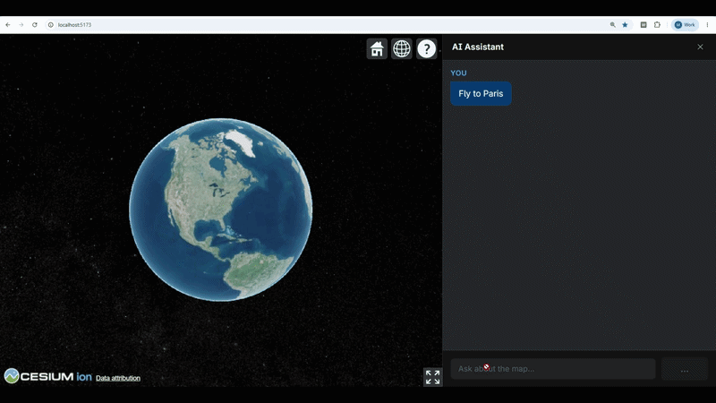
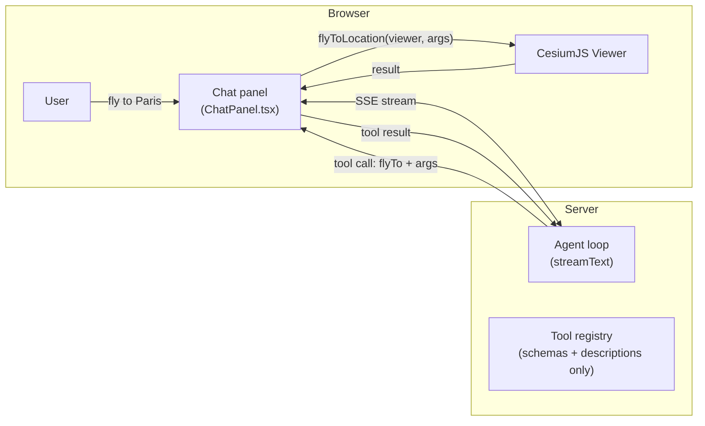

# Tutorial: Using and Extending CesiumJS Viewer Tools

This guide covers how to enable, wire up, and disable tools from the
`@cesium-ai/tools-schemas` library in this starter app. The library ships
a catalogue of ready-made CesiumJS tools; you pick which ones your app exposes
by editing **three app-layer files** — the library itself is never touched.

---

## 1. How **flyTo** tool works

The starter app ships with one tool already wired up end to end: **`flyTo`**.
Type something like _"fly to Paris"_ in the chat panel and the camera animates
there — the assistant confirms on arrival.



Here is what happens step by step:

1. **User types a message.** The chat panel sends it to the backend's `/api/chat`
   endpoint over a Server-Sent Events stream.
2. **The model decides to call `flyTo`.** It produces a JSON object matching the
   tool's Zod schema — `latitude`, `longitude`, `altitude`, optionally `duration`
   and `easingFunction`.
3. **The server streams the tool call to the browser.** It never executes
   anything — the server has no `Viewer`.
4. **`ChatPanel.tsx` receives `onToolCall("flyTo", args)`.** It checks that
   `"flyTo"` is in `ENABLED_CESIUM_TOOLS` (defense-in-depth), re-validates `args`
   against the structural schema, then delegates to `flyToLocation` in
   [`frontend/src/tools/camera.ts`](https://github.com/CesiumGS/cesiumjs-ai-starter-app/blob/main/frontend/src/tools/camera.ts),
   which calls `viewer.camera.flyTo(…)`.
5. **The executor returns a result.** The chat panel posts it back so the model
   can confirm the flight finished.



### The files wired end to end

Five files make `flyTo` work. Each has one clearly scoped responsibility:

| File                                                                                                                                           | Tier     | What it does                                                                                                                                       |
| ---------------------------------------------------------------------------------------------------------------------------------------------- | -------- | -------------------------------------------------------------------------------------------------------------------------------------------------- |
| [`shared/src/tools/flyto-schema.ts`](https://github.com/CesiumGS/cesiumjs-ai-starter-app/blob/main/shared/src/tools/flyto-schema.ts)           | Shared   | Defines `flyToShape` — the structural args contract (lat/lon/altitude + `duration`/`easingFunction`). No description text. Imported by both sides. |
| [`backend/src/tools/flyto-tool.ts`](https://github.com/CesiumGS/cesiumjs-ai-starter-app/blob/main/backend/src/tools/flyto-tool.ts)             | Backend  | Layers `.describe()` hints onto `flyToShape` to produce the model-facing schema. Never reaches the client bundle.                                  |
| [`backend/src/app.ts`](https://github.com/CesiumGS/cesiumjs-ai-starter-app/blob/main/backend/src/app.ts)                                       | Backend  | Wires the tool into the AI SDK registry via `createCesiumTools({ enabled: ENABLED_CESIUM_TOOLS, flyTo: { inputSchema } })`.                        |
| [`frontend/src/tools/camera.ts`](https://github.com/CesiumGS/cesiumjs-ai-starter-app/blob/main/frontend/src/tools/camera.ts)                   | Frontend | Validates `rawArgs` against `flyToShape`, then calls `viewer.camera.flyTo(…)`. Returns `{ success }` once the animation completes.                 |
| [`frontend/src/components/ChatPanel.tsx`](https://github.com/CesiumGS/cesiumjs-ai-starter-app/blob/main/frontend/src/components/ChatPanel.tsx) | Frontend | `TOOL_EXECUTORS` map routes the incoming tool call to `flyToLocation`. Also gates on `ENABLED_CESIUM_TOOLS` as defense-in-depth.                   |

The shared shape (`flyToShape` in `shared/`) is the single contract both sides
agree on. The backend adds descriptions on top; the frontend validates against
the structure — neither side redefines the rules.

---

## 2. Why schema and description are separated

Every viewer tool is split into two layers. Understanding why makes it easier to
know which file to edit.

### The structural shape — `schemas.ts`

[`packages/tools-schemas/src/schemas.ts`](https://github.com/CesiumGS/cesiumjs-ai-starter-app/blob/main/packages/tools-schemas/src/schemas.ts)
holds the **args contract**: field names, types, min/max ranges, optional vs.
required. This is a plain Zod object shape with no natural-language text.

```ts
// packages/tools-schemas/src/schemas.ts (simplified)
export const flyToInputShape = z.object({
  latitude: z.number().min(-90).max(90),
  longitude: z.number().min(-180).max(180),
  altitude: z.number().positive().optional(),
});
```

The frontend imports this shape directly (via the `/schemas` subpath) to
validate untrusted args before touching the Viewer. The backend derives its
model-facing schema from it, layering natural-language hints on top.

### The model-facing hints — `flyTo.ts`

[`packages/tools-schemas/src/tools/flyTo/flyTo.ts`](https://github.com/CesiumGS/cesiumjs-ai-starter-app/blob/main/packages/tools-schemas/src/tools/flyTo/flyTo.ts)
holds the **human-readable text the LLM reads**: the tool `description` and
per-field `.describe()` calls.

```ts
// packages/tools-schemas/src/tools/flyTo/flyTo.ts (simplified)
export const DEFAULT_FLY_TO_DESCRIPTION =
  "Fly the camera to a geographic location with an animated transition.";

export const DEFAULT_FLY_TO_FIELD_DESCRIPTIONS = {
  latitude: "Decimal degrees, −90 to 90. North is positive.",
  longitude: "Decimal degrees, −180 to 180. East is positive.",
  // …
};
```

`buildFlyToInputSchema` then calls `flyToInputShape.shape.*.describe(…)` to
produce the model-facing Zod schema — it layers the text onto the structural
rules without redefining them.

### Why keep them separate?

| Concern                                                                  | Layer                         | Who imports it                |
| ------------------------------------------------------------------------ | ----------------------------- | ----------------------------- |
| **Args contract** — field names, types, ranges, required/optional        | `schemas.ts` structural shape | Both backend **and** frontend |
| **Model-facing hints** — `description`, `.describe()` text the LLM reads | `flyTo.ts` full definition    | **Backend only**              |

Tool descriptions are prompt material — potentially long, and something you may
iterate on without touching validation logic. More importantly, **they must never
ship to the browser bundle**: they are internal guidance for the LLM, not
user-facing copy, and bundling them would increase client size for no user
benefit.

This separation also gives the design two security properties:

- **AI-generated args are treated as untrusted input.** The model's tool-call
  payload is arbitrary JSON. `flyToLocation` (and every executor) re-validates
  it against the structural Zod shape before touching the `Viewer` — a
  malformed or out-of-range payload is rejected with an error result instead of
  crashing the globe.
- **Double allowlist gate prevents stale or spoofed tool calls from executing.**
  The backend's `createCesiumTools({ enabled: ENABLED_CESIUM_TOOLS })` limits
  what the model is even offered, so a disabled tool is never called under
  normal operation. The frontend's `ENABLED_TOOLS` set in
  [`ChatPanel.tsx`](https://github.com/CesiumGS/cesiumjs-ai-starter-app/blob/main/frontend/src/components/ChatPanel.tsx)
  enforces the same allowlist a second time — an unexpected tool name (disabled,
  renamed, or injected via a prompt-injection attack) is rejected before the
  executor map is consulted, so no tool call can drive the live `Viewer` unless
  it is explicitly enabled on both sides.

The package therefore exposes three subpaths:

| Subpath                            | Exports                                | Who imports it                                   |
| ---------------------------------- | -------------------------------------- | ------------------------------------------------ |
| `@cesium-ai/tools-schemas`         | Full definitions incl. descriptions    | **Backend only.** Never import from client code. |
| `@cesium-ai/tools-schemas/names`   | `CESIUM_TOOL_NAMES`, `CesiumToolName`  | Both sides. String constants only.               |
| `@cesium-ai/tools-schemas/schemas` | `<toolName>InputShape`, inferred types | Both sides. Structural shapes, no descriptions.  |

A contract change — e.g. tightening the lat/lon ranges — is a **single edit** to
the structural shape in `schemas.ts` that both tiers pick up automatically. A
description tweak is a **single edit** to `flyTo.ts` that only the backend sees.

---

## 3. Updating descriptions

Because descriptions live only on the backend, you can change them without
touching the frontend or the shared schema.

### Update the tool description

The tool description is the sentence the model reads to decide when to call
`flyTo`. Pass a `description` override to `createCesiumTools` in
[`backend/src/app.ts`](https://github.com/CesiumGS/cesiumjs-ai-starter-app/blob/main/backend/src/app.ts):

```ts
// backend/src/app.ts
createCesiumTools({
  flyTo: {
    description: "Navigate the 3D globe camera to any named place on Earth.",
    inputSchema: flyToInputSchema,
  },
});
```

Omitting `description` keeps the default from
[`packages/tools-schemas/src/tools/flyTo/flyTo.ts`](https://github.com/CesiumGS/cesiumjs-ai-starter-app/blob/main/packages/tools-schemas/src/tools/flyTo/flyTo.ts)
(`DEFAULT_FLY_TO_DESCRIPTION`).

### Update individual field descriptions

Per-field hints tell the model what each argument means. They are defined in
[`backend/src/tools/flyto-tool.ts`](https://github.com/CesiumGS/cesiumjs-ai-starter-app/blob/main/backend/src/tools/flyto-tool.ts)
as `DEFAULT_FLY_TO_EXTENSION_DESCRIPTIONS` — a plain object spread over the
library defaults, where each key matches a field name:

```ts
// backend/src/tools/flyto-tool.ts
const DEFAULT_FLY_TO_EXTENSION_DESCRIPTIONS = {
  ...DEFAULT_FLY_TO_FIELD_DESCRIPTIONS,
  duration: "Flight duration in seconds. Omit to let Cesium pick a distance-based default.",
  easingFunction: "Named easing curve applied to the flight. Omit for Cesium's default.",
};
```

Edit the string for whichever field you want to change. The base field hints
(`latitude`, `longitude`, `altitude`) come from `DEFAULT_FLY_TO_FIELD_DESCRIPTIONS`
exported by `@cesium-ai/tools-schemas` — override any of them by adding the key
explicitly:

```ts
const DEFAULT_FLY_TO_EXTENSION_DESCRIPTIONS = {
  ...DEFAULT_FLY_TO_FIELD_DESCRIPTIONS,
  latitude: "Destination latitude in decimal degrees. Positive values are north.", // ← override
  duration: "Flight duration in seconds. Omit to let Cesium pick a distance-based default.",
  easingFunction: "Named easing curve applied to the flight. Omit for Cesium's default.",
};
```

Both the tool description and field descriptions are backend-only — changes
never affect the client bundle or the validated args contract.

---

## 4. Extending a tool's input schema

Sometimes you want the model to accept fields the base schema doesn't include.
`flyTo` is the example in this starter: the library's `flyToInputShape` covers
`latitude`, `longitude`, and `altitude`, but this app also wants `duration` and
`easingFunction`.

The pattern is to **extend the base shape** in
[`shared/src/tools/`](https://github.com/CesiumGS/cesiumjs-ai-starter-app/blob/main/shared/src/tools/)
and use the extended shape in both the executor and the backend's tool
configuration:

```ts
// shared/src/tools/flyto-schema.ts  (already exists — shown for reference)
import { z } from "zod";
import { flyToInputShape } from "@cesium-ai/tools-schemas/schemas";

export const flyToShape = z.object({
  ...flyToInputShape.shape,
  duration: z.number().positive().optional(),
  easingFunction: z.enum(EASING_FUNCTION_NAMES).optional(),
});
```

The extended shape stays in `shared/` so both the backend (adds descriptions on
top in
[`backend/src/tools/flyto-tool.ts`](https://github.com/CesiumGS/cesiumjs-ai-starter-app/blob/main/backend/src/tools/flyto-tool.ts))
and the frontend executor (validates the raw args in
[`frontend/src/tools/camera.ts`](https://github.com/CesiumGS/cesiumjs-ai-starter-app/blob/main/frontend/src/tools/camera.ts))
import the same structural contract without the descriptions.

Only extend when the base schema genuinely doesn't cover what you need. For most
tools the base `<toolName>InputShape` from `/schemas` is sufficient — import and
use it directly in the executor.

---

## 5. Available tools

The full tool catalogue is documented in the
[Tool Catalogue](../packages/tools-schemas/tools.md) reference page, which lists
every tool name and what it does. All tools are defined in
[`packages/tools-schemas/src/`](https://github.com/CesiumGS/cesiumjs-ai-starter-app/blob/main/packages/tools-schemas/src/)
and can be enabled in the starter app by following Section 6.

---

## 6. Enabling a tool

Enabling a tool from the library requires changes in exactly three files.
We'll use `entityAddPoint` as a concrete example.

### Step 1 — Add the name to the enabled-tools allowlist

[`shared/src/enabled-tools.ts`](https://github.com/CesiumGS/cesiumjs-ai-starter-app/blob/main/shared/src/enabled-tools.ts)
is the **single source of truth** for which tools this app exposes, defined in
the `@cesium-ai/sample-config` shared package. Add the tool name there:

```ts
// shared/src/enabled-tools.ts
export const ENABLED_CESIUM_TOOLS = [
  CESIUM_TOOL_NAMES.flyTo,
  CESIUM_TOOL_NAMES.entityAddPoint, // ← add
] as const satisfies readonly CesiumToolName[];
```

The `satisfies` constraint catches typos at compile time — every entry is
checked against `CesiumToolName` from `@cesium-ai/tools-schemas/names`, so a
name that isn't a real tool fails to build.

Both tiers import this array from `@cesium-ai/sample-config` and use it
differently:

**Backend** — [`backend/src/app.ts`](https://github.com/CesiumGS/cesiumjs-ai-starter-app/blob/main/backend/src/app.ts)
passes it to `createCesiumTools` from `@cesium-ai/tools-schemas`, which builds
the tool registry the model is offered. A tool not in this list is never
registered, so the model cannot call it:

```ts
// backend/src/app.ts
createCesiumTools({
  enabled: ENABLED_CESIUM_TOOLS, // ← model only sees tools in this list
  flyTo: { inputSchema: flyToInputSchema },
});
```

**Frontend** — [`frontend/src/components/ChatPanel.tsx`](https://github.com/CesiumGS/cesiumjs-ai-starter-app/blob/main/frontend/src/components/ChatPanel.tsx)
builds a runtime `Set` from the same array and checks every incoming tool call
against it before the executor runs. This is the defense-in-depth gate: even if
a disabled or spoofed tool name somehow arrives, it is rejected here:

```ts
// frontend/src/components/ChatPanel.tsx
const ENABLED_TOOLS = new Set<EnabledCesiumTool>(ENABLED_CESIUM_TOOLS);

// inside handleToolCall:
if (!ENABLED_TOOLS.has(toolName as EnabledCesiumTool)) {
  return Promise.resolve({ success: false, error: `Unknown or disabled tool: ${toolName}` });
}
```

After adding the name, the TypeScript compiler will report an error in
`ChatPanel.tsx` until you complete Step 3 — that error is intentional and acts
as a guard rail.

### Step 2 — Write the client-side executor

Create or add to a file under
[`frontend/src/tools/`](https://github.com/CesiumGS/cesiumjs-ai-starter-app/blob/main/frontend/src/tools/).
Group related tools in one file (e.g. all entity tools in `entity.ts`, all
camera tools in `camera.ts`).

The executor must:

1. Import the tool's **structural shape** from `@cesium-ai/tools-schemas/schemas`
   (never from the root — that would pull descriptions into the bundle).
2. Re-validate `rawArgs` before touching the `Viewer` — the payload is
   AI-generated and therefore untrusted.
3. Return a result object the agent loop can use to confirm success or surface
   an error to the user.

```ts
// frontend/src/tools/entity.ts
import type { Viewer } from "cesium";
import { Cartesian3, Color } from "cesium";
import { entityAddPointInputShape } from "@cesium-ai/tools-schemas/schemas";

export interface EntityResult {
  success: boolean;
  id?: string;
  error?: string;
}

export function entityAddPointHandler(viewer: Viewer, rawArgs: unknown): EntityResult {
  const parsed = entityAddPointInputShape.safeParse(rawArgs);
  if (!parsed.success) {
    const detail = parsed.error.issues.map((i) => i.message).join("; ");
    return { success: false, error: `Invalid entityAddPoint arguments: ${detail}` };
  }

  const { latitude, longitude, height, color, pixelSize, id } = parsed.data;

  const entity = viewer.entities.add({
    id,
    position: Cartesian3.fromDegrees(longitude, latitude, height ?? 0),
    point: {
      pixelSize: pixelSize ?? 8,
      color: color ? Color.fromCssColorString(color) : Color.YELLOW,
    },
  });

  return { success: true, id: entity.id };
}
```

### Step 3 — Register the executor in `ChatPanel.tsx`

Add the new executor to `TOOL_EXECUTORS` in
[`frontend/src/components/ChatPanel.tsx`](https://github.com/CesiumGS/cesiumjs-ai-starter-app/blob/main/frontend/src/components/ChatPanel.tsx).
Because the map is typed `Record<EnabledCesiumTool, ToolExecutor>`, TypeScript
requires an entry for every enabled tool — this is what fixes the compile error
from Step 1.

```ts
// frontend/src/components/ChatPanel.tsx
import { entityAddPointHandler } from "../tools/entity"; // ← add import

const TOOL_EXECUTORS: Record<EnabledCesiumTool, ToolExecutor> = {
  [CESIUM_TOOL_NAMES.flyTo]: (viewer, args) => flyToLocation(viewer, args),
  [CESIUM_TOOL_NAMES.entityAddPoint]: (viewer, args) => entityAddPointHandler(viewer, args), // ← add
};
```

That's it. Run `npm run dev` (or rebuild with `npm run build:packages && npm run build`)
and ask the chat panel something like _"add a point at the Eiffel Tower"_.

---

## 7. Disabling a tool

Remove the tool's name from `ENABLED_CESIUM_TOOLS` in
[`shared/src/enabled-tools.ts`](https://github.com/CesiumGS/cesiumjs-ai-starter-app/blob/main/shared/src/enabled-tools.ts):

```ts
// shared/src/enabled-tools.ts
export const ENABLED_CESIUM_TOOLS = [
  CESIUM_TOOL_NAMES.flyTo,
  // CESIUM_TOOL_NAMES.entityAddPoint,  ← removed
] as const satisfies readonly CesiumToolName[];
```

Removing the name propagates automatically to both tiers on the next build:

- **Backend** — `createCesiumTools({ enabled: ENABLED_CESIUM_TOOLS })` in
  [`backend/src/app.ts`](https://github.com/CesiumGS/cesiumjs-ai-starter-app/blob/main/backend/src/app.ts)
  no longer registers the tool, so the model is never offered it.
- **Frontend** — the runtime `ENABLED_TOOLS` set in
  [`ChatPanel.tsx`](https://github.com/CesiumGS/cesiumjs-ai-starter-app/blob/main/frontend/src/components/ChatPanel.tsx)
  is rebuilt from the updated array, so the gate rejects any call to the removed
  tool even if one somehow arrives.

`ChatPanel.tsx` will also fail to compile because `TOOL_EXECUTORS` still has an
entry for a non-enabled tool — remove that executor entry too to restore a clean
build and confirm nothing still references the disabled tool.

### Alternative: exclude via `createCesiumTools`

`createCesiumTools` also accepts `false` for any per-tool key, which drops that
tool from the registry independently of the `enabled` allowlist. This lets you
suppress one or more specific tools at the backend level without touching the
shared config:

```ts
// backend/src/app.ts
createCesiumTools({
  flyTo: false, // ← excluded from this backend's registry
});
```

Note that passing `false` here only stops the model from being offered the tool —
it does **not** update `ENABLED_CESIUM_TOOLS`, so the frontend's `ENABLED_TOOLS`
gate still admits the name. For a complete disable on both tiers, remove the name
from `ENABLED_CESIUM_TOOLS` as described above.

---

## 8. Quick reference

| I want to…                                   | Edit                                                                                                                                                                               |
| -------------------------------------------- | ---------------------------------------------------------------------------------------------------------------------------------------------------------------------------------- |
| Turn a tool on                               | [`shared/src/enabled-tools.ts`](https://github.com/CesiumGS/cesiumjs-ai-starter-app/blob/main/shared/src/enabled-tools.ts) — add name to `ENABLED_CESIUM_TOOLS`                    |
| Turn a tool off                              | Same file — remove the name                                                                                                                                                        |
| Change how a tool runs in the browser        | [`frontend/src/tools/<groupName>.ts`](https://github.com/CesiumGS/cesiumjs-ai-starter-app/blob/main/frontend/src/tools/) — edit the executor                                       |
| Wire a new executor into the dispatch map    | [`frontend/src/components/ChatPanel.tsx`](https://github.com/CesiumGS/cesiumjs-ai-starter-app/blob/main/frontend/src/components/ChatPanel.tsx) — add entry to `TOOL_EXECUTORS`     |
| Extend a tool's input schema with new fields | [`shared/src/tools/<toolName>-schema.ts`](https://github.com/CesiumGS/cesiumjs-ai-starter-app/blob/main/shared/src/tools/) — spread the base shape and add fields                  |
| Add guidance to the system prompt            | [`packages/server/src/agent.ts`](https://github.com/CesiumGS/cesiumjs-ai-starter-app/blob/main/packages/server/src/agent.ts) — extend `DEFAULT_SYSTEM_PROMPT`                      |
| See what tools the library offers            | [Tool Catalogue](../packages/tools-schemas/tools.md) or [`packages/tools-schemas/src/`](https://github.com/CesiumGS/cesiumjs-ai-starter-app/blob/main/packages/tools-schemas/src/) |
