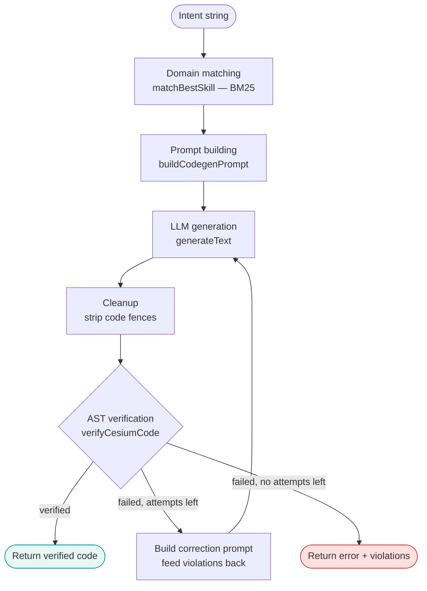
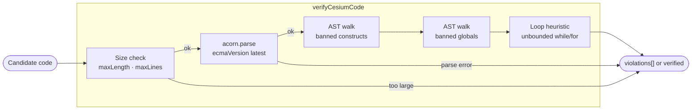
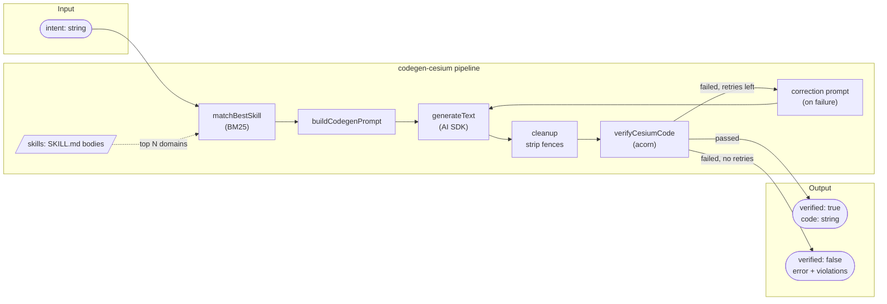

# How Codegen Works: The Generation Pipeline

This guide explains what happens inside `@cesium-ai/codegen-cesium` from the moment a user
submits an intent to the moment verified code (or an error) is returned. It is a companion to
the [Codegen Tool Tutorial](codegen-tool-tutorial.md), which covers configuration and
day-to-day use.

---

## Pipeline overview



The pipeline is entirely server-side and model-agnostic — the caller supplies the
`LanguageModel` instance. No API key is read, no provider is selected, and no code is
executed inside `@cesium-ai/codegen-cesium`.

---

## Stage 1 — Domain matching

**File:** `packages/codegen-cesium/src/pipeline/domain-matcher.ts`

`matchBestSkill(intent)` ranks every available CesiumJS skill domain against the user's
intent using **BM25** (a term-frequency/inverse-document-frequency ranking algorithm). It
returns the top-N `CesiumSkill` objects whose score exceeds a minimum threshold.

```
Intent: "add a polygon over France"
         ↓
BM25 ranking against 14 skill domains
         ↓
Top match: Entities/DataSources (score > 1.0)
```

Skills are loaded from the `@cesium/cesiumjs-skills` dependency. Each skill is a `SKILL.md`
file with YAML frontmatter (`name`, `description`) and a Markdown body of CesiumJS API
guidance. The loader caches the full skill set after first load so subsequent calls pay no
I/O cost.

**14 available domains:**

| Domain               | Topics                                                |
| -------------------- | ----------------------------------------------------- |
| Viewer/Camera        | Camera navigation, flyTo, lookAt, bounding spheres    |
| Entities/DataSources | Points, polylines, polygons, labels, CZML, GeoJSON    |
| 3D Tiles             | Tileset loading, styling, feature picking             |
| Imagery              | Imagery layers, providers, alpha blending             |
| Terrain/Environment  | Terrain providers, atmosphere, fog, sky               |
| Primitives           | Geometry instances, appearances, ground primitives    |
| Materials/Shaders    | Material properties, fabric materials                 |
| Custom Shaders       | Vertex/fragment shaders, uniform maps                 |
| Interaction          | Picking, mouse/keyboard handlers, screen-space events |
| Models/Particles     | glTF models, particle systems                         |
| Spatial Math         | Cartesian math, transforms, coordinate conversions    |
| Time/Animation       | JulianDate, Clock, animation API                      |
| Core Utilities       | Scene, Globe, Canvas, render loop                     |

`CODEGEN_MAX_SKILLS` (default `1`) controls how many top-ranked domains are passed forward.
Increasing it injects broader context at the cost of a longer prompt.

---

## Stage 2 — Prompt building

**File:** `packages/codegen-cesium/src/pipeline/prompt-builder.ts`

`buildCodegenPrompt({ intent, skills, maxSkills })` assembles the generation prompt that is
sent to the LLM. The prompt:

- States the user's intent verbatim.
- Inlines the top-matched `SKILL.md` body (or bodies) as grounding context — specific APIs,
  constructor signatures, and patterns the model should use.
- Constrains the model's output:
  - Use only documented CesiumJS APIs.
  - Assume `viewer` (`Viewer`) and `Cesium` (the CesiumJS module) are already in scope.
  - Never write `import` statements.
  - Never reuse placeholder asset paths (e.g., fake tile URLs) — omit them or use an
    explicit `// TODO` comment.
  - Output bare JavaScript with no Markdown code fences.

The skill bodies are the key differentiator between a generic JS code generator and one that
reliably produces runnable CesiumJS — they supply the exact API surface the model needs
without hallucination.

---

## Stage 3 — LLM generation

**File:** `packages/codegen-cesium/src/pipeline/generate-verified-cesium-code.ts`

The assembled prompt is passed to the AI SDK `generateText({ model, prompt })` call. The
`model` parameter is the `LanguageModel` instance supplied by the caller — the pipeline is
completely provider-agnostic. Default models configured in the starter app are:

| Provider  | Default model     |
| --------- | ----------------- |
| OpenAI    | `gpt-4.1`         |
| Anthropic | `claude-opus-4-8` |
| Google    | `gemini-2.5-pro`  |

The call produces a single completion string. On success that string is a block of
JavaScript; on LLM-level failure (rate limit, timeout, context overflow) an exception is
thrown and caught at the tool's `execute` handler, which returns `{ error }`.

---

## Stage 4 — Cleanup

Still in `generate-verified-cesium-code.ts`.

Models sometimes wrap their output in Markdown code fences (` ```javascript … ``` `) even
when instructed not to. The cleanup step strips any leading or trailing fence markers from
the completion string, leaving bare JavaScript ready for parsing.

---

## Stage 5 — AST verification

**File:** `packages/codegen-cesium/src/pipeline/ast-verifier.ts`

`verifyCesiumCode(code)` runs **parse-only static analysis** using `acorn` and `acorn-walk`.
The code is never executed during verification. All violations are collected before the
result is returned.



**What the verifier checks:**

| Check                  | Detail                                                                                                                                                            |
| ---------------------- | ----------------------------------------------------------------------------------------------------------------------------------------------------------------- |
| Size limits            | Rejects if `> 4000` chars or `> 100` lines                                                                                                                        |
| Parse                  | `acorn.parse` — any syntax error is a violation                                                                                                                   |
| Banned constructs      | `eval`, `Function`/`new Function`, dynamic `import()`, computed member access `obj[expr]`                                                                         |
| Banned browser globals | `fetch`, `XMLHttpRequest`, `WebSocket`, `window`, `document`, `localStorage`, `sessionStorage`, `indexedDB`, `navigator`, `Worker`, `SharedWorker`, `postMessage` |
| Unbounded loops        | `while(true)`, `for(;;)`, `do…while(true)` with no `break` in the body                                                                                            |

Returns `{ verified: true, code }` or `{ verified: false, violations: string[] }`.

---

## Stage 6 — Retry loop

If verification fails **and** `maxAttempts` has not been reached, the pipeline builds a
correction prompt that includes the original intent and the full violation list, then
re-enters Stage 3. The model is told exactly what was wrong and asked to fix it.

```
Attempt 1: generated code → verification fails (e.g. "computed member access: viewer[key]")
           ↓
Correction prompt: "The code failed with: computed member access …. Fix only that."
           ↓
Attempt 2: corrected code → verification passes → return { verified: true, code }
```

`CODEGEN_MAX_ATTEMPTS` (default `3`) is the upper bound on total generation attempts. After
the last attempt, `{ verified: false, error, violations }` is returned — no unverified code
is ever returned as verified.

---

## Data flow summary



---

## Skills data source

Skills are loaded at runtime from the `@cesium/cesiumjs-skills` npm dependency
(currently a GitHub branch reference in `package.json`). The loader resolves the installed
package via `require.resolve("@cesium/cesiumjs-skills/package.json")`, reads all
`skills/cesiumjs-*/SKILL.md` files, parses their YAML frontmatter, and caches the result.

Updating skills means bumping the GitHub dependency reference — no files need to be copied
into this repository.

---

## Related documents

- [Codegen Tool Tutorial](codegen-tool-tutorial.md) — configuration, env vars, enabling/disabling the tool.
- [Codegen Architecture](../architecture-codegen.md) — how codegen fits into the wider system.
- [Security Considerations](../Codegen-tool-security-attacks-vectors.md) — threat model and mitigations for the generation pipeline.
