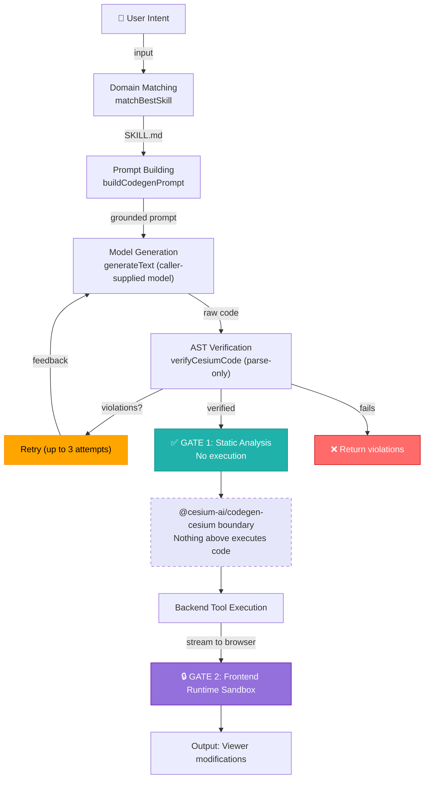
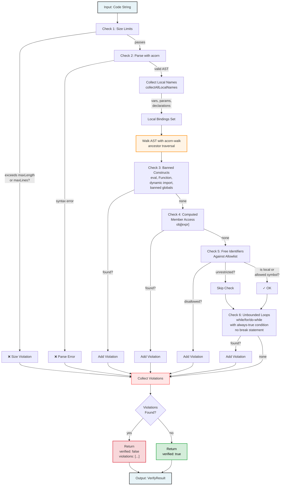

# @cesium-ai/codegen-cesium

Intent-to-verified-CesiumJS-code generation pipeline, plus the `executeCesiumCode` tool definition. The pipeline covers domain matching, model-agnostic generation, and AST-based static verification — nothing in the pipeline executes generated code; runtime isolation is the frontend's responsibility.

## Architecture

Steps 1–5 live in this package; steps 6–8 are in the consuming app:

Two independent gates sit between model output and a live `Viewer`: this package's static AST verifier and the frontend's runtime sandbox.

## Entry points

| Subpath                             | Exports                                                                | Consumer     |
| ----------------------------------- | ---------------------------------------------------------------------- | ------------ |
| `@cesium-ai/codegen-cesium`         | Full pipeline + `executeCesiumCode` tool with model-facing description | Backend only |
| `@cesium-ai/codegen-cesium/names`   | `CODEGEN_CESIUM_TOOL_NAMES`, `CodegenCesiumToolName`                   | Both         |
| `@cesium-ai/codegen-cesium/schemas` | `executeCesiumCodeInputShape`, `ExecuteCesiumCodeInput`                | Both         |

Never import the root from client code — it pulls in `acorn`, `ai`, the `@cesium/cesiumjs-skills` corpus, and model-facing descriptions.

## Security

- **GATE 1 — Static analysis (this package):** `verifyCesiumCode` parses generated code with [`acorn`](https://github.com/acornjs/acorn)/[`acorn-walk`](https://github.com/acornjs/acorn/tree/master/acorn-walk) and rejects banned constructs (`eval`, `Function`, dynamic `import()`, banned browser globals, computed member access), free identifiers outside the allowlist, oversized snippets, and unbounded loops — without ever running the code.
- **GATE 2 — Runtime isolation (frontend):** A sandboxed execution context with memory/deadline limits and a proxied Viewer surface runs the verified code. This repo's sample app does not yet have a frontend sandbox wired up; a browser-side execution boundary is planned.
- **Neither gate substitutes for the other.** Verified output is still attacker-influenceable model output until the frontend validates and executes it safely.

See [Codegen Security](https://cesiumgs.github.io/cesiumjs-ai-starter-app/architectures/codegen-tool-security-attacks-vectors/) for a full threat model.

## Skills data

This parse-only stance is a deliberate trade-off, not a shortcut: if this package ever _executed_
generated code server-side (even in a `try`/`catch`), a shared backend process would need its own
isolated runtime (no network, no host OS, no shared storage, controlled API access) to be safe at
all — a materially bigger lift than an AST walk. This package sidesteps that problem entirely by
never executing anything; the consuming app's frontend sandbox is the actual runtime isolation boundary, and it must
independently validate and execute the code with appropriate isolation — it can never treat "the backend already verified it"
as a substitute for its own runtime isolation. This repo's sample app executes verified code in
the frontend through `@cesium-ai/codegen-sandbox`: a fresh QuickJS-WASM interpreter with
memory/deadline limits and a guarded bridge to the live Viewer. See
[`frontend/README.md`](../../frontend/README.md).

Domain grounding comes from [`@cesium/cesiumjs-skills`](https://github.com/CesiumGS/cesiumjs-skills). Each `SKILL.md` covers a CesiumJS domain (camera, entities, 3D Tiles, imagery, etc.). [`domain-matcher.ts`](https://github.com/CesiumGS/cesiumjs-ai-starter-app/blob/main/packages/codegen-cesium/src/pipeline/domain-matcher.ts) uses [BM25](https://en.wikipedia.org/wiki/Okapi_BM25) ranking to select which skill grounds the generation prompt. Updating the dependency version is the entire re-sync process — no manual file copying.

## `executeCesiumCode` tool

The library copy is **schema-only** — no `execute` method. Host apps wire their own executable version on top (e.g. [`backend/src/tools/execute-cesium-code-tool.ts`](https://github.com/CesiumGS/cesiumjs-ai-starter-app/blob/main/backend/src/tools/execute-cesium-code-tool.ts) calls `generateVerifiedCesiumCode` from this package, following the same pattern as [`flyto-tool.ts`](https://github.com/CesiumGS/cesiumjs-ai-starter-app/blob/main/backend/src/tools/flyto-tool.ts)).

## File layout

**Key design principles:**

- **No execution:** Only parsing & AST walking — never `eval`, never `new Function(...)`, never runtime checks
- **Collect all violations:** Doesn't stop at first error — returns complete list so retry loop and user see full picture
- **Conservative over-approximations:** Computed member access (`obj[expr]`) banned entirely (can't statically resolve), unbounded loop check is heuristic (catches obvious infinite loops, not a termination proof)
- **Local scope tracking:** Flat "declared anywhere" set (not lexically precise) — conservative permissive bias for local names, strict for free identifiers

### Verification Rules

Rules enforced, in order:

| #   | Rule                          | Description                               | Details                                                                                                                                                                                                                                                                                                                                                                                 |
| --- | ----------------------------- | ----------------------------------------- | --------------------------------------------------------------------------------------------------------------------------------------------------------------------------------------------------------------------------------------------------------------------------------------------------------------------------------------------------------------------------------------- |
| 1   | **Size limits**               | Rejects oversized snippets before parsing | `maxLength`: 4000 chars (default), `maxLines`: 100 (default)                                                                                                                                                                                                                                                                                                                            |
| 2   | **Parseability**              | Code must parse as valid ECMAScript       | Valid `Program` via `acorn.parse(code, { ecmaVersion: "latest", sourceType: "script" })`. Parse errors returned as violations, never thrown.                                                                                                                                                                                                                                            |
| 3   | **Banned constructs**         | Forbidden regardless of allowlist         | `eval()`, `Function()`, dynamic `import()`, browser globals (`fetch`, `window`, `document`, `localStorage`, `sessionStorage`, `indexedDB`, `navigator`, `Worker`, `SharedWorker`, `postMessage`), timer/callback globals (`setTimeout`, `setInterval`, `requestAnimationFrame`), computed member access (`obj[expr]`) — dot notation only.                                              |
| 4   | **Free-identifier allowlist** | Only allowed symbols in scope             | Must be in `options.allowedSymbols` or `SAFE_GLOBAL_IDENTIFIERS` (`Math`, `console`, `undefined`, `NaN`, `Infinity`, `Array`, `Object`, `String`, `Number`, `Boolean`, `JSON`, `Promise`, `parseInt`, `parseFloat`, `isNaN`, `isFinite`). Local bindings always allowed. Only leftmost root identifier checked in chains: `viewer.camera.flyTo()` only requires `viewer` to be allowed. |
| 5   | **Unbounded-loop heuristic**  | Rejects infinite loops pragmatically      | `while(true)`, `for(;;)`, `do...while(true)` rejected only if body contains no `break` statement. Not a termination proof, catches obvious infinite loops.                                                                                                                                                                                                                              |

`verifyCesiumCode` collects **every** violation it finds (not just the first) so callers — and the
generation retry loop below — can see the full picture in one pass.

## Generation + verification entry point (`src/pipeline/generate-verified-cesium-code.ts`)

**Function signature:** `generateVerifiedCesiumCode({ intent, model, maxAttempts?, maxSkills?, maxLength?, maxLines?, allowedSymbols?, extraInstructions?, runtimeFeedback? })`

`maxLength`, `maxLines`, and `allowedSymbols` are passed straight through to `verifyCesiumCode` (see
Verification Rules above). `extraInstructions` is passed straight through to `buildCodegenPrompt`,
appended to the end of the generation prompt's output rules — intended for app/operator-supplied
constraints (e.g. house style, app-specific caveats), never raw end-user chat input, since it feeds
directly into the codegen model's prompt. The sample backend's `createExecuteCesiumCodeTool`
exposes matching options wired from the `CODEGEN_MAX_CODE_LENGTH`, `CODEGEN_MAX_CODE_LINES`,
`CODEGEN_ALLOWED_SYMBOLS`, and `CODEGEN_EXTRA_INSTRUCTIONS` env vars (see the root `.env.example`).

`runtimeFeedback` accepts `{ previousCode, executionError }` from an earlier browser-sandbox run.
When present, both values are appended to every generation attempt as diagnostic correction context,
so the model can preserve the original intent while fixing the concrete runtime failure. The values
are labeled as diagnostic data rather than instructions.

**Purpose:** Single orchestration entry point that coordinates intent-to-verified-code generation.

**Pipeline steps:**

1. **Domain matching** (via `matchBestSkills`) — Select `SKILL.md` for prompt grounding (routing only, not enforcement)
2. **Prompt building** (via `buildCodegenPrompt`) — Inline matched skill as context
3. **Code generation** (via AI SDK `generateText`) — Generate raw code string with caller-supplied `LanguageModel`
4. **Cleanup** — Strip markdown code fences
5. **Verification** (via `verifyCesiumCode`) — Static AST verification
6. **Retry on failure** — If violations found, feed back to model and retry (up to `maxAttempts` total, default 3)
7. **Return result** — `{ verified: true, code }` or `{ verified: false, error, violations }`

**Key characteristics:**

- **Model-agnostic** — Never selects provider or touches API keys (caller's responsibility)
- **Dependencies only:** `ai`, `zod`, `acorn`, `acorn-walk` (never `backend` or provider SDKs)
- **Verification rules:** Unconditional bans only (`eval`, `Function`, dynamic `import()`, banned globals, computed member access, size limits, unbounded loops). No capability-name allowlist enforced.
- **Async support:** Parses with `allowAwaitOutsideFunction: true` so generated code can use top-level `await` calls (frontend execution wraps in async context as needed)
- **Never executes** — Never runs generated code at any point, on any code path

## The `executeCesiumCode` tool (`src/tools/executeCesiumCode/`)

**Purpose:** Describes complex custom camera/entity/scene manipulation by natural-language intent (complements `@cesium-ai/tools-cesium`'s `flyTo` for non-simple requests).

**Design:** Library copy is **schema only by design** — no `execute` method. Host apps wire their own executable version on top (e.g., `backend/src/tools/execute-cesium-code-tool.ts` in this sample app).

**File structure:**

| File                          | Exports                                                                             | Purpose                                                                                                                           |
| ----------------------------- | ----------------------------------------------------------------------------------- | --------------------------------------------------------------------------------------------------------------------------------- |
| `executeCesiumCode.schema.ts` | `executeCesiumCodeInputShape`                                                       | Structural `{ intent: string }` shape, no description. Re-exported from `/schemas` for frontend to validate untrusted results.    |
| `executeCesiumCode.ts`        | `buildExecuteCesiumCodeInputSchema`, `createExecuteCesiumCode`, `executeCesiumCode` | Model-facing description, per-field hints, tool factory (via `src/lib/` helpers, mirrors `@cesium-ai/tools-cesium`'s `flyTo.ts`). |

**Tool naming (single source of truth):**

- **Source:** `CODEGEN_CESIUM_TOOL_NAMES.executeCesiumCode` (from `tool-names.ts`, re-exported at `/names`)
- **Backend:** Imported by tool registry
- **Frontend:** Imported by result handler (`frontend/src/tools/execute-cesium-code.ts`'s `isExecuteCesiumCodeTool`)

## File layout

| File                                                                                                                                                                                                       | Description                                                                                                                                  |
| ---------------------------------------------------------------------------------------------------------------------------------------------------------------------------------------------------------- | -------------------------------------------------------------------------------------------------------------------------------------------- |
| [`src/index.ts`](https://github.com/CesiumGS/cesiumjs-ai-starter-app/blob/main/packages/codegen-cesium/src/index.ts)                                                                                       | Public entry point                                                                                                                           |
| [`src/tool-names.ts`](https://github.com/CesiumGS/cesiumjs-ai-starter-app/blob/main/packages/codegen-cesium/src/tool-names.ts)                                                                             | `/names` subpath source                                                                                                                      |
| [`src/schemas.ts`](https://github.com/CesiumGS/cesiumjs-ai-starter-app/blob/main/packages/codegen-cesium/src/schemas.ts)                                                                                   | `/schemas` subpath source                                                                                                                    |
| [`src/tools/executeCesiumCode/executeCesiumCode.schema.ts`](https://github.com/CesiumGS/cesiumjs-ai-starter-app/blob/main/packages/codegen-cesium/src/tools/executeCesiumCode/executeCesiumCode.schema.ts) | Structural `{ intent }` shape, no descriptions                                                                                               |
| [`src/tools/executeCesiumCode/executeCesiumCode.ts`](https://github.com/CesiumGS/cesiumjs-ai-starter-app/blob/main/packages/codegen-cesium/src/tools/executeCesiumCode/executeCesiumCode.ts)               | Model-facing description + tool factory                                                                                                      |
| [`src/pipeline/generate-verified-cesium-code.ts`](https://github.com/CesiumGS/cesiumjs-ai-starter-app/blob/main/packages/codegen-cesium/src/pipeline/generate-verified-cesium-code.ts)                     | Main orchestration entry point                                                                                                               |
| [`src/pipeline/ast-verifier.ts`](https://github.com/CesiumGS/cesiumjs-ai-starter-app/blob/main/packages/codegen-cesium/src/pipeline/ast-verifier.ts)                                                       | Parse-only static verifier ([acorn](https://github.com/acornjs/acorn)/[acorn-walk](https://github.com/acornjs/acorn/tree/master/acorn-walk)) |
| [`src/pipeline/domain-matcher.ts`](https://github.com/CesiumGS/cesiumjs-ai-starter-app/blob/main/packages/codegen-cesium/src/pipeline/domain-matcher.ts)                                                   | [BM25](https://en.wikipedia.org/wiki/Okapi_BM25) skill selection                                                                             |
| [`src/pipeline/prompt-builder.ts`](https://github.com/CesiumGS/cesiumjs-ai-starter-app/blob/main/packages/codegen-cesium/src/pipeline/prompt-builder.ts)                                                   | Grounded prompt builder                                                                                                                      |
| [`src/pipeline/skills-loader.ts`](https://github.com/CesiumGS/cesiumjs-ai-starter-app/blob/main/packages/codegen-cesium/src/pipeline/skills-loader.ts)                                                     | Loads `SKILL.md` from [`@cesium/cesiumjs-skills`](https://github.com/CesiumGS/cesiumjs-skills)                                               |
