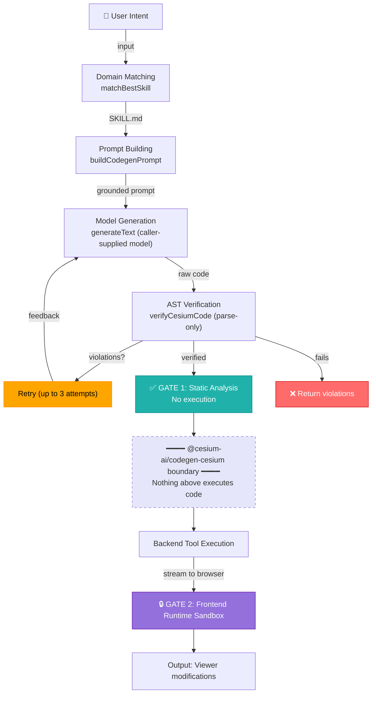

# @cesium-ai/codegen-cesium

Intent-to-verified-CesiumJS-code generation pipeline, plus the `executeCesiumCode` tool definition. The pipeline covers domain matching, model-agnostic generation, and AST-based static verification — nothing in the pipeline executes generated code; runtime isolation is the frontend's responsibility.

## Architecture

Steps 1–5 live in this package; steps 6–8 are in the consuming app:



Two independent gates sit between model output and a live `Viewer`: this package's static AST verifier and the frontend's runtime sandbox.

## Entry points

| Subpath                             | Exports                                                                | Consumer     |
| ----------------------------------- | ---------------------------------------------------------------------- | ------------ |
| `@cesium-ai/codegen-cesium`         | Full pipeline + `executeCesiumCode` tool with model-facing description | Backend only |
| `@cesium-ai/codegen-cesium/names`   | `CODEGEN_CESIUM_TOOL_NAMES`, `CodegenCesiumToolName`                   | Both         |
| `@cesium-ai/codegen-cesium/schemas` | `executeCesiumCodeInputShape`, `ExecuteCesiumCodeInput`                | Both         |

Never import the root from client code — it pulls in `acorn`, `ai`, the `@cesium/cesiumjs-skills` corpus, and model-facing descriptions.

## Security

- **GATE 1 — Static analysis (this package):** `verifyCesiumCode` parses generated code with `acorn`/`acorn-walk` and rejects banned constructs (`eval`, `Function`, dynamic `import()`, banned browser globals, computed member access), free identifiers outside the allowlist, oversized snippets, and unbounded loops — without ever running the code.
- **GATE 2 — Runtime isolation (frontend):** A sandboxed execution context with memory/deadline limits and a proxied Viewer surface runs the verified code. This repo's sample app does not yet have a frontend sandbox wired up; a browser-side execution boundary is planned.
- **Neither gate substitutes for the other.** Verified output is still attacker-influenceable model output until the frontend validates and executes it safely.

See [Codegen Security](https://cesiumgs.github.io/cesiumjs-ai-starter-app/codegen-tool-security-attacks-vectors/) for a full threat model.

## Skills data

Domain grounding comes from [`@cesium/cesiumjs-skills`](https://github.com/CesiumGS/cesiumjs-skills). Each `SKILL.md` covers a CesiumJS domain (camera, entities, 3D Tiles, imagery, etc.). `domain-matcher.ts` uses BM25 ranking to select which skill grounds the generation prompt. Updating the dependency version is the entire re-sync process — no manual file copying.

## `executeCesiumCode` tool

The library copy is **schema-only** — no `execute` method. Host apps wire their own executable version on top (e.g. `backend/src/tools/execute-cesium-code-tool.ts` calls `generateVerifiedCesiumCode` from this package, following the same pattern as `flyto-tool.ts`).

## File layout

```
src/
├── index.ts                       # Public entry point
├── tool-names.ts                  # /names subpath source
├── schemas.ts                     # /schemas subpath source
├── tools/executeCesiumCode/
│   ├── executeCesiumCode.schema.ts # Structural { intent } shape, no descriptions
│   └── executeCesiumCode.ts        # Model-facing description + tool factory
└── pipeline/
    ├── generate-verified-cesium-code.ts # Main orchestration entry point
    ├── ast-verifier.ts              # Parse-only static verifier (acorn/acorn-walk)
    ├── domain-matcher.ts            # BM25 skill selection
    ├── prompt-builder.ts            # Grounded prompt builder
    └── skills-loader.ts             # Loads SKILL.md from @cesium/cesiumjs-skills
```
