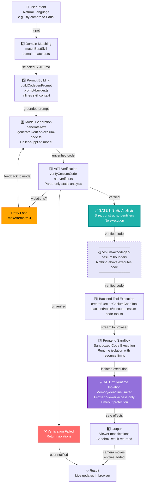
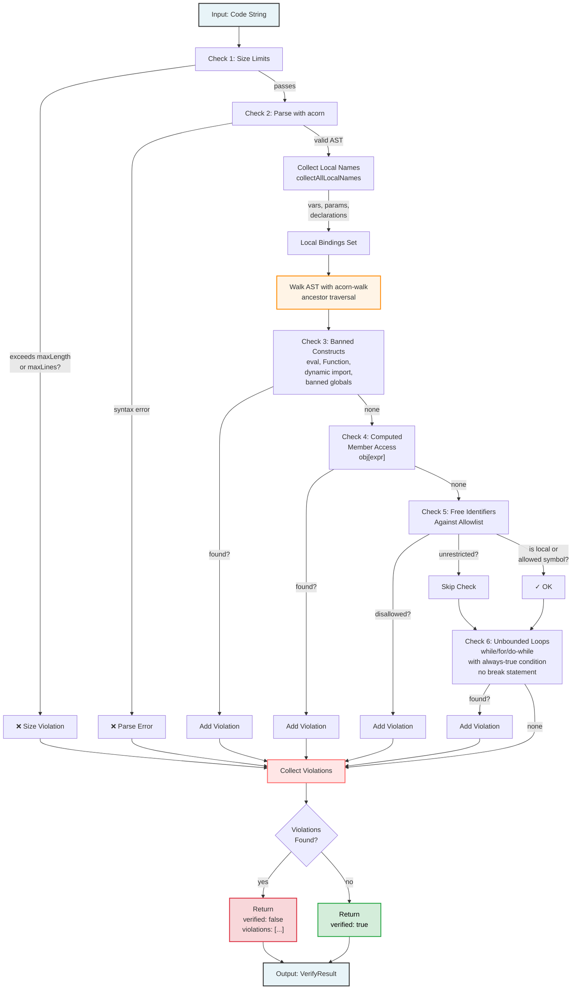

# @cesium-ai/codegen-cesium

Intent-to-**verified**-CesiumJS-code generation pipeline, plus the schema-only `executeCesiumCode`
tool definition that fronts it: CesiumJS Agent Skills grounding (sourced from the
`@cesium/cesiumjs-skills` package dependency), domain matching, model-agnostic generation, and
AST-based static verification. Nothing in the generation pipeline
executes generated code — verification is parse-only (static analysis of the generated JS/TS via an
AST), never a runtime `eval`/sandbox.

This package's generation/verification internals (`generateVerifiedCesiumCode`, `verifyCesiumCode`,
the skills/domain-matching machinery) have no frontend consumer and are meant to run server-side, as
part of building a tool call or code snippet before it's ever sent to the browser. The
`executeCesiumCode` tool _definition_ (its schema and description), however, follows the same
`/names` + `/schemas` subpath split as `@cesium-ai/tools-cesium` so the frontend can safely import
just the tool name / structural args shape without pulling in `acorn`, `ai`, or the
`@cesium/cesiumjs-skills` corpus.

This is the package this repo's sample app wires into its own executable `executeCesiumCode` tool —
this package's own copy of that tool stays schema-only by design, and
`backend/src/tools/execute-cesium-code-tool.ts` in the sample app calls `generateVerifiedCesiumCode`
(from here) inside the `execute` it builds on top of this package's schema, the same way
`backend/src/tools/flyto-tool.ts` extends `@cesium-ai/tools-cesium`'s `flyTo` shared schema.

## Architecture: user input → output

End-to-end, a call to `executeCesiumCode` flows through this pipeline. Steps 1–5 live in this
package; steps 6–8 live in the consuming sample app (`backend/` and `frontend/`), shown here so the
full trust boundary is visible in one place:



**Key security boundaries:**

- **GATE 1 (Green)**: Static AST verification in this package — parse-only, never executes code
- **GATE 2 (Pink)**: Runtime sandbox in frontend — memory/deadline limited, proxied Viewer access only
- **Package boundary (Gold)**: Nothing above this line executes code; runtime isolation is the frontend's responsibility

Two independent gates sit between "the model said this" and "this touches a live `Viewer`": this
package's static AST verifier (steps 4–5) and the frontend's runtime sandbox (step 7).
Either one alone is not sufficient — see Security below.

## Entry points

| Subpath                             | Exports                                                                                                                               | Who imports it                                                                                                                                                                            |
| ----------------------------------- | ------------------------------------------------------------------------------------------------------------------------------------- | ----------------------------------------------------------------------------------------------------------------------------------------------------------------------------------------- |
| `@cesium-ai/codegen-cesium`         | Everything — the generation/verification pipeline, plus the full `executeCesiumCode` tool definition (incl. model-facing description) | Backend only. **Never** import the root entry point from client code — it pulls in `acorn`, `ai`, the `@cesium/cesiumjs-skills` corpus, and the human-readable description the LLM reads. |
| `@cesium-ai/codegen-cesium/names`   | `CODEGEN_CESIUM_TOOL_NAMES`, `CodegenCesiumToolName`                                                                                  | Both. Schema-free — safe for the frontend to key its tool-call/result handling off of.                                                                                                    |
| `@cesium-ai/codegen-cesium/schemas` | `executeCesiumCodeInputShape`, `ExecuteCesiumCodeInput`                                                                               | Both. Structural shape only, no `.describe()` hints — safe for the frontend to validate untrusted tool-call/result args against.                                                          |

## File layout

```
packages/codegen-cesium/
├── src/
│   ├── index.ts                  # Public entry point — re-exports generateVerifiedCesiumCode, verifyCesiumCode, the executeCesiumCode tool, etc.
│   ├── tool-names.ts              # CODEGEN_CESIUM_TOOL_NAMES — the /names subpath source
│   ├── schemas.ts                 # Aggregates structural shapes — the /schemas subpath source
│   ├── tools/
│   │   └── executeCesiumCode/
│   │       ├── executeCesiumCode.schema.ts   # executeCesiumCodeInputShape — structural { intent } shape, no description text
│   │       └── executeCesiumCode.ts          # Model-facing description/schema + createExecuteCesiumCode factory (schema-only, no execute)
│   ├── lib/                       # Generic schema-building helpers (duplicated from @cesium-ai/tools-cesium — see its README)
│   │   ├── merge-descriptions.ts  # mergeDescriptions
│   │   ├── describe-shape.ts      # buildDescribedSchema / describeShape
│   │   └── client-tool.ts         # createClientTool / createToolFactory / ClientToolConfig
│   └── pipeline/                  # Intent -> verified CesiumJS code generation pipeline
│       ├── generate-verified-cesium-code.ts # generateVerifiedCesiumCode — the single orchestration entry point
│       ├── ast-verifier.ts            # verifyCesiumCode — parse-only static verifier (acorn/acorn-walk)
│       ├── domain-matcher.ts          # matchBestSkill — routes an intent to a vendored skill
│       ├── prompt-builder.ts          # buildCodegenPrompt — grounded generation prompt builder
│       └── skills-loader.ts           # Loads/parses SKILL.md from the @cesium/cesiumjs-skills package dependency
├── package.json
├── tsconfig.json
└── tsconfig.typecheck.json
```

## Skills data (`@cesium/cesiumjs-skills` dependency)

This package no longer vendors CesiumJS Agent Skills content directly — it depends on
[`@cesium/cesiumjs-skills`](https://github.com/CesiumGS/cesiumjs-skills) (currently pinned to the
`feat/npm-skills-support` branch via a `github:` dependency until the package is published to npm;
see that repo's `docs/INSTALLATION.md` for the eventual `npm install @cesium/cesiumjs-skills` path).
`pipeline/skills-loader.ts` resolves the installed package's `skills/` directory at runtime via
`require.resolve("@cesium/cesiumjs-skills/package.json")`, so
updating the dependency version is now the entire re-sync process — no more manual file copying.

Each `skills/<name>/SKILL.md` file is a per-domain CesiumJS reference: YAML frontmatter with a `name`
and a `description` written as trigger/activation text (the kind of prompt that should route to
this domain), followed by a Markdown body of key symbols, usage notes, and short code samples for
that area of the CesiumJS API. All 14 upstream domains (Viewer/Camera setup, Entities/DataSources,
3D Tiles, Imagery, Terrain/Environment, Primitives, Materials/Shaders, Custom Shaders, Interaction,
Models/Particles, spatial math, time/animation properties, and Core Utilities) are available through
the dependency. `domain-matcher.ts`'s BM25 ranking matches an intent against each skill's
`description` to pick which `SKILL.md` file(s) ground the generation prompt.

## Security

Summary (see the Architecture diagram above for where each gate sits in the pipeline):

- **This package (server-side, steps 4–5): parse-only static verification, never execution.**
  `verifyCesiumCode` (`src/pipeline/ast-verifier.ts`) parses generated code with `acorn`/`acorn-walk` and
  rejects it — without ever running it — for banned constructs (`eval`, `Function`, dynamic
  `import()`, banned browser globals, computed member access), free identifiers outside the
  allowlist, oversized snippets, or unbounded loops.
- **The consuming app's frontend (step 7): runtime isolation via a sandboxed execution environment.**
  A sandboxed runtime actually executes the verified code, inside a fresh, memory- and deadline-limited
  execution context with only a manifest of bound real CesiumJS symbols in scope — never a live `fetch`, `document`, or storage
  access — and a timeout that interrupts execution if the script hangs.
- **Neither gate substitutes for the other.** Static verification can't observe runtime behavior;
  the sandbox can't be skipped just because the backend already verified the code, since verified
  output is still attacker-influenceable model output.

Static verification here means **parsing**, not running, generated code — an AST walk (via
`acorn`/`acorn-walk`) checks that generated CesiumJS snippets only reference symbols present in the
vendored domain allowlist and don't contain constructs the pipeline hasn't cleared for use.
Verified output is still just JavaScript text; it carries no more trust than any other
attacker-influenceable model output until the consuming app validates and executes it safely
(within a runtime sandbox, never directly on a live Viewer).

This parse-only stance is a deliberate trade-off, not a shortcut: if this package ever _executed_
generated code server-side (even in a `try`/`catch`), a shared backend process would need its own
isolated runtime (no network, no host OS, no shared storage, controlled API access) to be safe at
all — a materially bigger lift than an AST walk. This package sidesteps that problem entirely by
never executing anything; the consuming app's frontend sandbox is the actual runtime isolation boundary, and it must
independently validate and execute the code with appropriate isolation — it can never treat "the backend already verified it"
as a substitute for its own runtime isolation. This repo's sample app executes verified code in
the frontend through `@cesium-ai/codegen-sandbox`: a fresh QuickJS-WASM interpreter with
memory/deadline limits and a guarded bridge to the live Viewer. See
[`frontend/README.md`](../../frontend/README.md).

## AST verifier (`src/pipeline/ast-verifier.ts`)

`verifyCesiumCode(code, options)` is a **parse-only** static verifier. It never `eval`s, never
constructs `new Function(...)`, never dynamically `import()`s, and never otherwise executes the
generated code — it only parses it with `acorn` and walks the AST with `acorn-walk`. Runtime
sandboxing of generated code is the frontend's job (runtime isolation layer); this
package stays entirely on the static-analysis side of that boundary.

### Verification Flow



**Key design principles:**

- **No execution:** Only parsing & AST walking — never `eval`, never `new Function(...)`, never runtime checks
- **Collect all violations:** Doesn't stop at first error — returns complete list so retry loop and user see full picture
- **Conservative over-approximations:** Computed member access (`obj[expr]`) banned entirely (can't statically resolve), unbounded loop check is heuristic (catches obvious infinite loops, not a termination proof)
- **Local scope tracking:** Flat "declared anywhere" set (not lexically precise) — conservative permissive bias for local names, strict for free identifiers

### Verification Rules

Rules enforced, in order:

| #   | Rule                          | Description                               | Details                                                                                                                                                                                                                                                                                                                                                                                 |
| --- | ----------------------------- | ----------------------------------------- | --------------------------------------------------------------------------------------------------------------------------------------------------------------------------------------------------------------------------------------------------------------------------------------------------------------------------------------------------------------------------------------- |
| 1   | **Size limits**               | Rejects oversized snippets before parsing | `maxLength`: 4000 chars (default), `maxLines`: 100 (default)                                                                                                                                                                                                                                                                                                                            |
| 2   | **Parseability**              | Code must parse as valid ECMAScript       | Valid `Program` via `acorn.parse(code, { ecmaVersion: "latest", sourceType: "script" })`. Parse errors returned as violations, never thrown.                                                                                                                                                                                                                                            |
| 3   | **Banned constructs**         | Forbidden regardless of allowlist         | `eval()`, `Function()`, dynamic `import()`, browser globals (`fetch`, `window`, `document`, `localStorage`, `sessionStorage`, `indexedDB`, `navigator`, `Worker`, `SharedWorker`, `postMessage`), timer/callback globals (`setTimeout`, `setInterval`, `requestAnimationFrame`), computed member access (`obj[expr]`) — dot notation only.                                              |
| 4   | **Free-identifier allowlist** | Only allowed symbols in scope             | Must be in `options.allowedSymbols` or `SAFE_GLOBAL_IDENTIFIERS` (`Math`, `console`, `undefined`, `NaN`, `Infinity`, `Array`, `Object`, `String`, `Number`, `Boolean`, `JSON`, `Promise`, `parseInt`, `parseFloat`, `isNaN`, `isFinite`). Local bindings always allowed. Only leftmost root identifier checked in chains: `viewer.camera.flyTo()` only requires `viewer` to be allowed. |
| 5   | **Unbounded-loop heuristic**  | Rejects infinite loops pragmatically      | `while(true)`, `for(;;)`, `do...while(true)` rejected only if body contains no `break` statement. Not a termination proof, catches obvious infinite loops.                                                                                                                                                                                                                              |

`verifyCesiumCode` collects **every** violation it finds (not just the first) so callers — and the
generation retry loop below — can see the full picture in one pass.

## Generation + verification entry point (`src/pipeline/generate-verified-cesium-code.ts`)

**Function signature:** `generateVerifiedCesiumCode({ intent, model, maxAttempts?, maxSkills?, maxLength?, maxLines?, allowedSymbols?, extraInstructions?, runtimeFeedback? })`

`maxLength`, `maxLines`, and `allowedSymbols` are passed straight through to `verifyCesiumCode` (see
Verification Rules above). `extraInstructions` is passed straight through to `buildCodegenPrompt`,
appended to the end of the generation prompt's output rules — intended for app/operator-supplied
constraints (e.g. house style, app-specific caveats), never raw end-user chat input, since it feeds
directly into the codegen model's prompt. The sample backend's `createExecuteCesiumCodeTool`
exposes matching options wired from the `CODEGEN_MAX_CODE_LENGTH`, `CODEGEN_MAX_CODE_LINES`,
`CODEGEN_ALLOWED_SYMBOLS`, and `CODEGEN_EXTRA_INSTRUCTIONS` env vars (see the root `.env.example`).

`runtimeFeedback` accepts `{ previousCode, executionError }` from an earlier browser-sandbox run.
When present, both values are appended to every generation attempt as diagnostic correction context,
so the model can preserve the original intent while fixing the concrete runtime failure. The values
are labeled as diagnostic data rather than instructions.

**Purpose:** Single orchestration entry point that coordinates intent-to-verified-code generation.

**Pipeline steps:**

1. **Domain matching** (via `matchBestSkills`) — Select `SKILL.md` for prompt grounding (routing only, not enforcement)
2. **Prompt building** (via `buildCodegenPrompt`) — Inline matched skill as context
3. **Code generation** (via AI SDK `generateText`) — Generate raw code string with caller-supplied `LanguageModel`
4. **Cleanup** — Strip markdown code fences
5. **Verification** (via `verifyCesiumCode`) — Static AST verification
6. **Retry on failure** — If violations found, feed back to model and retry (up to `maxAttempts` total, default 3)
7. **Return result** — `{ verified: true, code }` or `{ verified: false, error, violations }`

**Key characteristics:**

- **Model-agnostic** — Never selects provider or touches API keys (caller's responsibility)
- **Dependencies only:** `ai`, `zod`, `acorn`, `acorn-walk` (never `backend` or provider SDKs)
- **Verification rules:** Unconditional bans only (`eval`, `Function`, dynamic `import()`, banned globals, computed member access, size limits, unbounded loops). No capability-name allowlist enforced.
- **Async support:** Parses with `allowAwaitOutsideFunction: true` so generated code can use top-level `await` calls (frontend execution wraps in async context as needed)
- **Never executes** — Never runs generated code at any point, on any code path

## The `executeCesiumCode` tool (`src/tools/executeCesiumCode/`)

**Purpose:** Describes complex custom camera/entity/scene manipulation by natural-language intent (complements `@cesium-ai/tools-cesium`'s `flyTo` for non-simple requests).

**Design:** Library copy is **schema only by design** — no `execute` method. Host apps wire their own executable version on top (e.g., `backend/src/tools/execute-cesium-code-tool.ts` in this sample app).

**File structure:**

| File                          | Exports                                                                             | Purpose                                                                                                                           |
| ----------------------------- | ----------------------------------------------------------------------------------- | --------------------------------------------------------------------------------------------------------------------------------- |
| `executeCesiumCode.schema.ts` | `executeCesiumCodeInputShape`                                                       | Structural `{ intent: string }` shape, no description. Re-exported from `/schemas` for frontend to validate untrusted results.    |
| `executeCesiumCode.ts`        | `buildExecuteCesiumCodeInputSchema`, `createExecuteCesiumCode`, `executeCesiumCode` | Model-facing description, per-field hints, tool factory (via `src/lib/` helpers, mirrors `@cesium-ai/tools-cesium`'s `flyTo.ts`). |

**Tool naming (single source of truth):**

- **Source:** `CODEGEN_CESIUM_TOOL_NAMES.executeCesiumCode` (from `tool-names.ts`, re-exported at `/names`)
- **Backend:** Imported by tool registry
- **Frontend:** Imported by result handler (`frontend/src/tools/execute-cesium-code.ts`'s `isExecuteCesiumCodeTool`)
