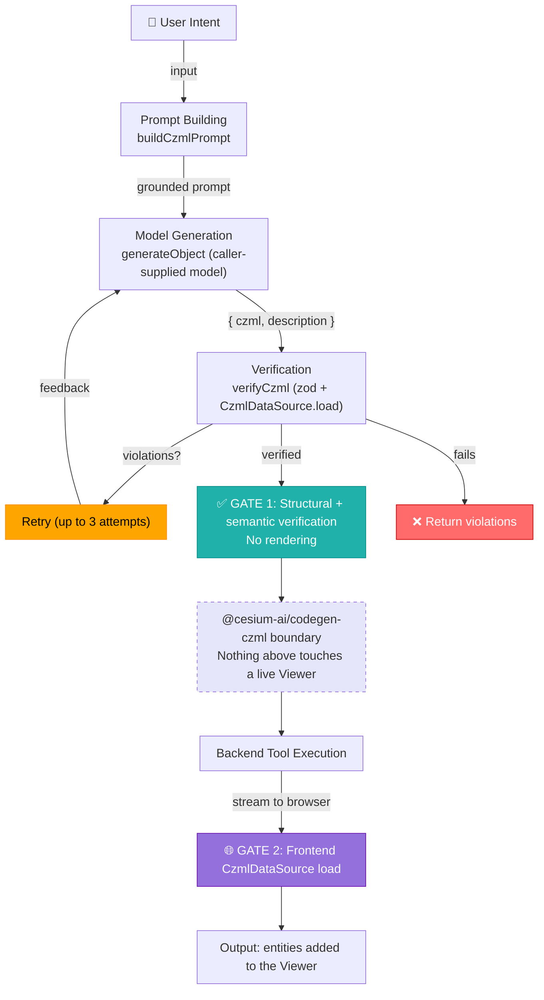

# @cesium-ai/codegen-czml

Intent-to-verified-CZML generation pipeline, plus the `generateCzml` tool definition. CZML is declarative data, not code — generation is grounded by an inlined CZML reference ([`czml-reference.ts`](./src/pipeline/czml-reference.ts)) and structured via the AI SDK's `generateObject`, and verification runs the result through Cesium's own `CzmlDataSource` parser (parse-only — this package never constructs a `Viewer` or renders anything).

## Architecture



Unlike `@cesium-ai/codegen-cesium`'s `executeCesiumCode` (arbitrary JavaScript, needing AST verification and a runtime sandbox), CZML is declarative data Cesium already knows how to parse safely — so GATE 1 doubles as both the structural check and the real semantic parse (via `CzmlDataSource`, headless, no `Viewer` needed), and GATE 2 is just loading the already-verified document into the live `Viewer`.

## Entry points

| Subpath                          | Exports                                                          | Consumer     |
| --------------------------------- | ----------------------------------------------------------------| ------------ |
| `@cesium-ai/codegen-czml`         | Full pipeline + `generateCzml` tool with model-facing description | Backend only |
| `@cesium-ai/codegen-czml/names`   | `CODEGEN_CZML_TOOL_NAMES`, `CodegenCzmlToolName`                 | Both         |
| `@cesium-ai/codegen-czml/schemas` | `generateCzmlInputShape`, `GenerateCzmlInput`                    | Both         |

Never import the root from client code — it pulls in `ai` and model-facing descriptions.

## Usage

```ts
import { generateVerifiedCzml } from "@cesium-ai/codegen-czml";

const result = await generateVerifiedCzml({
  intent: "animate a satellite orbit over Europe for 24 hours",
  model,
});

if (result.verified) {
  // result.czml, result.description, result.entityCount
}
```

A host application wraps this in its own executable AI SDK tool (see this repo's sample app's `backend/src/tools/generate-czml-tool.ts`), merging it into the tool registry alongside `@cesium-ai/tools-schemas`'s viewer tools.

## Security

- **GATE 1 — Verification (this package):** `verifyCzml` caps document size/packet count, structurally validates via zod (document packet first, unique ids), then parses the document with Cesium's own `CzmlDataSource.load` — catching anything Cesium itself would reject before it ever reaches the client. This never constructs a `Viewer` or renders anything.
- **GATE 2 — Frontend load:** The host application loads the already-verified CZML into the live `Viewer` via `CzmlDataSource` and reports the real entity count/any load error back to the agent loop.
- Verified CZML is still attacker-influenceable model output until the frontend actually loads it — treat a `{ czml }` result as "passed verification", not "is on the globe", exactly like `executeCesiumCode`'s `{ code }` result.
