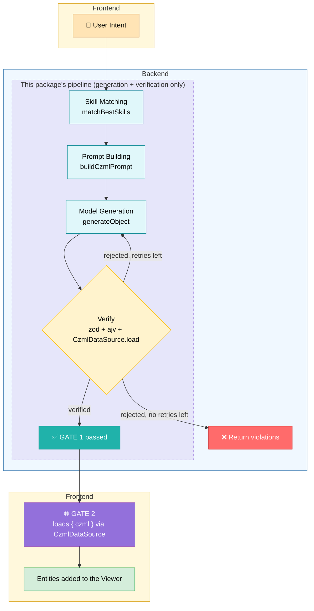

# @cesium-ai/codegen-czml

Intent-to-verified-CZML generation pipeline, plus the `generateCzml` tool definition. CZML is declarative data, not code — generation is grounded by an inlined CZML reference ([`czml-reference.ts`](https://github.com/CesiumGS/cesiumjs-ai-starter-app/blob/main/packages/codegen-czml/src/pipeline/czml-reference.ts)) and structured via the AI SDK's `generateObject`, and verification runs the result through Cesium's own `CzmlDataSource` parser (parse-only — this package never constructs a `Viewer` or renders anything).

## What is CZML?

[CZML](https://github.com/CesiumGS/cesium/wiki/CZML-Guide) is a JSON-based document format for describing time-dynamic graphics scenes in CesiumJS. Rather than imperative code that calls the Cesium API directly, a CZML document is declarative data: a list of packets, each describing an entity (a point, model, satellite, path, etc.) along with properties — position, orientation, color, availability — that can be constant or vary over time via time-tagged samples. Cesium's `CzmlDataSource` parses this data and renders it on the `Viewer`, interpolating between samples as the clock advances. Because it's pure data rather than executable code, generated CZML only needs to pass structural/semantic verification, not the code-execution sandboxing `@cesium-ai/codegen-cesium`'s `executeCesiumCode` requires.

## Architecture

Two checkpoints stand between a model's output and the live globe: **GATE 1** (this package) rejects anything structurally or semantically invalid before it ever leaves the backend, and **GATE 2** (the host app's frontend) is the real `CzmlDataSource` load into the `Viewer` — the only step that actually renders anything.



Unlike `@cesium-ai/codegen-cesium`'s `executeCesiumCode` (arbitrary JavaScript, needing AST verification and a runtime sandbox), CZML is declarative data Cesium already knows how to parse safely — so GATE 1 doubles as both the structural check and the real semantic parse (via `CzmlDataSource`, headless, no `Viewer` needed), and GATE 2 is just loading the already-verified document into the live `Viewer`.

## Supported dynamic behaviors

Grounded by [`czml-reference.ts`](https://github.com/CesiumGS/cesiumjs-ai-starter-app/blob/main/packages/codegen-czml/src/pipeline/czml-reference.ts), which is inlined into every generation prompt:

| Dynamic behavior              | CZML mechanism                                                        | Example use case                                                    |
| ----------------------------- | --------------------------------------------------------------------- | ------------------------------------------------------------------- |
| Time-varying position         | `position` with `epoch` + sampled `cartographicDegrees` offsets       | Satellite orbit, moving vehicle/aircraft                            |
| Motion trail                  | `path` (`resolution`, `leadTime`, `trailTime`, `material`, `width`)   | Ground track drawn behind a moving satellite                        |
| Scheduled appear/disappear    | `availability` (ISO8601 interval)                                     | Entity only exists during part of the scene's clock                 |
| Global timeline & playback    | document `clock` (`interval`, `currentTime`, `multiplier`, `range`)   | Populates the Cesium timeline widget; loop/clamp/unbounded playback |
| Static multi-point geometry   | `polyline` with a fixed `positions` array (not time-sampled)          | Fixed flight path or route line                                     |
| Point/billboard/label styling | `point`, `billboard`, `label` (`color`, `pixelSize`, `scale`, `show`) | Markers and text that ride along a dynamic position                 |

Anything outside this set is grounded instead by a per-intent BM25-matched feature skill under [`skills/`](https://github.com/CesiumGS/cesiumjs-ai-starter-app/tree/main/packages/codegen-czml/skills) (billboard/label, polygon, polyline, orientation, clock/viewFrom, box, cylinder, corridor, ellipse, ellipsoid, rectangle, wall, polyline volume, 3D models, 3D Tiles, custom properties, reference properties, distance-based scaling, and more) rather than always inlined in the core reference — see [`czml-eval-cases.ts`](https://github.com/CesiumGS/cesiumjs-ai-starter-app/blob/main/backend/evals/czml-eval-cases.ts) for the full evaluated feature list. Anything with no matching skill (e.g. sensor cones, CZML interpolation/extrapolation tuning) still falls back to whatever the model infers, which is not guaranteed to pass verification.

## Entry points

| Subpath                           | Exports                                                           | Consumer     |
| --------------------------------- | ----------------------------------------------------------------- | ------------ |
| `@cesium-ai/codegen-czml`         | Full pipeline + `generateCzml` tool with model-facing description | Backend only |
| `@cesium-ai/codegen-czml/names`   | `CODEGEN_CZML_TOOL_NAMES`, `CodegenCzmlToolName`                  | Both         |
| `@cesium-ai/codegen-czml/schemas` | `generateCzmlInputShape`, `GenerateCzmlInput`                     | Both         |

Never import the root from client code — it pulls in `ai` and model-facing descriptions.

## Usage

```ts
import { generateVerifiedCzml } from "@cesium-ai/codegen-czml";

const result = await generateVerifiedCzml({
  intent: "animate a satellite orbit over Europe for 24 hours",
  model,
});

if (result.verified) {
  // result.czml, result.description, result.entityCount
}
```

A host application wraps this in its own executable AI SDK tool (see this repo's sample app's `backend/src/tools/generate-czml-tool.ts`), merging it into the tool registry alongside `@cesium-ai/tools-schemas`'s viewer tools.

## Security

- **GATE 1 — Verification (this package):** `verifyCzml` caps document size/packet count, structurally validates via zod (document packet first, unique ids), validates every packet against the official CZML JSON Schema via ajv, then parses the document with Cesium's own `CzmlDataSource.load` — catching anything Cesium itself would reject before it ever reaches the client. This never constructs a `Viewer` or renders anything.
  - The ajv/official-schema step isn't redundant with the final `CzmlDataSource.load` parse: `CzmlDataSource.load` only throws a single generic parse error, while ajv reports one message per violated schema property (`instancePath` + `message`). That per-property detail is what gets fed back to the model as retry feedback — dropping ajv would still catch bad CZML at the `CzmlDataSource.load` step, but with much weaker guidance on what to fix on the next attempt.
  - The official CZML schema is vendored locally under `schema/czml/` (see [`czml-official-schema.ts`](https://github.com/CesiumGS/cesiumjs-ai-starter-app/blob/main/packages/codegen-czml/src/pipeline/czml-official-schema.ts)), not fetched from GitHub at runtime — validation never depends on network access.
- **GATE 2 — Frontend load:** The host application loads the already-verified CZML into the live `Viewer` via `CzmlDataSource` and reports the real entity count/any load error back to the agent loop.
- Verified CZML is still attacker-influenceable model output until the frontend actually loads it — treat a `{ czml }` result as "passed verification", not "is on the globe", exactly like `executeCesiumCode`'s `{ code }` result.
- **Not enforced by verification:** the prompt instructs the model not to invent external image/model/tileset URLs; explicit model requests may use a small allowlist of Cesium-hosted sample assets documented in the model skill when the intent supplies no URL. Neither GATE enforces that policy — a verified `{ czml }` result can still contain an attacker- or model-supplied URI that the browser will fetch once loaded. Likewise, a packet's `description` is raw HTML rendered in Cesium's `InfoBox` when that entity is clicked; verification only checks it's a valid CZML string, not that it's benign markup. Host applications with stricter requirements should add their own allowlist/sanitization on `{ czml }` before loading it.
