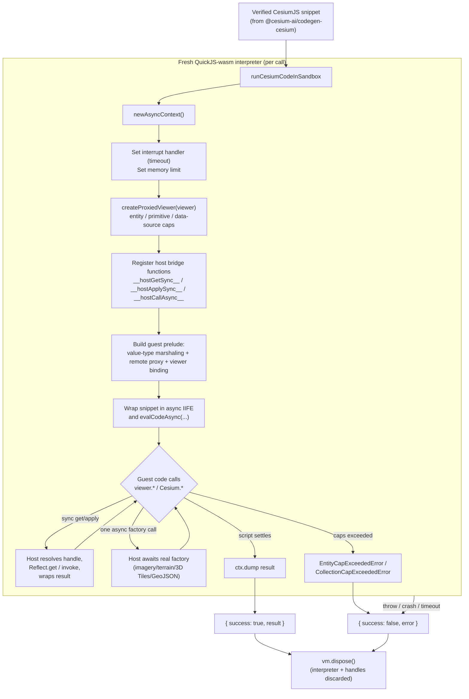
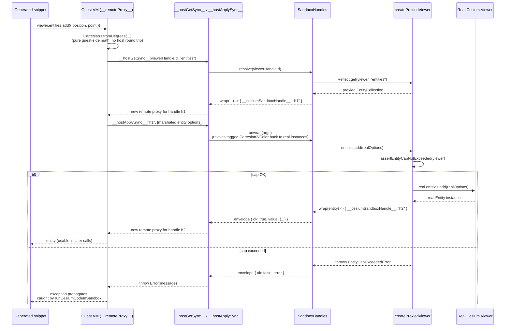

# @cesium-ai/codegen-sandbox

Browser-executed QuickJS-wasm sandbox that runs already-verified CesiumJS code directly against a
live `Viewer`'s real API surface, plus the client-side execution guardrails around it.

This is the **execution** half of the "Code Mode" pipeline whose **generation and static
verification** half lives in `@cesium-ai/codegen-cesium`:

1. `@cesium-ai/codegen-cesium` (server-side, Node-safe): turns a model `intent` into a CesiumJS
   snippet and statically verifies it (AST parse only — never executes).
2. `@cesium-ai/codegen-sandbox` (this package, frontend-only): actually **executes** an
   already-verified snippet, isolated in a QuickJS-wasm interpreter bound to the live `Viewer`.

The two are deliberately separate packages, not layers of one: this package depends on `cesium`
(WebGL/DOM) and `quickjs-emscripten` (browser wasm), so it must never be imported by server-side
code, while `@cesium-ai/codegen-cesium` is safe for the Node backend precisely because it carries
none of that.

## What is QuickJS?

[QuickJS](https://bellard.org/quickjs/) is a small, embeddable JavaScript engine. This package
uses [`quickjs-emscripten`](https://github.com/justjs/quickjs-emscripten), which compiles QuickJS
to WebAssembly so it can run entirely inside the browser, isolated from the page's own JS engine
(V8/SpiderMonkey/JavaScriptCore).

That isolation is the whole reason it's used here: the untrusted, LLM-generated CesiumJS snippet
runs inside this separate WASM VM ("the guest") instead of the app's real JS context ("the host").
The guest has:

- **No shared memory with the host.** It runs in its own WASM linear memory, so it can never hold
  a live reference to the real `Viewer`/`Entity`/etc. — every value crossing the boundary is either
  plain JSON data or an opaque handle id (see `SandboxHandles` and the "Execution Sequence" diagram
  below).
- **No access to the DOM, `fetch`, `window`, or any other browser global** unless explicitly bound
  in by the host — the guest prelude only exposes the small, deliberate `Cesium`/`viewer` surface
  built in `src/bindings/`.
- **Enforceable resource limits.** `ctx.runtime.setInterruptHandler(...)` and
  `ctx.runtime.setMemoryLimit(...)` bound how long a script may run and how much memory it may
  use — an infinite loop or runaway allocation in generated code is caught and turned into a
  structured `{ success: false, error }`, instead of hanging or crashing the tab.

In short: QuickJS-wasm gives per-call, disposable sandboxes that let this package run
untrusted/model-generated code with real crash/hang isolation, at the cost of the marshaling layer
(`src/bindings/`) needed to bridge guest calls back to the real Cesium `Viewer`.

## How It Works



Key points:

- **One interpreter per call.** `newAsyncContext()` creates a fresh QuickJS-wasm VM for every
  invocation and it's always disposed in a `finally` block — no state, bindings, or object handles
  leak between runs.
- **The guest never sees real Cesium objects.** `SandboxHandles` marshals class instances as
  opaque handle ids and value types (e.g. `Cartesian3`, `Color`) transparently; all `viewer.*` /
  `Cesium.*` calls cross the boundary through the generic `__hostGetSync__` / `__hostApplySync__`
  bridge (or, for the small fixed set of network-backed async factories, `__hostCallAsync__` —
  capped at one async call per script to avoid a known Asyncify crash).
- **Guardrails are enforced host-side, transparently.** `createProxiedViewer` wraps the real
  `Viewer` so calls like `entities.add(...)`, `scene.primitives.add(...)`, and
  `dataSources.add(...)` are checked against caps before being forwarded — the generated code
  itself needs no changes to respect them.
- **Failure is always structured, never thrown.** Timeouts (interrupt handler), memory-limit hits,
  cap violations, and any other runtime error all resolve to `{ success: false, error }` rather
  than an unhandled rejection or a crashed tab.

### Execution Sequence: How Generated Code Reaches the Real `Viewer`

The guest VM never holds a live reference to the real `Viewer` — QuickJS runs in separate WASM
linear memory, so every `viewer.*` / `Cesium.*` call in the generated snippet is dispatched by
opaque handle id through the synchronous host bridge. The sequence below walks through a concrete
example, `viewer.entities.add({ position, point })`:



A few things this makes concrete:

- **Pure value-type math never leaves the guest.** `Cartesian3.fromDegrees`, `Color.fromCssColorString`,
  etc. (from `buildCesiumValueTypeGuestPrelude`) run entirely in guest JS — only the final
  `entities.add(...)` call actually round-trips to the host.
- **Every reachable object becomes a new opaque handle.** The `Entity` returned by `add(...)` never
  crosses as a live reference — it's wrapped as `{ __cesiumSandboxHandle__: "h2" }` and re-proxied,
  so later calls like `entity.position = ...` go through the exact same bridge.
- **Guardrails run host-side, inside the real `Viewer` proxy, not in generated code.** The snippet
  never needs to know about `DEFAULT_MAX_ENTITIES` — `createProxiedViewer`'s `entities` wrapper
  checks the cap before forwarding, so a cap violation surfaces as a normal thrown `Error` in the
  guest, then as `{ success: false, error }` from `runCesiumCodeInSandbox`.

## Host Bridge Functions

The guest never talks to the real `Viewer`/`Cesium` module directly — it only ever calls one of
five functions registered on the QuickJS global object before the script runs
(`registerSyncHostBridge` / `registerAsyncHostBridge` in `cesium-code-sandbox.ts`). Every
`viewer.*` / `Cesium.*` property read, assignment, call, or `new` in generated code is rewritten by
the guest-side `__remoteProxy__` (see `guest-prelude-host-bridge.ts`) into one of these:

| Function                                     | Direction               | What it does                                                                                                                                                                                    | Triggered by (guest side)                                                              |
| --------------------------------------------- | ----------------------- | ------------------------------------------------------------------------------------------------------------------------------------------------------------------------------------------------ | ---------------------------------------------------------------------------------------- |
| `__hostGetSync__(handleId, prop)`             | guest → host, sync      | Checks `assertSandboxPropertyAllowed(prop)`, `Reflect.get`s the property off the real object the handle refers to, then wraps the result (new opaque handle, tagged value type, or plain data). | Any property read on a remote-proxy value, e.g. `viewer.entities`, `entity.position`.   |
| `__hostSetSync__(handleId, prop, valueJson)`  | guest → host, sync      | Checks the same property allowlist, unwraps the JSON value (reviving tagged handles/value types back into real instances), then `Reflect.set`s it on the real object.                          | Any property assignment, e.g. `tileset.style = ...`, `entity.polygon.material = ...`.   |
| `__hostApplySync__(handleId, argsJson)`       | guest → host, sync      | Resolves the handle to a real function, unwraps the marshaled arguments, invokes it, and wraps the return value.                                                                                | Calling a remote-proxy value as a function, e.g. `viewer.camera.flyTo({...})`.          |
| `__hostConstructSync__(handleId, argsJson)`   | guest → host, sync      | Same as apply, but via `Reflect.construct` — supports real classes reached through the `Cesium.*` static-namespace fallback.                                                                    | `new Cesium.SomeClass(...)`, e.g. `new Cesium.PinBuilder()`.                            |
| `__hostCallAsync__(name, argsJson)`           | guest → host, **async** | The only bridge function that actually awaits a real host-side `Promise`, via QuickJS's Asyncify support. Dispatches by name against a small fixed allowlist of async Cesium factories, and rejects a second call in the same script run. | `await Cesium.createWorldImageryAsync(...)`, `GeoJsonDataSource.load(...)`, etc.        |

All five return a JSON-encoded envelope, `{ ok: true, value }` or `{ ok: false, error }`. A `false`
envelope becomes a normal thrown `Error` inside the guest, which then propagates out of the wrapped
async IIFE and is caught by `runCesiumCodeInSandbox`'s own `try`/`catch` — guardrail violations,
blocked properties, and unknown handle ids all surface the same way generated-code bugs do:
`{ success: false, error }`, never an unhandled rejection.

## Execution Guards

Two independent layers of guards protect the host: interpreter-level resource limits (generic,
apply to any script regardless of what it calls) and Cesium-domain guards (specific to what a
script is allowed to do with the `Viewer`).

**Interpreter-level (QuickJS runtime) guards** — set up once per call in
`runCesiumCodeInSandbox`:

| Guard                | Mechanism                                                             | Default                             | What happens when it trips                                                                              |
| --------------------- | ---------------------------------------------------------------------- | ------------------------------------- | ----------------------------------------------------------------------------------------------------------- |
| Execution timeout     | `ctx.runtime.setInterruptHandler(shouldInterruptAfterDeadline(...))`  | 5000 ms (`DEFAULT_TIMEOUT_MS`)       | An infinite loop or long-running script is interrupted; the call resolves `{ success: false, error }`.  |
| Memory limit          | `ctx.runtime.setMemoryLimit(...)`                                     | 64 MiB (`DEFAULT_MEMORY_LIMIT_BYTES`) | A runaway allocation aborts the script the same way QuickJS's own out-of-memory handling would.        |
| Fresh VM per call     | `newAsyncContext()` created and `vm.dispose()`d in a `finally` block  | n/a                                  | No state, bindings, or object handles ever leak between separate `runCesiumCodeInSandbox` invocations.  |
| Handle table cap      | `MAX_HANDLES` in `SandboxHandles`                                     | 500                                  | Bounds how many live object handles a single run may accumulate.                                        |

**Cesium-domain guards** — enforced host-side, transparently, inside `createProxiedViewer` and
`execution-guards.ts`, so generated code never has to be aware of them:

| Guard                       | Enforced on                                                  | Default                                   | Failure mode                                                                    |
| --------------------------- | -------------------------------------------------------------- | -------------------------------------------- | ---------------------------------------------------------------------------------- |
| Entity cap                 | `viewer.entities.add(...)`                                    | 200 (`DEFAULT_MAX_ENTITIES`); overridable per call via the optional `EntityCapOptions.maxEntities` | Throws `EntityCapExceededError` before forwarding to the real `add`.            |
| Collection cap (primitives) | `viewer.scene.primitives.add(...)`                            | shares the generic collection-cap check   | Throws `CollectionCapExceededError`.                                            |
| Collection cap (data sources) | `viewer.dataSources.add(...)`                               | shares the generic collection-cap check   | Throws `CollectionCapExceededError`.                                            |
| Blocked property allowlist  | Every `__hostGetSync__` / `__hostSetSync__` / `__hostApplySync__` / `__hostConstructSync__` call, via `assertSandboxPropertyAllowed` | blocks any `_`-prefixed member, plus an explicit list (`destroy`, `document`, `window`, `canvas`, `container`, `contentWindow`, `contentDocument`, `ownerDocument`, `parentElement`, `defaultView`, `prototype`, `constructor`, `__proto__`, `caller`, `arguments`, `removeAll`, `isDestroyed`) | Throws *before* the real property is ever read, written, or called — blocks DOM/lifecycle escape and bulk-removal footguns, on every handle, not just the initial `viewer`. |
| Single async call cap       | `__hostCallAsync__`'s dispatcher                              | 1 async factory call per script run       | A 2nd async call in the same script is rejected outright (works around a known Asyncify crash) rather than risked. |

Both layers fail the same way from the caller's perspective — a structured
`{ success: false, error }` — so callers never need to distinguish "hit a resource limit" from "hit
a domain guardrail" from "the generated code itself threw."

## Bindings Modules (`src/bindings/`)

Each module below owns one narrow slice of the host/guest marshaling design. None of them maintain
an exhaustive manifest of Cesium's API surface — they lean on generic proxies and dynamic dispatch
so the bound surface tracks real CesiumJS automatically as it evolves.

| Module                            | Why it's needed                                                                                                                                                                                                        |
| ----------------------------------- | -------------------------------------------------------------------------------------------------------------------------------------------------------------------------------------------------------------------------- |
| `sandbox-handles.ts`              | Defines `SandboxHandles`, the core JSON marshaling boundary: tags real class instances (`Entity`, `Viewer`, ...) as opaque handle ids, transparently passes through JSON-safe value types (`Cartesian3`, `Color`, ...), and rejects unrecognized handle ids the guest might try to forge. |
| `guarded-viewer-proxy.ts`         | Defines `createProxiedViewer` and the shared `createGuardedProxy` factory: wraps the real `Viewer` (and nested `camera`/`scene`/`entities`/`dataSources`) so cap checks and the blocked-property allowlist apply, while every other real Cesium API call still passes through transparently. |
| `guest-prelude-host-bridge.ts`    | Builds the guest-side `__remoteProxy__`: the recursive `Proxy` that turns any handle id into something guest code can read/write/call/construct, dispatching each operation to the matching `__host*Sync__` function above. |
| `guest-prelude-static-fallback.ts`| Upgrades the guest's `Cesium` namespace object into a `Proxy` that falls back to the *real* static `Cesium` module (through the same remote-proxy bridge) for any class not reimplemented as a pure guest-side value type — avoids hand-maintaining an ever-growing allowlist of static classes (`Rectangle`, `PinBuilder`, `Material`, ...). |
| `guest-prelude-value-types.ts`    | Reimplements the handful of most commonly generated, pure/side-effect-free CesiumJS value types (`Cartesian2`/`Cartesian3`, `Color`, `Cartographic`, `HeadingPitchRange`/`HeadingPitchRoll`, `NearFarScalar`) directly in guest JS, so common math (`Cartesian3.fromDegrees`, `Color.fromCssColorString`) never needs a host round trip. |
| `cesium-async-factories.ts`       | The fixed allowlist of genuinely async real `Cesium.*` factories (imagery/terrain providers, 3D Tiles, GeoJSON, glTF models) dispatched through `__hostCallAsync__`, kept separate from the sync bridge because of the Asyncify one-call-per-script constraint. |
| `function-source.ts`              | Provides `extractFunctionBody`, letting the guest-prelude "body" functions above be written as real, type-checked TypeScript functions with their source text extracted for injection into the guest script — instead of hand-written, unchecked template-literal strings. |
| `execution-guards.ts` (package root) | Client-side defense-in-depth caps (`assertEntityCapNotExceeded`, `assertCollectionCapNotExceeded`) — independent of both the sandbox's own process isolation and the backend's static verification of the generated snippet. |

## Usage

```ts
import { runCesiumCodeInSandbox } from "@cesium-ai/codegen-sandbox";

const result = await runCesiumCodeInSandbox({ code: verifiedSnippet, viewer });
```

Callers that need to bound how often the sandbox itself is invoked (e.g. this app's `ChatPanel`)
should pair this with their own call rate limiter — this package no longer ships one, since it has
no dependency on `cesium`/`quickjs-emscripten` and was never invoked internally by
`runCesiumCodeInSandbox`. See `frontend/src/utils/sandbox-call-rate-limiter.ts` for this app's copy.

## Sandbox Benefits & Trade-offs

### What the Sandbox Solves

| Problem                     | Without Sandbox          | With Sandbox                                      |
| --------------------------- | ------------------------ | ------------------------------------------------- |
| **Infinite loops**          | 🔴 Browser hangs/freezes | 🟢 Timeout catches it gracefully                  |
| **Memory leaks**            | 🔴 Tab crashes           | 🟢 Heap limit enforced, isolated                  |
| **Stack overflow**          | 🔴 Browser crash         | 🟢 Stack limit enforced                           |
| **Deep recursion**          | 🔴 Browser freeze        | 🟢 Caught & isolated                              |
| **Guest VM state corruption** | 🔴 Can affect page realm | 🟢 Isolated per run (fresh interpreter each call) |
| **Viewer mutations**        | 🔴 Unbounded direct access | 🟡 Guarded and capped, but allowed effects persist |
| **Global scope pollution**  | 🔴 Affects entire app    | 🟢 Isolated to WASM context                       |
| **Prototype pollution**     | 🔴 Affects main page     | 🟢 Affects only sandbox                           |

### When to Use This Sandbox

✅ **Use the sandbox when:**

- You need **production stability** — generated code bugs shouldn't crash the browser
- You can't afford **data loss** — users lose work if the app crashes
- Code generation isn't 100% reliable (edge cases, off-by-one errors, typos)
- You want **fault isolation** — bad code dies in sandbox, not the app
- Your use case is **public-facing** and you need reliability guarantees

**Example**: AI-generated visualization code for production apps, demos, or user-facing features.

### When NOT to Use (Direct Execution Alternative)

❌ **Direct execution might work if:**

- Code generation is **extremely well-tested** and rarely produces bugs
- You have **comprehensive error handling** around code execution with proper timeouts
- You're in a **dev/experimental** environment where crashes are acceptable
- The **performance overhead** of WASM is unacceptable and you can't tolerate it
- You can guarantee the **code is already pre-verified** and trusted before reaching the browser

**However**: Even in these cases, the sandbox's crash isolation is valuable. The binding maintenance cost is typically worth the reliability gain.

### Cost vs. Benefit

**Maintenance Cost**: Keeping the `src/bindings/` proxy/marshaling modules in sync as Cesium API evolves  
**Operational Benefit**: Browser never crashes from generated code, users never lose work

For production use, the trade-off typically favors keeping the sandbox.

## Exports

| Export                                                                                                         | Description                                                                                                       |
| -------------------------------------------------------------------------------------------------------------- | ----------------------------------------------------------------------------------------------------------------- |
| `runCesiumCodeInSandbox`                                                                                       | Runs untrusted/verified code in a fresh QuickJS-wasm interpreter bound to a live `Viewer`.                        |
| `SandboxHandles`                                                                                               | Host/guest JSON marshaling: opaque handles for class instances, transparent tagging for value types.              |
| `createProxiedViewer`                                                                                          | Wraps a live `Viewer` with collection caps and a guard policy that blocks lifecycle, DOM, private, and bulk-removal properties. |
| `buildCesiumHostBridgeGuestPrelude`, `buildCesiumAsyncFactoryGuestPrelude`, `buildCesiumValueTypeGuestPrelude` | The generic remote-proxy bridge and guest-side prelude generators — see `src/bindings/`.                          |
| `assertEntityCapNotExceeded`, `DEFAULT_MAX_ENTITIES`, `EntityCapOptions`, `EntityCapExceededError`             | Caps how many entities one sandboxed session may add. `EntityCapOptions.maxEntities` is optional and falls back to `DEFAULT_MAX_ENTITIES` when omitted. |

## Why this isn't part of `@cesium-ai/tools-cesium` or `@cesium-ai/codegen-cesium`

- `@cesium-ai/tools-cesium` is scoped to schema-only viewer tools (`flyTo`, ...) whose arguments are
  bounded, typed data a client validates and hands straight to one `Viewer` method call — not
  arbitrary generated code.
- `@cesium-ai/codegen-cesium` is scoped to generation + static verification and is explicitly
  documented as "parse-only, never executes generated code" — it must stay safe to import from a
  Node backend. Folding a `cesium` + `quickjs-emscripten` execution sandbox into it would drag
  browser/WASM/WebGL dependencies into that server-side bundle and contradict that boundary.

Growing this package means extending the marshaling/proxy/prelude modules listed under
[Bindings Modules](#bindings-modules-srcbindings), not adding new bespoke capability functions —
see each file's own header comment for its part of the binding design, and `cesium-bindings.ts`
for the barrel re-export tying them together.