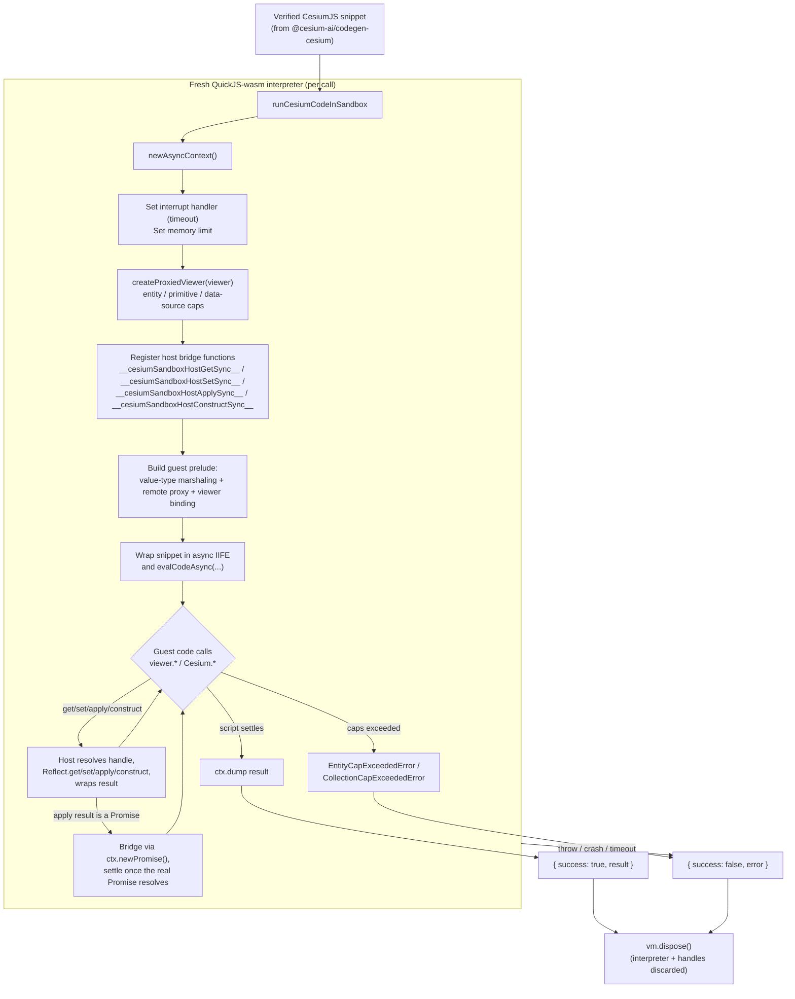

# @cesium-ai/codegen-sandbox

Browser-executed QuickJS-wasm sandbox that runs already-verified CesiumJS code against a live
`Viewer`, plus the client-side execution guardrails around it.

This is the **execution** half of the "Code Mode" pipeline; **generation and static verification**
lives in `@cesium-ai/codegen-cesium`:

1. `@cesium-ai/codegen-cesium` (server-side, Node-safe): turns a model `intent` into a CesiumJS
   snippet and statically verifies it (AST parse only — never executes).
2. `@cesium-ai/codegen-sandbox` (this package, frontend-only): **executes** an already-verified
   snippet, isolated in a QuickJS-wasm interpreter bound to the live `Viewer`.

They're separate packages because this one depends on `cesium` (WebGL/DOM) and
`quickjs-emscripten` (browser wasm) and must never be imported server-side, while
`@cesium-ai/codegen-cesium` stays Node-safe by carrying none of that.

## What is QuickJS?

[QuickJS](https://bellard.org/quickjs/) is a small, embeddable JS engine, compiled to WebAssembly
here via [`quickjs-emscripten`](https://github.com/justjs/quickjs-emscripten) so it can run
entirely inside the browser, isolated from the page's own JS engine. The untrusted,
LLM-generated CesiumJS snippet runs inside this separate WASM VM ("the guest") instead of the
app's real JS context ("the host") — it has no shared memory with the host (every value crossing
the boundary is JSON data or an opaque handle id), no access to the DOM/`fetch`/`window`, and its
time/memory usage is bounded and enforced (see [Restrictions](#restrictions) below).

In short: QuickJS-wasm gives per-call, disposable sandboxes that let this package run
untrusted/model-generated code with real crash/hang isolation, at the cost of the marshaling layer
(`src/bindings/`) needed to bridge guest calls back to the real Cesium `Viewer`.

## How It Works



Key points:

- **One interpreter per call.** Fresh VM per invocation, always disposed in a `finally` block — no
  state, bindings, or object handles leak between runs.
- **The guest never sees real Cesium objects.** `SandboxHandles` marshals class instances as opaque
  handle ids and value types (e.g. `Cartesian3`, `Color`) transparently through the generic
  `__cesiumSandboxHostGetSync__` / `__cesiumSandboxHostApplySync__` bridge. Any call that returns a
  host-side `Promise` is bridged back as a real QuickJS promise via `ctx.newPromise()` — one path
  handles both sync and Promise-returning calls.
- **Guardrails are enforced host-side, transparently.** `createProxiedViewer` wraps the real
  `Viewer` so calls like `entities.add(...)` are checked against caps before being forwarded — the
  generated code itself needs no changes to respect them.
- **Failure is always structured, never thrown.** Timeouts, memory-limit hits, cap violations,
  blocked callbacks/properties, and rejected Promises all resolve to `{ success: false, error }`
  rather than an unhandled rejection or crashed tab.

## Restrictions

Everything generated code is restricted from doing, in one place:

| Restriction                    | Limit / rule                                                                                                                                                            | Enforced by                                                     |
| ------------------------------ | ----------------------------------------------------------------------------------------------------------------------------------------------------------------------- | --------------------------------------------------------------- |
| Execution timeout              | 5000 ms default (`DEFAULT_TIMEOUT_MS`), configurable via `timeoutMs`                                                                                                    | QuickJS interrupt handler (`shouldInterruptAfterDeadline`)      |
| Memory limit                   | 64 MiB default (`DEFAULT_MEMORY_LIMIT_BYTES`), configurable via `memoryLimitBytes`                                                                                      | `ctx.runtime.setMemoryLimit(...)`                               |
| Live handle count              | 500 max (`MAX_HANDLES`)                                                                                                                                                 | `SandboxHandles`                                                |
| Entities per `viewer.entities` | 200 default (`DEFAULT_MAX_ITEMS_PER_COLLECTION`), configurable via `maxItemsPerCollection`                                                                              | `EntityCapExceededError` in `createProxiedViewer`               |
| Items per scene collection     | Same ceiling — `scene.primitives`, `groundPrimitives`, `postProcessStages`, `imageryLayers`, `dataSources`                                                              | `CollectionCapExceededError` in `createProxiedViewer`           |
| Entities per data source       | Same ceiling, checked before `viewer.dataSources.add(...)`                                                                                                              | `createProxiedViewer`                                           |
| Blocked properties             | Any `_`-prefixed member, plus `destroy`, `document`, `window`, `canvas`, `container`, `contentWindow`, `prototype`, `__proto__`, `removeAll`, `isDestroyed`, and others | `assertSandboxPropertyAllowed` on every get/set/apply/construct |
| Blocked static exports         | e.g. `Resource`, `IonResource`, `TaskProcessor` — network- or global-state-capable                                                                                      | `blockedStaticExports` in `cesium-capabilities.json`            |
| Network access                 | Default-deny; only exact-match origins in `allowedNetworkOrigins`, optionally relative URLs via `allowRelativeNetworkUrls`                                              | URL policy check before any host call receives a URL argument   |
| Guest callbacks                | Not supported — a bare guest function (event handler, `CallbackProperty`, etc.) is rejected, not silently dropped                                                       | `__marshalArg__` in the guest prelude                           |
| DOM / `window` / `fetch`       | Never exposed to the guest at all                                                                                                                                       | No binding exists for them                                      |
| State between runs             | None — every call gets a fresh interpreter, disposed after                                                                                                              | `newAsyncContext()` / `vm.dispose()`                            |

All of the above fail the same way — a structured `{ success: false, error }`, never a thrown
exception, unhandled rejection, or crashed tab — so callers never need to distinguish a resource
limit from a domain guardrail from the generated code's own error.

## How Cesium Values Are Resolved

The guest starts with a local `Cesium` object and then wraps it in a fallback `Proxy`. Resolution
depends on which kind of Cesium value generated code requests:

| Kind                                            | When it is used                                                                                                                                                                                     | How it is resolved                                                                                                                                                                                                                                               |
| ----------------------------------------------- | --------------------------------------------------------------------------------------------------------------------------------------------------------------------------------------------------- | ---------------------------------------------------------------------------------------------------------------------------------------------------------------------------------------------------------------------------------------------------------------- |
| Guest-local value type, enum, or constant table | Pure math/data APIs such as `Cesium.Cartesian3`, `Cesium.Color`, and `Cesium.Math`, plus automatically discovered immutable primitive records such as `Cesium.ArcType` and `Cesium.VerticalOrigin`. | The property already exists on the guest's local `Cesium` object, so the fallback proxy returns it directly. Construction and static methods run entirely inside QuickJS with no host bridge call.                                                               |
| Static Cesium export                            | Any installed top-level Cesium export that is not in `blockedStaticExports`, such as `Cesium.defined`, `Cesium.Rectangle`, or `Cesium.Cesium3DTileset`.                                             | The property is absent from the local object, so `guest-prelude-static-fallback.ts` reads it from the denylist-filtered host namespace through `__cesiumSandboxHostGetSync__`. The returned function, class, or object is represented by an opaque remote proxy. |
| Dynamic Promise result                          | Any non-blocked host function or method whose actual return value is Promise-like, such as `Cesium.Cesium3DTileset.fromUrl(...)`, `viewer.flyTo(...)`, or `viewer.dataSources.add(...)`.            | It uses the normal `__cesiumSandboxHostApplySync__` call path. `host-bridge.ts` detects the returned thenable at runtime and creates a genuine QuickJS promise with `ctx.newPromise()`. There is no separate async allowlist or async dispatch function.         |
| Host object instance                            | A real `Viewer`, entity, tileset, provider, collection, function, or other non-JSON host value.                                                                                                     | `SandboxHandles` keeps the real value host-side and gives the guest an opaque handle-backed remote proxy. Reads, writes, calls, and construction on that proxy use the four bridge functions below.                                                              |

Value types stay guest-local while calculations are local. If one crosses into a real host call,
for example `viewer.entities.add({ position: Cesium.Cartesian3.fromDegrees(...) })`, the guest tags
it as JSON-safe value-type data and `SandboxHandles.unwrap` reconstructs the real Cesium instance
before invoking the host API (and vice versa for a value type returned from the host).

The reviewed `valueTypes` map in `cesium-capabilities.json` is the single source of truth — each
key is a Cesium constructor, and its ordered field list is both the serialized shape and
constructor argument order:

```json
"valueTypes": {
  "Cartesian3": ["x", "y", "z"],
  "Color": ["red", "green", "blue", "alpha"]
}
```

`npm run generate:value-type-registry -w @cesium-ai/codegen-sandbox` regenerates
`bindings/generated/value-type-registry.ts` from that map — both host and guest marshaling consume
it generically, so a reviewed addition needs no new manual branches. The list is intentionally
reviewed, not inferred from every Cesium class: a candidate must be pure data, safe inside QuickJS,
and fully reconstructable from its listed public fields. DOM, WebGL, network, worker, lifecycle,
and identity-bearing classes (e.g. `Cesium3DTileStyle`) stay opaque host handles instead.

Enums and constant tables (`ArcType`, `ClockRange`, `TimeConstants`, ...) are discovered
automatically: every frozen top-level record with uppercase keys and JSON-safe primitive values is
copied into the guest. Enums that also expose helper functions don't qualify, and remain available
through the static host fallback instead.

Typical resolution paths are:

```text
Cesium.Cartesian3.fromDegrees(...)
  -> guest-local Cesium.Cartesian3
  -> no host bridge until the result is passed to a host API

Cesium.defined(value)
  -> __cesiumSandboxHostGetSync__(staticCesiumHandle, "defined")
  -> __cesiumSandboxHostApplySync__(definedHandle, args)
  -> synchronous JSON result

await Cesium.Cesium3DTileset.fromUrl(url)
  -> __cesiumSandboxHostGetSync__(staticCesiumHandle, "Cesium3DTileset")
  -> __cesiumSandboxHostGetSync__(classHandle, "fromUrl")
  -> __cesiumSandboxHostApplySync__(methodHandle, args)
  -> host thenable detected -> QuickJS promise -> opaque tileset handle

new Cesium.PinBuilder()
  -> __cesiumSandboxHostGetSync__(staticCesiumHandle, "PinBuilder")
  -> __cesiumSandboxHostConstructSync__(classHandle, args)
  -> opaque PinBuilder instance handle
```

## Host Bridge Functions

The guest never talks to the real `Viewer`/`Cesium` module directly — every `viewer.*` / `Cesium.*`
property read, assignment, call, or `new` is rewritten by the guest-side `__remoteProxy__`
(`guest-prelude-host-bridge.ts`) into a call to one of four host functions registered on the
QuickJS global object before the script runs (`registerHostBindings` in `bindings/host-bridge.ts`):

| Function                                                  | Direction                                 | What it does                                                                                                                                                                                                                              | Triggered by (guest side)                                                                                                               |
| --------------------------------------------------------- | ----------------------------------------- | ----------------------------------------------------------------------------------------------------------------------------------------------------------------------------------------------------------------------------------------- | --------------------------------------------------------------------------------------------------------------------------------------- |
| `__cesiumSandboxHostGetSync__(handleId, prop)`            | guest → host, sync                        | Checks `assertSandboxPropertyAllowed(prop)`, reads the property with `Reflect.get`, preserves method `this` binding, and wraps the result as plain data, tagged value-type data, or a new opaque handle.                                  | Any property read on a remote proxy, including static fallback lookup: `Cesium.defined`, `viewer.entities`, or `entity.position`.       |
| `__cesiumSandboxHostSetSync__(handleId, prop, valueJson)` | guest → host, sync                        | Checks the property denylist, unwraps JSON data and opaque handles, revives tagged value types into real Cesium instances, and writes with `Reflect.set`.                                                                                 | Any remote property assignment: `tileset.style = ...`, `viewer.clock.shouldAnimate = true`, or `entity.polygon.material = ...`.         |
| `__cesiumSandboxHostApplySync__(handleId, argsJson)`      | guest → host, sync or **Promise-bridged** | Resolves a function handle, unwraps its arguments, and invokes it. A synchronous result is wrapped immediately. A Promise-like result increments pending host work and returns a genuine QuickJS promise created with `ctx.newPromise()`. | Calling any remote function or method: `Cesium.defined(value)`, `viewer.camera.flyTo(...)`, or `await Cesium.Model.fromGltfAsync(...)`. |
| `__cesiumSandboxHostConstructSync__(handleId, argsJson)`  | guest → host, sync                        | Resolves a class/function handle, unwraps constructor arguments, constructs it with `Reflect.construct`, and wraps the resulting instance as data or an opaque handle.                                                                    | `new` against a remote class, such as `new Cesium.PinBuilder()` or `new Cesium.WebMapServiceImageryProvider(...)`.                      |

All four return a JSON envelope: `{ ok: true, value }` or `{ ok: false, error }` (the latter
eventually, via the QuickJS promise, for Promise-bridged calls). A false envelope becomes a normal
thrown `Error` inside the guest — caught by `runCesiumCodeInSandbox`'s own `try`/`catch` — so
guardrail violations, blocked properties, rejected host Promises, and unknown handle ids all
surface as `{ success: false, error }`, never an unhandled rejection.

## Bindings Modules (`src/bindings/`)

**The generated snippet is never rewritten or transformed** — it runs verbatim, wrapped in an
async IIFE. `src/bindings/` instead fakes a working `viewer`/`Cesium` API _inside_ the guest (which
otherwise has no real access to either, since guest and host are separate JS runtimes with no
shared memory), via:

- A **prelude** — guest-side JS defining `viewer`, `Cesium`, and helpers like
  `__remoteProxy__`/`__marshalArg__`, so reads/writes/calls/`new` look like ordinary JS.
- A **marshaling layer** deciding what crosses the VM boundary: opaque handles for class instances,
  plain JSON for value types, and a reimplemented subset of pure Cesium math that never crosses at
  all. Everything else is a JSON round trip through the host bridge functions, checked against the
  caps and denylists above.

Each module owns one narrow slice of that design; none maintain an exhaustive manifest of Cesium's
API surface — they lean on generic proxies and dynamic dispatch so the bound surface tracks real
CesiumJS automatically as it evolves.

| Module                                    | Why it's needed                                                                                                                                                            |
| ----------------------------------------- | -------------------------------------------------------------------------------------------------------------------------------------------------------------------------- |
| `cesium-capabilities.json` (package root) | Single reviewed policy manifest: Cesium version, blocked static exports, guest value types, blocked properties, dynamic Promise coverage, unsupported capabilities.        |
| `capabilities-registry.ts`                | Typed runtime view of `cesium-capabilities.json`; binding modules derive their sets/names from this.                                                                       |
| `sandbox-handles.ts`                      | `SandboxHandles`: the core JSON marshaling boundary — opaque handle ids for class instances, transparent value types, rejects forged handle ids.                           |
| `guarded-viewer-proxy.ts`                 | `createProxiedViewer`/`createGuardedProxy`: wraps the real `Viewer` (and nested `camera`/`scene`/`entities`/`dataSources`) so cap checks and the property allowlist apply. |
| `guest-prelude-host-bridge.ts`            | Builds the guest-side `__remoteProxy__` — the recursive `Proxy` dispatching reads/writes/calls/`new` to the four bridge functions above.                                   |
| `guest-prelude-static-fallback.ts`        | Upgrades the guest's `Cesium` namespace into a `Proxy` falling back to non-blocked static Cesium exports through the same bridge.                                          |
| `guest-prelude-value-types.ts`            | Reimplements the most common pure value types (`Cartesian2`/`3`, `Color`, `Cartographic`, `HeadingPitchRange`/`Roll`, `NearFarScalar`) directly in guest JS.               |
| `generated/value-type-registry.ts`        | Generated constructor/field metadata from `cesium-capabilities.json`; regenerate with `npm run generate:value-type-registry -w @cesium-ai/codegen-sandbox`.                |
| `function-source.ts`                      | `extractFunctionBody` — lets guest-prelude "body" functions be real, type-checked TypeScript with their source extracted for injection, not raw template literals.         |
| `execution-guards.ts` (package root)      | Client-side defense-in-depth caps (`assertEntityCapNotExceeded`, `assertCollectionCapNotExceeded`), independent of process isolation and static verification.              |

## Usage

```ts
import { createConsoleLogger, runCesiumCodeInSandbox } from "@cesium-ai/codegen-sandbox";

const result = await runCesiumCodeInSandbox({
  code: verifiedSnippet,
  viewer,
  // Network-capable Cesium loaders are default-deny — opt in only expected origins.
  allowedNetworkOrigins: ["https://assets.example.com"],
  allowRelativeNetworkUrls: false,
  // Override the default 200-item-per-collection ceiling for this run.
  maxItemsPerCollection: 50,
  // Opt-in logging (off by default) — see Logging below.
  logger: createConsoleLogger("debug"),
});

if (!result.success) {
  console.error(result.error); // e.g. a blocked property, cap violation, or timeout
}
```

Origin matching is exact (`https://assets.example.com` does not allow
`https://assets.example.com.evil.test`); protocol-relative URLs are rejected as ambiguous. The
policy inspects nested guest-provided arguments for absolute HTTP(S), root-relative, and
dot-relative URL values before any host setter, function, or constructor receives them. Cesium
calls that resolve configured Ion asset IDs internally don't need their implementation URLs
exposed to guest code.

## Upgrading CesiumJS

The package pins Cesium to the version recorded as `reviewedCesiumVersion` in
`cesium-capabilities.json`. When upgrading:

1. Install the new exact Cesium version.
2. Run `npm run validate:cesium-compat -w @cesium-ai/codegen-sandbox`.
3. Review `CESIUM_COMPATIBILITY.md`, especially new top-level exports and new or removed
   Promise-returning APIs. Under the denylist policy, new top-level exports become available by
   default after the reviewed version is updated.
4. Add new network, DOM, lifecycle, worker, global-state, or otherwise unsafe top-level exports to
   `blockedStaticExports` before updating the reviewed version.
5. Update `reviewedCesiumVersion` only after that review.
6. Run the package tests and browser domain tests.

The validator fails when the installed and reviewed versions differ, when a blocked static export
or guest value type disappears, or when a dynamic Promise runtime path no longer exists. The
generated report inventories the static denylist and Promise-returning declaration paths.

Guest-native `Number`, `String`, and `Boolean` constructor references are supported as Cesium
constructor arguments; other guest functions are rejected explicitly since callbacks cannot safely
outlive the disposable guest VM. Any host method that returns a Promise (not just a fixed allowlist
of factories) is awaited transparently across the host boundary via the generic `apply` bridge.

Callers that need to bound how often the sandbox itself is invoked (e.g. this app's `ChatPanel`)
should pair this with their own call rate limiter — this package no longer ships one, since it has
no dependency on `cesium`/`quickjs-emscripten` and was never invoked internally by
`runCesiumCodeInSandbox`. See `frontend/src/utils/sandbox-call-rate-limiter.ts` for this app's copy.

### Logging

Logging is opt-in and OFF by default — `runCesiumCodeInSandbox` never writes to the console unless
a `logger` is supplied (see the `Usage` example above). `logger.debug` reports each run's
start/completion plus every host-bridge call crossing the guest/host boundary — useful for
diagnosing "sandbox reports success but nothing visibly changed" bugs. `logger.warn` reports
blocked property access and other per-call failures; `logger.error` reports a run's overall
failure. `createConsoleLogger(level)` builds a `console`-backed logger with a given minimum level
(`"debug" | "info" | "warn" | "error" | "silent"`); omitting `logger` (or `createSandboxLogger({
enabled: false })`) returns the no-op `noopLogger`.

## Trade-offs

Running generated code directly (`new Function(...)`) shares the page's own JS heap and call
stack, so one bad snippet — an infinite loop, a runaway allocation, a `_`-prefixed DOM escape —
can hang or crash the tab. The sandbox trades WASM overhead plus the ongoing cost of keeping
`src/bindings/` in sync as Cesium evolves for real crash/hang isolation instead. For anything
executing untrusted or model-generated code in production, that trade-off favors keeping the
sandbox; direct execution only makes sense if the generated code is already fully trusted and
pre-verified before it ever reaches the browser.

## Exports

| Export                                                                                                                  | Description                                                                                                                                          |
| ----------------------------------------------------------------------------------------------------------------------- | ---------------------------------------------------------------------------------------------------------------------------------------------------- |
| `runCesiumCodeInSandbox`                                                                                                | Runs untrusted/verified code in a fresh QuickJS-wasm interpreter bound to a live `Viewer`.                                                           |
| `SandboxHandles`                                                                                                        | Host/guest JSON marshaling: opaque handles for class instances, transparent tagging for value types.                                                 |
| `createProxiedViewer`                                                                                                   | Wraps a live `Viewer` with collection caps and a guard policy that blocks lifecycle, DOM, private, and bulk-removal properties.                      |
| `buildCesiumHostBridgeGuestPrelude`, `buildCesiumValueTypeGuestPrelude`                                                 | The generic remote-proxy bridge and guest-side prelude generators — see `src/bindings/`.                                                             |
| `assertEntityCapNotExceeded`, `DEFAULT_MAX_ITEMS_PER_COLLECTION`, `SceneCollectionCapOptions`, `EntityCapExceededError` | Configures the ceiling applied independently to guarded scene collections. `maxItemsPerCollection` falls back to `DEFAULT_MAX_ITEMS_PER_COLLECTION`. |
| `createSandboxLogger`, `createConsoleLogger`, `noopLogger`, `SandboxLogger`, `SandboxLoggerOptions`, `LogLevel`         | Configurable logging for sandbox runs and host-bridge calls, off by default. See [Logging](#logging).                                                |

## Why this isn't part of `@cesium-ai/tools-cesium` or `@cesium-ai/codegen-cesium`

- `@cesium-ai/tools-cesium` is scoped to schema-only viewer tools (`flyTo`, ...) whose arguments
  are bounded, typed data — not arbitrary generated code.
- `@cesium-ai/codegen-cesium` is scoped to generation + static verification and must stay Node-safe
  ("parse-only, never executes generated code"). Folding a `cesium` + `quickjs-emscripten`
  execution sandbox into it would drag browser/WASM/WebGL dependencies into that server-side bundle.

Growing this package means extending the marshaling/proxy/prelude modules listed under
[Bindings Modules](#bindings-modules-srcbindings), not adding new bespoke capability functions.
