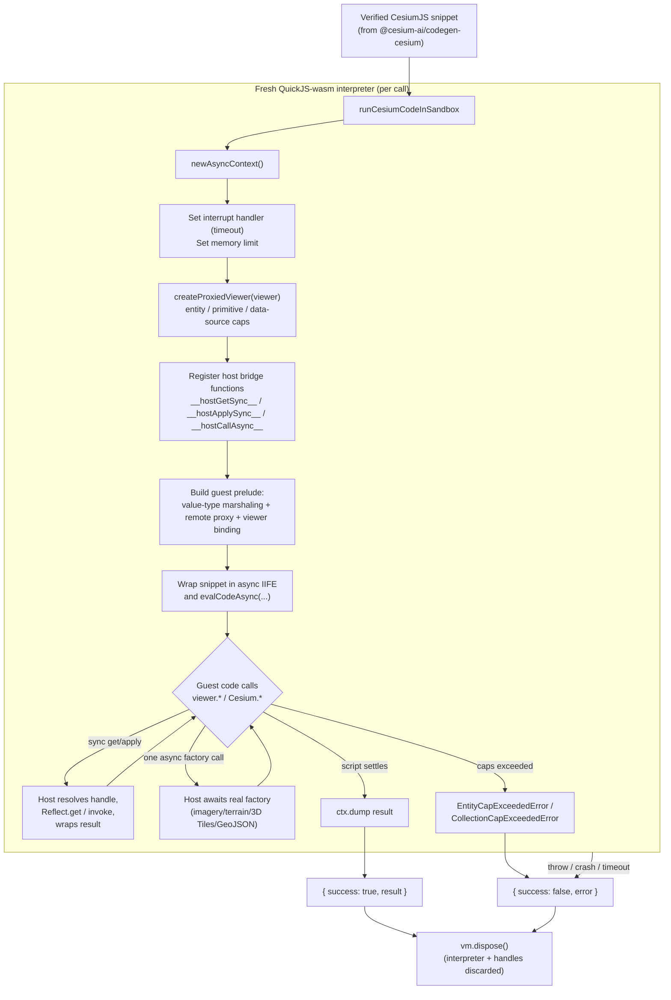
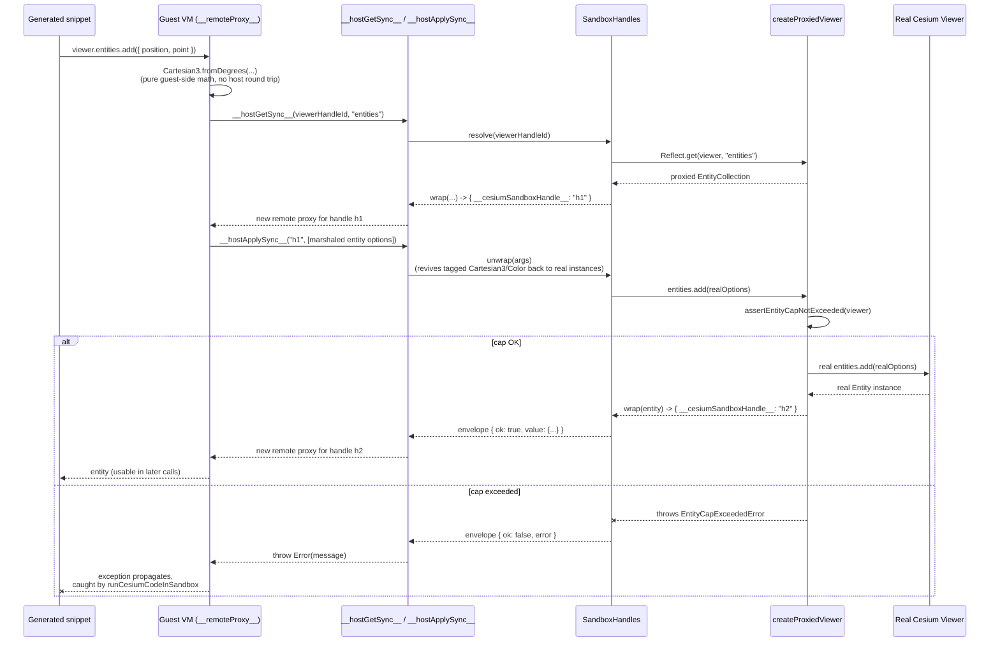
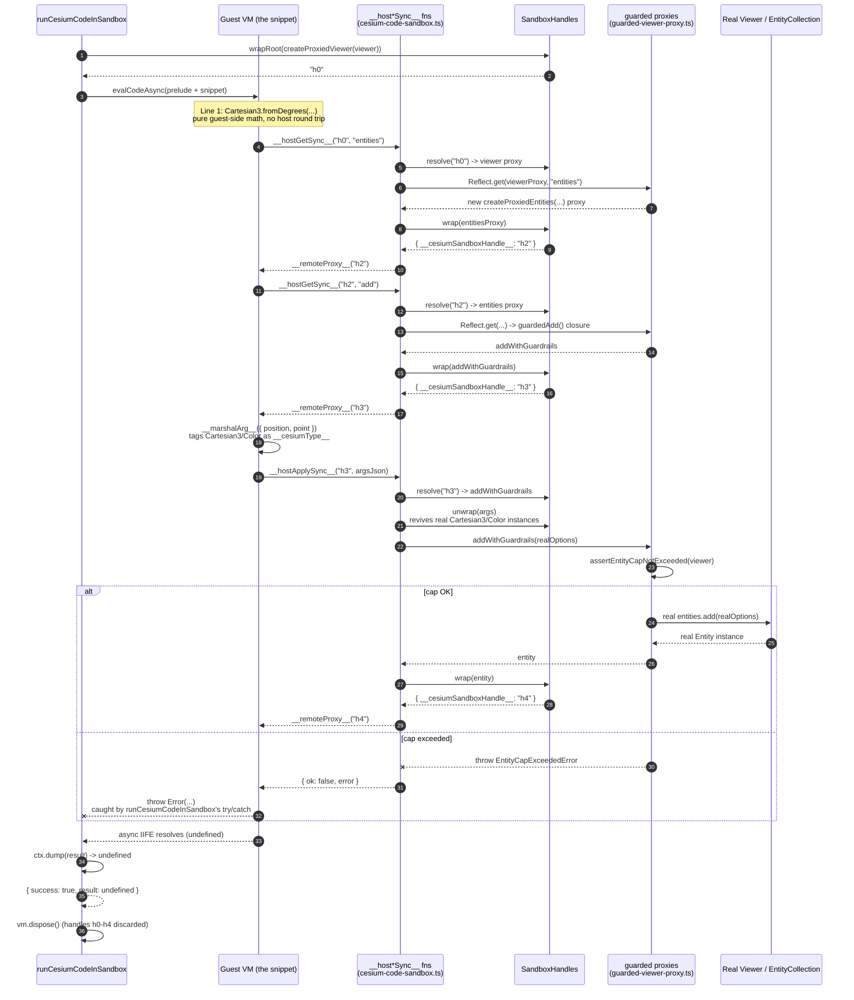

# @cesium-ai/codegen-sandbox

Browser-executed QuickJS-wasm sandbox that runs already-verified CesiumJS code directly against a
live `Viewer`'s real API surface, plus the client-side execution guardrails around it.

This is the **execution** half of the "Code Mode" pipeline whose **generation and static
verification** half lives in `@cesium-ai/codegen-cesium`:

1. `@cesium-ai/codegen-cesium` (server-side, Node-safe): turns a model `intent` into a CesiumJS
   snippet and statically verifies it (AST parse only — never executes).
2. `@cesium-ai/codegen-sandbox` (this package, frontend-only): actually **executes** an
   already-verified snippet, isolated in a QuickJS-wasm interpreter bound to the live `Viewer`.

The two are deliberately separate packages, not layers of one: this package depends on `cesium`
(WebGL/DOM) and `quickjs-emscripten` (browser wasm), so it must never be imported by server-side
code, while `@cesium-ai/codegen-cesium` is safe for the Node backend precisely because it carries
none of that.

## What is QuickJS?

[QuickJS](https://bellard.org/quickjs/) is a small, embeddable JavaScript engine. This package
uses [`quickjs-emscripten`](https://github.com/justjs/quickjs-emscripten), which compiles QuickJS
to WebAssembly so it can run entirely inside the browser, isolated from the page's own JS engine
(V8/SpiderMonkey/JavaScriptCore).

That isolation is the whole reason it's used here: the untrusted, LLM-generated CesiumJS snippet
runs inside this separate WASM VM ("the guest") instead of the app's real JS context ("the host").
The guest has:

- **No shared memory with the host.** It runs in its own WASM linear memory, so it can never hold
  a live reference to the real `Viewer`/`Entity`/etc. — every value crossing the boundary is either
  plain JSON data or an opaque handle id (see `SandboxHandles` and the "Execution Sequence" diagram
  below).
- **No access to the DOM, `fetch`, `window`, or network-capable static Cesium APIs** unless
  explicitly bound by the host. `Cesium.Resource`, for example, is not in the static export
  allowlist; supported network factories use the named async bridge.
- **Enforceable resource limits.** `ctx.runtime.setInterruptHandler(...)` and
  `ctx.runtime.setMemoryLimit(...)` bound how long a script may run and how much memory it may
  use — an infinite loop or runaway allocation in generated code is caught and turned into a
  structured `{ success: false, error }`, instead of hanging or crashing the tab.

In short: QuickJS-wasm gives per-call, disposable sandboxes that let this package run
untrusted/model-generated code with real crash/hang isolation, at the cost of the marshaling layer
(`src/bindings/`) needed to bridge guest calls back to the real Cesium `Viewer`.

## How It Works



Key points:

- **One interpreter per call.** `newAsyncContext()` creates a fresh QuickJS-wasm VM for every
  invocation and it's always disposed in a `finally` block — no state, bindings, or object handles
  leak between runs.
- **The guest never sees real Cesium objects.** `SandboxHandles` marshals class instances as
  opaque handle ids and value types (e.g. `Cartesian3`, `Color`) transparently; all `viewer.*` /
  `Cesium.*` calls cross the boundary through the generic `__hostGetSync__` / `__hostApplySync__`
  bridge (or, for the small fixed set of network-backed async factories, `__hostCallAsync__` —
  capped at one async call per script to avoid a known Asyncify crash).
- **Guardrails are enforced host-side, transparently.** `createProxiedViewer` wraps the real
  `Viewer` so calls like `entities.add(...)`, `scene.primitives.add(...)`, and
  `dataSources.add(...)` are checked against caps before being forwarded — the generated code
  itself needs no changes to respect them.
- **Failure is always structured, never thrown.** Timeouts, memory-limit hits, cap violations,
  unsupported guest callbacks, unbound Promise-returning APIs, and other runtime errors all
  resolve to `{ success: false, error }` rather than an unhandled rejection or crashed tab.

### Execution Sequence: How Generated Code Reaches the Real `Viewer`

The guest VM never holds a live reference to the real `Viewer` — QuickJS runs in separate WASM
linear memory, so every `viewer.*` / `Cesium.*` call in the generated snippet is dispatched by
opaque handle id through the synchronous host bridge. The sequence below walks through a concrete
example, `viewer.entities.add({ position, point })`:



A few things this makes concrete:

- **Pure value-type math never leaves the guest.** `Cartesian3.fromDegrees`, `Color.fromCssColorString`,
  etc. (from `buildCesiumValueTypeGuestPrelude`) run entirely in guest JS — only the final
  `entities.add(...)` call actually round-trips to the host.
- **Every reachable object becomes a new opaque handle.** The `Entity` returned by `add(...)` never
  crosses as a live reference — it's wrapped as `{ __cesiumSandboxHandle__: "h2" }` and re-proxied,
  so later calls like `entity.position = ...` go through the exact same bridge.
- **Guardrails run host-side, inside the real `Viewer` proxy, not in generated code.** The snippet
  never needs to know about `DEFAULT_MAX_ITEMS_PER_COLLECTION` — `createProxiedViewer`'s `entities` wrapper
  checks the cap before forwarding, so a cap violation surfaces as a normal thrown `Error` in the
  guest, then as `{ success: false, error }` from `runCesiumCodeInSandbox`.

## Worked Example: Tracing One Snippet Function-by-Function

The sequence diagram above shows the shape of the design; this section walks the exact same idea
as a step-by-step trace of **real function names, files, and return values**, for one small,
concrete generated snippet:

```js
const position = Cesium.Cartesian3.fromDegrees(-122.4194, 37.7749, 500);
viewer.entities.add({ position, point: { pixelSize: 10, color: Cesium.Color.RED } });
```

At a glance, with the actual handle ids and functions involved at each hop:



**Setup (runs once, before any of the snippet's own lines execute):**

1. The caller invokes `runCesiumCodeInSandbox({ code, viewer })` (`cesium-code-sandbox.ts`). It
   calls `newAsyncContext()` → a fresh QuickJS VM (`ctx`), creates `const handles = new
SandboxHandles()`, then `registerSyncHostBridge(ctx, handles)` and
   `registerAsyncHostBridge(ctx, handles)`, which register the five `__host*__` functions
   documented in the table below onto the QuickJS global object.
2. `buildGuestPrelude(viewer, handles)` calls `handles.wrapRoot(createProxiedViewer(viewer))`.
   `createProxiedViewer` (`guarded-viewer-proxy.ts`) returns a `Proxy` around the real `Viewer`
   that guards `entities`/`scene.primitives`/`dataSources`. `wrapRoot` stores that proxy in
   `SandboxHandles`'s private `byId` map and **returns a bare handle id string**, e.g. `"h0"` — not
   yet wrapped in the `{ __cesiumSandboxHandle__: ... }` envelope, since this is a root binding,
   not a call result crossing the boundary.
3. `buildGuestPrelude` joins the value-type, host-bridge, static-fallback, and async-factory
   prelude builders with `const viewer = __remoteProxy__("h0");` into one script string, and
   `runCesiumCodeInSandbox` wraps the snippet after it: `` `${prelude}\n(async () => {\n${code}\n})();` ``.
4. `evaluateWrappedCode(ctx, wrapped)` calls `ctx.evalCodeAsync(wrapped)` — the prelude's top-level
   statements run first (defining `__remoteProxy__`, `__marshalArg__`, etc.), then the wrapped
   async IIFE containing the snippet's two lines begins.

**Line 1 — `Cesium.Cartesian3.fromDegrees(-122.4194, 37.7749, 500)`:**

5. Inside the guest, `Cesium` is the reimplemented value-type namespace built by
   `buildCesiumValueTypeGuestPrelude`. `Cartesian3.fromDegrees` runs the real, bundled Cesium math
   (`__CesiumCoreBundle__`) **entirely inside the guest VM** — no host round trip at all — and
   returns a real `Cartesian3` instance (`position`) that only exists in guest memory so far.

**Line 2 — `viewer.entities.add({ position, point: {...} })`:**

6. `viewer.entities` is a property read on the guest's `viewer` remote proxy, triggering its `get`
   trap (`guest-prelude-host-bridge.ts`), which calls `__hostGetSync__("h0", "entities")`.
   - Host side (`registerHostGetSync`): `assertSandboxPropertyAllowed("entities")` passes;
     `handles.resolve("h0")` returns the guarded `Viewer` proxy; `Reflect.get(viewerProxy,
"entities")` triggers `createProxiedViewer`'s `nested.entities` handler, returning a **new**
     `createProxiedEntities(...)` proxy around the real `EntityCollection`. `handles.wrap(...)`
     sees its `PROXY_MARKER` (so `isPlainData` is `false`), stores it under a new id (`"h2"`), and
     returns `{ __cesiumSandboxHandle__: "h2" }`.
   - The guest's `get` trap sees the handle mark and returns `__remoteProxy__("h2")` — a new proxy
     standing in for the guarded `entities` collection.
7. `.add` is then read off that `"h2"` proxy — another `__hostGetSync__("h2", "add")` round trip.
   `Reflect.get` on the entities proxy triggers `createGuardedProxy`'s trap, which sees `spec.guarded.add`
   and returns `guardedAdd(realAddFn, realEntities, () => assertEntityCapNotExceeded(viewer))` — a
   closure, `addWithGuardrails`, that checks the entity cap before forwarding. Back in
   `registerHostGetSync`, since this is a function, it's wrapped once more in a thin
   `apply`-only `Proxy` (so calling it forwards correctly) and stored as a new handle (`"h3"`).
8. Guest calls that `"h3"` proxy as a function → its `apply` trap runs `__marshalArg__` on the
   argument object, tagging `position` as `{"__cesiumType__":"Cartesian3", x, y, z}` and
   `Cesium.Color.RED` the same way, then calls `__hostApplySync__("h3", argsJson)`.
   - Host side (`registerHostApplySync`): `handles.resolve("h3")` → the wrapped
     `addWithGuardrails`. `handles.unwrap(...)` on the arguments **revives** the tagged
     `Cartesian3`/`Color` JSON back into real Cesium class instances. Calling the function runs
     `assertEntityCapNotExceeded(viewer)` (throws `EntityCapExceededError` past
    `DEFAULT_MAX_ITEMS_PER_COLLECTION`), then the real `EntityCollection.add(realOptions)` — CesiumJS creates
     and returns a real `Entity`.
   - `handles.wrap(entity)` isn't plain data or a value type, so it becomes a new handle (`"h4"`);
     the envelope `{ ok: true, value: { __cesiumSandboxHandle__: "h4" } }` crosses back, and the
     guest revives it to `__remoteProxy__("h4")` (usable in later snippet lines, e.g. `entity.show
= false`).

**Finishing up:**

9. The snippet has no further statements, so the async IIFE resolves with `undefined`.
10. `evaluateWrappedCode` unwraps the eval result, calls `ctx.resolvePromise(...)`, pumps
    `ctx.runtime.executePendingJobs()` (needed for the promise to actually settle), awaits it, then
    `ctx.dump(resultHandle)` converts the final QuickJS value to plain JS: `undefined`.
11. `runCesiumCodeInSandbox` returns `{ success: true, result: undefined }` to its caller, and its
    `finally` block calls `vm.dispose()` — the interpreter and every entry in `SandboxHandles` are
    discarded. The real `Entity` that was created lives on only where real CesiumJS keeps it
    (`viewer.entities`), exactly as if ordinary trusted code had added it.

If step 7 or 8 had instead exceeded `DEFAULT_MAX_ITEMS_PER_COLLECTION`, `assertEntityCapNotExceeded` throws
`EntityCapExceededError` host-side; `registerHostApplySync`'s `catch` turns that into `{ ok: false,
error }`, the guest's remote proxy turns a `false` envelope into a thrown `Error`, and that
propagates out of the async IIFE to `runCesiumCodeInSandbox`'s own `try`/`catch`, ending in `{
success: false, error: "..." }` instead of step 11's success path — no code path here ever produces
an unhandled rejection or a crashed tab.

## Host Bridge Functions

The guest never talks to the real `Viewer`/`Cesium` module directly — it only ever calls one of
five functions registered on the QuickJS global object before the script runs
(`registerSyncHostBridge` / `registerAsyncHostBridge` in `cesium-code-sandbox.ts`). Every
`viewer.*` / `Cesium.*` property read, assignment, call, or `new` in generated code is rewritten by
the guest-side `__remoteProxy__` (see `guest-prelude-host-bridge.ts`) into one of these:

| Function                                     | Direction               | What it does                                                                                                                                                                                                                              | Triggered by (guest side)                                                             |
| -------------------------------------------- | ----------------------- | ----------------------------------------------------------------------------------------------------------------------------------------------------------------------------------------------------------------------------------------- | ------------------------------------------------------------------------------------- |
| `__hostGetSync__(handleId, prop)`            | guest → host, sync      | Checks `assertSandboxPropertyAllowed(prop)`, `Reflect.get`s the property off the real object the handle refers to, then wraps the result (new opaque handle, tagged value type, or plain data).                                           | Any property read on a remote-proxy value, e.g. `viewer.entities`, `entity.position`. |
| `__hostSetSync__(handleId, prop, valueJson)` | guest → host, sync      | Checks the same property allowlist, unwraps the JSON value (reviving tagged handles/value types back into real instances), then `Reflect.set`s it on the real object.                                                                     | Any property assignment, e.g. `tileset.style = ...`, `entity.polygon.material = ...`. |
| `__hostApplySync__(handleId, argsJson)`      | guest → host, sync      | Resolves the handle to a real function, unwraps the marshaled arguments, invokes it, and wraps the return value.                                                                                                                          | Calling a remote-proxy value as a function, e.g. `viewer.camera.flyTo({...})`.        |
| `__hostConstructSync__(handleId, argsJson)`  | guest → host, sync      | Same as apply, but via `Reflect.construct` — supports real classes reached through the `Cesium.*` static-namespace fallback.                                                                                                              | `new Cesium.SomeClass(...)`, e.g. `new Cesium.PinBuilder()`.                          |
| `__hostCallAsync__(name, argsJson)`          | guest → host, **async** | The only bridge function that actually awaits a real host-side `Promise`, via QuickJS's Asyncify support. Dispatches by name against a small fixed allowlist of async Cesium factories, and rejects a second call in the same script run. | `await Cesium.createWorldImageryAsync(...)`, `GeoJsonDataSource.load(...)`, etc.      |

All five return a JSON-encoded envelope, `{ ok: true, value }` or `{ ok: false, error }`. A `false`
envelope becomes a normal thrown `Error` inside the guest, which then propagates out of the wrapped
async IIFE and is caught by `runCesiumCodeInSandbox`'s own `try`/`catch` — guardrail violations,
blocked properties, and unknown handle ids all surface the same way generated-code bugs do:
`{ success: false, error }`, never an unhandled rejection.

## Execution Guards

Two independent layers of guards protect the host: interpreter-level resource limits (generic,
apply to any script regardless of what it calls) and Cesium-domain guards (specific to what a
script is allowed to do with the `Viewer`).

**Interpreter-level (QuickJS runtime) guards** — set up once per call in
`runCesiumCodeInSandbox`:

| Guard             | Mechanism                                                                       | Default                               | What happens when it trips                                                                             |
| ----------------- | ------------------------------------------------------------------------------- | ------------------------------------- | ------------------------------------------------------------------------------------------------------ |
| Execution timeout | QuickJS interrupt handler plus a host-side deadline race around async factories | 5000 ms (`DEFAULT_TIMEOUT_MS`)        | Guest loops and stalled supported host factories resolve `{ success: false, error }`.                  |
| Memory limit      | `ctx.runtime.setMemoryLimit(...)`                                               | 64 MiB (`DEFAULT_MEMORY_LIMIT_BYTES`) | A runaway allocation aborts the script the same way QuickJS's own out-of-memory handling would.        |
| Fresh VM per call | `newAsyncContext()` created and `vm.dispose()`d in a `finally` block            | n/a                                   | No state, bindings, or object handles ever leak between separate `runCesiumCodeInSandbox` invocations. |
| Handle table cap  | `MAX_HANDLES` in `SandboxHandles`                                               | 500                                   | Bounds how many live object handles a single run may accumulate.                                       |

**Cesium-domain guards** — enforced host-side, transparently, inside `createProxiedViewer` and
`execution-guards.ts`, so generated code never has to be aware of them:

| Guard                      | Enforced on                                                                                                                          | Default                                                                                                                                                                                                                                                                                         | Failure mode                                                                                                                                                                |
| -------------------------- | ------------------------------------------------------------------------------------------------------------------------------------ | ----------------------------------------------------------------------------------------------------------------------------------------------------------------------------------------------------------------------------------------------------------------------------------------------- | --------------------------------------------------------------------------------------------------------------------------------------------------------------------------- |
| Entity cap                 | `viewer.entities.add(...)`                                                                                                           | 200 (`DEFAULT_MAX_ITEMS_PER_COLLECTION`); overridable via `SceneCollectionCapOptions.maxItemsPerCollection`                                                                                                                                                                                     | Throws `EntityCapExceededError` before forwarding to the real `add`.                                                                                                        |
| Collection cap             | `scene.primitives`, `scene.groundPrimitives`, `scene.postProcessStages`, `imageryLayers`, and `dataSources` additions                | shares `maxItemsPerCollection` as the per-collection ceiling                                                                                                                                                                                                                                    | Throws `CollectionCapExceededError`.                                                                                                                                        |
| Data-source entity cap     | Entity count inside an item passed to `viewer.dataSources.add(...)`                                                                  | shares `maxItemsPerCollection` as the per-collection ceiling                                                                                                                                                                                                                                    | Rejects one oversized data source before forwarding it.                                                                                                                     |
| Blocked property allowlist | Every `__hostGetSync__` / `__hostSetSync__` / `__hostApplySync__` / `__hostConstructSync__` call, via `assertSandboxPropertyAllowed` | blocks any `_`-prefixed member, plus an explicit list (`destroy`, `document`, `window`, `canvas`, `container`, `contentWindow`, `contentDocument`, `ownerDocument`, `parentElement`, `defaultView`, `prototype`, `constructor`, `__proto__`, `caller`, `arguments`, `removeAll`, `isDestroyed`) | Throws _before_ the real property is ever read, written, or called — blocks DOM/lifecycle escape and bulk-removal footguns, on every handle, not just the initial `viewer`. |
| Single async call cap      | `__hostCallAsync__`'s dispatcher                                                                                                     | 1 async factory call per script run                                                                                                                                                                                                                                                             | A 2nd async call in the same script is rejected outright (works around a known Asyncify crash) rather than risked.                                                          |

Both layers fail the same way from the caller's perspective — a structured
`{ success: false, error }` — so callers never need to distinguish "hit a resource limit" from "hit
a domain guardrail" from "the generated code itself threw."

## Bindings Modules (`src/bindings/`)

Each module below owns one narrow slice of the host/guest marshaling design. None of them maintain
an exhaustive manifest of Cesium's API surface — they lean on generic proxies and dynamic dispatch
so the bound surface tracks real CesiumJS automatically as it evolves.

| Module                               | Why it's needed                                                                                                                                                                                                                                                                                                                          |
| ------------------------------------ | ---------------------------------------------------------------------------------------------------------------------------------------------------------------------------------------------------------------------------------------------------------------------------------------------------------------------------------------- |
| `sandbox-handles.ts`                 | Defines `SandboxHandles`, the core JSON marshaling boundary: tags real class instances (`Entity`, `Viewer`, ...) as opaque handle ids, transparently passes through JSON-safe value types (`Cartesian3`, `Color`, ...), and rejects unrecognized handle ids the guest might try to forge.                                                |
| `guarded-viewer-proxy.ts`            | Defines `createProxiedViewer` and the shared `createGuardedProxy` factory: wraps the real `Viewer` (and nested `camera`/`scene`/`entities`/`dataSources`) so cap checks and the blocked-property allowlist apply, while every other real Cesium API call still passes through transparently.                                             |
| `guest-prelude-host-bridge.ts`       | Builds the guest-side `__remoteProxy__`: the recursive `Proxy` that turns any handle id into something guest code can read/write/call/construct, dispatching each operation to the matching `__host*Sync__` function above.                                                                                                              |
| `guest-prelude-static-fallback.ts`   | Upgrades the guest's `Cesium` namespace object into a `Proxy` that falls back to a curated allowlist of non-network static Cesium exports through the same remote-proxy bridge. Network-capable exports such as `Resource` remain unavailable.                                                                                           |
| `guest-prelude-value-types.ts`       | Reimplements the handful of most commonly generated, pure/side-effect-free CesiumJS value types (`Cartesian2`/`Cartesian3`, `Color`, `Cartographic`, `HeadingPitchRange`/`HeadingPitchRoll`, `NearFarScalar`) directly in guest JS, so common math (`Cartesian3.fromDegrees`, `Color.fromCssColorString`) never needs a host round trip. |
| `cesium-async-factories.ts`          | The fixed allowlist of genuinely async real `Cesium.*` factories (imagery/terrain providers, 3D Tiles, GeoJSON, glTF models) dispatched through `__hostCallAsync__`, kept separate from the sync bridge because of the Asyncify one-call-per-script constraint.                                                                          |
| `function-source.ts`                 | Provides `extractFunctionBody`, letting the guest-prelude "body" functions above be written as real, type-checked TypeScript functions with their source text extracted for injection into the guest script — instead of hand-written, unchecked template-literal strings.                                                               |
| `execution-guards.ts` (package root) | Client-side defense-in-depth caps (`assertEntityCapNotExceeded`, `assertCollectionCapNotExceeded`) — independent of both the sandbox's own process isolation and the backend's static verification of the generated snippet.                                                                                                             |

## Usage

```ts
import { runCesiumCodeInSandbox } from "@cesium-ai/codegen-sandbox";

const result = await runCesiumCodeInSandbox({ code: verifiedSnippet, viewer });
```

Set `maxItemsPerCollection` to override the ceiling applied independently to each guarded
collection for one run:

```ts
const result = await runCesiumCodeInSandbox({
  code: verifiedSnippet,
  viewer,
  maxItemsPerCollection: 50,
});
```

Guest-native `Number`, `String`, and `Boolean` constructor references are supported as Cesium
constructor arguments. Other guest functions are rejected explicitly: callbacks cannot safely
outlive the disposable guest VM. Generic host methods that return Promises are also rejected;
only named async factory bindings are awaited across the host boundary.

Callers that need to bound how often the sandbox itself is invoked (e.g. this app's `ChatPanel`)
should pair this with their own call rate limiter — this package no longer ships one, since it has
no dependency on `cesium`/`quickjs-emscripten` and was never invoked internally by
`runCesiumCodeInSandbox`. See `frontend/src/utils/sandbox-call-rate-limiter.ts` for this app's copy.

## Sandbox Benefits & Trade-offs

### What the Sandbox Solves

| Problem                       | Without Sandbox            | With Sandbox                                       |
| ----------------------------- | -------------------------- | -------------------------------------------------- |
| **Infinite loops**            | 🔴 Browser hangs/freezes   | 🟢 Timeout catches it gracefully                   |
| **Memory leaks**              | 🔴 Tab crashes             | 🟢 Heap limit enforced, isolated                   |
| **Stack overflow**            | 🔴 Browser crash           | 🟢 Stack limit enforced                            |
| **Deep recursion**            | 🔴 Browser freeze          | 🟢 Caught & isolated                               |
| **Guest VM state corruption** | 🔴 Can affect page realm   | 🟢 Isolated per run (fresh interpreter each call)  |
| **Viewer mutations**          | 🔴 Unbounded direct access | 🟡 Guarded and capped, but allowed effects persist |
| **Global scope pollution**    | 🔴 Affects entire app      | 🟢 Isolated to WASM context                        |
| **Prototype pollution**       | 🔴 Affects main page       | 🟢 Affects only sandbox                            |

### When to Use This Sandbox

✅ **Use the sandbox when:**

- You need **production stability** — generated code bugs shouldn't crash the browser
- You can't afford **data loss** — users lose work if the app crashes
- Code generation isn't 100% reliable (edge cases, off-by-one errors, typos)
- You want **fault isolation** — bad code dies in sandbox, not the app
- Your use case is **public-facing** and you need reliability guarantees

**Example**: AI-generated visualization code for production apps, demos, or user-facing features.

### When NOT to Use (Direct Execution Alternative)

❌ **Direct execution might work if:**

- Code generation is **extremely well-tested** and rarely produces bugs
- You have **comprehensive error handling** around code execution with proper timeouts
- You're in a **dev/experimental** environment where crashes are acceptable
- The **performance overhead** of WASM is unacceptable and you can't tolerate it
- You can guarantee the **code is already pre-verified** and trusted before reaching the browser

**However**: Even in these cases, the sandbox's crash isolation is valuable. The binding maintenance cost is typically worth the reliability gain.

### Cost vs. Benefit

**Maintenance Cost**: Keeping the `src/bindings/` proxy/marshaling modules in sync as Cesium API evolves  
**Operational Benefit**: Browser never crashes from generated code, users never lose work

For production use, the trade-off typically favors keeping the sandbox.

## Exports

| Export                                                                                                         | Description                                                                                                                                             |
| -------------------------------------------------------------------------------------------------------------- | ------------------------------------------------------------------------------------------------------------------------------------------------------- |
| `runCesiumCodeInSandbox`                                                                                       | Runs untrusted/verified code in a fresh QuickJS-wasm interpreter bound to a live `Viewer`.                                                              |
| `SandboxHandles`                                                                                               | Host/guest JSON marshaling: opaque handles for class instances, transparent tagging for value types.                                                    |
| `createProxiedViewer`                                                                                          | Wraps a live `Viewer` with collection caps and a guard policy that blocks lifecycle, DOM, private, and bulk-removal properties.                         |
| `buildCesiumHostBridgeGuestPrelude`, `buildCesiumAsyncFactoryGuestPrelude`, `buildCesiumValueTypeGuestPrelude` | The generic remote-proxy bridge and guest-side prelude generators — see `src/bindings/`.                                                                |
| `assertEntityCapNotExceeded`, `DEFAULT_MAX_ITEMS_PER_COLLECTION`, `SceneCollectionCapOptions`, `EntityCapExceededError` | Configures the ceiling applied independently to guarded scene collections. `maxItemsPerCollection` falls back to `DEFAULT_MAX_ITEMS_PER_COLLECTION`. |

## Why this isn't part of `@cesium-ai/tools-cesium` or `@cesium-ai/codegen-cesium`

- `@cesium-ai/tools-cesium` is scoped to schema-only viewer tools (`flyTo`, ...) whose arguments are
  bounded, typed data a client validates and hands straight to one `Viewer` method call — not
  arbitrary generated code.
- `@cesium-ai/codegen-cesium` is scoped to generation + static verification and is explicitly
  documented as "parse-only, never executes generated code" — it must stay safe to import from a
  Node backend. Folding a `cesium` + `quickjs-emscripten` execution sandbox into it would drag
  browser/WASM/WebGL dependencies into that server-side bundle and contradict that boundary.

Growing this package means extending the marshaling/proxy/prelude modules listed under
[Bindings Modules](#bindings-modules-srcbindings), not adding new bespoke capability functions —
see each file's own header comment for its part of the binding design, and `cesium-bindings.ts`
for the barrel re-export tying them together.
