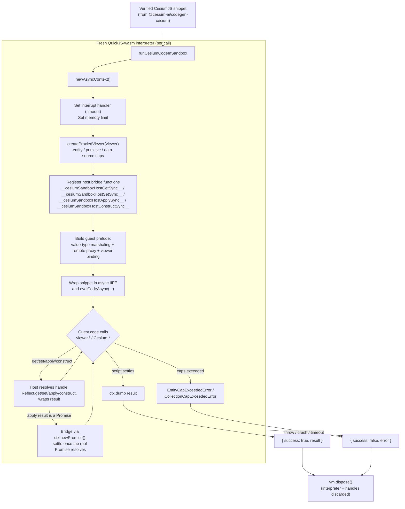

# @cesium-ai/codegen-sandbox

Browser-executed QuickJS-wasm sandbox that runs already-verified CesiumJS code directly against a
live `Viewer`'s real API surface, plus the client-side execution guardrails around it.

This is the **execution** half of the "Code Mode" pipeline whose **generation and static
verification** half lives in `@cesium-ai/codegen-cesium`:

1. `@cesium-ai/codegen-cesium` (server-side, Node-safe): turns a model `intent` into a CesiumJS
   snippet and statically verifies it (AST parse only — never executes).
2. `@cesium-ai/codegen-sandbox` (this package, frontend-only): actually **executes** an
   already-verified snippet, isolated in a QuickJS-wasm interpreter bound to the live `Viewer`.

The two are deliberately separate packages, not layers of one: this package depends on `cesium`
(WebGL/DOM) and `quickjs-emscripten` (browser wasm), so it must never be imported by server-side
code, while `@cesium-ai/codegen-cesium` is safe for the Node backend precisely because it carries
none of that.

## What is QuickJS?

[QuickJS](https://bellard.org/quickjs/) is a small, embeddable JavaScript engine. This package
uses [`quickjs-emscripten`](https://github.com/justjs/quickjs-emscripten), which compiles QuickJS
to WebAssembly so it can run entirely inside the browser, isolated from the page's own JS engine
(V8/SpiderMonkey/JavaScriptCore).

That isolation is the whole reason it's used here: the untrusted, LLM-generated CesiumJS snippet
runs inside this separate WASM VM ("the guest") instead of the app's real JS context ("the host").
The guest has:

- **No shared memory with the host.** It runs in its own WASM linear memory, so it can never hold
  a live reference to the real `Viewer`/`Entity`/etc. — every value crossing the boundary is either
  plain JSON data or an opaque handle id (see `SandboxHandles` in
  [Bindings Modules](#bindings-modules-srcbindings)).
- **No access to the DOM, `fetch`, `window`, or network-capable static Cesium APIs** unless
  explicitly bound by the host. `Cesium.Resource`, for example, is not in the static export
  allowlist; other network-backed factories are reached only through handles already exposed via
  the static export allowlist, and any `Promise` they return is bridged generically (see below).
- **Enforceable resource limits.** `ctx.runtime.setInterruptHandler(...)` and
  `ctx.runtime.setMemoryLimit(...)` bound how long a script may run and how much memory it may
  use — an infinite loop or runaway allocation in generated code is caught and turned into a
  structured `{ success: false, error }`, instead of hanging or crashing the tab.

In short: QuickJS-wasm gives per-call, disposable sandboxes that let this package run
untrusted/model-generated code with real crash/hang isolation, at the cost of the marshaling layer
(`src/bindings/`) needed to bridge guest calls back to the real Cesium `Viewer`.

## How It Works



Key points:

- **One interpreter per call.** `newAsyncContext()` creates a fresh QuickJS-wasm VM for every
  invocation and it's always disposed in a `finally` block — no state, bindings, or object handles
  leak between runs.
- **The guest never sees real Cesium objects.** `SandboxHandles` marshals class instances as
  opaque handle ids and value types (e.g. `Cartesian3`, `Color`) transparently; all `viewer.*` /
  `Cesium.*` calls cross the boundary through the generic `__cesiumSandboxHostGetSync__` /
  `__cesiumSandboxHostApplySync__` bridge. Any call that returns a host-side `Promise` (real
  Cesium factories included) is bridged back as a genuine QuickJS promise via `ctx.newPromise()`
  — the same generic `apply` path handles both synchronous and Promise-returning calls, so no
  separate async allowlist or dedicated Asyncify bridge is needed anymore.
- **Guardrails are enforced host-side, transparently.** `createProxiedViewer` wraps the real
  `Viewer` so calls like `entities.add(...)`, `scene.primitives.add(...)`, and
  `dataSources.add(...)` are checked against caps before being forwarded — the generated code
  itself needs no changes to respect them.
- **Failure is always structured, never thrown.** Timeouts, memory-limit hits, cap violations,
  unsupported guest callbacks, rejected Promise-returning APIs, and other runtime errors all
  resolve to `{ success: false, error }` rather than an unhandled rejection or crashed tab.

## How Cesium Values Are Resolved

The guest starts with a local `Cesium` object and then wraps it in a fallback `Proxy`. Resolution
depends on which kind of Cesium value generated code requests:

| Kind                                            | When it is used                                                                                                                                                                                     | How it is resolved                                                                                                                                                                                                                                               |
| ----------------------------------------------- | --------------------------------------------------------------------------------------------------------------------------------------------------------------------------------------------------- | ---------------------------------------------------------------------------------------------------------------------------------------------------------------------------------------------------------------------------------------------------------------- |
| Guest-local value type, enum, or constant table | Pure math/data APIs such as `Cesium.Cartesian3`, `Cesium.Color`, and `Cesium.Math`, plus automatically discovered immutable primitive records such as `Cesium.ArcType` and `Cesium.VerticalOrigin`. | The property already exists on the guest's local `Cesium` object, so the fallback proxy returns it directly. Construction and static methods run entirely inside QuickJS with no host bridge call.                                                               |
| Static Cesium export                            | Any installed top-level Cesium export that is not in `blockedStaticExports`, such as `Cesium.defined`, `Cesium.Rectangle`, or `Cesium.Cesium3DTileset`.                                             | The property is absent from the local object, so `guest-prelude-static-fallback.ts` reads it from the denylist-filtered host namespace through `__cesiumSandboxHostGetSync__`. The returned function, class, or object is represented by an opaque remote proxy. |
| Dynamic Promise result                          | Any non-blocked host function or method whose actual return value is Promise-like, such as `Cesium.Cesium3DTileset.fromUrl(...)`, `viewer.flyTo(...)`, or `viewer.dataSources.add(...)`.            | It uses the normal `__cesiumSandboxHostApplySync__` call path. `host-bridge.ts` detects the returned thenable at runtime and creates a genuine QuickJS promise with `ctx.newPromise()`. There is no separate async allowlist or async dispatch function.         |
| Host object instance                            | A real `Viewer`, entity, tileset, provider, collection, function, or other non-JSON host value.                                                                                                     | `SandboxHandles` keeps the real value host-side and gives the guest an opaque handle-backed remote proxy. Reads, writes, calls, and construction on that proxy use the four bridge functions below.                                                              |

Value types stay guest-local while calculations are local. If one crosses into a real host call,
for example `viewer.entities.add({ position: Cesium.Cartesian3.fromDegrees(...) })`, the guest tags
it as JSON-safe value-type data. `SandboxHandles.unwrap` reconstructs the corresponding real
Cesium instance before invoking the host API. A value type returned from the host is tagged in the
opposite direction and becomes guest-usable data instead of an opaque handle.

The reviewed `valueTypes` map in `cesium-capabilities.json` is the single source of truth for these
types. Each key is a Cesium constructor and its ordered field list is both the serialized shape and
constructor argument order:

```json
"valueTypes": {
  "Cartesian3": ["x", "y", "z"],
  "Color": ["red", "green", "blue", "alpha"]
}
```

`npm run generate:value-type-registry -w @cesium-ai/codegen-sandbox` generates
`bindings/generated/value-type-registry.ts` from that map. Host tagging/revival and guest tagging
iterate the generated definitions, so adding a reviewed positional value type does not require new
manual branches in `sandbox-handles.ts` or `guest-prelude-host-bridge.ts`. The Cesium core bundle
generator also derives its imports from the same map. Non-positional or identity-bearing classes
such as `Cesium3DTileStyle` use the generic static-export bridge and remain opaque host handles.

The list is intentionally reviewed rather than inferred from every Cesium class. A candidate must
be pure data, safe to run inside QuickJS, and fully reconstructable from the listed public fields.
DOM, WebGL, network, worker, lifecycle, and identity-bearing classes must use opaque host handles.

Enums and constant tables are generated automatically from the installed Cesium namespace. The
generator copies every frozen top-level record whose keys are uppercase identifiers and whose
values are JSON-safe primitives. This includes public enums such as `ArcType`, `ClockRange`, and
`ScreenSpaceEventType`, as well as immutable tables such as `TimeConstants`. Cesium enums that
also expose helper functions do not satisfy that data-only rule; they remain automatically
available through the static host fallback rather than being copied into the guest. Value-type
constructors cannot use this inference safely because runtime reflection does not reveal their
security characteristics or authoritative constructor-field order, so `valueTypes` stays reviewed.

The static export denylist applies only to top-level fallback lookups. Every nested host property
still passes through `assertSandboxPropertyAllowed`, which rejects underscore-prefixed members and
the names in `blockedProperties`.

`dynamicPromiseRuntimeCoverage` and `dynamicPromiseRuntimeGaps` in `cesium-capabilities.json` are
compatibility-report and test metadata. They record which Promise-returning paths have been
exercised or are known gaps, but they do not select which calls use the Promise bridge. Runtime
selection depends only on whether `__cesiumSandboxHostApplySync__` receives a Promise-like result.

Typical resolution paths are:

```text
Cesium.Cartesian3.fromDegrees(...)
  -> guest-local Cesium.Cartesian3
  -> no host bridge until the result is passed to a host API

Cesium.defined(value)
  -> __cesiumSandboxHostGetSync__(staticCesiumHandle, "defined")
  -> __cesiumSandboxHostApplySync__(definedHandle, args)
  -> synchronous JSON result

await Cesium.Cesium3DTileset.fromUrl(url)
  -> __cesiumSandboxHostGetSync__(staticCesiumHandle, "Cesium3DTileset")
  -> __cesiumSandboxHostGetSync__(classHandle, "fromUrl")
  -> __cesiumSandboxHostApplySync__(methodHandle, args)
  -> host thenable detected -> QuickJS promise -> opaque tileset handle

new Cesium.PinBuilder()
  -> __cesiumSandboxHostGetSync__(staticCesiumHandle, "PinBuilder")
  -> __cesiumSandboxHostConstructSync__(classHandle, args)
  -> opaque PinBuilder instance handle
```

## Host Bridge Functions

The guest never talks to the real `Viewer`/`Cesium` module directly — it only ever calls one of
four functions registered on the QuickJS global object before the script runs
(`registerHostBindings` in `bindings/host-bridge.ts`). These are this package's own globals (the
`__cesiumSandboxHost*Sync__` names below), not anything QuickJS itself defines — QuickJS only
provides the mechanism (`ctx.newFunction`) for exposing an arbitrary host function to the guest
under a name of this package's choosing. Every `viewer.*` / `Cesium.*` property read, assignment,
call, or `new` in generated code is rewritten by the guest-side `__remoteProxy__` (see
`guest-prelude-host-bridge.ts`) into one of these:

| Function                                                  | Direction                                 | What it does                                                                                                                                                                                                                              | Triggered by (guest side)                                                                                                               |
| --------------------------------------------------------- | ----------------------------------------- | ----------------------------------------------------------------------------------------------------------------------------------------------------------------------------------------------------------------------------------------- | --------------------------------------------------------------------------------------------------------------------------------------- |
| `__cesiumSandboxHostGetSync__(handleId, prop)`            | guest → host, sync                        | Checks `assertSandboxPropertyAllowed(prop)`, reads the property with `Reflect.get`, preserves method `this` binding, and wraps the result as plain data, tagged value-type data, or a new opaque handle.                                  | Any property read on a remote proxy, including static fallback lookup: `Cesium.defined`, `viewer.entities`, or `entity.position`.       |
| `__cesiumSandboxHostSetSync__(handleId, prop, valueJson)` | guest → host, sync                        | Checks the property denylist, unwraps JSON data and opaque handles, revives tagged value types into real Cesium instances, and writes with `Reflect.set`.                                                                                 | Any remote property assignment: `tileset.style = ...`, `viewer.clock.shouldAnimate = true`, or `entity.polygon.material = ...`.         |
| `__cesiumSandboxHostApplySync__(handleId, argsJson)`      | guest → host, sync or **Promise-bridged** | Resolves a function handle, unwraps its arguments, and invokes it. A synchronous result is wrapped immediately. A Promise-like result increments pending host work and returns a genuine QuickJS promise created with `ctx.newPromise()`. | Calling any remote function or method: `Cesium.defined(value)`, `viewer.camera.flyTo(...)`, or `await Cesium.Model.fromGltfAsync(...)`. |
| `__cesiumSandboxHostConstructSync__(handleId, argsJson)`  | guest → host, sync                        | Resolves a class/function handle, unwraps constructor arguments, constructs it with `Reflect.construct`, and wraps the resulting instance as data or an opaque handle.                                                                    | `new` against a remote class, such as `new Cesium.PinBuilder()` or `new Cesium.WebMapServiceImageryProvider(...)`.                      |

Get, set, construct, and synchronous apply return a JSON-encoded envelope immediately:
`{ ok: true, value }` or `{ ok: false, error }`. Promise-returning apply returns a QuickJS promise
that eventually resolves to the same JSON envelope. In either case, a false envelope becomes a
normal thrown `Error` inside the guest, which propagates out of the wrapped async IIFE and is caught
by `runCesiumCodeInSandbox`'s own `try`/`catch`. Guardrail violations, blocked properties, rejected
host Promises, and unknown handle ids therefore surface as `{ success: false, error }`, not as
unhandled rejections.

## Execution Guards

Two independent layers of guards protect the host: interpreter-level resource limits (generic,
apply to any script regardless of what it calls) and Cesium-domain guards (specific to what a
script is allowed to do with the `Viewer`).

**Interpreter-level (QuickJS runtime) guards** — set up once per call in
`runCesiumCodeInSandbox`:

| Guard             | Mechanism                                                            | Default                               | What happens when it trips                                                                             |
| ----------------- | -------------------------------------------------------------------- | ------------------------------------- | ------------------------------------------------------------------------------------------------------ |
| Execution timeout | QuickJS interrupt handler (`shouldInterruptAfterDeadline`)           | 5000 ms (`DEFAULT_TIMEOUT_MS`)        | Guest loops and long-running scripts are interrupted and resolve `{ success: false, error }`.          |
| Memory limit      | `ctx.runtime.setMemoryLimit(...)`                                    | 64 MiB (`DEFAULT_MEMORY_LIMIT_BYTES`) | A runaway allocation aborts the script the same way QuickJS's own out-of-memory handling would.        |
| Fresh VM per call | `newAsyncContext()` created and `vm.dispose()`d in a `finally` block | n/a                                   | No state, bindings, or object handles ever leak between separate `runCesiumCodeInSandbox` invocations. |
| Handle table cap  | `MAX_HANDLES` in `SandboxHandles`                                    | 500                                   | Bounds how many live object handles a single run may accumulate.                                       |

**Cesium-domain guards** — enforced host-side, transparently, inside `createProxiedViewer` and
`execution-guards.ts`, so generated code never has to be aware of them:

| Guard                     | Enforced on                                                                                                                                                                              | Default                                                                                                                                                                                                                                                                                         | Failure mode                                                                                                                                                                |
| ------------------------- | ---------------------------------------------------------------------------------------------------------------------------------------------------------------------------------------- | ----------------------------------------------------------------------------------------------------------------------------------------------------------------------------------------------------------------------------------------------------------------------------------------------- | --------------------------------------------------------------------------------------------------------------------------------------------------------------------------- |
| Entity cap                | `viewer.entities.add(...)`                                                                                                                                                               | 200 (`DEFAULT_MAX_ITEMS_PER_COLLECTION`); overridable via `SceneCollectionCapOptions.maxItemsPerCollection`                                                                                                                                                                                     | Throws `EntityCapExceededError` before forwarding to the real `add`.                                                                                                        |
| Collection cap            | `scene.primitives`, `scene.groundPrimitives`, `scene.postProcessStages`, `imageryLayers`, and `dataSources` additions                                                                    | shares `maxItemsPerCollection` as the per-collection ceiling                                                                                                                                                                                                                                    | Throws `CollectionCapExceededError`.                                                                                                                                        |
| Data-source entity cap    | Entity count inside an item passed to `viewer.dataSources.add(...)`                                                                                                                      | shares `maxItemsPerCollection` as the per-collection ceiling                                                                                                                                                                                                                                    | Rejects one oversized data source before forwarding it.                                                                                                                     |
| Blocked property denylist | Every `__cesiumSandboxHostGetSync__` / `__cesiumSandboxHostSetSync__` / `__cesiumSandboxHostApplySync__` / `__cesiumSandboxHostConstructSync__` call, via `assertSandboxPropertyAllowed` | blocks any `_`-prefixed member, plus an explicit list (`destroy`, `document`, `window`, `canvas`, `container`, `contentWindow`, `contentDocument`, `ownerDocument`, `parentElement`, `defaultView`, `prototype`, `constructor`, `__proto__`, `caller`, `arguments`, `removeAll`, `isDestroyed`) | Throws _before_ the real property is ever read, written, or called — blocks DOM/lifecycle escape and bulk-removal footguns, on every handle, not just the initial `viewer`. |

Both layers fail the same way from the caller's perspective — a structured
`{ success: false, error }` — so callers never need to distinguish "hit a resource limit" from "hit
a domain guardrail" from "the generated code itself threw."

## Bindings Modules (`src/bindings/`)

**The generated snippet itself is never rewritten or transformed** — it runs verbatim (just
wrapped in an async IIFE). What `src/bindings/` does instead is fake a working `viewer`/`Cesium`
API _inside_ the guest, which otherwise has no real access to either: the guest (QuickJS-wasm) and
the host (this app's real Cesium `Viewer`) are two separate JS runtimes with no shared memory, so
`viewer`/`Cesium` can't simply exist in guest scope as the real objects.

`src/bindings/` builds that illusion in two parts:

- A **prelude** — guest-side JS injected before the snippet that defines `viewer`, `Cesium`, and
  helpers like `__remoteProxy__`/`__marshalArg__`, so property reads, writes, calls, and `new`
  look like ordinary JS to the generated code.
- A **marshaling layer** deciding what's allowed to actually cross the VM boundary underneath that
  illusion: opaque handles standing in for class instances, plain JSON for value types, and a
  reimplemented subset of pure Cesium math that runs entirely guest-side and never crosses at all.
  Everything else silently becomes a JSON round trip through the host bridge functions, checked
  against the caps and denylisted properties/exports documented below.

Without this, isolated guest code would have no way to reach — or even see — a real, mutable
`Viewer` at all.

Each module owns one narrow slice of that design. None of them maintain an exhaustive manifest of
Cesium's API surface — they lean on generic proxies and dynamic dispatch so the bound surface
tracks real CesiumJS automatically as it evolves.

| Module                               | Why it's needed                                                                                                                                                                                                                                                                                                                          |
| ------------------------------------ | ---------------------------------------------------------------------------------------------------------------------------------------------------------------------------------------------------------------------------------------------------------------------------------------------------------------------------------------- |
| `cesium-capabilities.json`           | Single reviewed policy manifest for the Cesium version, blocked static exports, guest value types, blocked properties, dynamic Promise coverage, and known unsupported capabilities. Runtime bindings and upgrade tooling both consume it.                                                                                               |
| `capabilities-registry.ts`           | Typed runtime view of `cesium-capabilities.json`; binding modules derive their sets and names from this instead of maintaining duplicate lists.                                                                                                                                                                                          |
| `sandbox-handles.ts`                 | Defines `SandboxHandles`, the core JSON marshaling boundary: tags real class instances (`Entity`, `Viewer`, ...) as opaque handle ids, transparently passes through JSON-safe value types (`Cartesian3`, `Color`, ...), and rejects unrecognized handle ids the guest might try to forge.                                                |
| `guarded-viewer-proxy.ts`            | Defines `createProxiedViewer` and the shared `createGuardedProxy` factory: wraps the real `Viewer` (and nested `camera`/`scene`/`entities`/`dataSources`) so cap checks and the blocked-property allowlist apply, while every other real Cesium API call still passes through transparently.                                             |
| `guest-prelude-host-bridge.ts`       | Builds the guest-side `__remoteProxy__`: the recursive `Proxy` that turns any handle id into something guest code can read/write/call/construct, dispatching each operation to the matching `__host*Sync__` function above.                                                                                                              |
| `guest-prelude-static-fallback.ts`   | Upgrades the guest's `Cesium` namespace object into a `Proxy` that falls back to all non-blocked static Cesium exports through the same remote-proxy bridge. Denylisted exports such as `Resource` remain unavailable.                                                                                                                   |
| `guest-prelude-value-types.ts`       | Reimplements the handful of most commonly generated, pure/side-effect-free CesiumJS value types (`Cartesian2`/`Cartesian3`, `Color`, `Cartographic`, `HeadingPitchRange`/`HeadingPitchRoll`, `NearFarScalar`) directly in guest JS, so common math (`Cartesian3.fromDegrees`, `Color.fromCssColorString`) never needs a host round trip. |
| `generated/value-type-registry.ts`   | Generated constructor and ordered-field metadata derived from `cesium-capabilities.json`. Both host and guest marshaling consume it generically; regenerate it with `npm run generate:value-type-registry -w @cesium-ai/codegen-sandbox`.                                                                                                |
| `function-source.ts`                 | Provides `extractFunctionBody`, letting the guest-prelude "body" functions above be written as real, type-checked TypeScript functions with their source text extracted for injection into the guest script — instead of hand-written, unchecked template-literal strings.                                                               |
| `execution-guards.ts` (package root) | Client-side defense-in-depth caps (`assertEntityCapNotExceeded`, `assertCollectionCapNotExceeded`) — independent of both the sandbox's own process isolation and the backend's static verification of the generated snippet.                                                                                                             |

## Usage

```ts
import { runCesiumCodeInSandbox } from "@cesium-ai/codegen-sandbox";

const result = await runCesiumCodeInSandbox({ code: verifiedSnippet, viewer });
```

## Upgrading CesiumJS

The package pins Cesium to the version recorded as `reviewedCesiumVersion` in
`src/bindings/cesium-capabilities.json`. When upgrading:

1. Install the new exact Cesium version.
2. Run `npm run validate:cesium-compat -w @cesium-ai/codegen-sandbox`.
3. Review `CESIUM_COMPATIBILITY.md`, especially new top-level exports and new or removed
   Promise-returning APIs. Under the denylist policy, new top-level exports become available by
   default after the reviewed version is updated.
4. Add new network, DOM, lifecycle, worker, global-state, or otherwise unsafe top-level exports to
   `blockedStaticExports` before updating the reviewed version.
5. Update `reviewedCesiumVersion` only after that review.
6. Run the package tests and browser domain tests.

The validator fails when the installed and reviewed versions differ, when a blocked static export
or guest value type disappears, or when a dynamic Promise runtime path no longer exists. The
generated report inventories the static denylist and Promise-returning declaration paths.

Set `maxItemsPerCollection` to override the ceiling applied independently to each guarded
collection for one run:

```ts
const result = await runCesiumCodeInSandbox({
  code: verifiedSnippet,
  viewer,
  maxItemsPerCollection: 50,
});
```

Guest-native `Number`, `String`, and `Boolean` constructor references are supported as Cesium
constructor arguments. Other guest functions are rejected explicitly: callbacks cannot safely
outlive the disposable guest VM. Any host method that returns a Promise — not just a fixed
allowlist of factories — is awaited transparently across the host boundary via the generic
`apply` bridge.

Callers that need to bound how often the sandbox itself is invoked (e.g. this app's `ChatPanel`)
should pair this with their own call rate limiter — this package no longer ships one, since it has
no dependency on `cesium`/`quickjs-emscripten` and was never invoked internally by
`runCesiumCodeInSandbox`. See `frontend/src/utils/sandbox-call-rate-limiter.ts` for this app's copy.

### Logging

Logging is entirely opt-in and OFF by default — `runCesiumCodeInSandbox` never writes to the
console unless a `logger` is supplied. Pass one via `createSandboxLogger`/`createConsoleLogger`,
or supply your own object matching the `SandboxLogger` interface (`debug`/`info`/`warn`/`error`)
to route sandbox output through an existing app logger:

```ts
import { createSandboxLogger, runCesiumCodeInSandbox } from "@cesium-ai/codegen-sandbox";

const logger = createSandboxLogger({ enabled: import.meta.env.DEV, level: "debug" });

const result = await runCesiumCodeInSandbox({ code: verifiedSnippet, viewer, logger });
```

`logger.debug` reports each sandbox run's start/completion plus every individual host-bridge call
(property get/set, function apply/construct) crossing the guest/host boundary — useful for
diagnosing "sandbox reports success but nothing visibly changed" bugs.
`logger.warn` reports blocked property access and other per-call failures; `logger.error` reports
a run's overall failure. `createSandboxLogger({ enabled: false })` (or omitting `logger` entirely)
returns the no-op `noopLogger`; `createConsoleLogger(level)` builds a `console`-backed logger
directly with a given minimum level (`"debug" | "info" | "warn" | "error" | "silent"`).

## Trade-offs

Running generated code directly (`new Function(...)`) shares the page's own JS heap and call
stack, so one bad snippet — an infinite loop, a runaway allocation, a `_`-prefixed DOM escape —
can hang or crash the tab. The sandbox trades WASM overhead plus the ongoing cost of keeping
`src/bindings/` in sync as Cesium evolves for real crash/hang isolation instead: interpreter-level
limits (timeout, memory) and Cesium-domain guardrails (entity/collection caps, blocked properties)
both fail the same structured way, and a fresh interpreter per call means no state ever leaks
between runs. For anything executing untrusted or model-generated code in production, that
trade-off favors keeping the sandbox; direct execution only makes sense if the generated code is
already fully trusted and pre-verified before it ever reaches the browser.

## Exports

| Export                                                                                                                  | Description                                                                                                                                          |
| ----------------------------------------------------------------------------------------------------------------------- | ---------------------------------------------------------------------------------------------------------------------------------------------------- |
| `runCesiumCodeInSandbox`                                                                                                | Runs untrusted/verified code in a fresh QuickJS-wasm interpreter bound to a live `Viewer`.                                                           |
| `SandboxHandles`                                                                                                        | Host/guest JSON marshaling: opaque handles for class instances, transparent tagging for value types.                                                 |
| `createProxiedViewer`                                                                                                   | Wraps a live `Viewer` with collection caps and a guard policy that blocks lifecycle, DOM, private, and bulk-removal properties.                      |
| `buildCesiumHostBridgeGuestPrelude`, `buildCesiumValueTypeGuestPrelude`                                                 | The generic remote-proxy bridge and guest-side prelude generators — see `src/bindings/`.                                                             |
| `assertEntityCapNotExceeded`, `DEFAULT_MAX_ITEMS_PER_COLLECTION`, `SceneCollectionCapOptions`, `EntityCapExceededError` | Configures the ceiling applied independently to guarded scene collections. `maxItemsPerCollection` falls back to `DEFAULT_MAX_ITEMS_PER_COLLECTION`. |
| `createSandboxLogger`, `createConsoleLogger`, `noopLogger`, `SandboxLogger`, `SandboxLoggerOptions`, `LogLevel`         | Configurable logging for sandbox runs and host-bridge calls, off by default. See [Logging](#logging).                                                |

## Why this isn't part of `@cesium-ai/tools-cesium` or `@cesium-ai/codegen-cesium`

- `@cesium-ai/tools-cesium` is scoped to schema-only viewer tools (`flyTo`, ...) whose arguments are
  bounded, typed data a client validates and hands straight to one `Viewer` method call — not
  arbitrary generated code.
- `@cesium-ai/codegen-cesium` is scoped to generation + static verification and is explicitly
  documented as "parse-only, never executes generated code" — it must stay safe to import from a
  Node backend. Folding a `cesium` + `quickjs-emscripten` execution sandbox into it would drag
  browser/WASM/WebGL dependencies into that server-side bundle and contradict that boundary.

Growing this package means extending the marshaling/proxy/prelude modules listed under
[Bindings Modules](#bindings-modules-srcbindings), not adding new bespoke capability functions —
see each file's own header comment for its part of the binding design, and `cesium-bindings.ts`
for the barrel re-export tying them together.
