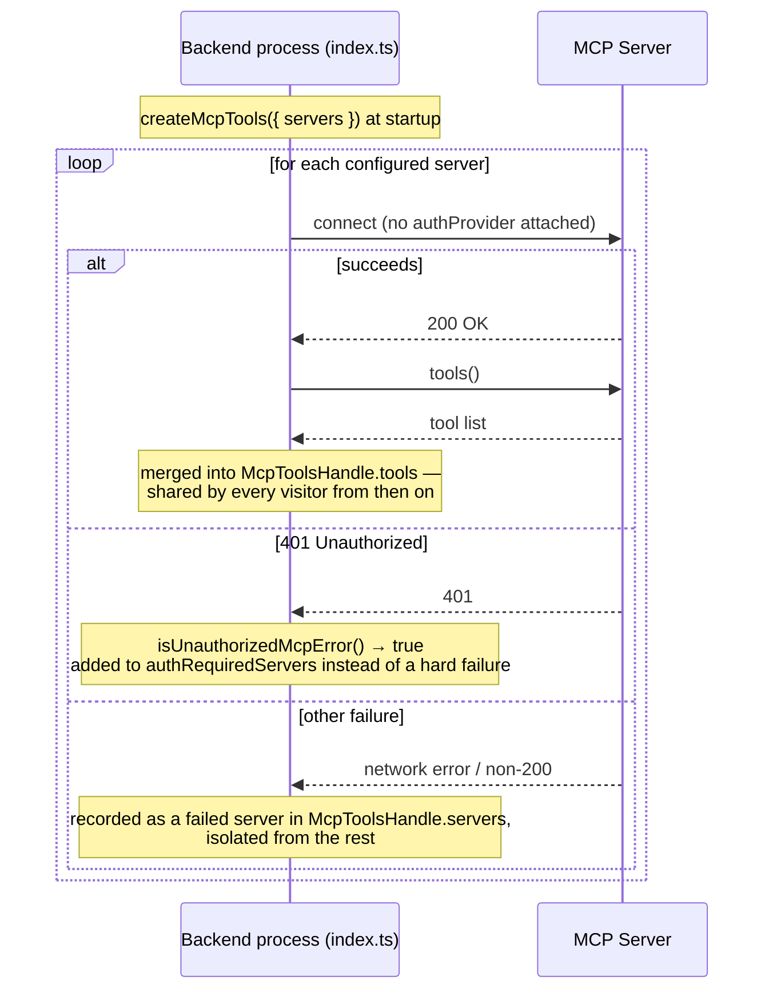
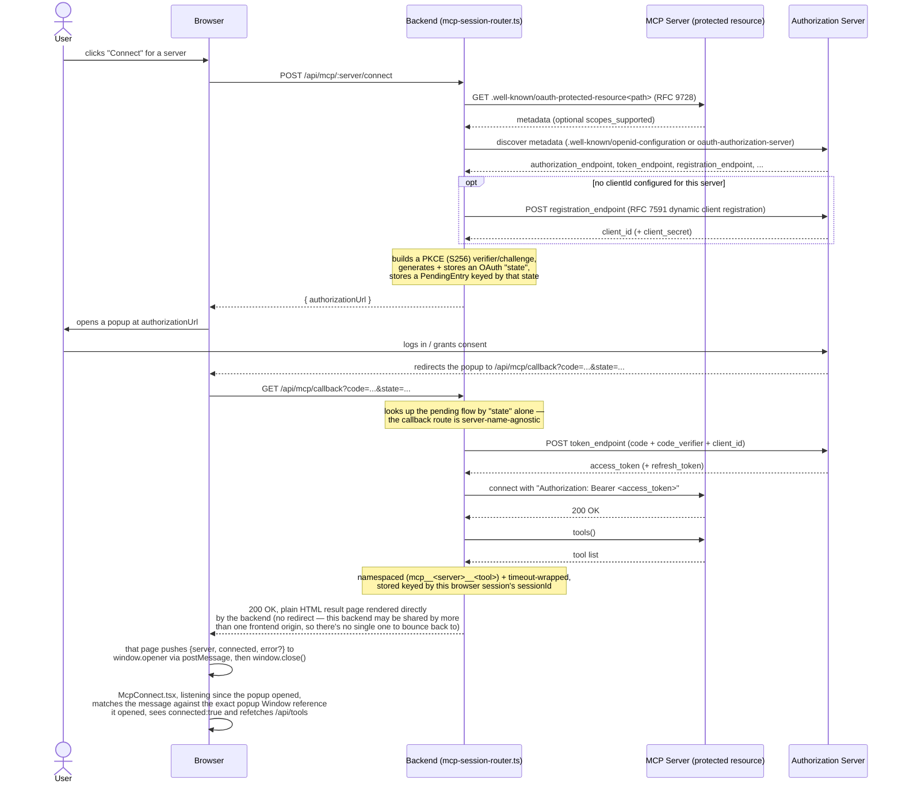
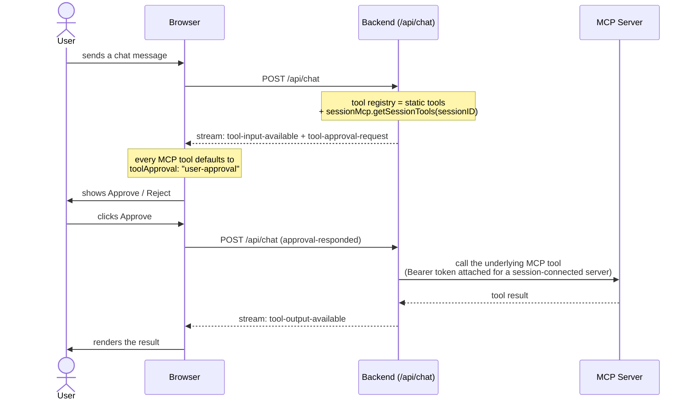

# @cesium-ai/mcp-tools

Server-only [Model Context Protocol](https://modelcontextprotocol.io) (MCP) client bridge for the AI SDK. Connects to one or more MCP servers over SSE or streamable HTTP (stdio — spawning a local executable — is deliberately unsupported, see the Security model table below), namespaces and allowlist-filters their tools, and merges them into a plain AI SDK `ToolSet` — the same shape [`@cesium-ai/tools-schemas`](https://cesiumgs.github.io/cesiumjs-ai-starter-app/packages/tools-schemas/)'s `createCesiumTools()` returns, so a host app composes them the same way:

```ts
import { createMcpTools } from "@cesium-ai/mcp-tools";
import { createCesiumTools } from "@cesium-ai/tools-schemas";

const mcp = await createMcpTools({
  servers: [
    {
      name: "docs",
      transport: { type: "http", url: "https://example.com/mcp" },
      allowedTools: ["search"],
    },
  ],
});

const tools = { ...createCesiumTools(), ...mcp.tools };
// ... run the agent loop with `tools` ...

// on shutdown
await mcp.close();
```

This package has **no dependency on `@cesium-ai/server` or `@cesium-ai/tools-schemas`** and is entirely optional — an app that never configures an MCP server never imports it.

## Why this is a separate package

MCP tools are architecturally different from this repo's other tool groups:

- **They run entirely server-side.** Unlike `flyTo` (streamed to the browser, executed against the live `Viewer`), an MCP tool's `execute()` talks to the MCP server directly from Node and its result is the real, final outcome — never streamed as a client tool call. See the root [README's architecture section](https://github.com/CesiumGS/cesiumjs-ai-starter-app/blob/main/README.md#architecture) and [`docs/architectures/architecture`](https://cesiumgs.github.io/cesiumjs-ai-starter-app/architectures/architecture/) for the split-execution model this follows.
- **The tool registry is third-party, dynamic content.** `flyTo`'s schema is hand-authored and reviewed; an MCP server can add, remove, or reword its tools at any time. That's a materially different trust boundary, so it gets its own package rather than living in `@cesium-ai/tools-schemas` (which is scoped to this repo's own hand-authored viewer tools) or `@cesium-ai/server` (model-/tool-agnostic, and shouldn't gain an MCP SDK dependency just to support an optional feature).

## Security model

MCP tool calls run arbitrary code you don't control, so this package is deliberately conservative by default:

| Risk                                                                                                                                                                                                                                                                                               | Mitigation                                                                                                                                                                                                                                                                                                                                                      |
| -------------------------------------------------------------------------------------------------------------------------------------------------------------------------------------------------------------------------------------------------------------------------------------------------- | --------------------------------------------------------------------------------------------------------------------------------------------------------------------------------------------------------------------------------------------------------------------------------------------------------------------------------------------------------------- |
| **Config is attacker-influenceable** — a server URL controls what code runs.                                                                                                                                                                                                                       | `McpServerConfig[]` is a plain, host-supplied argument, exactly like the LLM API key — it must come from trusted operator config (e.g. an `mcp.config.json` file, see the backend's [`env.ts`](https://github.com/CesiumGS/cesiumjs-ai-starter-app/blob/main/backend/src/utils/env.ts)), **never** from a chat request.                                         |
| **A locally-spawned process is a larger attack surface than a URL.**                                                                                                                                                                                                                               | `stdio` transport (spawning an arbitrary local executable) is deliberately unsupported — `McpTransportConfig` only allows `sse`/`http`, and `McpServerConfigsSchema` rejects any other `type` at parse time. Only network transports this app merely calls are supported.                                                                                       |
| **[Tool poisoning](https://owasp.org/www-community/attacks/MCP_Tool_Poisoning) / silent "rug pull"** — an MCP server can change a tool's `name`/`description` (which the model reads to decide what to call) at any time, including after your app has been reviewed against the original wording. | Every discovered tool's name + description is logged via the `logger` option (`createConsoleMcpToolsLogger("info")` or higher) at connect time — review these logs whenever an MCP server updates. Prefer `allowedTools` (an explicit per-server allowlist) over accepting a server's full, unreviewed tool catalogue.                                          |
| **Name collisions across servers.**                                                                                                                                                                                                                                                                | Every tool is namespaced `mcp__<serverName>__<toolName>` before merging, so two servers can never silently shadow each other's tools.                                                                                                                                                                                                                           |
| **A stalled or malicious server hangs the agent loop.**                                                                                                                                                                                                                                            | Every tool call is wrapped with a timeout (`timeoutMs`, default {@link DEFAULT_MCP_TOOL_TIMEOUT_MS} = 30s) that rejects the call — it can't block the request indefinitely.                                                                                                                                                                                     |
| **One bad server takes the whole app down.**                                                                                                                                                                                                                                                       | Each server connects independently — a connection failure is recorded in `McpToolsHandle.servers` and logged, but never thrown; the other servers (and the rest of the app) start normally. Check `servers` at startup / in `/health`.                                                                                                                          |
| **Credentials/URLs leaking to the browser.**                                                                                                                                                                                                                                                       | `McpServerConfig` (which may carry auth headers) is consumed entirely server-side — never serialize it into any response sent to the client.                                                                                                                                                                                                                    |
| **Per-user OAuth credentials must not leak across users or persist unexpectedly.**                                                                                                                                                                                                                 | Session OAuth creates one in-memory provider per browser session. Tokens never reach the browser or disk and are discarded when the connection/session is closed or the process restarts.                                                                                                                                                                       |
| **A model calling an MCP tool without a human in the loop.**                                                                                                                                                                                                                                       | This package doesn't gate approval itself (that's a `streamText`/`toolApproval` concern — see `@cesium-ai/server`), but the host app should default every MCP tool to `"user-approval"` (this repo's `backend/src/app.ts` does exactly that for every tool `createMcpTools` returns).                                                                           |
| **A rendered MCP App widget calling tools/reading resources without a human in the loop.**                                                                                                                                                                                                         | Every widget-initiated `tools/call` bridge request requires an explicit inline Approve/Reject decision in the frontend BEFORE the backend is ever called (see `McpAppWidget`); the backend independently re-validates the `(server, toolName)` pair against that request's own resolved tool registry, and `resources/read` is restricted to `ui://` URIs only. |

## API

### `createMcpTools(options)`

```ts
interface CreateMcpToolsOptions {
  servers: readonly McpServerConfig[];
  timeoutMs?: number; // default 30_000
  logger?: McpToolsLogger; // default: no-op
}

interface McpToolsHandle {
  tools: ToolSet; // merged, namespaced — spread into your registry. A tool with an MCP Apps widget carries it as its own `mcpApp` property (see "MCP Apps widgets" below)
  servers: readonly McpServerStatus[]; // per-server connect outcome
  authRequiredServers: readonly McpServerConfig[]; // auto-detected as needing per-user OAuth
  getClient(serverName: string): MCPClient | undefined; // live client for one connected server — needed to serve widget bridge requests
  close(): Promise<void>; // closes every underlying MCP client
}
```

`createMcpTools` is `async` (connecting + discovering tools is inherently async), unlike `createCesiumTools()`. Resolve it once at process startup — not per-request — and pass the resulting `tools` into your registry and `close` into your shutdown handler.

### `McpServerConfig`

One array, one schema, no manual "does this need OAuth" flag:

```ts
interface McpServerConfig {
  name: string; // unique; used for namespacing + logs
  transport: {
    type: "sse" | "http";
    url: string;
    headers?: Record<string, string>;
    oauth?: McpOAuthConfig; // optional overrides, only consulted if auth turns out to be needed
  };
  allowedTools?: readonly string[]; // omit = expose every tool the server advertises
}
```

`createMcpTools` attempts every server the same way, with no `authProvider` attached. Per server, the outcome is one of:

- **Connects successfully** — shared by every visitor from then on (tools merged into `McpToolsHandle.tools`).
- **Fails with a 401** — auto-detected as needing per-user authentication (`isUnauthorizedMcpError`, see [`src/connection/mcp-error.ts`](https://github.com/CesiumGS/cesiumjs-ai-starter-app/blob/main/packages/mcp-tools/src/connection/mcp-error.ts)) and collected into `McpToolsHandle.authRequiredServers` instead of a hard failure. Feed that list into `createSessionMcpManager` (below) to offer it through an interactive "Connect" flow.
- **Fails any other way** (network unreachable, bad URL, ...) — recorded as a genuine failure in `McpToolsHandle.servers`, isolated from other servers.

```ts
const mcp = await createMcpTools({ servers });
const sessionMcp =
  mcp.authRequiredServers.length > 0
    ? createSessionMcpManager({
        servers: mcp.authRequiredServers,
        buildRedirectUrl: () => "https://app.example.com/api/mcp/callback",
      })
    : undefined;
```

### Session-scoped OAuth

Interactive OAuth is intentionally handled by a separate function from startup-connected servers, even though both share one config type. Use `createSessionMcpManager` for user-initiated connections (pass it the servers `createMcpTools` reported in `authRequiredServers`, above) so each browser session gets its own identity and in-memory credentials:

```ts
const sessionMcp = createSessionMcpManager({
  servers: [
    {
      name: "ion",
      transport: {
        type: "http",
        url: "http://localhost:3000/mcp/",
        oauth: {
          clientId: "<optional default client_id>",
        },
      },
    },
  ],
  buildRedirectUrl: () => "https://app.example.com/api/mcp/callback",
});
```

`oauth` is an optional override bag with `clientId`, `clientSecret`, `clientName`, and `scope` — omit `clientId` to use RFC 7591 dynamic client registration. Scope is normally discovered from RFC 9728 Protected Resource Metadata; configure `scope` when a provider requires it but omits `scopes_supported` (Cesium ion currently does). `buildRedirectUrl` returns ONE shared URL for every server — an operator registers a single redirect URI per third-party OAuth app, since the callback routes to the right in-flight flow via the OAuth `state` parameter, not the URL. The host owns the session/callback HTTP routes; this repo's implementation is `@cesium-ai/server/mcp`'s [`mcp-session-router.ts`](https://github.com/CesiumGS/cesiumjs-ai-starter-app/blob/main/packages/server/src/routers/mcp-session-router.ts) (one `GET /api/mcp/callback` route, not one per server).

`@ai-sdk/mcp` handles dynamic client registration, PKCE (S256), authorization-code exchange, and refresh. This package keeps provider state in memory only — the host must call `disconnect`, `disconnectSession`, and `closeAll` at the appropriate lifecycle boundaries.

### `McpServerConfigsSchema`

A zod schema validating a full `McpServerConfig[]` list (e.g. `JSON.parse()`'d from an `mcp.config.json` file) — checks transport shape and rejects duplicate server names. Use `McpServerConfigsSchema.parse(value)` (throws on violation) or `.safeParse(value)` (returns `{success, data | error}`); see [`backend/src/utils/mcp-servers-config.ts`](https://github.com/CesiumGS/cesiumjs-ai-starter-app/blob/main/backend/src/utils/mcp-servers-config.ts) for the latter.

### Logging

`noopMcpToolsLogger` (default) and `createConsoleMcpToolsLogger(level)` (`"debug" | "info" | "warn" | "error" | "silent"`, `[mcp-tools]`-prefixed) are exported. `"info"` or louder is recommended in any environment where you want to catch tool-poisoning-style changes — it logs every discovered tool's name and description at connect time.

## MCP Apps widgets

Both `createMcpTools` and `createSessionMcpManager` always advertise `@ai-sdk/mcp`'s `mcpAppClientCapabilities` during connect — the ["MCP Apps"](https://modelcontextprotocol.io) extension that lets a tool declare an interactive `ui://` HTML widget resource (via `_meta.ui.resourceUri`) instead of/alongside a plain JSON result. This package only discovers that metadata (`getMcpAppToolMeta`) and attaches it directly onto the discovered tool as `tool.mcpApp` (see `McpTool`) — no separate map to look up alongside the tool registry — plus a way to reach the underlying live `MCPClient` (`getClient` / `getSessionClient`). It does **not** fetch resources or call tools on a widget's behalf. That's the host's job:

- `@cesium-ai/server/mcp`'s [`mcp-app-router.ts`](https://github.com/CesiumGS/cesiumjs-ai-starter-app/blob/main/packages/server/src/routers/mcp-app-router.ts) exposes bounded `GET /api/mcp-app/resource` and `POST /api/mcp-app/tool-call` routes. It returns raw `MCPClient.readResource` results expected by `AppRenderer`, validates tool calls against the request's resolved tool set, and applies the configured MCP timeout to both operations.
- [`packages/chat-element/src/components/McpAppWidget.tsx`](https://github.com/CesiumGS/cesiumjs-ai-starter-app/blob/main/packages/chat-element/src/components/McpAppWidget.tsx) uses `@mcp-ui/client`'s `AppRenderer`, which implements the MCP Apps JSON-RPC/postMessage protocol and isolates widget HTML through a host-served double-iframe sandbox proxy. This repo serves that proxy from [`frontend/public/sandbox_proxy.html`](https://github.com/CesiumGS/cesiumjs-ai-starter-app/blob/main/frontend/public/sandbox_proxy.html); another host can pass its URL through `AiChatPanel`'s `mcpAppSandboxUrl` prop. Widget-initiated tool calls remain approval-gated.

## Request flows

Three flows this package participates in. All are simplified — `@ai-sdk/mcp`'s own `auth()` may perform additional metadata-discovery round trips not shown here.

### Startup: connecting operator-configured servers

Every server is attempted the same way, with no `authProvider` attached — a protected server's plain 401 is what routes it to `authRequiredServers` instead of a hard failure:



### Session-scoped interactive OAuth connect

Triggered by a user clicking "Connect" for a server `createMcpTools` reported in `authRequiredServers`. Routes shown are `@cesium-ai/server/mcp`'s own [`mcp-session-router.ts`](https://github.com/CesiumGS/cesiumjs-ai-starter-app/blob/main/packages/server/src/routers/mcp-session-router.ts):



### Calling a connected MCP tool during chat

Applies equally to an operator-configured server's tool and a session-connected one — the only difference is where `getSessionTools` merges its tools into the request's tool registry:



## Limitations / follow-ups

This package only calls the MCP client's `tools()` method — the one capability this app's `streamText` agent loop can consume. A few other things `@ai-sdk/mcp`'s client exposes are deliberately **not** wired up:

- **Elicitation** (`client.onElicitationRequest(...)`) — a server can ask the client to gather more input mid tool-call. No handler is registered, so a bridged tool that triggers elicitation fails rather than surfacing a UI prompt; this app's MCP calls run headless, server-side, with no live "ask the user and wait" channel.
- **Resources / Prompts** (`listResources`, `readResource`, `experimental_listPrompts`, `experimental_getPrompt`) — not fetched at all. A server whose real value is resources/prompts rather than tools connects successfully but contributes zero tools (`toolNames: []` in `McpToolsHandle.servers`).
- Per-tool-call timeout wraps `execute()` in a `Promise.race`; it can't cancel work already in flight on the MCP server, only stop waiting for its result.
- Requires Node.js ≥ 22 (`@ai-sdk/mcp`'s own requirement) — higher than this repo's overall `>=20` floor. Only relevant if you configure an MCP server.
- **`SessionMcpManager` keeps all state in memory in the process that created it** — connected `MCPClient` instances, in-flight OAuth state/PKCE verifiers, pending-connection bookkeeping. A live MCP client connection can only exist in one process, so running more than one backend instance requires routing a given browser session consistently to the SAME instance (sticky sessions / instance affinity) — swapping just the session-ID store does not make this multi-instance-safe. There's no idle-connection sweep either; a connected session's `MCPClient` stays open until `disconnect`/`disconnectSession`/`closeAll` is called or the process exits.

This package has no opinion on how the host establishes a `sessionId` — `createSessionMcpManager` just takes one as a plain string, so any session-identity mechanism (an `express-session` cookie, a signed JWT, etc.) works.

## Multi-instance deployment:

`createSessionMcpManager`'s default in-memory repositories are fine for a single backend
instance (this starter app's own default — it does **not** wire in Redis or any external
store). If you do scale to more than one instance, `SessionMcpManagerOptions` has two
purpose-built extension points for this, both optional:

- `connectedDescriptorRepository?: McpConnectionRepository<ConnectedMcpConnectionDescriptor>`
- `pendingDescriptorRepository?: McpConnectionRepository<PendingMcpConnectionDescriptor>`

These are written to ALONGSIDE (never instead of) the real in-memory
`connectedRepository`/`pendingRepository` — they only ever receive a plain-data
_descriptor_ (`{sessionId, serverName, toolNames, connectedAt}` /
`{sessionId, serverName, state, startedAt}`), never the live `MCPClient`/OAuth provider,
which genuinely cannot be serialized (see the doc comments on `ConnectedMcpConnection`/
`PendingMcpConnection` in [`storage/models.ts`](https://github.com/CesiumGS/cesiumjs-ai-starter-app/blob/main/packages/mcp-tools/src/storage/models.ts)). That makes them safe to back with an
external store like Redis (or Azure Table, DynamoDB, etc.) purely for cross-instance
**status observability** — e.g. answering "is this session connected to `ion`, and since
when" from any instance, not just the one that created the connection.

Both are just the standard `McpConnectionRepository<T>` interface
(`findById`/`save`/`delete`/`listAll`, each `T | Promise<T>`) already used by the in-memory
default ([`storage/in-memory-repositories.ts`](https://github.com/CesiumGS/cesiumjs-ai-starter-app/blob/main/packages/mcp-tools/src/storage/in-memory-repositories.ts)) — this package doesn't ship a Redis-specific
implementation itself (no `redis`/`ioredis` dependency), so switching is writing a small
adapter for whichever store you pick, following that same shape:

```ts
import { createSessionMcpManager, type McpConnectionRepository } from "@cesium-ai/mcp-tools";

// Sketch only — swap in your own store's client/calls. Every method just
// needs to round-trip a plain-data descriptor (already JSON-serializable)
// under a key you choose, e.g. `${keyPrefix}${id}`.
function createExternalConnectionRepository<T>(/* your store's client, keyPrefix, etc. */) {
  return {
    findById: async (id) => {
      /* store.get(key) → JSON.parse or undefined */
    },
    save: async (id, entry) => {
      /* store.set(key, JSON.stringify(entry)) */
    },
    delete: async (id) => {
      /* store.delete(key) */
    },
    listAll: async () => {
      /* list/scan all entries under keyPrefix, JSON.parse each */
    },
  } satisfies McpConnectionRepository<T>;
}

const sessionMcp = createSessionMcpManager({
  servers: authRequiredServers,
  buildRedirectUrl: () => new URL("/api/mcp/callback", env.PUBLIC_URL).href,
  connectedDescriptorRepository: createExternalConnectionRepository(/* ... */),
  pendingDescriptorRepository: createExternalConnectionRepository(/* ... */),
  // connectedRepository/pendingRepository (the LIVE ones) stay the built-in in-memory
  // default — they can never be backed by an external store, see above.
});
```

**Important caveat, worth restating**: this only fixes cross-instance _status_ visibility.
It does **not** make a session's actual MCP tool calls reachable from a different instance
than the one holding the live connection — `getSessionTools`/`getSessionClient` still only
ever look at the LOCAL in-memory `connectedRepository`. Making tool calls themselves
multi-instance-safe still requires routing a given browser session consistently to the same
instance (sticky sessions/instance affinity), regardless of whether you've also plugged in
an external store for the descriptor repositories. See `backend/README.md`'s note on this
for how it applies to this repo's own starter backend.
