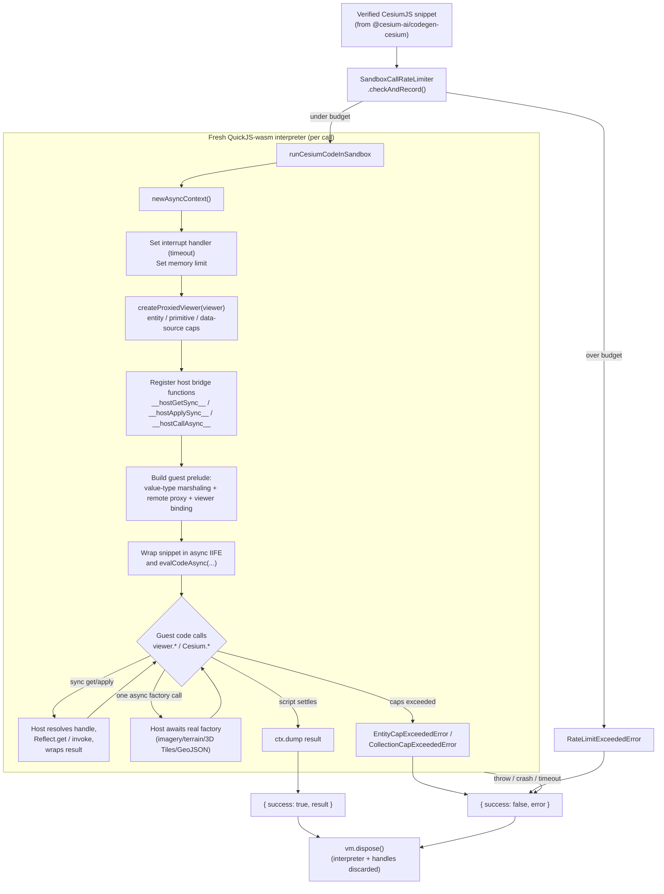
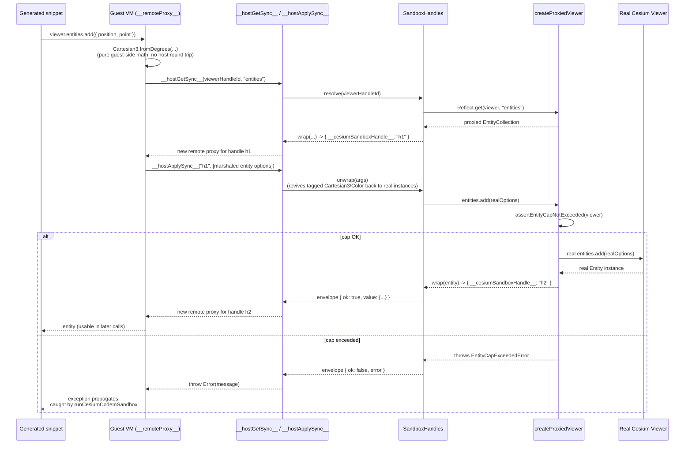

# @cesium-ai/sandbox-cesium

Browser-executed QuickJS-wasm sandbox that runs already-verified CesiumJS code directly against a
live `Viewer`'s real API surface, plus the client-side execution guardrails around it.

This is the **execution** half of the "Code Mode" pipeline whose **generation and static
verification** half lives in `@cesium-ai/codegen-cesium`:

1. `@cesium-ai/codegen-cesium` (server-side, Node-safe): turns a model `intent` into a CesiumJS
   snippet and statically verifies it (AST parse only — never executes).
2. `@cesium-ai/sandbox-cesium` (this package, frontend-only): actually **executes** an
   already-verified snippet, isolated in a QuickJS-wasm interpreter bound to the live `Viewer`.

The two are deliberately separate packages, not layers of one: this package depends on `cesium`
(WebGL/DOM) and `quickjs-emscripten` (browser wasm), so it must never be imported by server-side
code, while `@cesium-ai/codegen-cesium` is safe for the Node backend precisely because it carries
none of that.

## What is QuickJS?

[QuickJS](https://bellard.org/quickjs/) is a small, embeddable JavaScript engine. This package
uses [`quickjs-emscripten`](https://github.com/justjs/quickjs-emscripten), which compiles QuickJS
to WebAssembly so it can run entirely inside the browser, isolated from the page's own JS engine
(V8/SpiderMonkey/JavaScriptCore).

That isolation is the whole reason it's used here: the untrusted, LLM-generated CesiumJS snippet
runs inside this separate WASM VM ("the guest") instead of the app's real JS context ("the host").
The guest has:

- **No shared memory with the host.** It runs in its own WASM linear memory, so it can never hold
  a live reference to the real `Viewer`/`Entity`/etc. — every value crossing the boundary is either
  plain JSON data or an opaque handle id (see `SandboxHandles` and the "Execution Sequence" diagram
  below).
- **No access to the DOM, `fetch`, `window`, or any other browser global** unless explicitly bound
  in by the host — the guest prelude only exposes the small, deliberate `Cesium`/`viewer` surface
  built in `src/bindings/`.
- **Enforceable resource limits.** `ctx.runtime.setInterruptHandler(...)` and
  `ctx.runtime.setMemoryLimit(...)` bound how long a script may run and how much memory it may
  use — an infinite loop or runaway allocation in generated code is caught and turned into a
  structured `{ success: false, error }`, instead of hanging or crashing the tab.

In short: QuickJS-wasm gives per-call, disposable sandboxes that let this package run
untrusted/model-generated code with real crash/hang isolation, at the cost of the marshaling layer
(`src/bindings/`) needed to bridge guest calls back to the real Cesium `Viewer`.

## How It Works



Key points:

- **One interpreter per call.** `newAsyncContext()` creates a fresh QuickJS-wasm VM for every
  invocation and it's always disposed in a `finally` block — no state, bindings, or object handles
  leak between runs.
- **The guest never sees real Cesium objects.** `SandboxHandles` marshals class instances as
  opaque handle ids and value types (e.g. `Cartesian3`, `Color`) transparently; all `viewer.*` /
  `Cesium.*` calls cross the boundary through the generic `__hostGetSync__` / `__hostApplySync__`
  bridge (or, for the small fixed set of network-backed async factories, `__hostCallAsync__` —
  capped at one async call per script to avoid a known Asyncify crash).
- **Guardrails are enforced host-side, transparently.** `createProxiedViewer` wraps the real
  `Viewer` so calls like `entities.add(...)`, `scene.primitives.add(...)`, and
  `dataSources.add(...)` are checked against caps before being forwarded — the generated code
  itself needs no changes to respect them.
- **Failure is always structured, never thrown.** Timeouts (interrupt handler), memory-limit hits,
  cap violations, and any other runtime error all resolve to `{ success: false, error }` rather
  than an unhandled rejection or a crashed tab.

### Execution Sequence: How Generated Code Reaches the Real `Viewer`

The guest VM never holds a live reference to the real `Viewer` — QuickJS runs in separate WASM
linear memory, so every `viewer.*` / `Cesium.*` call in the generated snippet is dispatched by
opaque handle id through the synchronous host bridge. The sequence below walks through a concrete
example, `viewer.entities.add({ position, point })`:



A few things this makes concrete:

- **Pure value-type math never leaves the guest.** `Cartesian3.fromDegrees`, `Color.fromCssColorString`,
  etc. (from `buildCesiumValueTypeGuestPrelude`) run entirely in guest JS — only the final
  `entities.add(...)` call actually round-trips to the host.
- **Every reachable object becomes a new opaque handle.** The `Entity` returned by `add(...)` never
  crosses as a live reference — it's wrapped as `{ __cesiumSandboxHandle__: "h2" }` and re-proxied,
  so later calls like `entity.position = ...` go through the exact same bridge.
- **Guardrails run host-side, inside the real `Viewer` proxy, not in generated code.** The snippet
  never needs to know about `DEFAULT_MAX_ENTITIES` — `createProxiedViewer`'s `entities` wrapper
  checks the cap before forwarding, so a cap violation surfaces as a normal thrown `Error` in the
  guest, then as `{ success: false, error }` from `runCesiumCodeInSandbox`.

## Usage

```ts
import {
  runCesiumCodeInSandbox,
  SandboxCallRateLimiter,
  DEFAULT_RATE_LIMIT,
} from "@cesium-ai/sandbox-cesium";

const rateLimiter = new SandboxCallRateLimiter(DEFAULT_RATE_LIMIT);

rateLimiter.checkAndRecord(); // throws RateLimitExceededError once over budget

const result = await runCesiumCodeInSandbox({ code: verifiedSnippet, viewer });
```

## Sandbox Benefits & Trade-offs

### What the Sandbox Solves

| Problem                     | Without Sandbox          | With Sandbox                                      |
| --------------------------- | ------------------------ | ------------------------------------------------- |
| **Infinite loops**          | 🔴 Browser hangs/freezes | 🟢 Timeout catches it gracefully                  |
| **Memory leaks**            | 🔴 Tab crashes           | 🟢 Heap limit enforced, isolated                  |
| **Stack overflow**          | 🔴 Browser crash         | 🟢 Stack limit enforced                           |
| **Deep recursion**          | 🔴 Browser freeze        | 🟢 Caught & isolated                              |
| **Guest VM state corruption** | 🔴 Can affect page realm | 🟢 Isolated per run (fresh interpreter each call) |
| **Viewer mutations**        | 🔴 Unbounded direct access | 🟡 Guarded and capped, but allowed effects persist |
| **Global scope pollution**  | 🔴 Affects entire app    | 🟢 Isolated to WASM context                       |
| **Prototype pollution**     | 🔴 Affects main page     | 🟢 Affects only sandbox                           |

### When to Use This Sandbox

✅ **Use the sandbox when:**

- You need **production stability** — generated code bugs shouldn't crash the browser
- You can't afford **data loss** — users lose work if the app crashes
- Code generation isn't 100% reliable (edge cases, off-by-one errors, typos)
- You want **fault isolation** — bad code dies in sandbox, not the app
- Your use case is **public-facing** and you need reliability guarantees

**Example**: AI-generated visualization code for production apps, demos, or user-facing features.

### When NOT to Use (Direct Execution Alternative)

❌ **Direct execution might work if:**

- Code generation is **extremely well-tested** and rarely produces bugs
- You have **comprehensive error handling** around code execution with proper timeouts
- You're in a **dev/experimental** environment where crashes are acceptable
- The **performance overhead** of WASM is unacceptable and you can't tolerate it
- You can guarantee the **code is already pre-verified** and trusted before reaching the browser

**However**: Even in these cases, the sandbox's crash isolation is valuable. The binding maintenance cost is typically worth the reliability gain.

### Cost vs. Benefit

**Maintenance Cost**: Keeping the `src/bindings/` proxy/marshaling modules in sync as Cesium API evolves  
**Operational Benefit**: Browser never crashes from generated code, users never lose work

For production use, the trade-off typically favors keeping the sandbox.

## Exports

| Export                                                                                                         | Description                                                                                                       |
| -------------------------------------------------------------------------------------------------------------- | ----------------------------------------------------------------------------------------------------------------- |
| `runCesiumCodeInSandbox`                                                                                       | Runs untrusted/verified code in a fresh QuickJS-wasm interpreter bound to a live `Viewer`.                        |
| `SandboxHandles`                                                                                               | Host/guest JSON marshaling: opaque handles for class instances, transparent tagging for value types.              |
| `createProxiedViewer`                                                                                          | Wraps a live `Viewer` with collection caps and a guard policy that blocks lifecycle, DOM, private, and bulk-removal properties. |
| `buildCesiumHostBridgeGuestPrelude`, `buildCesiumAsyncFactoryGuestPrelude`, `buildCesiumValueTypeGuestPrelude` | The generic remote-proxy bridge and guest-side prelude generators — see `src/bindings/`.                          |
| `assertEntityCapNotExceeded`, `DEFAULT_MAX_ENTITIES`, `EntityCapExceededError`                                 | Caps how many entities one sandboxed session may add.                                                             |
| `SandboxCallRateLimiter`, `DEFAULT_RATE_LIMIT`, `RateLimitExceededError`                                       | Sliding-window call rate limiter for sandbox invocations.                                                         |

## Why this isn't part of `@cesium-ai/tools-cesium` or `@cesium-ai/codegen-cesium`

- `@cesium-ai/tools-cesium` is scoped to schema-only viewer tools (`flyTo`, ...) whose arguments are
  bounded, typed data a client validates and hands straight to one `Viewer` method call — not
  arbitrary generated code.
- `@cesium-ai/codegen-cesium` is scoped to generation + static verification and is explicitly
  documented as "parse-only, never executes generated code" — it must stay safe to import from a
  Node backend. Folding a `cesium` + `quickjs-emscripten` execution sandbox into it would drag
  browser/WASM/WebGL dependencies into that server-side bundle and contradict that boundary.

Growing this package means extending the marshaling/proxy/prelude modules under `src/bindings/`
(`sandbox-handles.ts`, `guarded-viewer-proxy.ts`, `cesium-async-factories.ts`,
`guest-prelude-host-bridge.ts`, `guest-prelude-value-types.ts`), not adding new bespoke capability
functions — see each file's own header comment for its part of the binding design, and
`cesium-bindings.ts` for the barrel re-export tying them together.