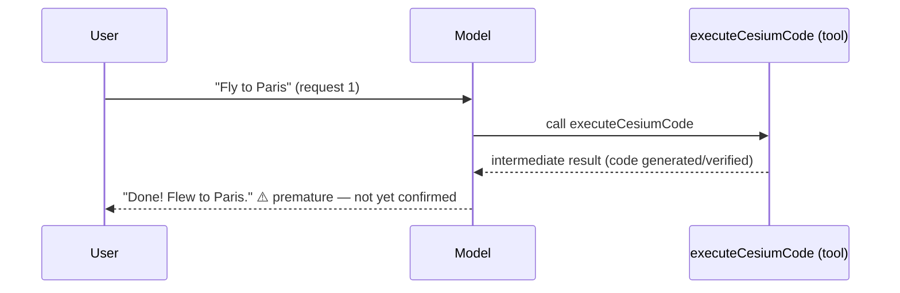
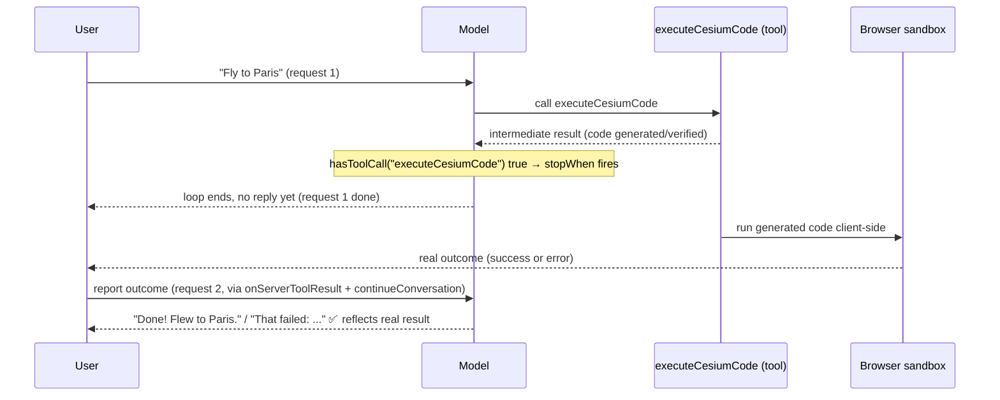

# @cesium-ai/server

[Express](https://expressjs.com) router that mounts the [AI SDK](https://sdk.vercel.ai/docs) chat endpoint (`POST /api/chat`). Runs the [`streamText`](https://sdk.vercel.ai/docs/reference/ai-sdk-core/stream-text) agent loop server-side — the LLM API key never reaches the browser. Model-agnostic: the host app owns provider selection, SDK instantiation, and API keys.

## Usage

```ts
import express from "express";
import { createChatRouter } from "@cesium-ai/server";
import { createCesiumTools } from "@cesium-ai/tools-schemas";
import { createModel } from "./providers.js";

const app = express();
app.use(express.json());
app.use(
  createChatRouter({
    model: createModel(),
    tools: createCesiumTools(),
  }),
);
```

When `model` is `undefined`, `/api/chat` responds `400 { error: "NOT_CONFIGURED" }` instead of throwing.

## Options

`createChatRouter` accepts a `ChatRouterOptions` object:

| Option           | Default                             | Description                                                                                              |
| ---------------- | ----------------------------------- | -------------------------------------------------------------------------------------------------------- |
| `model`          | —                                   | Required to enable chat. Omit to run with `/api/chat` returning `NOT_CONFIGURED`.                        |
| `tools`          | —                                   | Required. The tool registry exposed to the agent loop, e.g. `createCesiumTools()`.                       |
| `system`         | `DEFAULT_SYSTEM_PROMPT` (see below) | System prompt override.                                                                                  |
| `maxSteps`       | `DEFAULT_MAX_STEPS` = `5`           | Max agent-loop iterations (model call → tool call → model call) per request.                             |
| `maxMessages`    | `DEFAULT_MAX_MESSAGES` = `100`      | Max messages accepted in a single request body; requests over the cap get `400 INVALID_REQUEST`.         |
| `toolApproval`   | —                                   | Per-tool human-in-the-loop approval gating, passed straight through to `streamText`.                     |
| `stopAfterTools` | —                                   | Tool names to end the agent loop after, instead of letting the model reply in the same turn (see below). |

`system`, `maxSteps`, `toolApproval`, and `stopAfterTools` are forwarded to `runAgent` (see below); `maxMessages` is enforced only at the router's request-validation layer.

### Overriding the system prompt

The package exports its default so you can extend rather than replace it:

```ts
import { DEFAULT_SYSTEM_PROMPT } from "@cesium-ai/server";

createChatRouter({
  model,
  tools: createCesiumTools(),
  system: `${DEFAULT_SYSTEM_PROMPT}\nAlways answer in French.`,
});
```

## Using `runAgent` directly

```ts
createChatRouter({
  model,
  tools: createCesiumTools(),
  maxSteps: 10, // allow longer tool-calling chains
  maxMessages: 50, // tighten the per-request history cap
});
```

### Deferring the model's reply for tools with a delayed real outcome

Some tools only report an intermediate result server-side (e.g. "the generated code passed
verification") while their real, final outcome (e.g. "it actually ran without error in the
browser") is only known later and reported back via a separate follow-up request. Left alone, the
agent loop would let the model reply immediately after the intermediate result — often producing a
confident "I did X" before the action has actually been confirmed to succeed. Pass such tool names
via `stopAfterTools` to end the loop right after that tool's result instead, so the model only gets
a chance to reply once a follow-up request (starting a fresh agent loop) reports the real outcome:

```ts
createChatRouter({
  model,
  tools: { ...createCesiumTools(), executeCesiumCode },
  stopAfterTools: ["executeCesiumCode"],
});
```

Without `stopAfterTools`, the same-turn loop replies immediately after the tool result — before
the real outcome is known:



With `stopAfterTools: ["executeCesiumCode"]`, `stopWhen` ends the loop right after that tool's
result, so the model waits for a follow-up request carrying the real outcome before commenting:



## Using the agent loop directly

`runAgent` (also exported) is the lower-level primitive `createChatRouter` calls per request. Use it directly if you need to build a custom route instead of mounting the provided router:

```ts
import { runAgent, DEFAULT_MAX_STEPS, DEFAULT_SYSTEM_PROMPT } from "@cesium-ai/server";

const result = await runAgent({
  messages,
  model,
  tools,
  system: DEFAULT_SYSTEM_PROMPT,
  maxSteps: DEFAULT_MAX_STEPS,
});
```

## Exports

| Export                  | Description                                                                                                                                      |
| ----------------------- | ------------------------------------------------------------------------------------------------------------------------------------------------ |
| `createChatRouter`      | Builds the [Express](https://expressjs.com) `Router` mounting `POST /api/chat`.                                                                  |
| `ChatRouterOptions`     | Type for `createChatRouter`'s options.                                                                                                           |
| `runAgent`              | Runs one agent-loop turn with [`streamText`](https://sdk.vercel.ai/docs/reference/ai-sdk-core/stream-text).                                      |
| `DEFAULT_MAX_STEPS`     | Default `maxSteps` (`5`).                                                                                                                        |
| `DEFAULT_SYSTEM_PROMPT` | Default system prompt string — see [`src/agent.ts`](https://github.com/CesiumGS/cesiumjs-ai-starter-app/blob/main/packages/server/src/agent.ts). |
| `RunAgentOptions`       | Type for `runAgent`'s options.                                                                                                                   |
