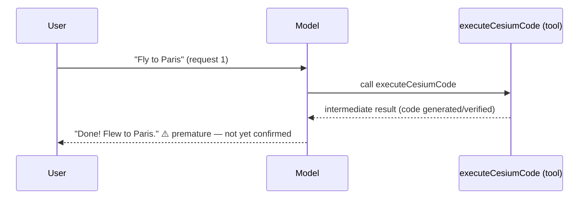
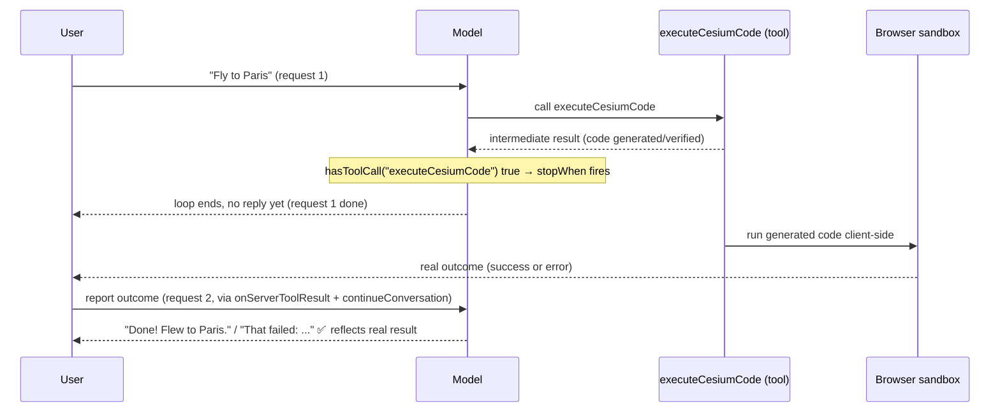
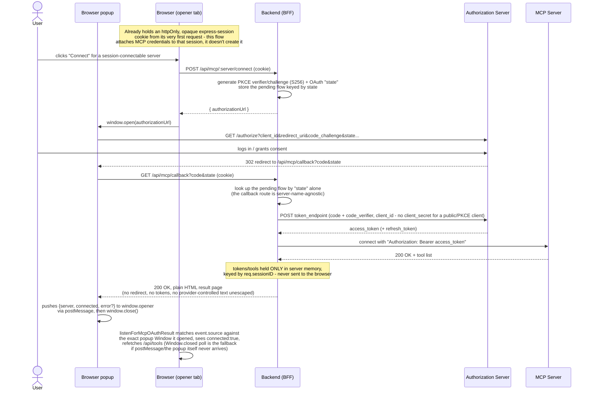

# @cesium-ai/server

[Express](https://expressjs.com) router that mounts the [AI SDK](https://sdk.vercel.ai/docs) chat endpoint (`POST /api/chat`). Runs the [`streamText`](https://sdk.vercel.ai/docs/reference/ai-sdk-core/stream-text) agent loop server-side — the LLM API key never reaches the browser. Model-agnostic: the host app owns provider selection, SDK instantiation, and API keys.

## Usage

```ts
import express from "express";
import { createChatRouter } from "@cesium-ai/server";
import { createCesiumTools } from "@cesium-ai/tools-schemas";
import { createModel } from "./providers.js";

const app = express();
app.use(express.json());
app.use(
  createChatRouter({
    model: createModel(),
    tools: createCesiumTools(),
  }),
);
```

When `model` is `undefined`, `/api/chat` responds `400 { error: "NOT_CONFIGURED" }` instead of throwing.

## Options

`createChatRouter` accepts a `ChatRouterOptions` object:

| Option           | Default                             | Description                                                                                              |
| ---------------- | ----------------------------------- | -------------------------------------------------------------------------------------------------------- |
| `model`          | —                                   | Required to enable chat. Omit to run with `/api/chat` returning `NOT_CONFIGURED`.                        |
| `tools`          | —                                   | Required. The tool registry exposed to the agent loop, e.g. `createCesiumTools()`.                       |
| `system`         | `DEFAULT_SYSTEM_PROMPT` (see below) | System prompt override.                                                                                  |
| `maxSteps`       | `DEFAULT_MAX_STEPS` = `5`           | Max agent-loop iterations (model call → tool call → model call) per request.                             |
| `maxMessages`    | `DEFAULT_MAX_MESSAGES` = `100`      | Max messages accepted in a single request body; requests over the cap get `400 INVALID_REQUEST`.         |
| `toolApproval`   | —                                   | Per-tool human-in-the-loop approval gating, passed straight through to `streamText`.                     |
| `stopAfterTools` | —                                   | Tool names to end the agent loop after, instead of letting the model reply in the same turn (see below). |

`system`, `maxSteps`, `toolApproval`, and `stopAfterTools` are forwarded to `runAgent` (see below); `maxMessages` is enforced only at the router's request-validation layer.

### Overriding the system prompt

The package exports its default so you can extend rather than replace it:

```ts
import { DEFAULT_SYSTEM_PROMPT } from "@cesium-ai/server";

createChatRouter({
  model,
  tools: createCesiumTools(),
  system: `${DEFAULT_SYSTEM_PROMPT}\nAlways answer in French.`,
});
```

## Using `runAgent` directly

```ts
createChatRouter({
  model,
  tools: createCesiumTools(),
  maxSteps: 10, // allow longer tool-calling chains
  maxMessages: 50, // tighten the per-request history cap
});
```

### Deferring the model's reply for tools with a delayed real outcome

Some tools only report an intermediate result server-side (e.g. "the generated code passed
verification") while their real, final outcome (e.g. "it actually ran without error in the
browser") is only known later and reported back via a separate follow-up request. Left alone, the
agent loop would let the model reply immediately after the intermediate result — often producing a
confident "I did X" before the action has actually been confirmed to succeed. Pass such tool names
via `stopAfterTools` to end the loop right after that tool's result instead, so the model only gets
a chance to reply once a follow-up request (starting a fresh agent loop) reports the real outcome:

```ts
createChatRouter({
  model,
  tools: { ...createCesiumTools(), executeCesiumCode },
  stopAfterTools: ["executeCesiumCode"],
});
```

Without `stopAfterTools`, the same-turn loop replies immediately after the tool result — before
the real outcome is known:



With `stopAfterTools: ["executeCesiumCode"]`, `stopWhen` ends the loop right after that tool's
result, so the model waits for a follow-up request carrying the real outcome before commenting:



## Using the agent loop directly

`runAgent` (also exported) is the lower-level primitive `createChatRouter` calls per request. Use it directly if you need to build a custom route instead of mounting the provided router:

```ts
import { runAgent, DEFAULT_MAX_STEPS, DEFAULT_SYSTEM_PROMPT } from "@cesium-ai/server";

const result = await runAgent({
  messages,
  model,
  tools,
  system: DEFAULT_SYSTEM_PROMPT,
  maxSteps: DEFAULT_MAX_STEPS,
});
```

## Tool introspection (`createToolsRouter`)

Mounts `GET /api/tools` — lets the client see the exact tool surface a `/api/chat` request would run against, including MCP tools not known statically at build time, and which of them declared an [MCP Apps](https://modelcontextprotocol.io) `ui://` widget resource (so the frontend can render that widget inline instead of the plain JSON result):

```ts
import { createToolsRouter } from "@cesium-ai/server";

app.use("/api/tools", rateLimiter(/* ... */));
app.use(createToolsRouter({ buildTools }));
```

`buildTools` is `(req: Request) => Promise<Record<string, McpTool>>` — resolved fresh per request so it can merge in per-session tools (e.g. a user-initiated MCP connection) not known at server-construction time. Despite its `McpTool` type import, this router has no runtime dependency on `@cesium-ai/mcp-tools` (the import is type-only), so it's safely part of the package's main `.` entry rather than the `/mcp` subpath. Read-only, but the host app is expected to rate-limit this route itself (same as `/api/chat`/`/api/mcp-app`) — this router doesn't apply one of its own, since a third-party MCP server's tool count/descriptions could otherwise be scraped freely.

## MCP Apps widget bridge (`createMcpAppRouter`)

> Imported from **`@cesium-ai/server/mcp`**, a separate entry point from the package's main `.` export (see [Subpath exports](#subpath-exports-cesium-aiservermcp) below) — requires `@cesium-ai/mcp-tools` installed alongside it.

Mounts `/api/mcp-app/resource` and `/api/mcp-app/tool-call` — the server-side half of rendering an [MCP Apps](https://modelcontextprotocol.io) widget (a tool result's `ui://` HTML resource). These routes exist because the widget itself runs **in the browser**, inside `@mcp-ui/client`'s sandboxed iframe, which never holds MCP credentials or a live `MCPClient` — only this backend does. `resources/read` and `tools/call` requests the widget issues via `AppRenderer`'s `onReadResource`/`onCallTool` callbacks are proxied through these two routes instead:

```ts
import { createMcpAppRouter } from "@cesium-ai/server/mcp";

app.use("/api/mcp-app", rateLimiter(/* ... */));
app.use(createMcpAppRouter({ mcp, sessionMcp, timeoutMs: 10_000 }));
```

- `GET /api/mcp-app/resource` resolves the right `MCPClient` for `(req.sessionID, server)` (checking `mcp`'s operator-configured servers first, then `sessionMcp`'s per-session connections), rejects any `uri` not starting with `ui://`, and returns the raw `client.readResource(...)` result unmodified.
- `POST /api/mcp-app/tool-call` re-validates `(server, toolName)` against **this request's own** resolved tool registry (`isKnownMcpTool`) before calling `client.callTool(...)` — a widget can never invoke a tool this host wouldn't otherwise have offered the model.
- Neither route executes a tool call automatically — the host's own frontend is expected to gate `tool-call` behind an explicit user Approve/Reject step before ever calling it (see `@cesium-ai/chat-element`'s `McpAppWidget.tsx` for this repo's own implementation); this router's checks are defense-in-depth, not a replacement for that UI.
- Accepts `mcp`/`sessionMcp` (both optional — see `@cesium-ai/mcp-tools`' `McpScope`) and mounts a safe "no such server" 404 for everything if neither is configured, rather than throwing.
- The host app is expected to rate-limit these routes itself (same as `/api/chat`/`/api/tools`) — this router doesn't apply one of its own.

## Session-scoped MCP OAuth connect (`createMcpSessionRouter`)

> Also imported from **`@cesium-ai/server/mcp`** (see below).

Mounts `/api/mcp/*` routes for user-initiated, per-browser-session MCP OAuth connections (e.g. a "Connect to Cesium ion" button) — the dynamic counterpart to `createMcpTools`' operator-configured, always-on servers:

```ts
import { createMcpSessionRouter } from "@cesium-ai/server/mcp";

app.use(createSessionMiddleware(/* ... */)); // express-session, mounted first
app.use(createMcpSessionRouter(sessionMcp)); // sessionMcp: SessionMcpManager, from @cesium-ai/mcp-tools
```

Requires `express-session` (or equivalent) middleware mounted earlier in the pipeline, since every route keys off `req.sessionID`. Implements the full OAuth 2.0/2.1 authorization-code + PKCE exchange server-side: `GET /api/mcp/callback` renders a small self-contained HTML page (no redirect to a host-owned URL, since a `SessionMcpManager` may be shared by more than one frontend origin) that pushes the outcome to `window.opener` via `postMessage` and then closes itself. See `@cesium-ai/mcp-tools`'s README for the full sequence diagram and in-memory-state caveats.

### Session middleware

`createMcpSessionRouter` requires that session middleware, but doesn't provide one itself — a host supplies its own `express-session`-compatible middleware. This repo's own backend wraps `express-session` in [`backend/src/utils/session.ts`](https://github.com/CesiumGS/cesiumjs-ai-starter-app/blob/main/backend/src/utils/session.ts)'s `createSessionMiddleware`: it defaults to `express-session`'s in-memory `MemoryStore` — fine for local dev / a single instance, but sessions (and any MCP connections tied to them) are lost on restart and aren't shared across replicas. Its `store` option accepts any real `express-session`-compatible `Store` (e.g. `connect-redis`) for production. Note this only replaces the session-ID/cookie layer — `@cesium-ai/mcp-tools`'s `SessionMcpManager` keeps its own in-memory state (live MCP client connections), so a multi-instance deployment still needs sticky sessions / instance affinity for the "Connect" flow to keep working; see that package's README's "Multi-instance deployment" section for how its own pluggable descriptor-repository options can similarly be swapped for an external store.

### Why this is a Backend-for-Frontend (BFF), not a browser-side PKCE client

The per-session MCP "Connect" flow implemented by `createMcpSessionRouter` runs the entire OAuth 2.0/2.1 authorization-code + PKCE exchange **server-side** — the browser only ever sees an `authorizationUrl` to open in a popup and later polls `GET /api/mcp/:server/status`. The host backend is deliberately acting as a BFF: it generates and stores the PKCE code verifier/challenge and OAuth `state`, exchanges the authorization code for tokens, and holds the resulting access/refresh tokens entirely in server memory (`@cesium-ai/mcp-tools`'s `SessionMcpManager`), keyed only by the opaque, httpOnly `express-session` cookie (`req.sessionID`). The browser never receives or handles a code verifier, an access token, or a refresh token at any point.

#### Sequence diagram



This is a different (and, for a public client talking to third-party OAuth providers, safer) design than the common SPA pattern of running the whole PKCE dance **in the browser** and stashing the resulting tokens in `sessionStorage`:

|                                 | Backend-for-Frontend (this pattern)                                                                                                  | Browser-side PKCE + `sessionStorage`                                                             |
| ------------------------------- | ------------------------------------------------------------------------------------------------------------------------------------ | ------------------------------------------------------------------------------------------------ |
| Code verifier / tokens          | Never leave the server process; browser only holds an httpOnly session cookie                                                        | Live in `sessionStorage`, readable by any JS running on that page                                |
| Exposure to XSS                 | An XSS bug can ride the session cookie via same-origin requests, but can't directly read/exfiltrate the token value                  | An XSS bug can `sessionStorage.getItem(...)` the access/refresh token directly and exfiltrate it |
| Token refresh                   | Handled transparently by the backend (`@ai-sdk/mcp`'s refresh logic) — the browser never needs to see a new token                    | The browser page must itself store and rotate refreshed tokens                                   |
| Third-party client secret       | Can be configured and used safely (never shipped to the browser)                                                                     | Never safe to embed — must stay a public/PKCE-only client                                        |
| Persistence across tabs/reloads | Survives via the session cookie; MCP connection itself is still in-memory per backend instance (see the multi-instance caveat above) | Tied to one tab's `sessionStorage` (cleared on tab close, not shared across tabs)                |

`sessionStorage` is a reasonable choice for genuinely client-only state that never needs to be secret (e.g. this repo's own codegen sandbox keeps its own API keys in `sessionStorage`, isolated from the sandboxed iframe — see [`docs/Codegen-tool-security-attacks-vectors.md`](https://cesiumgs.github.io/cesiumjs-ai-starter-app/architectures/codegen-tool-security-attacks-vectors/)), but it is the wrong place for OAuth tokens or PKCE material precisely because any script with page access can read it. Keeping the whole PKCE exchange and the resulting tokens server-side (this BFF pattern) removes that entire class of exposure, at the cost of the backend needing to track per-session state itself (see `@cesium-ai/mcp-tools`'s README for the full sequence diagram and in-memory-state caveats).

## Subpath exports: `@cesium-ai/server/mcp`

The MCP-related routers (`createMcpAppRouter`, `createMcpSessionRouter`) live behind a separate `@cesium-ai/server/mcp` entry point, deliberately **not** re-exported from the package's main `.` entry. ES module imports are eager — re-exporting them from [`index.ts`](https://github.com/CesiumGS/cesiumjs-ai-starter-app/blob/main/packages/server/src/index.ts) would force `@cesium-ai/mcp-tools` to resolve at load time for every consumer of `@cesium-ai/server`, even one that only ever calls `createChatRouter` and has no interest in MCP at all. Keeping them behind their own subpath means:

- A chat-only host never needs `@cesium-ai/mcp-tools` installed — importing `@cesium-ai/server`'s main entry never touches it.
- A host that DOES want MCP support explicitly opts in via `import { ... } from "@cesium-ai/server/mcp"`, and must have `@cesium-ai/mcp-tools` installed itself — it's declared as an **optional peer dependency** (`peerDependenciesMeta`), not a hard `dependency`, of this package.

## Exports

### `@cesium-ai/server` (main entry)

| Export                  | From         | Description                                            |
| ----------------------- | ------------ | ------------------------------------------------------ |
| `createChatRouter`      | `./index.js` | Builds the Express `Router` mounting `POST /api/chat`. |
| `ChatRouterOptions`     | `./index.js` | Type for `createChatRouter`'s options.                 |
| `runAgent`              | `./index.js` | Runs one agent-loop turn with `streamText`.            |
| `DEFAULT_MAX_STEPS`     | `./index.js` | Default `maxSteps` (`5`).                              |
| `DEFAULT_SYSTEM_PROMPT` | `./index.js` | Default system prompt string.                          |
| `RunAgentOptions`       | `./index.js` | Type for `runAgent`'s options.                         |
| `createToolsRouter`     | `./index.js` | Builds the Express `Router` mounting `GET /api/tools`. |
| `ToolsRouterOptions`    | `./index.js` | Type for `createToolsRouter`'s options.                |

### `@cesium-ai/server/mcp` (requires `@cesium-ai/mcp-tools`)

| Export                   | From       | Description                                                                 |
| ------------------------ | ---------- | --------------------------------------------------------------------------- |
| `createMcpAppRouter`     | `./mcp.js` | Builds the Express `Router` mounting `/api/mcp-app/resource` + `tool-call`. |
| `McpAppRouterOptions`    | `./mcp.js` | Type for `createMcpAppRouter`'s options.                                    |
| `createMcpSessionRouter` | `./mcp.js` | Builds the Express `Router` mounting `/api/mcp/*` OAuth connect routes.     |
